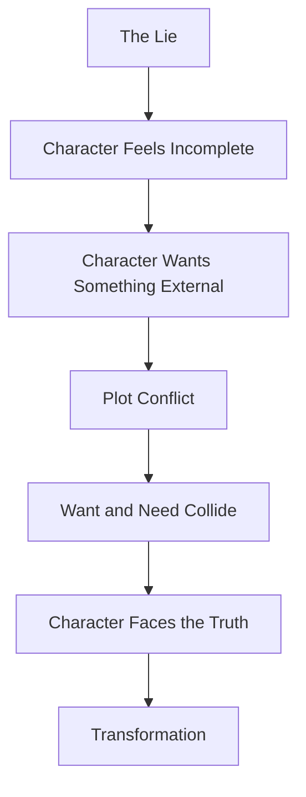
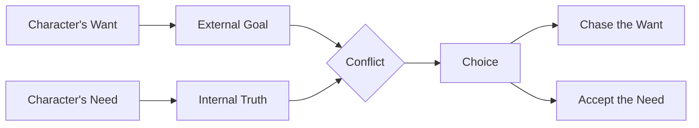
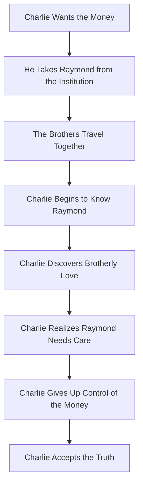

# 028 - What the Character Wants vs. What They Need

## Section

**01 - The Character**

## Original Lecture Title

**Điều nhân vật muốn và điều nhân vật thật sự cần**
**English:** What the Character Wants vs. What They Need

## Duration

**5:27**

---

## Lesson Overview

A strong character arc is often built on the tension between two forces:

* What the character **wants**
* What the character **needs**

The character usually understands what they want. It is visible, practical, and external.

But what they need is deeper. It is emotional, internal, and often connected to the truth they must learn.

---

## Core Idea

> What the character wants drives the plot.
> What the character needs drives the character arc.

The conflict between want and need creates tension. That tension becomes the emotional engine of the story.

---

## The Toothache Metaphor

The character's lie is like a bad tooth.

From the outside, everything may seem fine. The character may still function. They may still live their normal life.

But inside, something is wrong.

They feel pain, but they avoid facing the real problem. They want the pain to disappear by itself. What they actually need is to go to the dentist.

This is the same with characters.

They often want the easy solution, but they need the difficult truth.

---

## Want vs. Need

| Element | Meaning                              | Example                                         |
| ------- | ------------------------------------ | ----------------------------------------------- |
| Want    | The conscious external goal          | Win the race, become king, get the money        |
| Need    | The unconscious internal truth       | Learn humility, accept love, become independent |
| Lie     | The false belief blocking growth     | “I only matter if I win.”                       |
| Truth   | The lesson the character must accept | “My value is not based on victory.”             |

---

## Simple Structure



---

## What the Character Wants

The **want** is the character's conscious goal.

It is what the protagonist actively pursues throughout the story.

They may say:

* “I want to be champion.”
* “I want to become king.”
* “I want to win the race.”
* “I want that person to love me.”
* “I want to prove everyone wrong.”
* “I want the money.”
* “I want to protect my reputation.”

The want is usually concrete and visible.

It gives the plot direction.

---

## Examples of Wants

| Story / Character            | What They Want                  |
| ---------------------------- | ------------------------------- |
| *This Is Us* / Kate          | To lose weight                  |
| *Jane Eyre* / Jane           | To be loved                     |
| *Toy Story* / Woody          | To remain the favorite toy      |
| *Thor* / Thor                | To prove his strength and worth |
| *Jurassic Park* / Scientists | To study dinosaurs in peace     |
| *Rain Man* / Charlie         | To get the inheritance money    |

There is nothing wrong with these goals. They are understandable.

The problem is that these goals often ignore what the character truly needs.

---

## What the Character Needs

The **need** is the deeper truth or inner change required for real fulfillment.

The character may not know they need it.

They may resist it because it is uncomfortable, painful, boring, difficult, or frightening.

Examples:

| Character                     | What They Need                                 |
| ----------------------------- | ---------------------------------------------- |
| Kate in *This Is Us*          | To accept herself as she is                    |
| Jane in *Jane Eyre*           | To be free and independent                     |
| Woody in *Toy Story*          | To share love and attention with others        |
| Thor                          | To learn humility and compassion               |
| Characters in *Jurassic Park* | To protect the world from reckless experiments |
| Charlie in *Rain Man*         | To love and value his brother                  |

---

## Want and Need in Conflict

Sometimes the character's want and need support each other.

But often, they are in conflict.



The most satisfying arcs often force the character to choose.

They may achieve what they wanted and realize it does not satisfy them.
Or they may give up what they wanted in order to receive what they truly needed.

---

## Example: Rain Man

In *Rain Man*, Charlie learns that his father has died. He also discovers that the inheritance of more than three million dollars has been left to his autistic brother, Raymond.

At first, Charlie is angry and feels betrayed.

### Charlie's Want

Charlie wants the money.

He has debts to pay, and the inheritance becomes his external goal.

### Charlie's Need

Charlie needs to discover love, connection, and responsibility toward his brother.

During their journey back to Los Angeles, Charlie gets to know Raymond. He realizes that Raymond is sensitive, gifted, vulnerable, and important.

Eventually, Charlie understands that he cannot care for Raymond properly by himself.

So he takes Raymond back to the clinic and uses the inheritance to support his treatment.

Charlie gives up the thing he wanted because he has found what he needed.

---

## Rain Man Arc Diagram



---

## Want, Need, Lie, and Truth

A character arc becomes stronger when these four elements are connected.

| Element | Question                                            |
| ------- | --------------------------------------------------- |
| Want    | What does the character think will make them happy? |
| Need    | What would actually make them whole?                |
| Lie     | What false belief keeps them from changing?         |
| Truth   | What must they finally understand?                  |

---

## Key Points

* The want is the conscious external goal.
* The need is the unconscious internal growth.
* The want moves the plot forward.
* The need creates the emotional arc.
* The lie prevents the character from seeing what they truly need.
* The truth replaces the lie.
* Sometimes getting the want proves that it was never enough.
* Sometimes the character must sacrifice the want to gain the need.

---

## Practical Exercise

Write one sentence for your character's want and one sentence for their need.

Then identify the scene where these two forces collide.

### Exercise Template

```markdown id="wantneedtemplate"
### Character Want and Need

**Character's Want:**  
The protagonist wants...

**Character's Need:**  
The protagonist needs...

**The Lie Blocking Them:**  
The protagonist believes...

**The Truth They Must Learn:**  
The protagonist must learn that...

**Scene Where Want and Need Collide:**  
This happens when...

**Final Choice:**  
At the end, the protagonist chooses...
```

---

## Development Questions

Answer the following questions about your protagonist:

1. How is the lie holding your character back from change?
2. Why does your character feel unhappy or incomplete?
3. What is the truth that they need?
4. How is the truth opposed to the lie?
5. What event teaches them what they truly need?
6. How will their life be different after they accept the truth?

---

## Worksheet: Want vs. Need

| Question                                               | Answer |
| ------------------------------------------------------ | ------ |
| What does the protagonist want?                        |        |
| Why do they want it?                                   |        |
| What do they think this goal will give them?           |        |
| What does the protagonist truly need?                  |        |
| Why do they resist this need?                          |        |
| What lie keeps them from seeing the truth?             |        |
| What truth must replace the lie?                       |        |
| Where do the want and need collide?                    |        |
| Does the ending give them the want, the need, or both? |        |
| Is that the right ending for this story?               |        |

---

## Reflection Question

> Does your ending give the character the want, the need, or both — and is that the right choice for this story?

Not every story needs to give the protagonist everything.

Possible endings include:

| Ending Type                             | Result                        |
| --------------------------------------- | ----------------------------- |
| Gets the want and the need              | Full positive transformation  |
| Gets the need but loses the want        | Bittersweet but mature ending |
| Gets the want but not the need          | Ironic or tragic ending       |
| Loses both                              | Tragic downfall               |
| Rejects the want after finding the need | Strong internal victory       |

---

## Summary

This lesson explains the difference between what a character wants and what they truly need.

The want is the visible goal that drives the plot. The need is the deeper truth that drives the character arc.

A powerful story often places these two forces in conflict. The character may chase what they want for most of the story, only to discover that it cannot heal the deeper problem.

The lie keeps the character trapped.
The need points them toward the truth.

In short:

> The character chases what they want.
> The story teaches them what they need.
