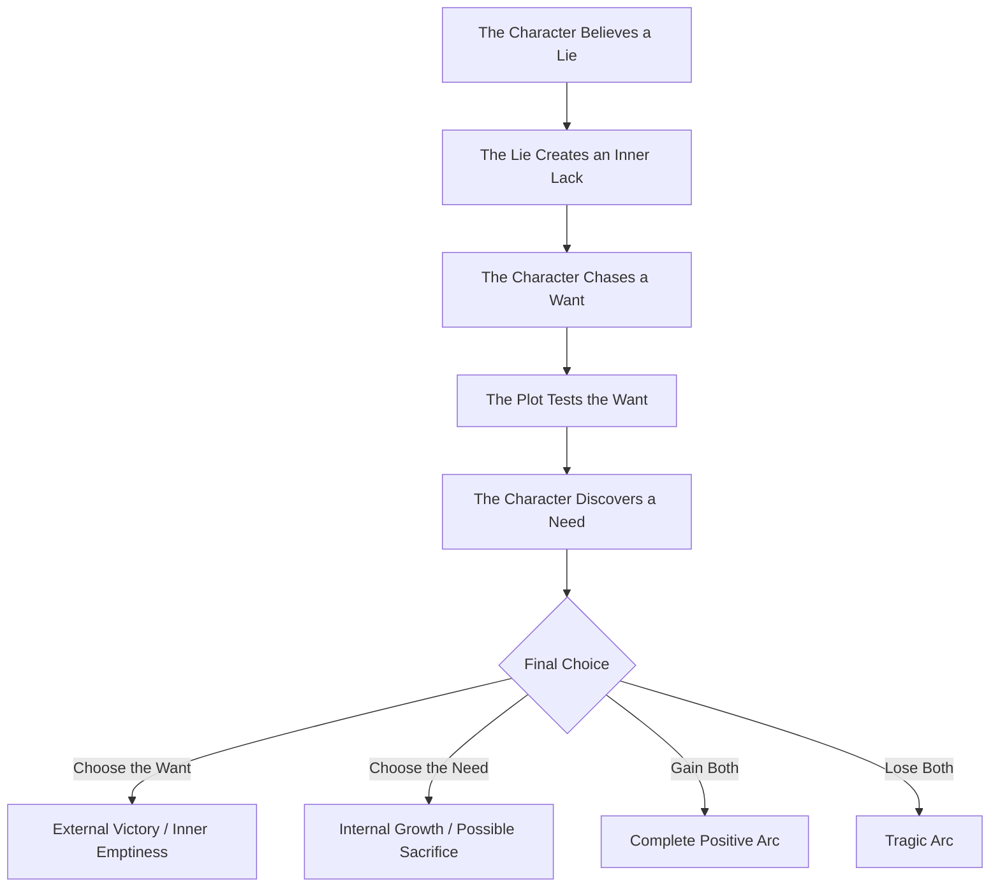
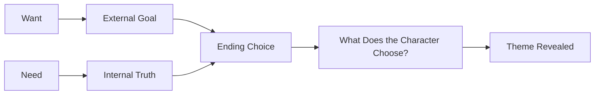

# 029 - Exercise: Want vs. Need

## Section

**01 - The Character**

## Original Lecture Title

**Bài tập want vs need**
**English:** Exercise: Want vs. Need

## Duration

**Not listed**
Writing exercise / discussion segment

---

## Assignment

**What They Want, What They Need**

**Estimated time:** 600 minutes
**Student solutions:** 34

---

## Lesson Overview

This exercise helps you examine the relationship between your character's **want**, **need**, **lie**, and **truth**.

A character's **want** is what they consciously chase.
A character's **need** is the deeper truth they must discover in order to grow.

The emotional power of a story often comes from the gap between these two things.

---

## Core Idea

> The character may chase what they want, but the story reveals what they truly need.

If the protagonist gets everything they want but never addresses their deeper need, the ending may feel emotionally incomplete.

---

## Want vs. Need Review

| Element | Meaning                                             |
| ------- | --------------------------------------------------- |
| Want    | The external goal the character consciously pursues |
| Need    | The internal truth or growth the character requires |
| Lie     | The false belief that keeps the character stuck     |
| Truth   | The realization that replaces the lie               |
| Arc     | The movement from lie toward truth                  |

---

## Story Logic Diagram



---

## Key Points

* Track the character's want and need separately through your outline.
* A story should make both the want and the need visible.
* A character who gets everything they want but ignores their need may feel unresolved.
* The gap between want and need often reveals the story's theme.
* A strong ending usually proves whether the character has changed or remained trapped.

---

## Practical Exercise

Rewrite your ending twice:

1. **Version One:** The character gets what they want.
2. **Version Two:** The character gets what they need.

Then compare both versions.

Ask yourself:

> Which ending feels more honest to who this character has become?

---

## Main Assignment Questions

Answer the following questions:

1. How is the lie holding your character back from change?
2. How and why do they feel unhappy or incomplete?
3. What is the truth that they need?
4. How is that truth opposed to the lie?
5. What event will teach them what they need?
6. How will their life be different once they have grasped the truth?

---

## Want vs. Need Tracking Table

| Story Stage          | What the Character Wants | What the Character Needs | How the Lie Affects Them |
| -------------------- | ------------------------ | ------------------------ | ------------------------ |
| Beginning            |                          |                          |                          |
| First major conflict |                          |                          |                          |
| Midpoint             |                          |                          |                          |
| Crisis               |                          |                          |                          |
| Climax               |                          |                          |                          |
| Ending               |                          |                          |                          |

---

## Exercise Template

```markdown id="wantneed29template"
# Want vs. Need Exercise

## Character's Lie

The protagonist believes that...

## How the Lie Holds Them Back

This belief prevents them from changing because...

## Why They Feel Unhappy or Incomplete

The protagonist feels incomplete because...

## What They Want

The protagonist wants...

## What They Need

The protagonist needs...

## The Truth

The truth they must learn is...

## How the Truth Opposes the Lie

The lie says...

But the truth says...

## Event That Teaches the Need

The character learns this truth when...

## Life After the Truth

Once they understand the truth, their life changes because...

## Ending Version 1: Want Wins

In this version, the protagonist gets what they wanted, but...

## Ending Version 2: Need Wins

In this version, the protagonist accepts what they needed, and...

## Which Ending Works Better?

The stronger ending is...
```

---

## Example 1: Negative Arc

### Lie

Raul Baca believes that power, money, and control will give him peace.

### How the Lie Holds Him Back

His lie prevents him from finding peace because it pushes him further into destructive choices.

### Why He Feels Incomplete

He cannot experience true happiness because his life is built around domination and fear.

### Truth He Needs

He needs to stop walking the path of destruction and accept responsibility for his actions.

### How the Truth Opposes the Lie

The lie says:

> Control will make me safe.

The truth says:

> Control cannot replace peace, love, or accountability.

### Event That Teaches the Need

In this version, Raul never accepts the truth. His mind remains clouded by money, power, and control.

### Ending

Because he never grasps what he needs, his story becomes a negative arc. He avoids prison by arranging his own death instead of facing the truth.

---

## Example 2: Positive Arc

### Lie

The protagonist believes:

> Love must be earned.

### How the Lie Holds Her Back

This lie prevents her from accepting that people love her for who she is, not only for what she does.

### Why She Feels Incomplete

She feels unhappy because she constantly tries to prove her value. She cannot rest, ask for help, or trust affection.

### Truth She Needs

She needs to learn:

> Love is freely given. It does not have to be earned through perfection.

### How the Truth Opposes the Lie

The lie says:

> I am loved only when I am useful or perfect.

The truth says:

> I can be loved even when I fail, need help, or cannot give anything back.

### Event That Teaches the Need

Her mentor sacrifices himself to save her. Because he gives his life for her, she realizes that his love was not based on her usefulness.

### Life After the Truth

After this, she begins to accept help from others. She allows herself to believe that people truly care about her.

---

## Ending Comparison

| Ending Type                | Result                                           | Emotional Effect                                  |
| -------------------------- | ------------------------------------------------ | ------------------------------------------------- |
| Want wins                  | The character achieves the external goal         | May feel hollow if the need is ignored            |
| Need wins                  | The character grows internally                   | Often emotionally satisfying, even if bittersweet |
| Want and need both win     | The character succeeds externally and internally | Full positive resolution                          |
| Want wins but need fails   | Ironic or tragic ending                          | Shows the cost of refusing growth                 |
| Need wins but want is lost | Bittersweet ending                               | Shows maturity and transformation                 |
| Both are lost              | Tragic ending                                    | Shows complete failure or downfall                |

---

## Want vs. Need Conflict Diagram



---

## Reflection Question

> Which version of the ending feels more honest to who this character has become?

The best ending is not always the happiest one. It is the ending that feels emotionally truthful.

If the character has truly changed, the ending should prove that change through action.

If the character refuses to change, the ending should show the cost of that refusal.

---

## Summary

This exercise asks you to examine what your character wants and what they truly need.

The want gives the story direction.
The need gives the story emotional meaning.

By comparing two endings — one where the want wins and one where the need wins — you can discover which ending best serves the character, the theme, and the story as a whole.

In short:

> The want shows what the character is chasing.
> The need shows what the story is really about.

---

# Bài luyện tập

## Mục tiêu


## Đề bài


## Yêu cầu hoàn thành

- [ ] 
- [ ] 
- [ ] 

## Kết quả / lời giải


## Ghi chú
