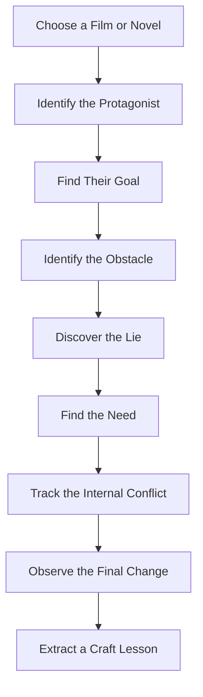
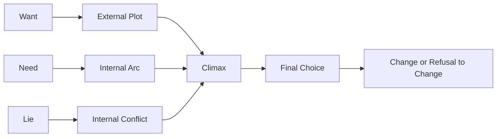

# 031 - Exercise: Analyzing Characters in Film

## Section

**01 - The Character**

## Original Lecture Title

**Bài tập xem phim để phân tích nhân vật**
**English:** Exercise: Analyzing Characters in Film

## Duration

**Not listed**
Writing exercise / discussion segment

---

## Assignment

**Time to Watch a Film!**

**Estimated time:** 600 minutes
**Student solutions:** 32

---

## Lesson Overview

This exercise trains you to analyze character construction by studying a film or novel.

Films are especially useful because they often reveal character quickly through visible action, dialogue, conflict, and choice. By watching a scene carefully, you can learn how a protagonist's **goal**, **need**, **lie**, **internal conflict**, and **arc** are presented in a compressed and dramatic way.

---

## Core Idea

> Studying characters in films helps you see how story structure, conflict, and character change work in action.

Instead of watching only for entertainment, you watch as a writer.

You ask:

* What does the protagonist want?
* What do they actually need?
* What false belief controls them?
* What choice reveals who they really are?
* How do they change by the end?

---

## Why Analyze Film Characters?

Film is useful for character study because it must communicate quickly and clearly.

Unlike novels, films cannot rely heavily on internal thoughts. They usually reveal character through:

| Film Technique   | What It Reveals                           |
| ---------------- | ----------------------------------------- |
| Action           | What the character chooses under pressure |
| Dialogue         | What the character says they want         |
| Silence          | What the character avoids saying          |
| Visual behavior  | Fear, desire, hesitation, confidence      |
| Conflict         | What blocks the character                 |
| Repeated choices | The pattern of their personality          |
| Climax decision  | Whether they have changed                 |

---

## Film vs. Prose

| Medium | How Character Is Revealed                                                |
| ------ | ------------------------------------------------------------------------ |
| Film   | Through action, image, dialogue, performance, and editing                |
| Prose  | Through action, dialogue, inner thoughts, memory, voice, and description |

A film can teach you efficiency.
A novel can add interior depth.

As a writer, you can borrow both approaches.

---

## Character Analysis Framework



---

## Key Points

* Watching film with character craft in mind helps you identify want, need, lie, and arc.
* Pay attention to the first scene where the protagonist's goal becomes clear.
* Notice whether the goal is stated aloud or shown visually.
* Film often reveals character through action more efficiently than prose.
* Prose can borrow this efficiency while adding internal thoughts and emotional depth.
* A strong character analysis helps you improve your own protagonist.

---

## Practical Exercise

Watch one scene from a favorite film.

Then write the protagonist's situation in three lines:

```markdown id="film031scene"
**Want:**  
The protagonist wants...

**Obstacle:**  
The thing blocking them is...

**Choice:**  
The protagonist chooses to...
```

This simple exercise helps you identify the dramatic engine of a scene.

---

## Main Assignment Questions

Choose a movie or novel and answer the following:

1. **Title of the movie/book:**
2. **Author / Writer / Director:**
3. **Protagonist:**
4. **Antagonist:**
5. **Goal:**
6. **Need:**
7. **Lie:**
8. **Internal conflict:**
9. **Theme:**
10. **Does the protagonist change compared to the first part of the story? How?**

---

## Character Analysis Worksheet

| Element                           | Answer |
| --------------------------------- | ------ |
| Title of the movie/book           |        |
| Author / Writer / Director        |        |
| Protagonist                       |        |
| Antagonist                        |        |
| External goal                     |        |
| Internal need                     |        |
| Character's lie                   |        |
| Main internal conflict            |        |
| Main external conflict            |        |
| Theme                             |        |
| Key scene that reveals the goal   |        |
| Key scene that challenges the lie |        |
| Final choice                      |        |
| How does the protagonist change?  |        |
| Craft technique you can borrow    |        |

---

## Want, Need, Lie, and Arc Diagram



---

## How to Analyze a Character Scene

When watching a scene, look for five things:

| Question                                | Purpose                        |
| --------------------------------------- | ------------------------------ |
| What does the character want right now? | Identifies scene-level goal    |
| What blocks them?                       | Creates conflict               |
| What do they believe?                   | Reveals the lie                |
| What choice do they make?               | Shows character under pressure |
| What changes after the scene?           | Shows story movement           |

A good scene should usually change something.

The change may be:

* A new decision
* A revealed secret
* A broken relationship
* A deeper conflict
* A new understanding
* A stronger commitment to the lie
* A first step toward truth

---

## Example Analysis: The Spellshop

### Title

*The Spellshop*

### Author

Sarah Beth Durst

### Protagonist

Kiela

### Antagonist

The antagonist is not only a single person. The opposing force is the hoarding of magic, the misuse of power, and the danger of controlling knowledge for the benefit of a few.

### Goal

Kiela wants to protect the magic spellbooks and avoid being discovered after taking them from the great library.

### Need

Kiela needs to realize that life is not only about books and hidden knowledge. She must learn that people, community, friendship, and connection are just as important as the spells she protects.

### Lie

Kiela believes:

> Books are more important than people, and no one truly cares for me.

### Internal Conflict

Kiela struggles between protecting the spellbooks and opening herself to others.

She wants safety and secrecy, but she also longs for friendship and belonging.

### Theme

The story explores how hoarding knowledge can harm communities. It also focuses on fear, friendship, trust, responsibility, and doing what is right.

### Does the Protagonist Change?

Yes. Kiela begins as someone who prioritizes books and secrecy over people. Over time, she learns to value community, friendship, and emotional connection.

---

## Scene-Level Analysis Template

```markdown id="film031template"
# Scene Analysis

## Film / Book Title

...

## Scene Chosen

...

## Protagonist's Want in This Scene

The protagonist wants...

## Obstacle

The obstacle is...

## Choice

The protagonist chooses to...

## What This Reveals About the Character

This reveals that...

## Connection to the Character's Lie

The scene shows the lie because...

## Connection to the Character's Need

The scene hints that the protagonist needs...

## Craft Technique to Borrow

The technique I can borrow for my own writing is...
```

---

## Reflection Question

> What craft technique from that scene could you borrow for your own novel?

Possible answers:

| Technique                    | How You Can Use It                                  |
| ---------------------------- | --------------------------------------------------- |
| Reveal desire through action | Show what the character wants without explaining it |
| Use conflict immediately     | Let pressure expose personality                     |
| Make the goal visual         | Give the character something concrete to pursue     |
| Show contradiction           | Let the character say one thing but do another      |
| Force a choice               | Reveal character through decision                   |
| Use silence                  | Let what is unsaid create tension                   |
| Repeat behavior              | Build a pattern that reveals the lie                |

---

## Summary

This exercise asks you to study a film or novel character and identify the essential elements of their arc.

You are looking for:

* Their goal
* Their need
* Their lie
* Their antagonist
* Their internal conflict
* Their theme
* Their transformation

By analyzing another story, you train yourself to recognize character craft more clearly in your own manuscript.

In short:

> Watch like an audience member first.
> Then watch like a writer.

---

# Bài luyện tập

## Mục tiêu


## Đề bài


## Yêu cầu hoàn thành

- [ ] 
- [ ] 
- [ ] 

## Kết quả / lời giải


## Ghi chú
