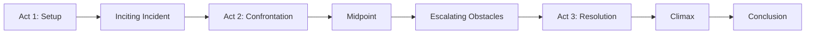
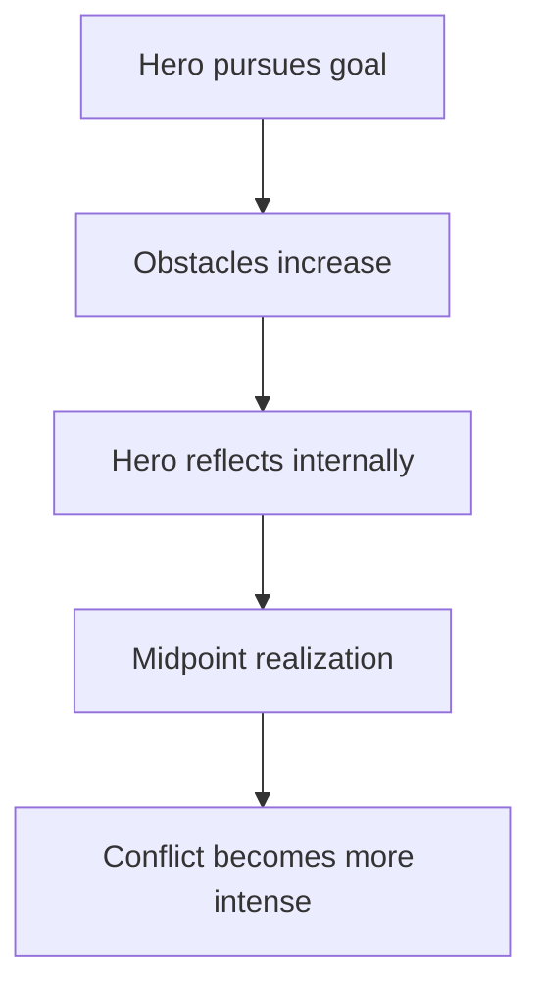
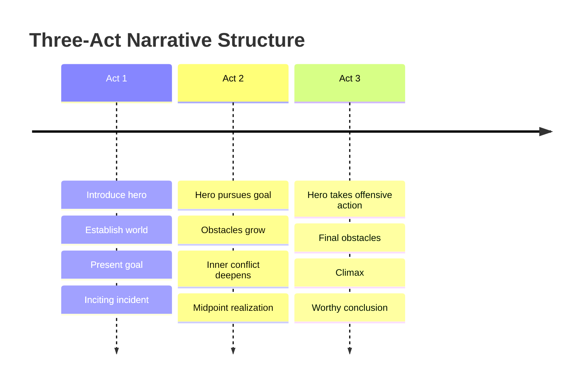
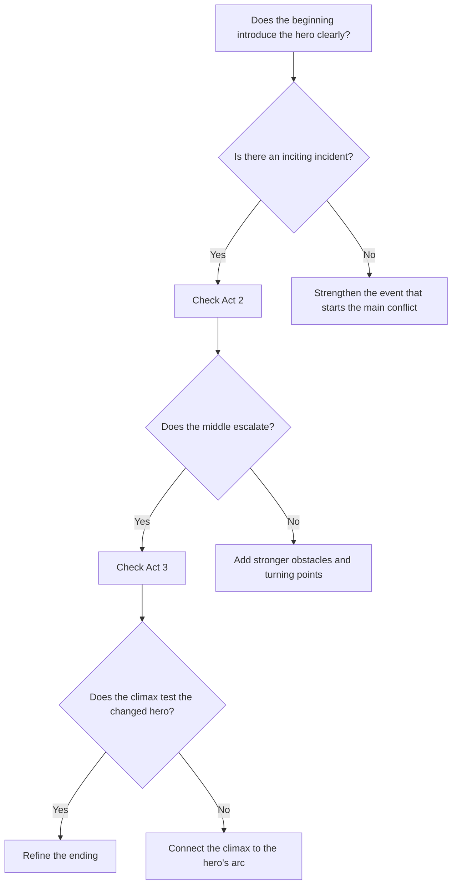

# 001 - Why Use a Story Structure

## Section

**02 - The 3 Act Narrative Structure**

## Original Lecture Title

**Vì sao nên dùng cấu trúc truyện**

## Duration

**5:01**

---

## 1. Lesson Overview

This lesson explains why story structure matters in fiction writing. A narrative structure is not a prison for creativity. Instead, it works like a map, a canvas, or a foundation that helps the writer organize tension, character growth, conflict, and resolution.

The lesson introduces the idea that many successful novels and films follow recognizable narrative patterns, especially the **Three-Act Structure**.

---

## 2. Core Message

> A story structure does not destroy creativity.
> It gives creativity a shape.

Writers can choose to follow structure strictly, adapt it freely, or break it completely. However, before breaking the rules, a writer should first understand how those rules work.

---

## 3. Two Types of Writers

There are generally two types of writers:

| Type of Writer        | Description                    | Strength                       | Risk                           |
| --------------------- | ------------------------------ | ------------------------------ | ------------------------------ |
| **Intuitive Writer**  | Writes freely without planning | Strong creative freedom        | Story may lose direction       |
| **Structured Writer** | Plans before writing           | Clearer pacing and progression | May feel too rigid if overused |

Both approaches are valid. Writing is an art, so creativity matters. However, even art usually needs some kind of form.

---

## 4. Why Structure Matters

A story without structure can easily suffer from:

* A weak beginning
* A slow or empty middle
* A climax that feels unearned
* An ending that arrives too suddenly
* Character arcs that do not feel complete
* Conflict that does not escalate naturally

Structure helps the writer understand what each part of the story is supposed to do.

---

## 5. Structure Is Not a Formula

A common fear is that structure will make a story predictable or boring.

However, structure is not the same as formula.

| Formula                                | Structure                                        |
| -------------------------------------- | ------------------------------------------------ |
| Forces every story to feel the same    | Gives the story a useful shape                   |
| Limits imagination                     | Supports imagination                             |
| Produces mechanical writing            | Helps manage tension and pacing                  |
| Tells the writer exactly what to write | Shows where major story functions usually happen |

Structure gives direction, but the writer still decides the characters, tone, theme, conflict, and emotional meaning.

---

## 6. Examples from Popular Stories

Many successful books and films follow recognizable narrative structures, such as:

* *Harry Potter*
* *The Little Prince*
* *Titanic*
* *Jaws*
* *The Alchemist*
* *Jonathan Livingston Seagull*
* *Angels and Demons*

The point is not that every successful story is identical. The point is that stories that engage large audiences often use patterns of tension, conflict, transformation, and resolution.

---

## 7. Analogy: Art Needs Form

The lesson compares story structure to other creative fields:

| Art Form     | Necessary Form                    |
| ------------ | --------------------------------- |
| Painting     | Needs a canvas                    |
| Music        | Needs rhythm, harmony, or pattern |
| Architecture | Needs a plan and foundation       |
| Cooking      | Needs method and proportion       |
| Storytelling | Needs narrative shape             |

A pile of bricks is not automatically a house. Random ingredients are not automatically a tiramisu. In the same way, random scenes are not automatically a satisfying story.

---

## 8. Important Principle

Great artists often break the rules, but they usually understand the rules first.

Before a writer can go beyond structure, they need to internalize it. Once the structure becomes natural, the writer can adapt it, bend it, or break it with intention.

---

## 9. The Three-Act Structure

The lesson introduces the **Three-Act Structure**, which divides a story into three major narrative movements.

---

## 10. Act 1 - Setup

In the first act, the writer introduces:

* The main character
* The world of the story
* The character's ordinary life
* The central desire or goal
* The first major disruption

The key turning point of Act 1 is usually the **Inciting Incident**.

### Inciting Incident

The inciting incident is the event that pushes the hero into the main conflict of the story.

It answers the question:

> What happens that makes the story truly begin?

---

## 11. Act 2 - Confrontation

In the second act, the hero begins to pursue the goal, but often in a defensive or uncertain way.

This act usually contains:

* Rising obstacles
* Inner conflict
* Failed attempts
* External pressure
* Emotional reflection
* A growing awareness of what the hero truly needs

The central turning point of Act 2 is the **Midpoint**.

### Midpoint

The midpoint is a major moment of realization, reversal, or transformation. It often changes how the hero understands the conflict, themselves, or their goal.

---

## 12. Act 3 - Resolution

In the third act, the hero becomes more active and decisive.

The hero is no longer simply reacting. They begin to act with greater clarity, courage, or transformation.

Act 3 usually contains:

* Final confrontation
* Highest stakes
* Hero's decisive action
* Climax
* Resolution
* Emotional conclusion

The climax is where the hero faces the greatest obstacle and proves whether they have changed.

---

## 13. Three-Act Timeline

---

## 14. Simple Structural Map

| Act       | Main Function               | Key Question                                        |
| --------- | --------------------------- | --------------------------------------------------- |
| **Act 1** | Setup                       | Who is the hero, and what disrupts their life?      |
| **Act 2** | Conflict and transformation | What obstacles force the hero to change?            |
| **Act 3** | Resolution                  | How does the changed hero face the final challenge? |

---

## 15. Key Points

* Structure is not a cage; it is a map.
* A strong structure helps tension rise and fall naturally.
* Without structure, stories often have weak middles or rushed endings.
* Structure gives writers checkpoints for diagnosing story problems.
* The Three-Act Structure is one of the most common and useful narrative models.
* Writers should learn structure before deciding whether to follow, adapt, or break it.

---

## 16. Practical Exercise

Plot your novel's major events onto a simple three-act timeline.

Use this template:

| Story Part              | Major Event | Is This Section Strong or Empty? |
| ----------------------- | ----------- | -------------------------------- |
| Act 1 - Setup           |             |                                  |
| Inciting Incident       |             |                                  |
| Act 2 - Rising Conflict |             |                                  |
| Midpoint                |             |                                  |
| Act 2 - Escalation      |             |                                  |
| Act 3 - Final Conflict  |             |                                  |
| Climax                  |             |                                  |
| Ending                  |             |                                  |

After filling it in, mark any act that feels empty, rushed, or unclear.

---

## 17. Reflection Questions

1. Which act of your current draft is doing the least work right now?
2. Does your story have a clear inciting incident?
3. Does the middle of your story escalate, or does it simply repeat similar conflicts?
4. Does your protagonist change before the climax?
5. Does the ending feel earned by everything that came before it?

---

## 18. Writing Application

When reviewing your own draft, ask:

---

## 19. Summary

This lesson introduces the purpose of story structure, especially the Three-Act Structure. Structure does not replace creativity. Instead, it helps creativity become readable, emotionally powerful, and dramatically satisfying.

A writer does not have to follow structure blindly. However, understanding structure allows the writer to make better creative decisions.

Before breaking structure, master it.

---

## 20. Core Takeaway

> Story structure is not the enemy of creativity.
> It is the shape that allows creativity to become a complete story.

---

# Bài luyện tập

## Mục tiêu

## Đề bài

## Yêu cầu hoàn thành

- [ ] 
- [ ] 
- [ ] 

## Kết quả / lời giải

## Ghi chú
