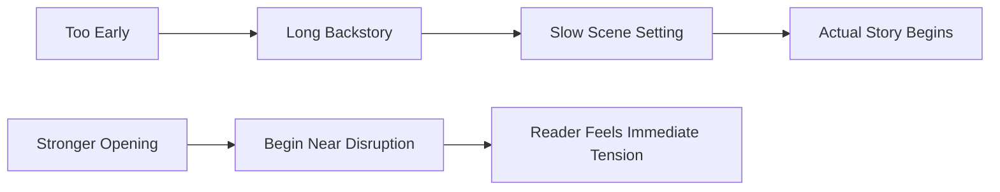
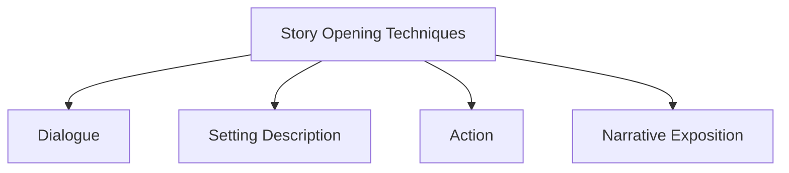
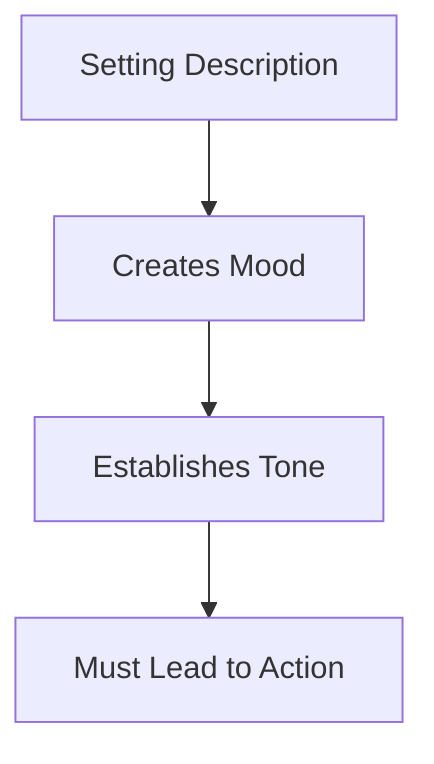
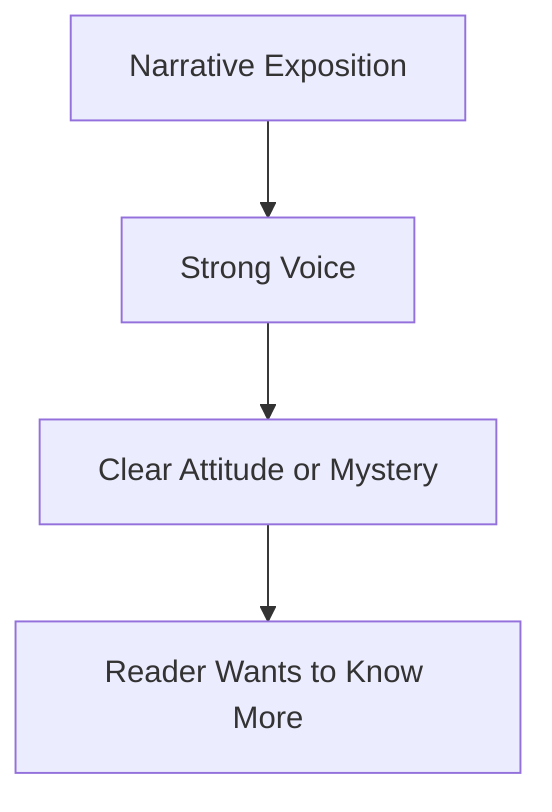
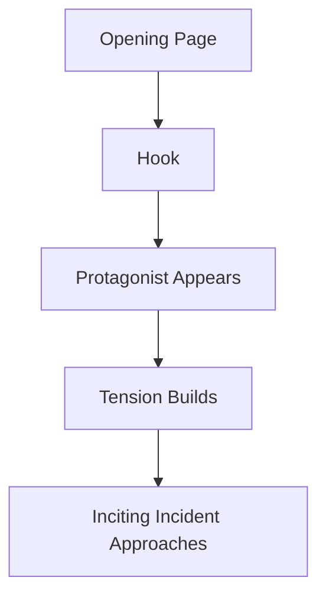
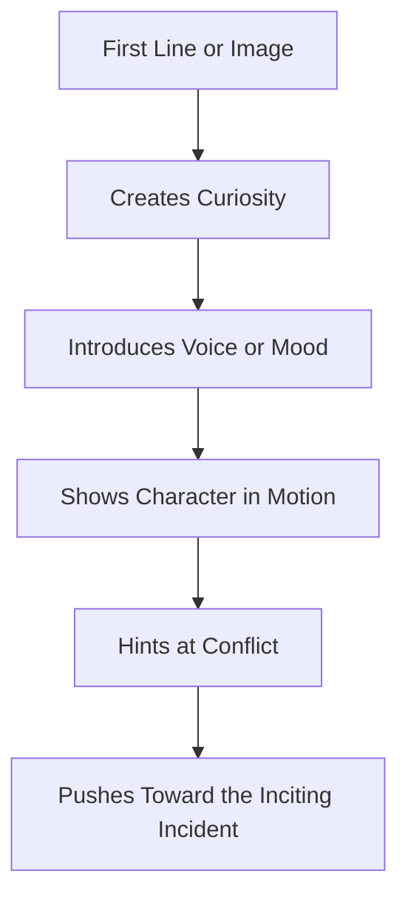
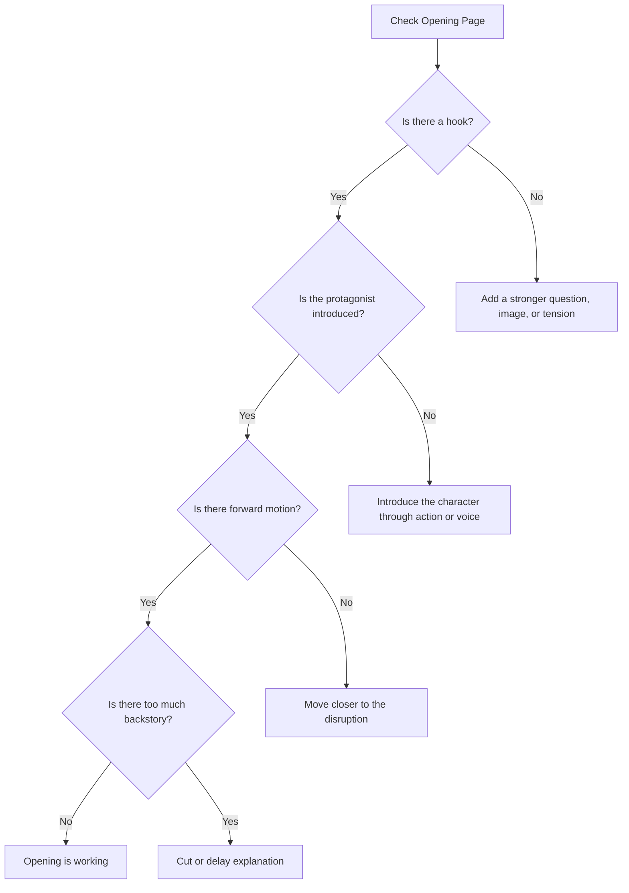

# 002 - Tips for a Strong Opening

## Section

**02 - The 3 Act Narrative Structure**

## Original Lecture Title

**Lời khuyên để mở đầu tốt**

## Duration

**7:10**

---

## 1. Lesson Overview

This lesson explains how to write a strong opening for a novel or short story. A good opening should not delay the reader with too much background information. Instead, it should begin as close as possible to the moment when something interesting is about to happen.

The opening pages should create curiosity, introduce the tone of the story, and give the reader a reason to continue.

---

## 2. Core Message

> A strong story opening should make the reader feel that something is already moving.

Beginning a story is like inviting someone to dinner. A little conversation at the door is fine, but the guest mainly wants to sit down and eat. In the same way, the reader does not want to wait too long before the story begins.

---

## 3. What a Strong Opening Should Do

A strong opening usually needs to establish three things:

| Element              | Purpose                                               |
| -------------------- | ----------------------------------------------------- |
| **Voice**            | Shows the style, rhythm, and personality of the story |
| **Tension**          | Suggests that something important is about to happen  |
| **Reader Curiosity** | Raises a question the reader wants answered           |

The first page does not need to explain everything. In fact, it should not. It should give the reader enough to feel interested, but not so much that the mystery disappears.

---

## 4. What to Avoid in an Opening

Avoid beginning with:

* Too much backstory
* Long explanation before anything happens
* Static description with no movement
* A character thinking abstractly without conflict
* Worldbuilding that delays the story
* Information the reader does not yet care about

A good opening should create forward motion.

---

## 5. The Main Principle

Start as close as possible to the disruption.

The writer should not begin too far before the real story starts. The closer the opening is to meaningful change, the stronger the reader's engagement will be.

---

## 6. Four Techniques for Starting a Story

The lesson presents four main techniques for opening a story:

Each technique has a different effect and should be used with care.

---

## 7. Technique 1: Starting with Dialogue

Opening with dialogue places the reader immediately inside an ongoing situation.

### Advantages

* Creates instant movement
* Suggests conflict or mystery
* Makes the reader feel dropped into a living scene
* Can reveal character quickly

### Risks

* The reader may not know who is speaking
* The setting may feel unclear
* Too much unexplained dialogue can become confusing

### Best Use

Dialogue works best when it also reveals something about the situation, setting, or tension.

### Example Effect

A dialogue opening can create urgency, especially when the characters are already reacting to danger, conflict, or a strange event.

---

## 8. Technique 2: Starting with Setting Description

A story can also begin by describing the environment.

### Advantages

* Establishes mood
* Introduces atmosphere
* Gives the reader sensory details
* Suggests the tone of the story

### Risks

* Too much description can slow the opening
* The reader may lose interest if nothing happens
* Description without tension can feel static

### Best Use

Setting description should be brief and should lead quickly into action or conflict.

A few precise details are usually stronger than a long descriptive passage.

---

## 9. Technique 3: Starting with Action

Starting with action is one of the most direct ways to pull the reader into the story.

### Advantages

* Creates immediate tension
* Makes the story feel alive
* Encourages the reader to keep reading
* Raises urgent questions

### Risks

* The reader may not understand why the action matters
* Too much action without context can feel empty
* The scene may become confusing if the stakes are unclear

### Best Use

Action openings need balance. The writer should describe what is happening while also giving enough context for the reader to care.

The best action openings combine external movement with emotional meaning.

---

## 10. Technique 4: Starting with Narrative Exposition

Narrative exposition means beginning with the narrator speaking directly or indirectly to the reader.

### Advantages

* Establishes a strong narrative voice
* Can create intimacy with the reader
* Allows the writer to introduce theme or mystery
* Works well when the narrator has a distinctive perspective

### Risks

* Can feel old-fashioned if handled poorly
* May become too explanatory
* Can delay the scene if there is no tension

### Best Use

Narrative exposition works best when the narrator's voice is compelling and immediately raises a question.

This technique can be powerful when the narrator hints at danger, memory, guilt, murder, love, or an unusual event.

---

## 11. Comparison of Opening Techniques

| Technique                | Main Strength          | Main Risk            | Best For                                    |
| ------------------------ | ---------------------- | -------------------- | ------------------------------------------- |
| **Dialogue**             | Immediate scene energy | Confusion            | Conflict, mystery, tension                  |
| **Setting Description**  | Mood and atmosphere    | Slow pacing          | Literary fiction, fantasy, mystery          |
| **Action**               | High tension           | Lack of context      | Thriller, adventure, drama                  |
| **Narrative Exposition** | Strong voice           | Too much explanation | Literary fiction, crime, reflective stories |

---

## 12. The Three Parts of a Good Beginning

According to the lesson, a good beginning consists of three major parts:

---

## 13. Part 1: The Hook

The hook is the element that grabs the reader's attention.

It can be:

* A strange image
* A surprising sentence
* A dangerous situation
* A mysterious voice
* A conflict already in motion
* A question the reader wants answered

The hook should not simply be loud or dramatic. It should be meaningful to the story.

---

## 14. Part 2: Introduction of the Protagonist

The opening should begin to introduce the main character.

This does not mean giving the reader the character's entire biography. Instead, the opening should show the protagonist through:

* Action
* Voice
* Desire
* Reaction
* Conflict
* A specific situation

The reader should quickly begin to understand who the story is about.

---

## 15. Part 3: Staging the Inciting Incident

The opening should prepare the story for the inciting incident.

The inciting incident is the event that disrupts the protagonist's ordinary life and begins the main story conflict.

The opening does not always need to contain the full inciting incident, but it should move toward it.

---

## 16. Opening Structure Map

A strong opening often moves like this:

---

## 17. Key Points

* Begin as close as possible to the action.
* The reader should feel that something is about to happen.
* Avoid starting with too much backstory.
* Do not overload the first page with explanation.
* A strong opening creates curiosity and movement.
* Dialogue, setting, action, and narrative exposition are four useful opening techniques.
* The opening should lead toward the hook, protagonist introduction, and inciting incident.

---

## 18. Practical Exercise

Take the last story or novel you wrote and rewrite the opening four times.

| Version   | Opening Technique    | Goal                                                        |
| --------- | -------------------- | ----------------------------------------------------------- |
| Version 1 | Dialogue             | Begin with characters speaking in the middle of a situation |
| Version 2 | Setting Description  | Establish mood, place, and atmosphere                       |
| Version 3 | Action               | Begin with movement, danger, or conflict                    |
| Version 4 | Narrative Exposition | Begin with the narrator's voice                             |

After writing all four versions, compare them and ask which one creates the strongest pull.

---

## 19. Opening Line Practice

Write three different opening lines for your novel.

Then read them aloud and ask:

1. Which one has the strongest rhythm?
2. Which one creates the clearest question?
3. Which one best matches the tone of the book?
4. Which one makes the reader want to continue?
5. Which one begins closest to the real story?

---

## 20. Reflection Questions

1. Does your current opening page raise a question the reader actually wants answered?
2. Are you beginning too early?
3. Is there too much backstory before the story begins?
4. Does the first page establish a clear voice?
5. Does the opening hint at the central tension of the book?
6. Is the protagonist introduced through action, voice, or conflict?
7. Does the opening move toward the inciting incident?

---

## 21. Diagnostic Checklist

Use this checklist to test your opening:

---

## 22. Summary

This lesson explains that a strong opening should not waste time. It should invite the reader directly into the story by creating movement, tension, voice, and curiosity.

There are four useful ways to begin a story:

1. Dialogue
2. Setting description
3. Action
4. Narrative exposition

Each technique can work well, but each has risks. The most important thing is that the opening should make the reader feel that something meaningful is about to happen.

---

## 23. Core Takeaway

> Do not begin with everything the reader needs to know.
> Begin with something the reader wants to know more about.

---

# Bài luyện tập

## Mục tiêu

## Đề bài

## Yêu cầu hoàn thành

- [ ] 
- [ ] 
- [ ] 

## Kết quả / lời giải

## Ghi chú
