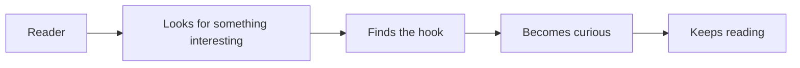
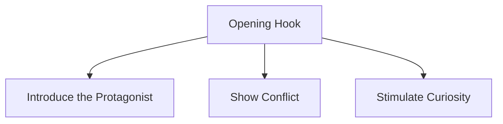
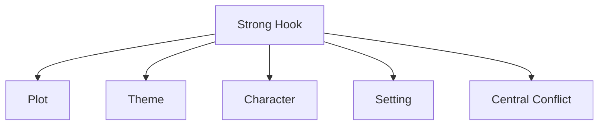
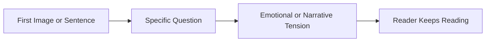
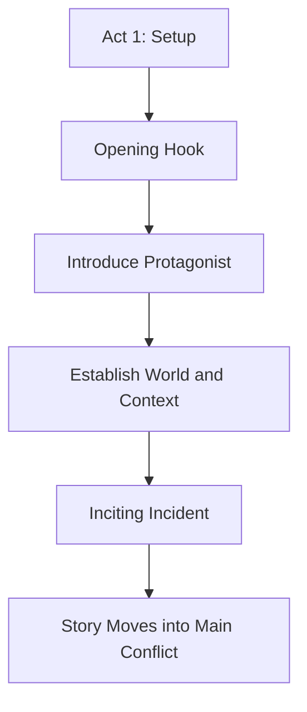
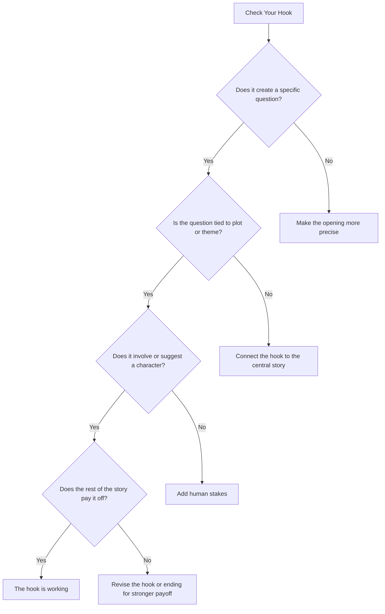

# 003 - Act 1: The Opening Hook

## Section

**02 - The 3 Act Narrative Structure**

## Original Lecture Title

**Hồi 1: Cú móc mở đầu**

## Duration

**5:38**

---

## 1. Lesson Overview

This lesson introduces the **opening hook**, one of the most important elements in Act 1 of a story.

A hook is the moment, sentence, image, situation, or question that makes the reader want to keep reading. It does not simply shock the reader. It gives them a meaningful reason to ask:

> What is going to happen next?

The hook is the writer's first chance to earn the reader's attention.

---

## 2. Core Message

> A strong hook plants a specific question in the reader's mind.

The reader should not merely feel confused. They should feel curious.

A weak hook makes the reader ask:

> What did I just read?

A strong hook makes the reader ask:

> What happens next, and why does this matter?

---

## 3. The Reader as a Fish

The lesson compares the reader to a clever fish.

The hook is the bait. Without it, the reader may not enter the story. With it, the reader is invited into the narrative through curiosity, tension, and emotional interest.

---

## 4. What Is a Hook?

A hook is a story element that creates immediate curiosity.

It can be:

* A strange sentence
* A dramatic image
* A mysterious situation
* A character in trouble
* A surprising confession
* A question connected to the plot
* A quiet but emotionally charged moment

The hook does not have to be loud. It only has to make a promise that the story will become worth reading.

---

## 5. The Three Jobs of a Hook

A strong hook should usually do three things:

### 1. Introduce the Protagonist

The hook should often give the reader a first glimpse of the central character.

This does not mean explaining the protagonist's full background. It means placing them in a moment that reveals something important about who they are or what kind of story they belong to.

### 2. Show Conflict

The hook should contain or suggest conflict.

This conflict can be:

* External danger
* Emotional tension
* A mystery
* A moral dilemma
* A strange event
* A relationship problem
* A threat approaching the protagonist

### 3. Stimulate Curiosity

The hook should make the reader ask a clear and specific question.

That question is what pulls the reader forward.

---

## 6. Good Curiosity vs. Bad Confusion

Not every unanswered question is a good hook.

| Good Hook                             | Bad Hook                                            |
| ------------------------------------- | --------------------------------------------------- |
| Creates a specific question           | Creates meaningless confusion                       |
| Gives enough context to care          | Gives too little information to understand anything |
| Connects to character, plot, or theme | Feels random or disconnected                        |
| Makes the reader want answers         | Makes the reader feel lost                          |

A good hook gives the reader enough information to form a meaningful question.

---

## 7. Example: A Simple Hook

In Elizabeth Gaskell's *Lizzie Leigh*, the story opens with a dying man saying:

> "I forgive her, Anna!"

This line immediately creates questions:

* Who is being forgiven?
* What did she do?
* Why is he saying this on his deathbed?
* What kind of story has led to this moment?

The hook works because it is short, emotional, and specific.

---

## 8. What Strong Hooks Have in Common

The lesson gives several examples of famous opening hooks. Their power comes from the questions they raise.

| Type of Hook                                                | Question It Creates                                    |
| ----------------------------------------------------------- | ------------------------------------------------------ |
| Someone wakes up and the other side of the bed is cold      | Who was there, and why are they gone?                  |
| A man wakes up transformed into a monstrous insect          | How did this happen, and what will he do now?          |
| A narrator says their mother died today, or maybe yesterday | Why is the narrator emotionally detached or uncertain? |
| A person wakes in the woods beside a child                  | Why are they there, and what danger surrounds them?    |
| A narrator says they died                                   | How can a dead person tell the story?                  |
| A man faces a firing squad and remembers childhood          | How did his life lead to this moment?                  |

The reader does not yet understand everything. However, they understand enough to want answers.

---

## 9. The Hook Should Be Connected to the Story

A hook should not be a flashy scene that has nothing to do with the rest of the book.

It should connect to at least one of the following:

A hook creates a promise. The rest of the story must eventually pay off that promise.

---

## 10. The Hook as a Promise

Every opening hook tells the reader what kind of experience to expect.

| Hook Promise                     | Reader Expectation                                       |
| -------------------------------- | -------------------------------------------------------- |
| A murder is mentioned            | This story will involve crime, guilt, or investigation   |
| A strange transformation happens | This story will involve the surreal, symbolic, or absurd |
| A relationship is broken         | This story will explore love, loss, or betrayal          |
| A character is in danger         | This story will involve survival or suspense             |
| A mysterious statement is made   | This story will reveal hidden truths                     |

The ending should answer, complete, or transform the question raised by the hook.

---

## 11. Hooks Usually Talk About People

Readers become attached to characters.

That is why many strong openings immediately introduce people, relationships, or human problems.

A good hook often shows:

* Someone in danger
* Someone making a confession
* Someone facing loss
* Someone remembering the past
* Someone entering conflict
* Someone encountering the unknown

Even when the hook begins with setting or atmosphere, it usually becomes stronger when it connects to a human situation.

---

## 12. Hook and Setting

A hook can also establish setting.

However, the setting should not be empty decoration. It should support the mood, conflict, or character situation.

Examples of hook settings may include:

| Setting        | Possible Story Effect                       |
| -------------- | ------------------------------------------- |
| A cold bed     | Absence, loneliness, abandonment            |
| A dark forest  | Fear, survival, danger                      |
| A deathbed     | Regret, confession, forgiveness             |
| A firing squad | Fate, memory, historical tragedy            |
| A strange room | Mystery, uncertainty, psychological tension |

Setting works best when it creates emotional or narrative pressure.

---

## 13. Statement Hooks

Some hooks begin with a direct statement.

For example:

> No, it is too risky.

This works because the reader immediately asks:

> What is too risky?

A statement hook is effective when it creates a follow-up question.

However, a plain statement with no tension does not work well.

| Weak Statement         | Stronger Statement                                           |
| ---------------------- | ------------------------------------------------------------ |
| The sky was blue.      | No, it was too risky.                                        |
| It was Monday morning. | I knew he would come back to kill me.                        |
| She opened the door.   | She opened the door and found her own name written in blood. |

The difference is not just drama. The stronger statement creates a question.

---

## 14. Hook Structure

A strong hook often follows this pattern:

The hook does not need to explain the story. It needs to open a gap in the reader's mind.

That gap creates curiosity.

---

## 15. The Hook in Act 1

In the Three-Act Structure, the hook belongs at the very beginning of Act 1.

The hook does not always have to be the inciting incident itself. However, it should prepare the reader for the story's main direction.

---

## 16. Hook vs. Inciting Incident

The hook and the inciting incident are related, but they are not always the same.

| Element               | Function                                                           | Position                    |
| --------------------- | ------------------------------------------------------------------ | --------------------------- |
| **Hook**              | Makes the reader want to continue                                  | First page or opening scene |
| **Inciting Incident** | Disrupts the protagonist's life and starts the main story conflict | Usually later in Act 1      |

The hook attracts attention.
The inciting incident launches the main story.

---

## 17. A Strong Hook Can Be Quiet

A hook does not need to include explosions, murder, or dramatic action.

A quiet hook can work if it creates emotional curiosity.

Examples of quiet hooks:

* A character notices an empty chair at breakfast.
* A child refuses to speak after returning home.
* A woman receives a letter from someone who should be dead.
* A man forgives someone on his deathbed.
* A character lies about something small, but the lie feels important.

What matters is not volume. What matters is narrative promise.

---

## 18. Diagnostic Questions for Your Hook

Use these questions to test your opening:

---

## 19. Practical Exercise

Identify the promise your opening hook makes to the reader.

Then check whether your ending pays it off.

Use this table:

| Question                                            | Your Answer |
| --------------------------------------------------- | ----------- |
| What is the first question my opening creates?      |             |
| Is this question connected to the main plot?        |             |
| Is this question connected to the theme?            |             |
| Does the hook introduce or suggest the protagonist? |             |
| What kind of story does the hook promise?           |             |
| Does the ending satisfy that promise?               |             |

---

## 20. Reflection Questions

1. If a reader only read your first page, what would they expect this book to be about?
2. Does your hook create curiosity or confusion?
3. Is your hook connected to the central conflict?
4. Does your hook introduce a person, problem, or emotional situation?
5. Could your hook happen in any story, or does it belong specifically to this story?
6. Does your ending answer the question your hook raises?
7. Is the hook too flashy for the kind of story that follows?

---

## 21. Key Points

* The hook is the first major tool for capturing the reader's attention.
* A hook should make the reader ask, “What happens next?”
* It should introduce the protagonist or at least a human situation.
* It should show or suggest conflict.
* It should stimulate curiosity without causing meaningless confusion.
* A hook must connect to the plot, theme, or emotional core of the novel.
* The hook can be loud and action-driven or quiet and character-driven.
* The hook creates a promise that the story should eventually fulfill.

---

## 22. Summary

The opening hook is the first major checkpoint in Act 1. Its job is to make the reader curious enough to continue.

A strong hook does not merely surprise the reader. It creates a specific question connected to the story's protagonist, conflict, setting, plot, or theme.

The hook is your first and possibly only chance to impress the reader. Use it carefully.

---

## 23. Core Takeaway

> A good hook does not confuse the reader.
> It gives the reader one powerful question they want answered.
