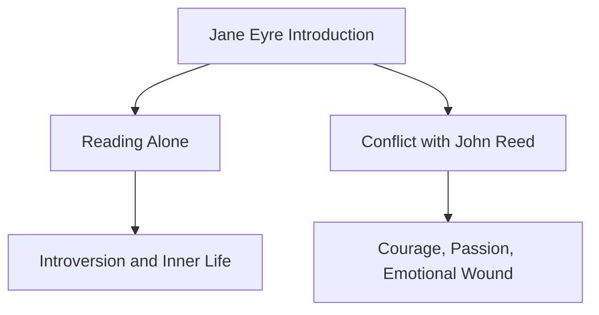
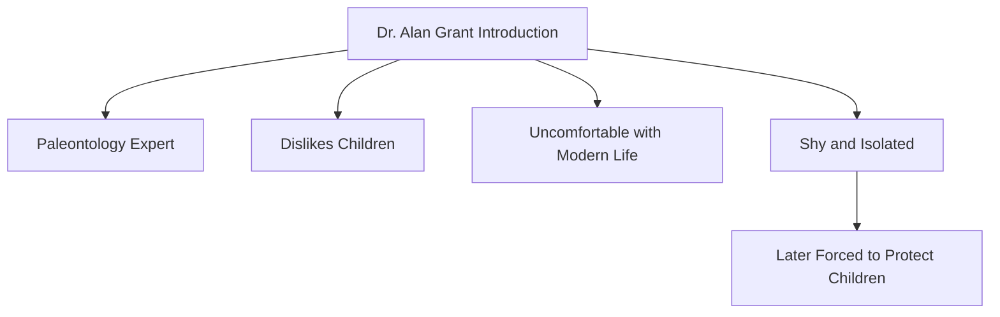
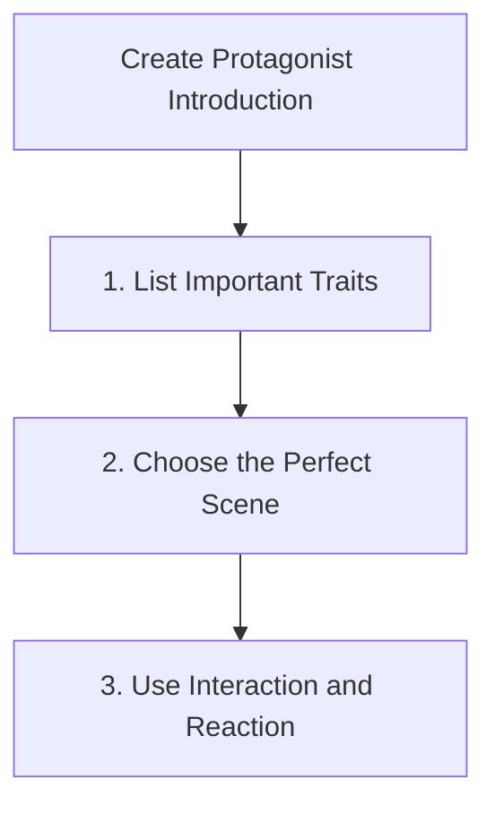
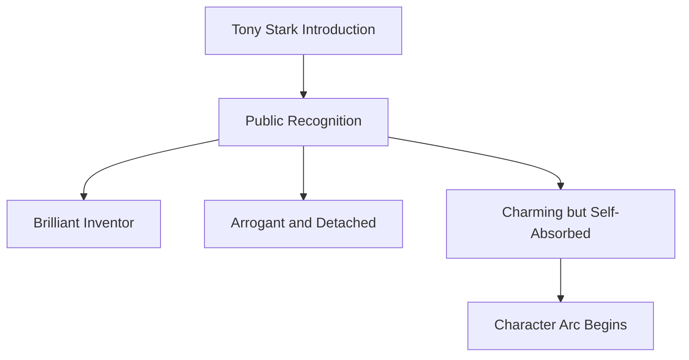
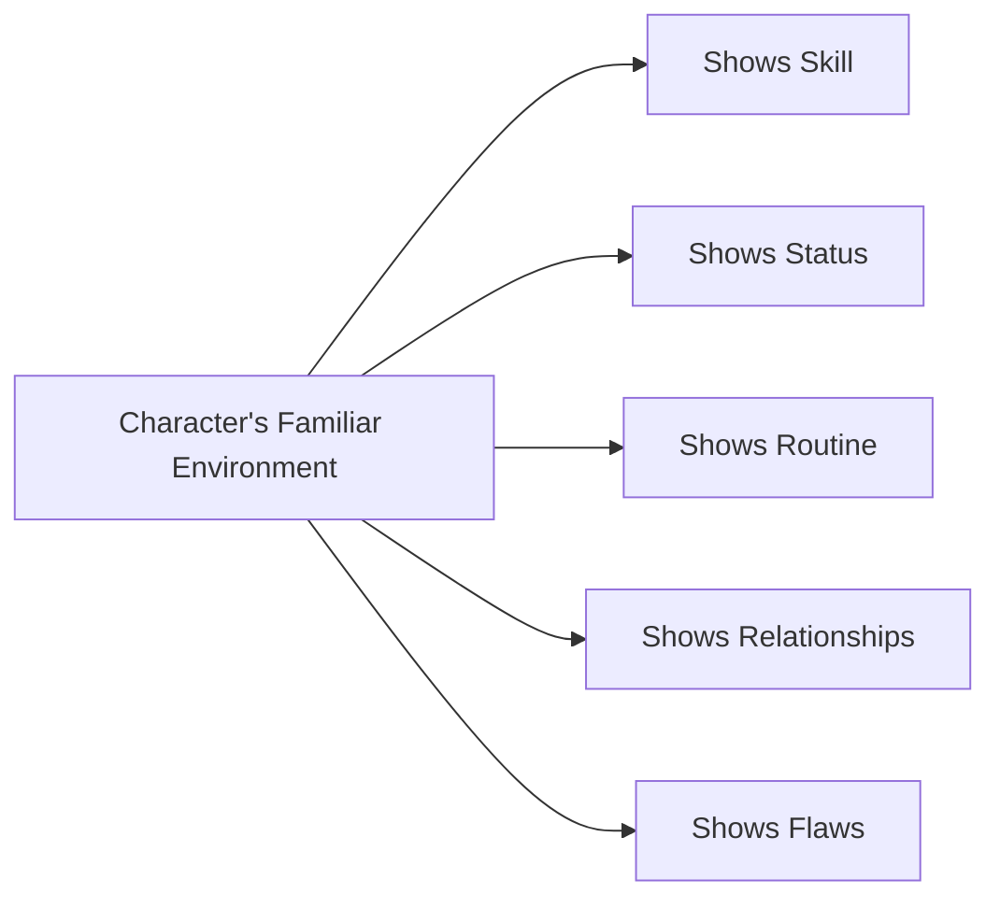
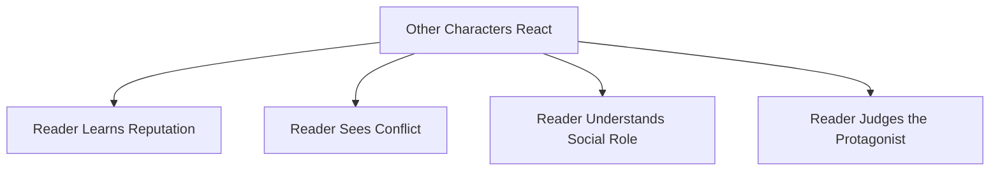
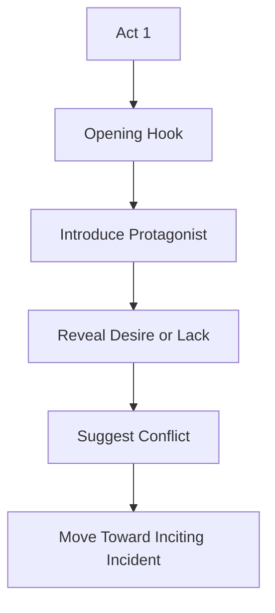
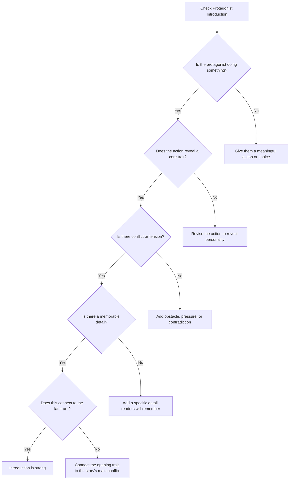

# 004 - Introducing the Protagonist

## Section

**02 - The 3 Act Narrative Structure**

## Original Lecture Title

**Giới thiệu nhân vật chính**

## Duration

**8:24**

---

## 1. Lesson Overview

This lesson explains how to introduce the protagonist in a strong and memorable way.

After the opening hook, one of the most important tasks in Act 1 is to bring the protagonist onto the stage. The reader's first impression of this character matters because it shapes how they will understand, judge, and emotionally follow the character for the rest of the story.

A strong protagonist introduction should not simply list personality traits. It should reveal who the character is through action, choice, conflict, setting, and interaction.

---

## 2. Core Message

> The protagonist should be introduced through behavior, not explanation.

The reader should not merely be told that the protagonist is brave, lonely, arrogant, shy, kind, or ambitious. The reader should see the protagonist doing something that proves it.

---

## 3. Why First Impressions Matter

First impressions guide the reader's emotional response.

When readers open a new book, they often judge very quickly whether the story interests them. The first few pages must therefore give them a reason to care.

The introduction of the protagonist must answer one central question:

> Why should the reader be interested in this person?

---

## 4. The Hero Enters the Stage

The protagonist's introduction is like the moment when the spotlight falls on the hero.

The introduction should make the reader feel that this character is worth following.

---

## 5. A Protagonist Should Not Be a Stereotype

A generic hero is not enough.

The protagonist should feel full-bodied, with:

* Positive traits
* Negative traits
* Inner contradictions
* Possible conflicts
* Goals
* Desires
* Values
* Weaknesses
* Emotional pressure

A compelling protagonist is not perfect. They are interesting because their strengths and flaws create tension.

---

## 6. Ten Things to Include When Introducing the Protagonist

A strong protagonist introduction should give the reader hints about several important areas.

These details do not need to be explained directly. The best approach is to reveal them naturally through one well-designed scene.

---

## 7. What the Introduction Must Reveal

| Element                               | Purpose                                                      |
| ------------------------------------- | ------------------------------------------------------------ |
| **Name**                              | Gives the reader a clear anchor                              |
| **Age or life stage**                 | Helps the reader understand the character's position in life |
| **Occupation or role**                | Shows how the character functions in the world               |
| **Physical details**                  | Highlights traits that matter to the story                   |
| **Personality**                       | Shows how the character behaves                              |
| **Sympathetic or interesting traits** | Gives the reader a reason to care                            |
| **Goal**                              | Shows what the character wants                               |
| **Conflict**                          | Shows what stands in the way                                 |
| **Desire**                            | Reveals emotional motivation                                 |
| **Beliefs and values**                | Shows how the character understands the world                |

The goal is not to dump information. The goal is to dramatize identity.

---

## 8. Show the Character in Motion

A protagonist should be introduced while wanting or doing something.

Avoid introducing the character in a neutral, static moment.

| Weak Introduction                                 | Stronger Introduction                                |
| ------------------------------------------------- | ---------------------------------------------------- |
| Describing the character's appearance in a mirror | Showing the character making a difficult choice      |
| Listing personality traits                        | Showing the character reacting under pressure        |
| Explaining their backstory immediately            | Showing the effect of their past on present behavior |
| Starting with a passive moment                    | Starting with a desire, conflict, or action          |

The first thing the protagonist does should reveal something essential.

---

## 9. Example: Jane Eyre

In *Jane Eyre*, the protagonist is introduced through two important early scenes.

### Scene 1: Jane Reading Alone

This shows:

* Her introverted nature
* Her need for solitude
* Her inner life
* Her separation from others

### Scene 2: Jane Being Tormented by John Reed

This shows:

* Her passionate side
* Her courage
* Her anger
* Her vulnerability
* The emotional wound that shapes her belief about love and worth

Jane's introduction works because it shows both her quiet interiority and her fierce resistance.

---

## 10. Example: Toy Story

In *Toy Story*, Woody is introduced through Andy's playtime.

At first, Woody is shown as Andy's favorite toy. When Andy leaves the room, Woody begins speaking to the other toys like a leader.

This introduction reveals:

* Woody's importance to Andy
* His joy in being loved
* His leadership role
* His confidence
* His values
* A hint of his flaw: his need to remain special

The scene introduces not only who Woody is, but also the emotional conflict that will later be challenged.

---

## 11. Example: Jurassic Park

*Jurassic Park* is an action-heavy story, but it spends significant time introducing the protagonists before the danger begins.

Dr. Alan Grant is introduced as:

* A paleontologist
* Shy
* Uncomfortable with modern technology
* Deeply focused on dinosaurs
* Awkward with children
* Emotionally closed off

This matters because later the plot forces him to protect children in a dangerous world filled with dinosaurs.

The introduction prepares the character arc before the major action begins.

---

## 12. Why Calm Introductions Can Work

A protagonist introduction does not always need immediate danger.

Sometimes a calmer scene is useful because it allows the reader to understand the character's worldview before the conflict escalates.

Calm scenes can build suspense because the reader senses that danger is coming.

When the reader knows the protagonist well, later danger becomes more emotionally powerful.

---

## 13. Three Steps to Creating a Strong Protagonist Introduction

The lesson presents three practical steps.

---

## 14. Step 1: List the Character's Most Important Traits

Before writing the introduction, identify the traits that matter most to the story.

Ask:

* What personality traits define this character?
* What skills make them special?
* What flaws create problems?
* What contradictions make them interesting?
* Which traits will matter later in the plot?

The introduction should focus on the traits that will become important later.

---

## 15. Example: Tony Stark in Iron Man

Tony Stark is introduced as a character with strong contrasting traits.

| Positive Traits | Negative Traits            |
| --------------- | -------------------------- |
| Funny           | Arrogant                   |
| Charming        | Insensitive                |
| Brilliant       | Self-absorbed              |
| Innovative      | Careless with consequences |

These contradictions make him compelling.

In one early scene, Tony receives an award for innovation in weapons technology, but he appears uninterested in the praise. This reveals his intelligence, status, arrogance, detachment, and self-absorption.

The scene works because it displays multiple traits at once.

---

## 16. Step 2: Choose the Perfect Scene

Once you know the protagonist's key traits, choose a scene that can reveal them naturally.

A useful strategy is to show the protagonist in an environment familiar to them.

This might be:

* Their workplace
* Their home
* Their school
* Their courtroom
* Their battlefield
* Their family environment
* Their social circle
* A place where they feel powerful or vulnerable

The right environment helps reveal the character quickly.

---

## 17. Character Introduction Through Familiar Environment

A lawyer in court, a teacher in class, a thief during a robbery, or a lonely person at home can all reveal character through context.

---

## 18. Example: The Devil's Advocate

In *The Devil's Advocate*, the protagonist is introduced as a successful lawyer.

He is so determined to win that he helps a clearly guilty professor escape punishment.

This introduction reveals:

* Ambition
* Intelligence
* Moral compromise
* Competitive drive
* A dangerous desire to win at any cost

The scene tells the reader who this person is by showing what he is willing to do.

---

## 19. Step 3: Use Other Characters' Reactions

A protagonist can also be introduced through how other characters respond to them.

Reactions can reveal:

* How others see the protagonist
* The protagonist's social power
* Their reputation
* Their emotional effect on people
* Hidden conflict
* Their role in the world

Sometimes another character's reaction reveals more than direct description.

---

## 20. Example: The Canterville Ghost

In *The Canterville Ghost*, Sir Simon, the ghost, tries to frighten the new owner of the castle.

However, instead of being afraid, Mr. Otis calmly offers him oil for his noisy chains.

This scene reveals the ghost's conflict:

> He can no longer frighten the people he is supposed to haunt.

The introduction works because the protagonist's identity is shown through another character's unexpected reaction.

---

## 21. Protagonist Introduction Checklist

A strong introduction should answer these questions:

| Question                                               | Your Answer |
| ------------------------------------------------------ | ----------- |
| What is the protagonist doing when we first meet them? |             |
| What core trait does this action reveal?               |             |
| What flaw or weakness appears early?                   |             |
| What does the protagonist want?                        |             |
| What obstacle or conflict is suggested?                |             |
| What does the reader learn without direct exposition?  |             |
| What memorable detail will stay with the reader?       |             |

---

## 22. The Best Introduction Reveals Contradiction

The most interesting protagonists often contain tension between opposing traits.

Examples:

| Trait 1   | Trait 2            | Result                |
| --------- | ------------------ | --------------------- |
| Brave     | Afraid of intimacy | Emotional conflict    |
| Brilliant | Arrogant           | Social conflict       |
| Kind      | Secretly resentful | Inner conflict        |
| Ambitious | Morally uncertain  | Ethical conflict      |
| Loving    | Controlling        | Relationship conflict |

A good introduction can show both the strength and the flaw that will drive the story.

---

## 23. Structural Role in Act 1

The protagonist introduction belongs early in Act 1, usually after or alongside the hook.

The reader should understand enough about the protagonist to care when the inciting incident disrupts their life.

---

## 24. Avoid Long-Winded Exposition

Do not introduce the protagonist by stopping the story to explain everything.

Instead of writing:

> Sarah was brave, stubborn, lonely, and ambitious. She was thirty-two years old and had always wanted to become a judge because of something that happened in her childhood.

Show it through a scene:

> Sarah stood alone before the judge, refusing to lower her voice even after the entire courtroom turned against her.

The second version lets the reader infer character through action.

---

## 25. Practical Exercise

Rewrite your protagonist's introduction so that the very first thing they do reveals a core trait.

Use this template:

| Step | Writing Task                                                |
| ---- | ----------------------------------------------------------- |
| 1    | Choose one core trait of your protagonist                   |
| 2    | Choose one flaw or contradiction                            |
| 3    | Create a situation that pressures both                      |
| 4    | Show the protagonist making a choice                        |
| 5    | Let another character react to that choice                  |
| 6    | Add one memorable physical, emotional, or behavioral detail |

---

## 26. Seven Questions for Your Protagonist Introduction

Answer the following questions:

1. What are the personality traits, skills, and shortcomings that best represent the protagonist?
2. How can you tie all these elements together at the beginning of the story?
3. How can you show the event or wound that shaped the protagonist's current beliefs and values?
4. How can the opening scene reveal the protagonist's goal?
5. How can you introduce the main obstacle to that goal?
6. How can you provide details such as name, age, or physical appearance without long exposition?
7. Whom can the protagonist interact with so the reader understands their character?

---

## 27. Reflection Questions

1. What is the one detail from your protagonist's introduction that a reader would still remember at the end of the book?
2. Does the first scene show the protagonist doing something meaningful?
3. Is the protagonist introduced through action, choice, or conflict?
4. Does the introduction reveal both strength and weakness?
5. Does the scene hint at the protagonist's goal?
6. Does another character's reaction help reveal who the protagonist is?
7. Is the introduction connected to the later character arc?

---

## 28. Diagnostic Flowchart

Use this flowchart to evaluate your protagonist's introduction:

---

## 29. Key Points

* First impressions matter.
* The protagonist should be introduced soon after the hook.
* The introduction must answer why the reader should care about this person.
* Avoid presenting a stereotypical or purely heroic character.
* Reveal personality through action, choice, conflict, and reaction.
* Show both strengths and weaknesses.
* Choose a scene that displays the character's most important traits.
* Other characters' reactions can help reveal the protagonist.
* Give the reader one memorable detail early.
* The introduction should prepare the reader for the protagonist's goal, conflict, and arc.

---

## 30. Summary

The protagonist's introduction is one of the most important moments in Act 1. It must make the reader interested in following this particular person.

A strong introduction does not rely on a list of traits. It shows the protagonist in action, in conflict, or in a meaningful environment. It reveals personality, goal, flaw, values, and potential conflict through a carefully chosen scene.

The best introductions make the protagonist memorable while also preparing the reader for the journey ahead.

---

## 31. Core Takeaway

> Do not tell the reader who your protagonist is.
> Show the reader what your protagonist does when something matters.
