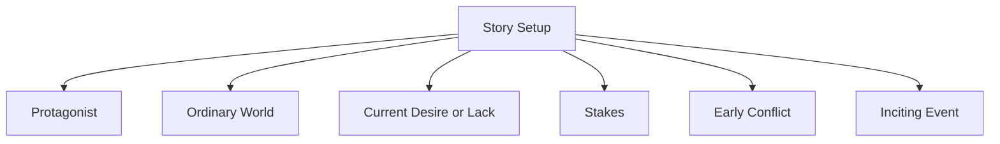
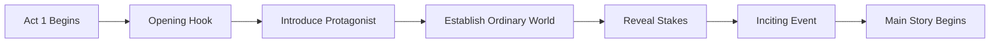
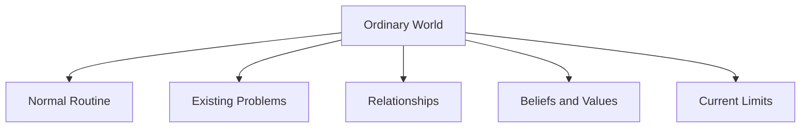
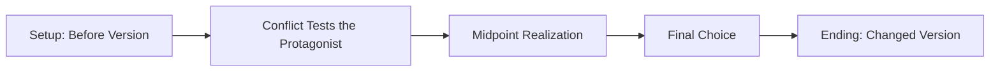
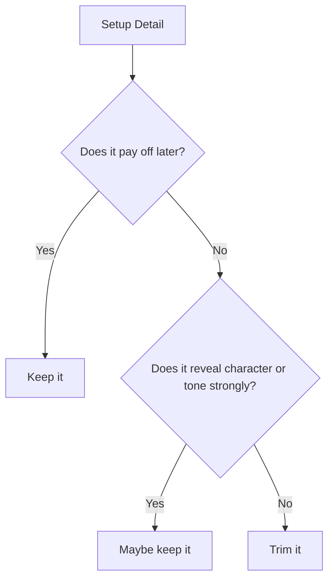
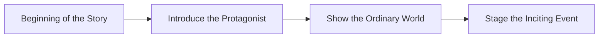
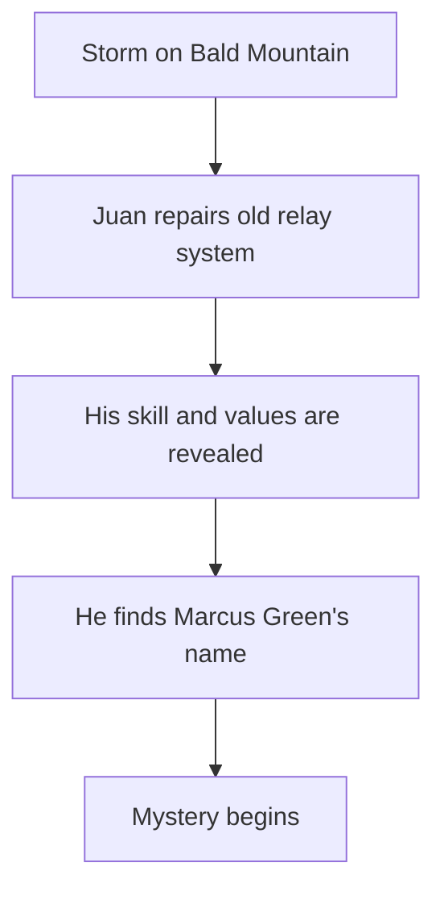
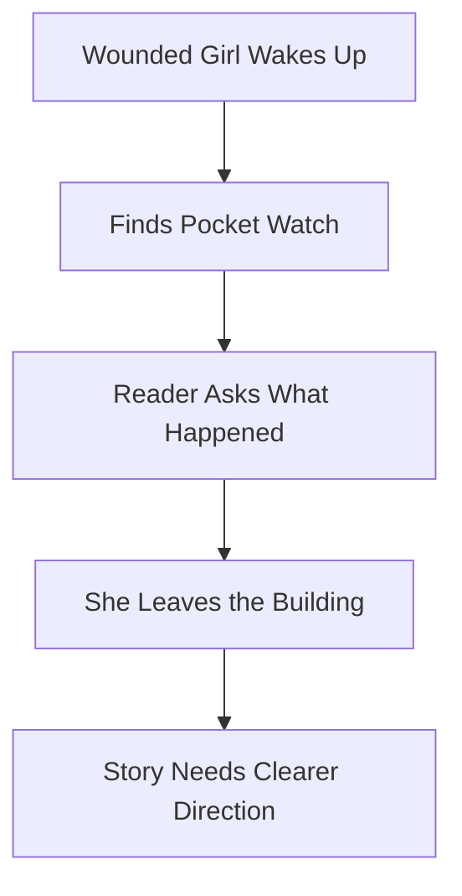
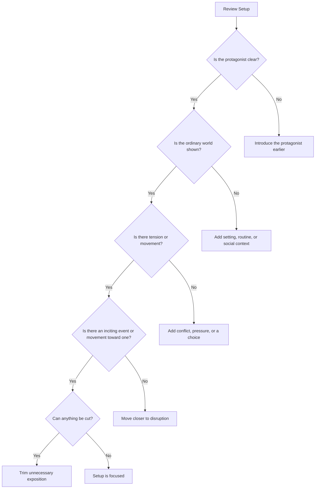

# 005 - The Story's Setup

## Section

**02 - The 3 Act Narrative Structure**

## Original Lecture Title

**Phần mở đầu câu chuyện**

## Duration

**Not listed**
Writing exercise / discussion segment

---

## 1. Lesson Overview

This lesson focuses on the **setup** of a story: the opening portion where the reader learns who the protagonist is, what their ordinary world looks like, and what event begins to disturb that world.

The setup is not merely background information. It is the foundation of the whole story. It introduces the “before” version of the protagonist so that the reader can later understand how the story changes them.

---

## 2. Core Message

> The setup should not feel like preparation for the story.
> It should already feel like the story has begun.

A strong setup gives the reader enough information to understand the protagonist, the ordinary world, the main tension, and the coming disruption — but it should still have movement, curiosity, and conflict.

---

## 3. What Is the Story Setup?

The setup is the early part of Act 1 where the writer establishes the basic conditions of the story.

It usually introduces:

* The protagonist
* The ordinary world
* The protagonist's current life
* The protagonist's desire or lack
* The emotional tone of the story
* The first hints of conflict
* The stakes
* The inciting event or the movement toward it

---

## 4. The Function of the Setup

The setup has one main job:

> To show the reader what the world looks like before everything changes.

This “before” state matters because the rest of the story will transform it.

| Setup Element                   | Why It Matters                                      |
| ------------------------------- | --------------------------------------------------- |
| **Ordinary world**              | Shows what normal life looks like before disruption |
| **Protagonist's current state** | Establishes the character before growth or change   |
| **Stakes**                      | Shows what can be lost or gained                    |
| **Early conflict**              | Prevents the opening from feeling static            |
| **Inciting event**              | Begins the main story movement                      |

---

## 5. The Setup in Act 1

The setup belongs in the first act of the story.

The hook grabs attention.
The protagonist introduction gives the reader someone to follow.
The setup gives the reader context.
The inciting event pushes the story into motion.

---

## 6. Setup Is Not the Same as Backstory

A common mistake is confusing setup with backstory.

| Setup                                | Backstory                                    |
| ------------------------------------ | -------------------------------------------- |
| Happens in the present story         | Explains events from the past                |
| Shows the protagonist's current life | Explains why the protagonist became this way |
| Moves toward disruption              | May slow the story if overused               |
| Gives the reader what they need now  | Gives history only when necessary            |

Backstory can appear in the setup, but only in small, necessary pieces.

The setup should not become a history lesson.

---

## 7. The Ordinary World

The ordinary world is the protagonist's normal life before the central conflict fully begins.

It may include:

* Their home
* Their family
* Their job
* Their social position
* Their habits
* Their emotional routine
* Their current problem
* Their false belief about life

The ordinary world does not need to be peaceful. It only needs to represent the protagonist's normal reality.

---

## 8. The “Before” Version of the Protagonist

The setup should show who the protagonist is before the story changes them.

This includes:

* What they believe
* What they want
* What they fear
* What they avoid
* What they misunderstand
* What they lack emotionally
* What flaw or wound shapes their choices

The reader needs this early version so they can later recognize the transformation.

---

## 9. Setup and Character Arc

The setup creates the starting point of the character arc.

Without a clear setup, the ending may not feel meaningful because the reader cannot measure how far the protagonist has come.

---

## 10. Setup Should Have Movement

The setup should not feel like homework the reader must complete before the “real” story starts.

A weak setup often contains:

* Too much explanation
* Too much worldbuilding
* A passive protagonist
* Long descriptions with no tension
* Information that does not pay off later
* Scenes that only exist to explain context

A strong setup contains:

* Action
* Choice
* Tension
* Character behavior
* Conflict
* Mystery
* A sense that something is about to change

---

## 11. The Rule of Payoff

Everything introduced in the setup should matter later.

If the setup introduces an object, relationship, promise, secret, fear, skill, or wound, the story should eventually use it.

A setup becomes stronger when every detail has a purpose.

---

## 12. The Inciting Event

The assignment reminds the writer to include or move toward the **inciting event**.

The inciting event is the moment that disturbs the ordinary world and starts the main conflict.

It may be:

* A death
* A discovery
* A letter
* A betrayal
* A threat
* A meeting
* A challenge
* A strange accident
* A decision that cannot be undone

The inciting event should make the reader feel that the protagonist's life can no longer continue as before.

---

## 13. Setup vs. Inciting Event

| Element            | Function                                                 |
| ------------------ | -------------------------------------------------------- |
| **Setup**          | Shows the protagonist's ordinary world and current state |
| **Inciting Event** | Disrupts that world and begins the main conflict         |

The setup prepares the reader.
The inciting event changes the direction of the story.

---

## 14. A Strong Beginning Should Include Three Things

For this assignment, the beginning should include:

These three elements create a complete opening movement.

---

## 15. Assignment Instructions

Write the beginning of your story.

Your beginning should include:

1. The protagonist
2. The ordinary world
3. The inciting event

Maximum length:

> **2,000 characters**

The challenge is to begin the story clearly and efficiently without over-explaining.

---

## 16. Assignment Goal

The goal of this assignment is not to summarize your story idea.

The goal is to write the actual beginning as prose.

Do not write:

> My story is about a detective who investigates a murder in a rich family.

Instead, begin with a scene:

> Detective Mara Venn knew the family was lying before she saw the body.

The second version creates immediate narrative movement.

---

## 17. Setup Writing Template

Use this template to plan your opening:

| Element                                   | Your Answer |
| ----------------------------------------- | ----------- |
| Who is the protagonist?                   |             |
| Where are they when the story begins?     |             |
| What does their ordinary world look like? |             |
| What do they want right now?              |             |
| What detail reveals their personality?    |             |
| What tension already exists?              |             |
| What event disrupts the situation?        |             |
| What question should the reader ask next? |             |

---

## 18. Information Audit Exercise

List every piece of information your setup delivers.

Then decide whether each detail pays off later.

| Setup Detail            | Purpose             | Payoff Later? | Keep / Cut / Move Later |
| ----------------------- | ------------------- | ------------- | ----------------------- |
| Protagonist's name      | Character anchor    | Yes / No      |                         |
| Ordinary world detail   | Context             | Yes / No      |                         |
| Relationship introduced | Emotional stake     | Yes / No      |                         |
| Object or symbol        | Future clue / theme | Yes / No      |                         |
| Backstory detail        | Motivation          | Yes / No      |                         |
| Inciting event          | Story launch        | Yes           | Keep                    |

---

## 19. Example Analysis: Strong Atmospheric Setup

One student example begins on **Bald Mountain**, inside a relay shack during a storm.

### What Works

* The setting is vivid and specific.
* The protagonist, Juan Valdez, is introduced through action.
* His technical skill and personality are shown naturally.
* Dialogue reveals character without long exposition.
* The ordinary world is clear: radio equipment, towers, storms, maintenance work.
* A mysterious name, Marcus Green / Floyd, creates a possible inciting thread.

### Why It Works as Setup

The scene does not merely describe the world. It shows the protagonist doing something meaningful inside that world.

The ordinary world is technical and grounded, but the discovery of the name pushes the story toward mystery.

---

## 20. Example Analysis: Strong Visual Opening

Another student example begins with a wounded girl in an abandoned building.

### What Works

* The opening image is immediately striking.
* The physical condition of the character creates instant questions.
* The pocket watch becomes a memorable object.
* The scene creates tension without explaining too much.
* The reader wonders who the girl is, what happened, and where she will go.

### Possible Improvement

The scene has strong atmosphere, but it could become even stronger if the protagonist's goal or immediate decision were clearer.

A powerful image is useful, but the setup should also point toward forward motion.

---

## 21. Common Setup Mistakes

| Mistake             | Problem                             | Fix                                 |
| ------------------- | ----------------------------------- | ----------------------------------- |
| Starting too early  | Reader waits too long for the story | Begin closer to disruption          |
| Too much backstory  | Opening feels slow                  | Reveal history later                |
| Static description  | Nothing moves                       | Add action or choice                |
| Unclear protagonist | Reader has no anchor                | Introduce a specific person quickly |
| No stakes           | Reader does not know why it matters | Show what can be lost               |
| Random details      | Setup feels bloated                 | Keep details that pay off           |

---

## 22. Setup Revision Checklist

Use this checklist to revise your beginning:

---

## 23. Practical Exercise

Write the beginning of your story in **2,000 characters or fewer**.

Make sure it includes:

* The protagonist
* The ordinary world
* A hint of conflict
* The inciting event or the movement toward it

After writing, ask:

1. Does the scene begin close enough to the real story?
2. Is the protagonist doing something revealing?
3. Does the ordinary world feel specific?
4. Is there a question that makes the reader continue?
5. Can any sentence be cut without losing meaning?

---

## 24. Reflection Questions

1. Could you cut your setup shorter without losing anything the reader needs to understand Act 2?
2. What does the reader learn about the protagonist before the inciting event?
3. Does the setup introduce details that pay off later?
4. Is the ordinary world shown through action rather than explanation?
5. Does the setup contain forward motion?
6. What is the first sign that the protagonist's world is about to change?
7. Is the opening scene interesting by itself?

---

## 25. Key Points

* The setup establishes the ordinary world.
* The setup shows the “before” version of the protagonist.
* The setup prepares the reader for the central conflict.
* Everything introduced early should have a purpose.
* Setup should not feel like passive background information.
* The protagonist should be introduced through action, choice, or conflict.
* The inciting event should disturb the ordinary world.
* A strong setup moves while it explains.

---

## 26. Summary

The story setup is the foundation of Act 1. It introduces the protagonist, the ordinary world, the stakes, and the first movement toward disruption.

A good setup does not delay the story. It begins the story. It gives the reader enough context to care while still creating tension and curiosity.

The best setup is focused, active, and purposeful. Every detail should either reveal character, establish stakes, build atmosphere, or prepare for a later payoff.

---

## 27. Core Takeaway

> The setup is not the part before the story begins.
> The setup is where the story begins to change.
