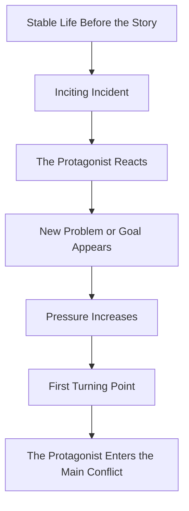

# 006 - The Inciting Incident

## Section

**02 - The 3 Act Narrative Structure**

## Original Lecture Title

**Biến cố kích hoạt**
*The Inciting Incident*

## Duration

**4:27**

---

# Lesson Overview

The **Inciting Incident** is the precise moment that lights the fuse of the story. It disrupts the protagonist’s ordinary world and begins the chain of events that the rest of the narrative will follow.

Before this moment, the story is still showing the protagonist’s normal life, background, relationships, and early conflicts. After this moment, the real story begins to move forward with urgency.

In a typical 3-act structure, the inciting incident often appears around the **first 10–12%** of the story.

---

# Key Points

## 1. The Inciting Incident Disrupts the Ordinary World

Before the inciting incident, the protagonist usually lives in a state of relative balance.

This balance does not mean their life is perfect. It simply means their world has not yet been shaken by the central problem of the story.

The inciting incident changes that.

It introduces an event, decision, discovery, death, meeting, invitation, or crisis that makes the old life impossible to continue in the same way.

---

## 2. It Starts the Real Story

The inciting incident is the event that separates the setup from the actual story.

Everything before it prepares the reader to understand:

* who the protagonist is,
* what their ordinary life looks like,
* what they want,
* what kind of world they live in,
* and what emotional or practical weakness may be tested later.

Everything after it begins the main chain of cause and effect.

---

## 3. It Creates a Problem the Protagonist Cannot Ignore

A strong inciting incident gives the protagonist a problem, opportunity, danger, or desire that cannot be dismissed easily.

The protagonist may not immediately know how to solve it, and they may even resist it at first. However, the incident creates pressure.

The story now has motion.

---

# Position in the 3-Act Structure

```mermaid
flowchart LR
    A[Ordinary World / Setup] --> B[Inciting Incident]
    B --> C[Reaction and Pressure]
    C --> D[First Turning Point]
    D --> E[Act 2: Confrontation]

    A:::setup
    B:::incident
    C:::reaction
    D:::turning
    E:::act2

    classDef setup fill:#f4f4f4,stroke:#555,stroke-width:1px;
    classDef incident fill:#ffe0b2,stroke:#d35400,stroke-width:2px;
    classDef reaction fill:#e3f2fd,stroke:#1976d2,stroke-width:1px;
    classDef turning fill:#ffcdd2,stroke:#c62828,stroke-width:2px;
    classDef act2 fill:#dcedc8,stroke:#558b2f,stroke-width:1px;
```



The inciting incident is not the same as the first turning point.

The inciting incident starts the disruption.
The first turning point pushes the protagonist fully into the main journey.

---

# Simple Definition

> The inciting incident is the event or decision that kicks off the real story.

It is the first major domino.

Once it falls, every major story event begins to follow from it.

---

# Domino Effect of the Inciting Incident



The inciting incident should feel like the beginning of an unavoidable chain reaction.

---

# Examples from Popular Stories

## Indiana Jones and the Last Crusade

Indiana Jones discovers that his father has been kidnapped while searching for the Holy Grail.

This kidnapping becomes the inciting incident because it forces Indiana to leave for Venice and begin searching for clues his father may have left behind.

### Function in the Story

* It creates urgency.
* It gives Indiana a personal reason to act.
* It connects the adventure plot to family stakes.

---

## Anna Karenina

Anna meets the young Count Vronsky for the first time at the train station.

She falls in love, even though she is already married.

### Function in the Story

* It introduces emotional conflict.
* It disrupts Anna’s existing life.
* It begins the tragic chain of desire, secrecy, and consequence.

---

## Jaws

The sudden death of Chrissie after she goes swimming becomes the trigger event.

Without this death, the town would remain just another seaside town.

### Function in the Story

* It reveals the hidden danger.
* It creates public fear.
* It forces the town and the authorities to respond.

---

## Children of Men

Theo lives in a world where children are no longer being born.

The inciting incident occurs when he meets Kee, a young pregnant woman. Because of his past as an activist and the fresh memory of his ex-wife’s death, Theo decides to protect her at all costs.

### Function in the Story

* It gives Theo a new purpose.
* It connects personal grief to global stakes.
* It changes the possible fate of humanity.

---

## Kung Fu Panda

Po dreams of becoming a kung fu warrior, but he is clumsy and works in his father’s noodle restaurant.

Everything changes when he sees a notice announcing that the village must gather for the ceremony to choose the Dragon Warrior.

This event pushes Po to go to the Jade Palace.

### Function in the Story

* It connects Po’s dream to the main plot.
* It moves him out of his ordinary world.
* It leads to the surprise that Po himself is chosen.

---

## Ratatouille

Remy tries to get ingredients from an old lady’s pantry and accidentally exposes the entire rat colony.

Because of this, the colony is forced to flee, and Remy becomes separated from them.

### Function in the Story

* It destroys Remy’s old life.
* It separates him from his family.
* It forces him into a new world where his dream can develop.

---

# What Makes a Good Inciting Incident?

A strong inciting incident should:

| Quality                        | Explanation                                                 |
| ------------------------------ | ----------------------------------------------------------- |
| **Disruptive**                 | It changes the protagonist’s normal life.                   |
| **Specific**                   | It is a clear event, not a vague mood or general situation. |
| **Early enough**               | It appears soon enough to launch the plot.                  |
| **Emotionally relevant**       | It matters to the protagonist personally.                   |
| **Unignorable**                | The protagonist cannot simply return to life as before.     |
| **Connected to the main plot** | It begins the story’s central chain of cause and effect.    |

---

# Inciting Incident vs. Backstory

The inciting incident is not just something interesting that happened before the story.

It must happen at the point where the actual story begins.

## Backstory

Backstory explains what shaped the protagonist before the story begins.

Example:

> The protagonist lost their family years ago.

## Inciting Incident

The inciting incident creates the present conflict.

Example:

> The protagonist receives a letter proving that the person responsible is still alive.

---

# Inciting Incident vs. First Turning Point

These two moments are connected, but they are not identical.

| Story Beat              | Function                                                  |
| ----------------------- | --------------------------------------------------------- |
| **Inciting Incident**   | Starts the disruption.                                    |
| **First Turning Point** | Forces the protagonist into the main journey or conflict. |

The inciting incident creates the problem.
The first turning point commits the protagonist to dealing with it.

---

# Story Formula

Use this sentence to test your own inciting incident:

> This story is about **[protagonist name]**, who usually **[main activity / ordinary life]**, but suddenly **[inciting incident happens]**. That is why they decide to **[main goal]**.

## Example Template

```text
This story is about __________,
who usually __________,
but suddenly __________.
That is why they decide to __________.
```

---

# Practical Exercise

Identify your inciting incident and ask:

> Is this the earliest point where the story could not exist without this event?

If the answer is no, your inciting incident may happen too late, or the true inciting incident may be an earlier event.

---

# Reflection Question

What was your protagonist’s life like immediately before the inciting incident?

More importantly:

> Does the reader clearly see the contrast between life before and life after the incident?

A powerful inciting incident works because the reader understands what has been disrupted.

---

# Application to Your Novel

To apply this lesson to your work-in-progress, answer the following:

## 1. What is the protagonist’s ordinary world?

Describe their normal life before the incident.

```text
Before the inciting incident, my protagonist usually...
```

## 2. What event disrupts that world?

Identify the exact moment.

```text
The inciting incident happens when...
```

## 3. Why can’t the protagonist ignore it?

Explain the pressure.

```text
My protagonist cannot ignore this because...
```

## 4. What goal appears because of it?

Connect the incident to the protagonist’s new direction.

```text
Because of this incident, my protagonist decides to...
```

---

# Summary

The inciting incident is the trigger event that launches the real story.

It disrupts the protagonist’s ordinary world, creates a problem they cannot ignore, and begins the chain of events that will lead toward the first turning point.

If the story is a line of dominoes, the inciting incident is the first tile.

Once it falls, the rest of the story begins to move.

---

# Core Takeaway

> A strong inciting incident does not merely surprise the protagonist. It changes the direction of their life and gives the story its first unavoidable momentum.

---

# Bài luyện tập

## Mục tiêu


## Đề bài


## Yêu cầu hoàn thành

- [ ] 
- [ ] 
- [ ] 

## Kết quả / lời giải


## Ghi chú
