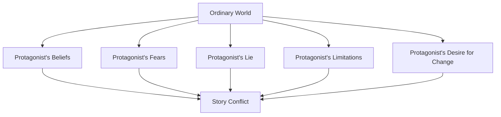
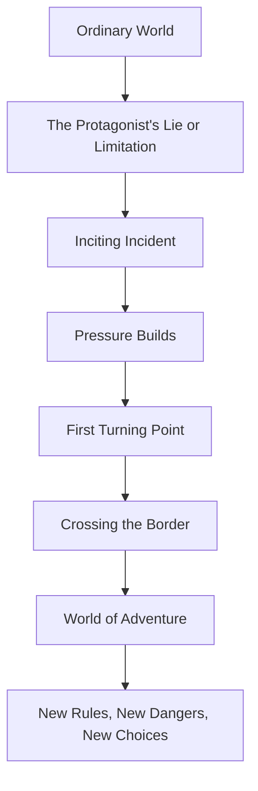

# 007 - The Ordinary World and the World of Adventure

## Section

**02 - The 3 Act Narrative Structure**

## Original Lecture Title

**Thế giới bình thường và thế giới phiêu lưu**
*The Ordinary World and the World of Adventure*

## Duration

**6:08**

---

# Lesson Overview

Every story begins somewhere.

The physical, social, emotional, and symbolic environment where the protagonist starts is called the **Ordinary World** or **Normal World**. This world is not just a background setting. It shapes the protagonist’s beliefs, fears, habits, limitations, and desires.

Later, the protagonist enters the **World of Adventure** — a new environment where the main plot develops. This world introduces new rules, dangers, relationships, and challenges. It forces the protagonist to change.

The contrast between these two worlds gives the story emotional power.

---

# Key Points

## 1. The Ordinary World Gives Change Meaning

The ordinary world shows the protagonist’s life before the major transformation begins.

It helps the reader understand:

* who the protagonist is at the beginning,
* what they believe,
* what they lack,
* what they want,
* what they fear,
* and what kind of life they are about to lose or leave behind.

Without the ordinary world, the reader cannot fully feel the meaning of the protagonist’s later change.

---

## 2. The Adventure World Forces Adaptation

The world of adventure is where the protagonist enters the heart of the story.

In this new world, they must:

* make difficult choices,
* face obstacles,
* learn new rules,
* confront enemies or internal fears,
* form new relationships,
* and discover hidden strengths.

The adventure world should feel unfamiliar to the protagonist.

---

## 3. The Crossing Between Worlds Is a Major Story Beat

The moment when the protagonist leaves the ordinary world and enters the adventure world is often a natural place for:

* a scene break,
* a chapter break,
* the end of Act 1,
* or the beginning of the central journey.

This crossing is usually connected to the **First Turning Point**.

---

# Basic Structure

```mermaid id="w56rf8"
flowchart LR
    A[Ordinary World] --> B[Inciting Incident]
    B --> C[Pressure and Reaction]
    C --> D[First Turning Point]
    D --> E[World of Adventure]
    E --> F[Main Conflict and Transformation]

    A:::ordinary
    B:::incident
    C:::pressure
    D:::turning
    E:::adventure
    F:::growth

    classDef ordinary fill:#f4f4f4,stroke:#555,stroke-width:1px;
    classDef incident fill:#ffe0b2,stroke:#d35400,stroke-width:2px;
    classDef pressure fill:#e3f2fd,stroke:#1976d2,stroke-width:1px;
    classDef turning fill:#ffcdd2,stroke:#c62828,stroke-width:2px;
    classDef adventure fill:#dcedc8,stroke:#558b2f,stroke-width:1px;
    classDef growth fill:#ede7f6,stroke:#5e35b1,stroke-width:1px;
```



The ordinary world shows the protagonist’s starting condition.
The adventure world tests whether that condition can survive.

---

# The Ordinary World

The **ordinary world** is the environment where the story begins.

It can be:

* beautiful but limiting,
* safe but boring,
* miserable but familiar,
* peaceful but emotionally false,
* comfortable but spiritually empty,
* dangerous but normal to the protagonist.

The ordinary world is important because it represents the protagonist’s inner condition at the beginning of the story.

---

# The Ordinary World as a Symbol

The ordinary world is often a symbolic reflection of the protagonist’s soul.



The place where the story begins should help explain why the protagonist thinks, behaves, and desires things in a certain way.

---

# Types of Ordinary Worlds

## 1. A Perfect-Looking World

Sometimes the ordinary world looks perfect on the surface.

However, beneath that surface, something may be wrong.

Example:

> In *Edward Scissorhands*, the suburban world appears neat and safe, but it is also shallow, judgmental, and emotionally limited.

---

## 2. A Boring but Safe World

The ordinary world may be dull, predictable, or emotionally unsatisfying.

Example:

> In *Star Wars*, Luke’s life on Tatooine is boring and limited. He dreams of something larger, but he has not yet entered the adventure.

---

## 3. A Miserable World

Sometimes the protagonist begins in a world already marked by suffering.

Example:

> In *Saving Private Ryan*, the protagonist exists in a war-torn world where violence and sacrifice define the environment.

---

## 4. A Good World the Protagonist Cannot Appreciate Yet

Sometimes the ordinary world is not bad. The protagonist simply does not understand its value.

Example:

> In *The Wizard of Oz*, Dorothy wants to escape home, but her journey teaches her what home truly means.

---

# Examples of Ordinary Worlds

## Thor

In *Thor*, the ordinary world is a peaceful and prosperous planet.

This world reinforces Thor’s belief that he can become whatever he wants without humility, patience, or effort.

### Function

* It reflects Thor’s arrogance.
* It supports his false belief.
* It prepares the audience for his fall and transformation.

---

## A Christmas Carol

Scrooge lives in a shabby, cold house.

He would rather suffer discomfort than spend money on firewood. His world extends into a ghostly and barren version of London, reflecting the coldness of his heart.

### Function

* The setting mirrors Scrooge’s emotional emptiness.
* His physical world reflects his inner poverty.
* The ordinary world prepares the reader for spiritual change.

---

## Ralph Breaks the Internet

At first, Ralph’s normal world seems perfect.

Ralph feels at peace with himself, but Vanellope does not. She feels bored and limited.

That boredom becomes the trigger that leads to the discovery of the Internet.

### Function

* Ralph’s world appears stable.
* Vanellope’s dissatisfaction creates pressure.
* The contrast prepares the transition into a larger, more chaotic world.

---

# The World of Adventure

The **World of Adventure** is the new environment where the main plot develops.

It may be:

* a fantasy land,
* a dangerous city,
* a battlefield,
* a mystery location,
* a new social world,
* a symbolic psychological space,
* or even the same physical place seen from a transformed perspective.

What matters is not only that the place changes, but that the protagonist’s relationship to the world changes.

---

# Two Essential Qualities of the Adventure World

The adventure world should have two major qualities:

| Quality                                | Explanation                                                            |
| -------------------------------------- | ---------------------------------------------------------------------- |
| **Foreign to the protagonist**         | The protagonist does not fully understand this world at first.         |
| **Contrasted with the ordinary world** | It should feel clearly different from the world where the story began. |

The adventure world should challenge the protagonist’s old habits and beliefs.

---

# Ordinary World vs. Adventure World

| Element        | Ordinary World                        | Adventure World                      |
| -------------- | ------------------------------------- | ------------------------------------ |
| Function       | Shows the protagonist’s starting life | Tests and transforms the protagonist |
| Feeling        | Familiar                              | Unfamiliar                           |
| Rules          | Known and predictable                 | New and uncertain                    |
| Conflict       | Hidden or beginning                   | Active and unavoidable               |
| Character Role | Passive or limited                    | Forced to choose and act             |
| Symbolism      | Represents the old self               | Represents transformation            |
| Plot Position  | Setup / Act 1                         | Main conflict / Act 2                |

---

# Types of Adventure Worlds

## 1. A Fantastic World

Some adventure worlds are openly magical or fantastical.

Examples:

* *The Chronicles of Narnia*
* *The Wizard of Oz*
* *Avatar*
* *The Matrix*
* *Harry Potter*

These worlds have new rules, names, cultures, dangers, and possibilities.

---

## 2. A Realistic but Unfamiliar Place

Sometimes the adventure world could exist in reality.

Examples:

* Gotham City in *Batman*
* The Orient Express in *Murder on the Orient Express*

These settings may not be magical, but they still function as enclosed worlds with their own rules, tensions, and dangers.

---

## 3. A Symbolic World

In some stories, the physical place may not change much, but the protagonist’s perspective changes completely.

Example:

> In *Taxi Driver*, the city becomes a symbolic psychological landscape. The world reflects the protagonist’s isolation, anger, and distorted worldview.

---

# Examples of Entering the Adventure World

## Forrest Gump

After graduation, Forrest enlists in the army and leaves for Vietnam.

This is a literal departure from his ordinary world.

### Function

* He enters a dangerous new environment.
* He encounters new relationships and challenges.
* His innocence is tested by war.

---

## The Incredibles

Bob receives a secret message from Mirage offering him a job where he can use his superpowers again.

He accepts and flies to an unknown island.

### Function

* He leaves behind the ordinary world of domestic frustration.
* He returns to the adventure world where he can be a superhero.
* His desire to reclaim his past identity creates new danger.

---

## The Lion King

Scar kills Mufasa and convinces Simba that Simba caused his father’s death.

Simba runs away into the forest.

Only by leaving the ordinary world can he meet Timon and Pumbaa and begin a new phase of his journey.

### Function

* Simba loses his home and identity.
* He enters a strange new world.
* His escape delays, but also prepares, his eventual return.

---

# The Transition Between Worlds

The movement from the ordinary world to the adventure world is one of the most important transitions in a story.



The transition is often caused by the **First Turning Point**.

This is the event that makes the protagonist cross from the old world into the new one.

---

# Why Contrast Matters

The ordinary world and the adventure world should contrast strongly.

The stronger the contrast, the clearer the transformation.

## Example Contrast

| Ordinary World    | Adventure World           |
| ----------------- | ------------------------- |
| Safe village      | Dangerous kingdom         |
| Boring office     | Criminal underworld       |
| Lonely apartment  | Public fame               |
| Wealthy palace    | Exile in the wilderness   |
| Small town        | Magical school            |
| Family restaurant | World-class cooking scene |

The contrast helps readers feel that the protagonist has truly crossed a boundary.

---

# Practical Exercise

Write two short paragraphs.

## Paragraph 1: The Ordinary World

Describe the protagonist’s life before the adventure begins.

```text id="9y5kiu"
Before the story changes, my protagonist lives in a world where...
```

## Paragraph 2: The World of Adventure

Describe the new world they enter after the story begins moving.

```text id="8pntuq"
After crossing into the world of adventure, my protagonist enters a world where...
```

Then ask:

> What is genuinely different between these two worlds?

---

# Eight Questions for Creating the Ordinary World

Use these questions when designing the protagonist’s normal world.

## 1. How does the ordinary world represent the character at the beginning?

The setting should reflect who the protagonist is before transformation.

```text id="q0wvuu"
My protagonist's ordinary world represents them because...
```

---

## 2. What does the ordinary world reveal about the conflict they must overcome?

The setting should hint at the deeper conflict of the story.

```text id="obkr4s"
This world reveals the protagonist's conflict by...
```

---

## 3. What lie is the protagonist living in?

The “lie” is the false belief that prevents the protagonist from growing or achieving what they truly need.

Examples:

* “I must never trust anyone.”
* “Power is the only thing that matters.”
* “I am not worthy of love.”
* “Leaving home is the only way to be free.”
* “If I stay invisible, I will stay safe.”

```text id="ayp8gd"
The lie my protagonist believes is...
```

---

## 4. Why did this lie develop in the ordinary world?

The ordinary world should help explain why this false belief exists.

```text id="qpqefo"
This lie developed in the ordinary world because...
```

---

## 5. If the protagonist wants to leave, why haven’t they done so yet?

A character may dream of escape but remain stuck because of fear, duty, guilt, poverty, loyalty, habit, or ignorance.

```text id="he2qti"
My protagonist has not left yet because...
```

---

## 6. Will the protagonist return to the ordinary world at the end?

Some stories end with the protagonist returning home changed.

Others end with the protagonist permanently leaving the old world behind.

```text id="4zbbqo"
At the end of the story, my protagonist will / will not return to the ordinary world because...
```

---

## 7. How can the ordinary world contrast strongly with the adventure world?

The two worlds should feel different in atmosphere, rules, risks, relationships, and values.

```text id="crabff"
The strongest contrast between the ordinary world and the adventure world is...
```

---

## 8. If the ordinary world is a good place, why does the protagonist still need to change?

A good ordinary world can still create inner conflict.

The protagonist may need to change because:

* they cannot appreciate what they have,
* they feel incomplete,
* they are avoiding responsibility,
* they are living in fear,
* they believe a false idea,
* or they are not yet ready to become their true self.

```text id="5ifd3f"
Even though the ordinary world seems good, my protagonist must change because...
```

---

# Application to Your Novel

To apply this lesson, complete the following structure:

```text id="vbmo3m"
My protagonist begins in a world where...

This world represents their inner state because...

The lie they believe in this world is...

The inciting incident disrupts this world by...

The first turning point forces them to enter...

The adventure world is different because...

In this new world, they must learn...
```

---

# Summary

The ordinary world shows the protagonist’s life before change.

The world of adventure is the new environment where the protagonist must face obstacles, make choices, and discover hidden strengths.

The contrast between these two worlds gives the story its emotional and symbolic power.

The ordinary world represents the old self.
The adventure world creates the conditions for transformation.

---

# Core Takeaway

> The ordinary world shows who the protagonist is before the story changes them. The adventure world tests whether that old version of the protagonist can survive.

---

# Bài luyện tập

## Mục tiêu


## Đề bài


## Yêu cầu hoàn thành

- [ ] 
- [ ] 
- [ ] 

## Kết quả / lời giải


## Ghi chú
