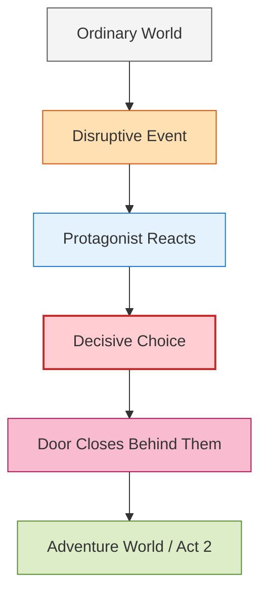
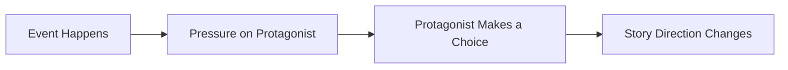
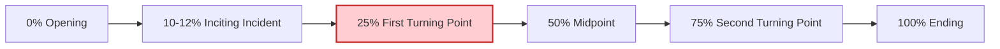

# 008 - The First Turning Point

## Section

**02 - The 3 Act Narrative Structure**

## Original Lecture Title

**Bước ngoặt thứ nhất**
*The First Turning Point*

## Duration

**5:40**

---

# Lesson Overview

The **First Turning Point** is the moment when the protagonist crosses from Act 1 into Act 2.

At this point, the protagonist can no longer remain safely inside the ordinary world. Something happens that forces them to make a decisive choice, pursue their goal, and step into the main conflict of the story.

The First Turning Point usually appears around the **25% mark** of the story.

It is not just an event.
It is the protagonist’s **reaction** to the event that makes it a true turning point.

---

# Key Points

## 1. The First Turning Point Locks the Protagonist into the Conflict

The First Turning Point is the moment when the protagonist can no longer easily return to the ordinary world.

A door closes behind them.

They may not fully understand the danger yet, but they have crossed a boundary. From this point onward, the story moves into a more active phase.

---

## 2. It Usually Ends Act 1 and Launches Act 2

Act 1 introduces:

* the protagonist,
* the ordinary world,
* the inciting incident,
* the central problem,
* and the early pressure to change.

The First Turning Point closes Act 1 by forcing the protagonist to act.

Act 2 begins when the protagonist starts actively pursuing the goal.

---

## 3. It Raises the Stakes

The First Turning Point should not merely repeat the inciting incident.

The inciting incident disrupts the protagonist’s life.
The First Turning Point makes the situation more serious, more personal, or more difficult to escape.

It increases the cost of inaction.

---

# Position in the 3-Act Structure

```mermaid
flowchart LR
    A[Act 1: Setup] --> B[Inciting Incident]
    B --> C[Pressure Builds]
    C --> D[First Turning Point]
    D --> E[Act 2: Main Conflict]
    E --> F[Active Pursuit of the Goal]

    A:::act1
    B:::incident
    C:::pressure
    D:::turning
    E:::act2
    F:::goal

    classDef act1 fill:#f4f4f4,stroke:#555,stroke-width:1px;
    classDef incident fill:#ffe0b2,stroke:#d35400,stroke-width:2px;
    classDef pressure fill:#e3f2fd,stroke:#1976d2,stroke-width:1px;
    classDef turning fill:#ffcdd2,stroke:#c62828,stroke-width:2px;
    classDef act2 fill:#dcedc8,stroke:#558b2f,stroke-width:1px;
    classDef goal fill:#ede7f6,stroke:#5e35b1,stroke-width:1px;
```



The First Turning Point is the bridge between the setup and the real adventure.

---

# Simple Definition

> The First Turning Point is the moment when the protagonist makes, or is forced into, a decisive choice that moves them from the ordinary world into the central conflict.

It is the point of no easy return.

---

# The Door Between Act 1 and Act 2

If there were a door separating Act 1 from Act 2, the First Turning Point would be the moment when the protagonist finds the key, opens the door, and steps through.



The story does not truly move into Act 2 until the protagonist reacts and commits.

---

# Event vs. Reaction

A dramatic event alone is not enough.

A murder, kidnapping, disaster, betrayal, or discovery may create tension, but the turning point happens when the protagonist responds in a way that changes the direction of the story.

## Event

Something happens to the protagonist.

## Reaction

The protagonist makes a choice because of what happened.

## Turning Point

That choice changes the course of the story.



The protagonist’s reaction is what transforms an event into a turning point.

---

# What a Good First Turning Point Must Do

A strong First Turning Point should:

| Function                          | Explanation                                                  |
| --------------------------------- | ------------------------------------------------------------ |
| **Put the protagonist in crisis** | Their old life or old plan no longer works.                  |
| **Force a choice**                | They must respond decisively.                                |
| **Carry the action forward**      | The story gains momentum.                                    |
| **Introduce Act 2**               | The protagonist enters the main conflict.                    |
| **Raise the stakes**              | The situation becomes more serious than before.              |
| **Close the old door**            | The ordinary world becomes unreachable, damaged, or changed. |

---

# Symbolic Crossings

The First Turning Point often uses physical or symbolic boundaries.

Examples include:

* doors,
* gates,
* bridges,
* rivers,
* trains,
* roads,
* portals,
* borders,
* ships,
* cars,
* tunnels.

These symbols represent the protagonist crossing from the old life into the new one.

---

# First Turning Point vs. Inciting Incident

| Story Beat              | Function                                                            | Typical Position |
| ----------------------- | ------------------------------------------------------------------- | ---------------- |
| **Inciting Incident**   | Disrupts the ordinary world and begins the story’s central problem. | Around 10–12%    |
| **First Turning Point** | Forces the protagonist to commit to the main conflict.              | Around 25%       |

The inciting incident starts the disturbance.
The First Turning Point makes escape from the story impossible.

---

# Examples from Stories

## The Great Escape

The act of digging a tunnel to escape becomes a turning point because it moves the characters from passive imprisonment into active resistance.

### Function

* The characters commit to action.
* The goal becomes clear.
* The danger increases.

---

## Roman Holiday

The discovery of a princess in one’s bed becomes the disruptive event that pulls the protagonist into a new situation.

### Function

* It changes the protagonist’s normal plans.
* It creates an unusual relationship.
* It opens the door to the adventure.

---

## Gladiator

A murder becomes the disturbing event that forces the protagonist into a new path.

### Function

* The protagonist loses the old world.
* The conflict becomes personal.
* The story moves into revenge, survival, and justice.

---

## The Patriot

The death of the protagonist’s son is a dramatic event.

However, the event itself is not automatically the First Turning Point. It becomes a turning point only when the protagonist reacts and chooses a new path.

### Function

* The protagonist is pushed beyond neutrality.
* Personal loss forces commitment.
* The old life becomes impossible.

---

## Changeling

In *Changeling*, several events disrupt the protagonist’s life:

1. Her son is kidnapped.
2. The police return the wrong child.
3. She is pressured to accept a child she knows is not hers.

Each event increases tension.

However, the true turning point comes when she decides to confront the corrupt police and uncover the truth.

### Function

* She moves from suffering to action.
* She challenges authority.
* Her goal becomes active and dangerous.

---

## Harry Potter and the Philosopher’s Stone

Around the 25% mark, Harry arrives at King’s Cross Station to catch the train to Hogwarts.

This is a literal and symbolic crossing.

### Function

* Harry leaves the ordinary world.
* He enters the magical world.
* His life changes permanently.

---

## The Matrix

Around 33 minutes into the film, Neo chooses the red pill offered by Morpheus.

He experiences the Matrix for the first time.

### Function

* Neo chooses truth over illusion.
* He leaves his ordinary reality behind.
* He enters the central conflict of the story.

---

## The Silence of the Lambs

Around the 30-minute mark, Hannibal Lecter offers to collaborate with Clarice.

He agrees to provide a psychological profile of Buffalo Bill in exchange for being transferred to a cell with a view.

### Function

* Clarice is pulled deeper into the investigation.
* The relationship with Lecter becomes central.
* The stakes and danger increase.

---

## The Martian

Around minute 35, Mark Watney accepts that he is alone on Mars and decides to implement a plan to survive.

### Function

* He stops reacting passively.
* He commits to survival.
* The story becomes an active problem-solving journey.

---

# Why Around 25%?

The First Turning Point often appears around the 25% mark because readers and viewers instinctively expect the setup to begin paying off by then.

If nothing major happens by this point, the story may feel slow or directionless.

The 25% mark is not a rigid mathematical rule, but it is a useful structural guide.



---

# How to Know If Your First Turning Point Works

Your First Turning Point is probably strong if:

* the protagonist makes a decisive choice,
* the story direction changes clearly,
* the ordinary world can no longer continue as before,
* the goal becomes more urgent,
* the conflict becomes unavoidable,
* the protagonist enters a new world, role, or mission,
* and the reader understands why this character would react this way.

---

# Practical Exercise

Identify the moment when your protagonist can no longer turn back.

Ask yourself:

> Has everything before this moment earned the protagonist’s commitment?

If the answer is no, you may need to strengthen the setup, the protagonist’s motivation, or the pressure created by the events.

---

# Reflection Question

What door closes behind your protagonist at this turning point?

This door may be physical, emotional, social, moral, or symbolic.

Examples:

* They leave home.
* They betray someone.
* They reveal a secret.
* They accept a mission.
* They break a law.
* They lose protection.
* They cross into enemy territory.
* They choose love over safety.
* They can no longer pretend nothing is wrong.

---

# Eight Questions for Creating the First Turning Point

## 1. How is the protagonist dissatisfied with their life?

```text
My protagonist is dissatisfied because...
```

---

## 2. What are their biggest fears and weaknesses?

```text
My protagonist's biggest fears and weaknesses are...
```

---

## 3. What would they need in order to find satisfaction?

```text
To find satisfaction, my protagonist needs...
```

---

## 4. What kind of event could force them to change their plans quickly?

```text
The event that could force them to change their plans is...
```

---

## 5. Does the First Turning Point make their life easier?

Sometimes the turning point may look like a good thing at first.

```text
At first, this turning point seems to make life easier because...
```

---

## 6. What could happen afterward to make the situation harder than expected?

```text
Right afterward, the situation becomes harder because...
```

---

## 7. What reaction will the protagonist have at the turning point?

```text
At the First Turning Point, my protagonist reacts by...
```

---

## 8. What happens to the old world after this moment?

```text
After the First Turning Point, the old world becomes...
```

The old world may be destroyed, abandoned, transformed, exposed as false, or left behind.

---

# Application to Your Novel

Use this structure to test your own First Turning Point:

```text
My protagonist begins Act 1 in a world where...

The inciting incident disrupts this world by...

Pressure increases when...

At the First Turning Point, my protagonist can no longer turn back because...

They choose to...

This choice launches Act 2 because...

The door that closes behind them is...
```

---

# Summary

The First Turning Point is the moment that moves the protagonist from the ordinary world into the world of adventure.

It usually appears around the 25% mark and closes Act 1.

A strong First Turning Point does not depend only on a dramatic event. It depends on the protagonist’s decisive reaction to that event.

The event creates pressure.
The reaction creates the turning point.

---

# Core Takeaway

> The First Turning Point is not simply what happens to the protagonist. It is the moment when the protagonist responds in a way that makes the old life impossible and the main story unavoidable.

---

# Bài luyện tập

## Mục tiêu


## Đề bài


## Yêu cầu hoàn thành

- [ ] 
- [ ] 
- [ ] 

## Kết quả / lời giải


## Ghi chú
