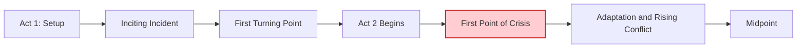
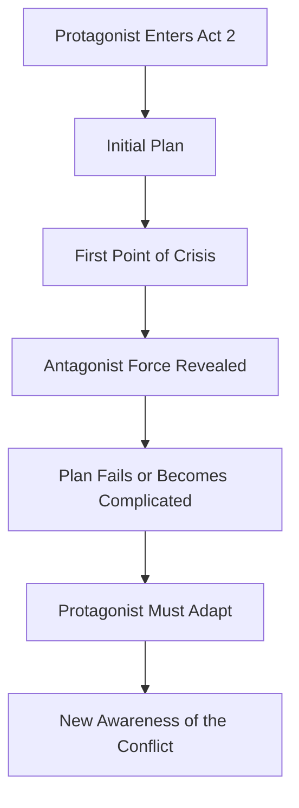
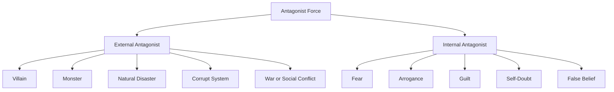

# 009 - The First Point of Crisis

## Section

**02 - The 3 Act Narrative Structure**

## Original Lecture Title

**Điểm khủng hoảng đầu tiên**
*The First Point of Crisis*

## Duration

**4:28**

---

# Lesson Overview

The **First Point of Crisis** is an early pressure point in Act 2 where the protagonist begins to understand the true strength of the opposing force.

After the First Turning Point, the protagonist has entered the world of adventure and has started pursuing a goal. However, their first plan is usually incomplete, naive, or based on a misunderstanding of the conflict.

The First Point of Crisis tests that plan.

It shows the reader and the protagonist that the antagonist force is stronger, more dangerous, or more complicated than expected.

---

# Key Points

## 1. The First Crisis Reveals the Power of the Antagonist

The First Point of Crisis is the moment when the story gives the audience a clear taste of the antagonist’s strength.

The antagonist does not have to be a person. It can be:

* a villain,
* a monster,
* a ghost,
* a corrupt system,
* a natural disaster,
* a war,
* a disease,
* a social pressure,
* or the protagonist’s own flaw.

What matters is that the protagonist begins to understand the scale of the opposition.

---

## 2. It Tests the Protagonist’s Initial Plan

At the beginning of Act 2, the protagonist often believes they have a plan.

The First Point of Crisis proves that the plan is not enough.

This crisis should not simply delay the protagonist. It should complicate the goal and force the protagonist to adapt.

---

## 3. It Reveals the Character’s Flaw Under Pressure

A good crisis does not only reveal external danger.

It also reveals something about the protagonist.

When pressure increases, the protagonist’s weakness, fear, arrogance, ignorance, or false belief becomes more visible.

The crisis shows what the protagonist must eventually overcome inside themselves.

---

# Position in the 3-Act Structure



The First Point of Crisis usually appears between the **First Turning Point** and the **Midpoint**.

It is one of the early tests of Act 2.

---

# Simple Definition

> The First Point of Crisis is the scene where the protagonist and the reader realize how powerful the opposing force really is.

It is not necessarily the biggest crisis in the story.

It is the first major warning that the conflict is more dangerous than the protagonist expected.

---

# Crisis as a Warning Signal



The crisis should change the protagonist’s understanding of the story world.

After this scene, they should not see the conflict in exactly the same way.

---

# What the First Point of Crisis Is Useful For

## 1. It Shapes the Conflict

The First Point of Crisis helps define the true nature of the story’s central conflict.

It shows:

* what the protagonist is really up against,
* why the goal will not be easy,
* what kind of danger is approaching,
* and what the antagonist force is capable of.

This is often the moment when the antagonist enters the story more clearly.

---

## 2. It Creates Tension for the Reader

A strong crisis makes the reader feel uneasy.

Sometimes the reader understands the danger before the protagonist does. This creates suspense because the reader can see that the protagonist is moving toward trouble.

The protagonist may think they are safe, but the reader senses that something terrible is coming.

---

## 3. It Provides Clues About the Protagonist’s Motivation

The best crisis points do not only show danger.

They also reveal something important about why the protagonist must continue.

The crisis may expose:

* the protagonist’s fear,
* their hidden desire,
* their emotional wound,
* their weakness,
* or the deeper truth behind the conflict.

The more frightening the antagonist becomes, the more the protagonist must begin searching for strength within themselves.

---

# Crisis vs. Delay

A crisis is not the same as a simple obstacle.

| Simple Delay                      | True Crisis                                          |
| --------------------------------- | ---------------------------------------------------- |
| Slows the protagonist down        | Changes how the protagonist understands the conflict |
| Creates temporary frustration     | Reveals deeper danger                                |
| Can be solved without much change | Forces adaptation                                    |
| Does not expose character         | Reveals flaw, fear, or weakness                      |
| Keeps the story at the same level | Raises the stakes                                    |

A crisis should make the story more complicated, not merely longer.

---

# Examples from Stories

## Alien

In *Alien*, the alien wakes up, breaks free, and disappears into the labyrinth-like corridors of the spaceship.

For the first time, the crew realizes that the creature they are facing is far more dangerous than they imagined.

### Function

* The antagonist force becomes visible.
* The characters understand the real danger.
* The spaceship becomes a threatening environment.
* The story shifts from curiosity to survival horror.

---

## Back to the Future Part II

While Doc is busy saving Jennifer, Marty leaves the DeLorean for a moment.

Biff sneaks inside with the Sports Almanac.

The audience does not yet know exactly what Biff will do in the past, but they understand that it cannot lead to anything good.

Later, when Marty, Doc, and Jennifer return to 1985, they discover that reality has changed. Biff has become rich and powerful.

### Function

* The danger is planted before the full consequence is revealed.
* The antagonist’s action creates suspense.
* The plot becomes more complicated.
* The audience understands that time travel has serious risks.

---

## Top Gun

After Maverick makes serious mistakes during a practice flight, his colleagues confront him in the locker room.

They accuse him of risking lives just to show off.

This becomes a crucial crisis because Maverick is forced to face the true antagonist of the story: his own arrogance.

### Function

* The crisis reveals the protagonist’s flaw.
* The antagonist is internal rather than external.
* Maverick’s confidence becomes a weakness.
* The story begins to pressure him toward growth.

---

## The Lord of the Rings

At the First Point of Crisis, Frodo and his hobbit friends are attacked by the Nazgûl, also known as the Ringwraiths.

This scene shows the terrifying power of the antagonist force hunting them.

It also gives Frodo stronger motivation to continue the journey.

### Function

* The threat becomes immediate and physical.
* Frodo understands the danger of the Ring.
* The journey becomes more urgent.
* The antagonist force gains emotional weight.

---

# External and Internal Antagonists

The antagonist force can take many forms.



A powerful story often combines both.

The external antagonist pressures the protagonist.
The internal antagonist explains why the protagonist struggles to respond well.

---

# What a Strong First Crisis Should Do

A good First Point of Crisis should:

| Function                       | Explanation                                               |
| ------------------------------ | --------------------------------------------------------- |
| **Reveal danger**              | The protagonist sees how serious the antagonist force is. |
| **Complicate the goal**        | The path forward becomes harder or less clear.            |
| **Expose weakness**            | The protagonist’s flaw appears under pressure.            |
| **Increase tension**           | The reader senses greater danger ahead.                   |
| **Create adaptation**          | The protagonist must rethink their plan.                  |
| **Foreshadow future conflict** | The crisis hints at worse problems to come.               |

---

# Relationship to the Protagonist’s Flaw

The First Point of Crisis is a useful place to reveal the protagonist’s flaw in action.

For example:

| Protagonist Flaw | Crisis Example                          |
| ---------------- | --------------------------------------- |
| Arrogance        | They underestimate the enemy and fail.  |
| Fear             | They freeze when action is needed.      |
| Distrust         | They refuse help and make things worse. |
| Impulsiveness    | They act too quickly and create danger. |
| Naivety          | They believe the wrong person.          |
| Guilt            | They hesitate because of a past wound.  |

The crisis should show why the protagonist cannot win yet.

They still have something to learn.

---

# The First Crisis and New Awareness

The First Point of Crisis should give the protagonist a new awareness.

They may realize:

* the antagonist is stronger than expected,
* the goal is harder than expected,
* their first plan is flawed,
* they do not fully understand the world of adventure,
* they are part of the problem,
* or their greatest fear is closer than they thought.

This new awareness prepares the story for deeper conflict later in Act 2.

---

# Practical Exercise

Write the moment when your protagonist’s initial plan fails.

Focus on two things:

1. What external force causes the failure?
2. What internal flaw contributes to the failure?

```text id="yh2m5b"
My protagonist's initial plan is...

The plan fails when...

The antagonist force reveals its power by...

My protagonist's flaw contributes to the failure because...

Because of this crisis, my protagonist must now...
```

---

# Reflection Question

What does this crisis force your character to learn that they did not know at the start of Act 2?

```text id="sulvfo"
At the start of Act 2, my protagonist believes...

After the First Point of Crisis, they begin to understand...
```

---

# Questions for Designing the First Point of Crisis

## 1. What is the protagonist’s biggest fear?

```text id="x1zv7o"
My protagonist's biggest fear is...
```

---

## 2. Who or what is the antagonist of the story?

The antagonist may be human, natural, supernatural, social, psychological, or internal.

```text id="4uhp6n"
The antagonist force in my story is...
```

---

## 3. What is the antagonist’s most characteristic trait?

Examples:

* cruelty,
* patience,
* intelligence,
* unpredictability,
* power,
* corruption,
* manipulation,
* emotional coldness,
* overwhelming force.

```text id="wu6t7h"
The antagonist's most characteristic trait is...
```

---

## 4. How can you showcase that trait clearly?

```text id="ow8qia"
I can showcase this trait by creating a scene where...
```

---

## 5. How does the crisis affect the protagonist’s goal?

```text id="8ye0v5"
This crisis complicates the protagonist's goal because...
```

---

## 6. What does the protagonist misunderstand before the crisis?

```text id="rxnohz"
Before the crisis, my protagonist misunderstands...
```

---

## 7. What truth does the crisis reveal?

```text id="yf60c2"
The truth revealed by this crisis is...
```

---

# Three-Scene Antagonist Exercise

Write at least three short scenes that showcase the antagonist force.

These scenes do not have to appear in the final novel. Their purpose is to help you understand the antagonist more clearly.

## Scene 1: The Warning

```text id="mzxqkx"
A small sign of the antagonist's power appears when...
```

## Scene 2: The Damage

```text id="e47jqv"
The antagonist causes real damage when...
```

## Scene 3: The Fear

```text id="g220uu"
The protagonist truly feels fear when...
```

After writing these scenes, ask:

> Which version reveals the antagonist most clearly and creates the strongest pressure on the protagonist?

---

# Application to Your Novel

Use this structure to develop your First Point of Crisis:

```text id="cp4qg5"
After the First Turning Point, my protagonist enters Act 2 with the goal of...

Their first plan is...

The First Point of Crisis happens when...

This reveals the antagonist's power by...

The protagonist's flaw makes the situation worse because...

The crisis teaches them that...

Because of this, they must adapt by...
```

---

# Summary

The First Point of Crisis is an early Act 2 scene that reveals the true power of the antagonist force.

It shows the protagonist and the reader that the conflict is more serious than expected.

A strong crisis does not simply delay the protagonist. It complicates the goal, exposes the protagonist’s flaw, and forces them to adapt.

The crisis is also a moment of awareness.

The protagonist begins to understand what they are truly facing.

---

# Core Takeaway

> The First Point of Crisis is where the story proves that the protagonist’s first plan is not enough. The antagonist is stronger than expected, and the protagonist must begin to change if they want to survive the conflict.

---

# Bài luyện tập

## Mục tiêu


## Đề bài


## Yêu cầu hoàn thành

- [ ] 
- [ ] 
- [ ] 

## Kết quả / lời giải


## Ghi chú
