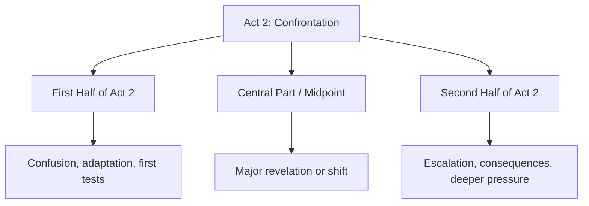
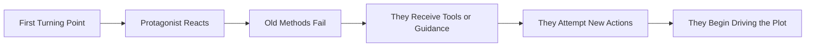
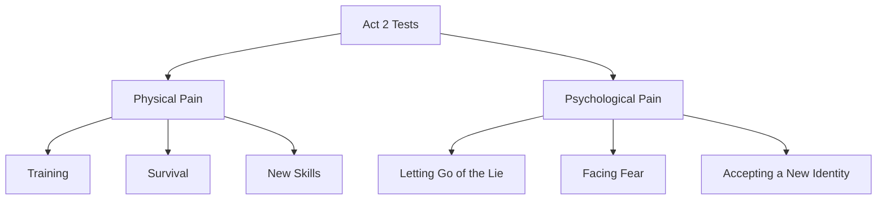
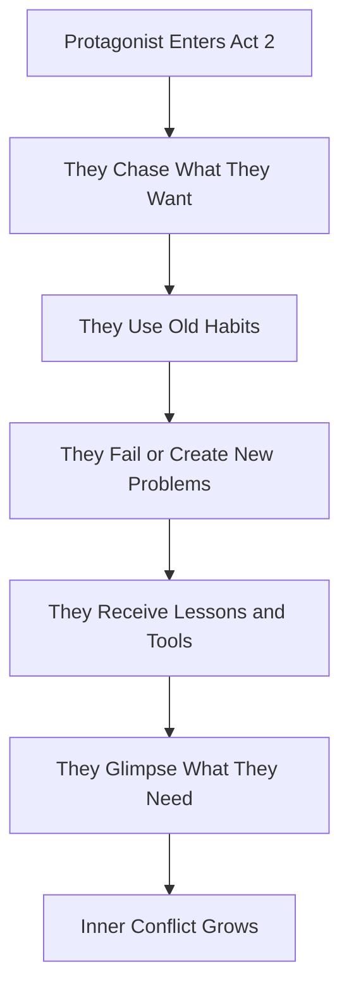

# 010 - Act 2: The Protagonist Takes Action

## Section

**02 - The 3 Act Narrative Structure**

## Original Lecture Title

**Hồi 2: nhân vật chính bước vào hành động**
*Act 2: The Protagonist Takes Action*

## Duration

**7:14**

---

# Lesson Overview

After the **First Turning Point**, the protagonist has crossed into the main conflict of the story.

Something has changed. Whether the event was positive or negative, it has forced the protagonist to make a decision that will affect the entire story.

This is why **Act 2** is mainly about one word:

> **Confrontation**

In Act 2, the protagonist confronts:

* their goal,
* their limits,
* the antagonist force,
* the new world,
* their old beliefs,
* and the difference between what they want and what they truly need.

Act 2 is usually the largest part of the novel. It is where the protagonist stops merely reacting and begins taking action.

---

# Key Points

## 1. Act 2 Must Be Active

The protagonist should not simply be carried through the plot.

They must begin making choices, taking risks, and pursuing the goal.

Even when they make mistakes, those mistakes should come from action.

The story becomes stronger when the protagonist drives events instead of only responding to them.

---

## 2. Difficulty and Personal Cost Must Escalate

Act 2 should become harder over time.

The protagonist’s actions should lead to:

* greater danger,
* deeper emotional pressure,
* more difficult choices,
* stronger opposition,
* and higher personal cost.

The reader should feel that each step forward creates a new complication.

---

## 3. Want and Need Begin to Separate

In Act 2, the protagonist often believes they are moving closer to what they want.

However, the story gradually reveals that what they want may not be the same as what they need.

This creates inner conflict.

The protagonist may chase the visible goal while moving further away from the deeper truth they must learn.

---

# Position in the 3-Act Structure

```mermaid id="act2-structure-010"
flowchart LR
    A[Act 1: Setup] --> B[First Turning Point]
    B --> C[Act 2 Begins]
    C --> D[First Half of Act 2]
    D --> E[Midpoint]
    E --> F[Second Half of Act 2]
    F --> G[Second Turning Point]
    G --> H[Act 3]

    C:::act2
    D:::act2
    E:::midpoint

    classDef act2 fill:#dcedc8,stroke:#558b2f,stroke-width:2px;
    classDef midpoint fill:#ffe0b2,stroke:#d35400,stroke-width:2px;
```



Act 2 begins after the First Turning Point and continues until the Second Turning Point.

It contains the central struggle of the story.

---

# The Three Parts of Act 2

For practical writing purposes, Act 2 can be divided into three sections:



This lesson focuses mainly on the **first half of Act 2**.

---

# The First Half of Act 2

The first half of Act 2 begins immediately after the First Turning Point and leads toward the Midpoint.

At this stage, the protagonist has entered unfamiliar territory.

They may have a goal, but they do not yet fully understand:

* the new world,
* the rules of the conflict,
* the strength of the antagonist,
* the cost of pursuing the goal,
* or the truth about themselves.

Their early actions may be impulsive, confused, or based on old habits.

That is normal.

At this point, the protagonist is learning by being tested.

---

# From Reaction to Action



The protagonist may begin Act 2 confused, but they should gradually become more active.

---

# What the Protagonist Faces in Act 2

## 1. A New World

The protagonist has left the ordinary world behind.

Now they must adapt to a world with different rules, risks, people, and expectations.

## 2. New Tests

The protagonist must face challenges that expose their weaknesses.

These tests may be physical, emotional, moral, or psychological.

## 3. New Lessons

The protagonist may encounter a mentor, teacher, guide, friend, rival, or secondary character who helps them understand the new world.

However, the protagonist may resist these lessons at first.

## 4. New Pain

Growth is not comfortable.

Act 2 often hurts because the protagonist must let go of old beliefs, old patterns, and old identities.

---

# Two Kinds of Pain in Act 2

## Physical Pain

The protagonist may need to:

* train,
* survive,
* learn a new skill,
* adapt to a dangerous place,
* master a discipline,
* or endure physical hardship.

## Psychological Pain

The protagonist may need to:

* abandon an old belief,
* detach from the ordinary world,
* accept help,
* face fear,
* admit weakness,
* or see themselves honestly.



---

# Four Essential Moments in the First Half of Act 2

## 1. Give the Protagonist Tools to Overcome the Lie

After the First Turning Point, the rules of the story have changed.

The protagonist is confused about what they want and what they need.

This is the perfect time to introduce tools, knowledge, training, or guidance that can help them survive in the new world.

These tools are often given by a secondary character, such as:

* a mentor,
* a teacher,
* a guide,
* a friend,
* a rival,
* or someone who understands the new world better.

These tools should help the protagonist fight both:

1. the external antagonist, and
2. the internal lie they brought from the ordinary world.

---

## Example: The Matrix

Neo may be “the chosen one,” but he is not yet ready to fight the dangers of the Matrix.

He needs Morpheus and the others to teach him.

His training is painful. He crashes to the ground, suffers frustration, and repeatedly fails.

Through this process, Neo begins to change.

### Function

* Neo learns the rules of the new world.
* He receives practical training.
* His old understanding of reality breaks down.
* He begins moving toward his true potential.

---

## 2. Show That the Old Ways No Longer Work

The world around the protagonist has changed, but the protagonist has not fully changed yet.

They may still try to act according to old habits.

But what worked in the ordinary world no longer works in the adventure world.

Each time they rely on old patterns, the story should punish them.

---

## Example: Thor

After Thor is banished to Earth, he continues acting like an arrogant immortal prince.

He tries to impose his will on human authorities, but fails.

Instead of being obeyed, he is humiliated.

### Function

* Thor’s old identity no longer works.
* His arrogance becomes a weakness.
* The new world forces him to confront his limitations.

---

## 3. Move the Protagonist Closer to What They Want and Further from What They Need

At this stage, the protagonist often believes they can solve everything by getting what they want.

But the story reveals a problem:

> Every step toward what they want may take them further away from what they truly need.

This creates tension between external goal and internal growth.

---

## Example: Back to the Future

Doc warns Marty not to interact with anyone in 1955.

But Marty tries to help his parents, interfering with their lives and accidentally damaging the future.

When he sees his brother slowly fading from a photograph, Marty realizes the danger.

If he cannot fix what he has changed, he and his siblings may be erased from existence.

### Function

* Marty takes action, but makes things worse.
* His desire to fix the situation creates new danger.
* The story raises the cost of his mistakes.

---

## 4. Give the Protagonist a Glimpse of Life Without the Lie

The new world should show the protagonist another way of living.

They may not be ready to fully accept it yet, but they should begin to see that life beyond the ordinary world is possible.

This glimpse should be attractive.

It should suggest that the protagonist could become someone different.

---

## Example: The Lion King

After Mufasa’s death, Simba runs away into exile.

Exhausted, he collapses in the desert and is found by Timon and Pumbaa.

They take him in, help him recover, and teach him a new way of life built around the motto:

> **Hakuna Matata** — no worries.

### Function

* Simba escapes his old pain.
* He discovers a new lifestyle.
* He experiences friendship and freedom.
* However, this new life also delays his responsibility.

---

# Want vs. Need in Act 2



Act 2 becomes emotionally rich when the protagonist’s external goal and internal need begin to pull in different directions.

---

# What Act 2 Should Avoid

A weak Act 2 often feels slow because the protagonist is too passive.

Avoid making Act 2 a sequence of events that merely happen to the protagonist.

Instead, make sure the protagonist:

* chooses,
* tries,
* fails,
* learns,
* adapts,
* risks something,
* and causes consequences.

---

# Strong Act 2 Checklist

A strong first half of Act 2 should include:

| Element                     | Purpose                                                      |
| --------------------------- | ------------------------------------------------------------ |
| **Active pursuit**          | The protagonist takes steps toward the goal.                 |
| **New world rules**         | The protagonist learns how this new world works.             |
| **Mentor or guide**         | A secondary character provides tools, lessons, or contrast.  |
| **Failed old methods**      | The protagonist discovers that old habits no longer work.    |
| **Escalating tests**        | Each challenge becomes harder or more costly.                |
| **Want vs. need tension**   | The protagonist’s visible goal conflicts with deeper growth. |
| **Glimpse of another life** | The protagonist sees life beyond the lie.                    |

---

# Practical Exercise

List five actions your protagonist actively initiates during Act 2.

Do not count simple reactions to other characters.

```text id="act2-actions-010"
1. My protagonist chooses to...

2. My protagonist actively goes to...

3. My protagonist risks...

4. My protagonist investigates / trains / confronts...

5. My protagonist changes the situation by...
```

Then ask:

> Which of these actions truly changes the direction of the plot?

---

# Reflection Question

Where in Act 2 does your protagonist stop reacting and start driving events?

```text id="act2-reflection-010"
At first, my protagonist mostly reacts by...

They begin driving the story when...

This matters because...
```

---

# Six Questions for Designing This Stage

## 1. What can your hero do in practical terms to reach their goal?

```text id="act2-q1-010"
In practical terms, my protagonist can pursue their goal by...
```

---

## 2. What is their greatest strength?

```text id="act2-q2-010"
My protagonist's greatest strength is...
```

---

## 3. What events can show this strength?

```text id="act2-q3-010"
This strength can be shown in a scene where...
```

---

## 4. What is their biggest flaw, and how can it be tested?

```text id="act2-q4-010"
My protagonist's biggest flaw is...

This flaw is tested when...
```

---

## 5. What must they learn or obtain to reach their goal?

This may be:

* a skill,
* a truth,
* a map,
* a weapon,
* an artifact,
* a relationship,
* a secret,
* or a new way of seeing the world.

```text id="act2-q5-010"
To reach the goal, my protagonist must learn / obtain...
```

---

## 6. What secondary character can help them?

```text id="act2-q6-010"
The secondary character who helps them is...

This character helps by...

The new world this character reveals is...
```

---

# Application to Your Novel

Use this structure to develop the first half of Act 2:

```text id="act2-application-010"
After the First Turning Point, my protagonist enters a new world where...

Their immediate goal is...

At first, they try to solve the problem by...

This fails because...

A secondary character helps them by...

The protagonist receives or learns...

Their old way of thinking is challenged when...

They move closer to what they want by...

But they move further away from what they need because...

For the first time, they glimpse a life without the lie when...
```

---

# Summary

Act 2 is the confrontation stage of the story.

After the First Turning Point, the protagonist enters uncertain territory and begins pursuing the goal. At first, they may act impulsively or rely on old habits, but the new world quickly teaches them that those habits no longer work.

The first half of Act 2 should give the protagonist tools, tests, failures, guidance, and glimpses of a different life.

Most importantly, Act 2 should show the protagonist taking action.

The protagonist may not act wisely yet, but they must act.

---

# Core Takeaway

> Act 2 becomes powerful when the protagonist actively pursues what they want, fails because of who they still are, and slowly begins discovering what they truly need.

---

# Bài luyện tập

## Mục tiêu


## Đề bài


## Yêu cầu hoàn thành

- [ ] 
- [ ] 
- [ ] 

## Kết quả / lời giải


## Ghi chú
