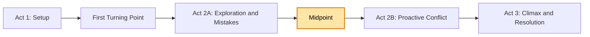
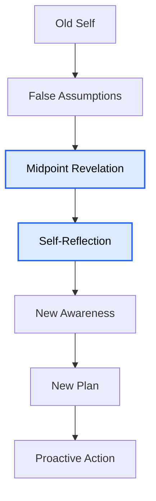
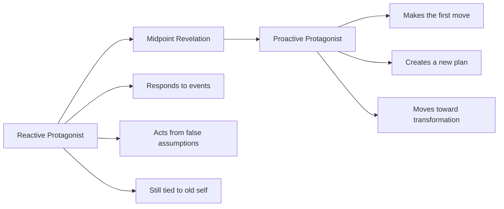
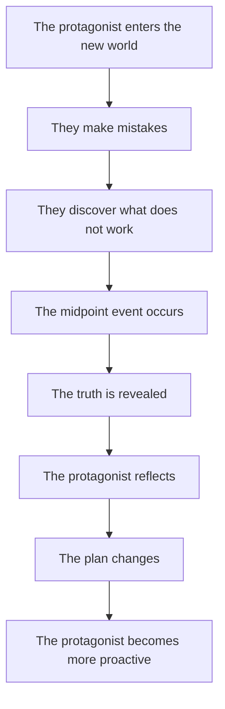

# 011 - The Midpoint

## Section

**02 - The 3 Act Narrative Structure**

## Original Lecture Title

**Midpoint – The Turning Point at the Center of the Story**

## Duration

**4:47**

---

# 1. Lesson Overview

The **midpoint** is one of the most important turning points in a story. It happens around the middle of the plot and creates a major shift in the protagonist’s understanding, goal, strategy, or emotional state.

Before the midpoint, the protagonist is often still learning how the new world works. They make mistakes, act based on false assumptions, and react to problems as they appear.

At the midpoint, something changes.

This change may come through:

* A powerful revelation
* A false victory
* A false defeat
* A major clue
* A battle or confrontation
* A relationship shift
* A raised-stakes event
* A moment of self-recognition

The midpoint prevents the middle of the story from becoming weak or repetitive. It injects new urgency and pushes the protagonist into a more active role.

---

# 2. Core Idea

The midpoint is the moment where the protagonist begins to understand the truth of the conflict.

It is not just another event. It is a **point of transformation**.

Before the midpoint, the protagonist may still be reacting.

After the midpoint, the protagonist begins to act with greater awareness, intention, and urgency.

---

# 3. What Happens Before the Midpoint?

In the first half of Act 2, the protagonist enters unfamiliar territory.

They may:

* Make errors based on false assumptions
* Discover what no longer works from the old world
* Begin to understand the rules of the new world
* Build new relationships or alliances
* Encounter stronger resistance
* Slowly realize that their old methods are not enough

This section of the story is about learning, testing, failing, and adapting.

---

# 4. What the Midpoint Does

The midpoint changes the direction of the story.

It usually does one or more of the following:

| Function                                  | Explanation                                                                        |
| ----------------------------------------- | ---------------------------------------------------------------------------------- |
| Reveals new truth                         | The protagonist learns something that changes their understanding of the conflict. |
| Raises the stakes                         | The danger, cost, or urgency becomes greater.                                      |
| Shifts the goal                           | The protagonist’s plan must change.                                                |
| Exposes the antagonist                    | The true nature or strength of the opposing force becomes clearer.                 |
| Creates a point of no return              | The protagonist cannot go back to the way things were.                             |
| Moves the hero from reactive to proactive | The protagonist begins making deliberate moves instead of simply responding.       |

---

# 5. The Midpoint as a “Mirror Moment”

James Scott Bell describes the midpoint as a **mirror moment**.

This means the protagonist metaphorically, or sometimes literally, looks at themselves and begins to see the truth.

They may ask:

* Who am I becoming?
* What have I misunderstood?
* What must I do now?
* What old belief is failing me?
* What truth have I been avoiding?

This does not mean the protagonist is fully transformed yet. However, it does mean the transformation has begun.

---

# 6. Reactive vs. Proactive Protagonist

A strong midpoint often marks the shift from a reactive protagonist to a proactive protagonist.

## Before the Midpoint

The protagonist:

* Reacts to problems
* Makes mistakes
* Does not fully understand the conflict
* Depends on old habits
* Defends themselves against the antagonist

## After the Midpoint

The protagonist:

* Takes initiative
* Forms a clearer plan
* Understands the stakes more deeply
* Recognizes the antagonist’s threat
* Begins moving toward the goal with intention

---

# 7. Placement of the Midpoint

The midpoint should usually occur near the center of the story.

Placement matters.

## If the midpoint happens too early

The story may not have enough time to:

* Develop the protagonist
* Build the new world
* Establish meaningful conflict
* Show the protagonist’s early mistakes

## If the midpoint happens too late

The reader may feel that:

* The story is not progressing
* The middle section is too slow
* The conflict is repeating itself
* The protagonist is not changing quickly enough

A well-placed midpoint keeps the story balanced.

---

# 8. Examples of Midpoints

## Jurassic Park

At the midpoint of *Jurassic Park*, a technician turns off the electricity in order to steal dinosaur embryos.

The consequences are catastrophic.

The dinosaurs escape from their cages, including the T-Rex. The T-Rex attacks the Jeep carrying Alan, Ian, and the children.

This is a point of no return.

From this moment onward, all the characters understand how dangerous the island truly is. Their goal changes from observing the park to escaping it.

---

## The Fellowship of the Ring

In *The Fellowship of the Ring*, the Fellowship is formed.

From this point forward, the heroes have a clear plan:

> Get to Mount Doom and destroy the Ring.

This is not only important for the first book, but for the entire trilogy. The conflict now has a clear direction, and the characters begin moving toward a defined goal.

---

## Titanic

In *Titanic*, Rose decides that she wants to start a new life with Jack when they arrive in America.

At the same time, the ship strikes the iceberg.

This creates both an emotional midpoint and a plot midpoint:

* Rose’s inner life changes.
* The external danger becomes immediate.
* The romantic dream collides with disaster.

---

## Pride and Prejudice

In *Pride and Prejudice*, Mr. Darcy unexpectedly proposes to Elizabeth Bennet.

Elizabeth rejects him with disdain.

This moment changes their relationship completely. Their inner worlds will never be the same again.

---

## Thor

In *Thor*, the protagonist can no longer lift his hammer.

He realizes that his natural talent, superhuman strength, cannot be the only thing he relies on.

This midpoint forces him to confront his identity and begin changing from arrogance toward humility.

---

# 9. Midpoint Structure

A useful midpoint often follows this pattern:

---

# 10. Key Points

* The midpoint is a major shift in the story.
* It often reveals new information or raises the stakes.
* It may appear as a false victory, false defeat, clue, battle, or emotional revelation.
* It changes the protagonist’s understanding of the conflict.
* It often marks the shift from reaction to action.
* It prevents the middle of the story from sagging.
* It should not pass unnoticed.
* It should force the protagonist to rethink their plan.

---

# 11. Practical Exercise

Identify the midpoint event in your story.

Then answer:

1. What exactly happens at the midpoint?
2. What truth does the protagonist discover?
3. How does this event change the protagonist’s plan?
4. What does the protagonist do immediately after the midpoint?
5. How does this event raise the stakes?

---

# 12. Reflection Questions

## Main Reflection Question

Does your midpoint raise the stakes, or does it simply repeat what the reader already knows?

## Additional Questions

1. What kind of revelation does your protagonist have at the midpoint?
2. How is this different from the trigger event in Act 1?
3. How does the revelation push the protagonist to create a new plan?
4. How does the protagonist begin to take control of the conflict?
5. In what way is the protagonist still tied to the old world or their old self?
6. What makes this moment impossible to ignore?

---

# 13. Midpoint Design Checklist

Use this checklist to test whether your midpoint is strong.

| Question                                                 | Yes / No |
| -------------------------------------------------------- | -------- |
| Does the midpoint happen near the center of the story?   |          |
| Does it reveal something new?                            |          |
| Does it change the protagonist’s plan?                   |          |
| Does it raise the stakes?                                |          |
| Does it create urgency?                                  |          |
| Does it push the protagonist from reactive to proactive? |          |
| Does it expose the antagonist more clearly?              |          |
| Does it force the protagonist to reflect on themselves?  |          |
| Does it create a point of no return?                     |          |
| Would the story feel weaker if this moment were removed? |          |

---

# 14. Summary

The midpoint is the turning point at the center of the story.

It is the moment when the protagonist begins to understand the conflict more deeply and realizes that they can no longer simply react. They must take action.

A strong midpoint changes the emotional, strategic, or external direction of the story. It gives the protagonist a new awareness and pushes them toward a more active role.

This moment should feel important, urgent, and unforgettable.

The midpoint is where the story says:

> Things cannot continue the way they were.

---

# Bài luyện tập

## Mục tiêu

## Đề bài

## Yêu cầu hoàn thành

- [ ] 
- [ ] 
- [ ] 

## Kết quả / lời giải

## Ghi chú
