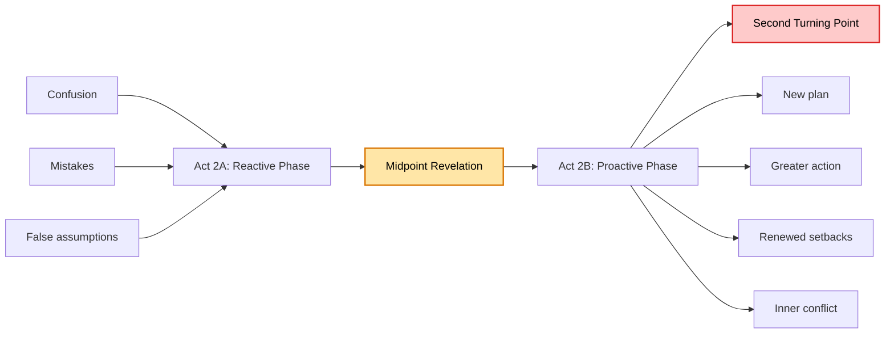
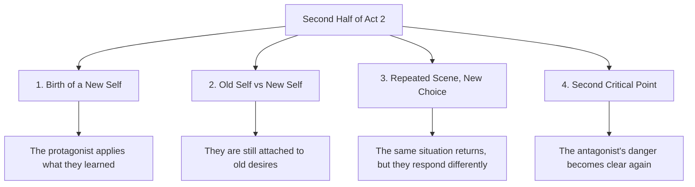
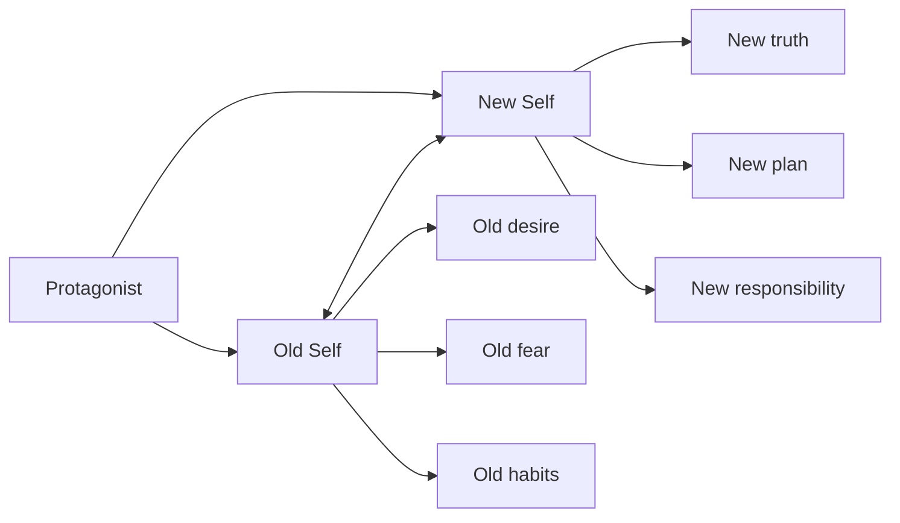
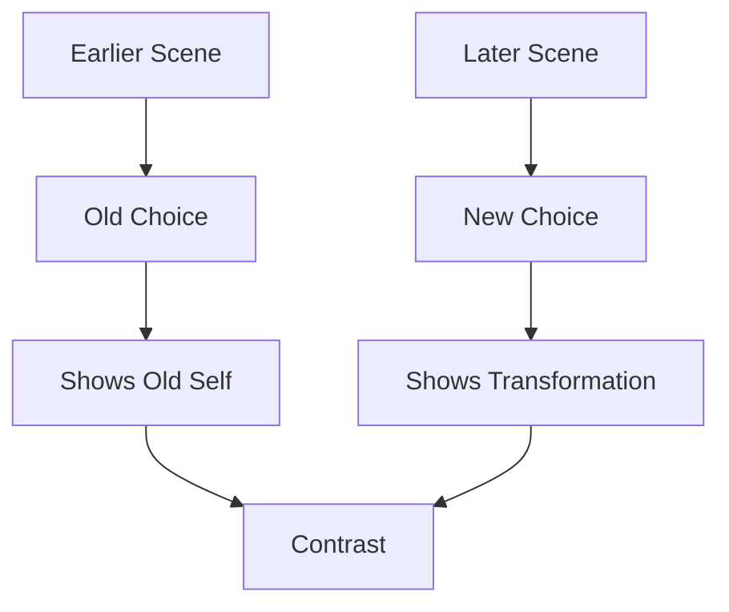
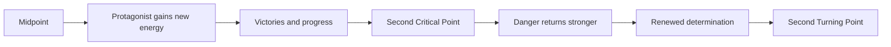
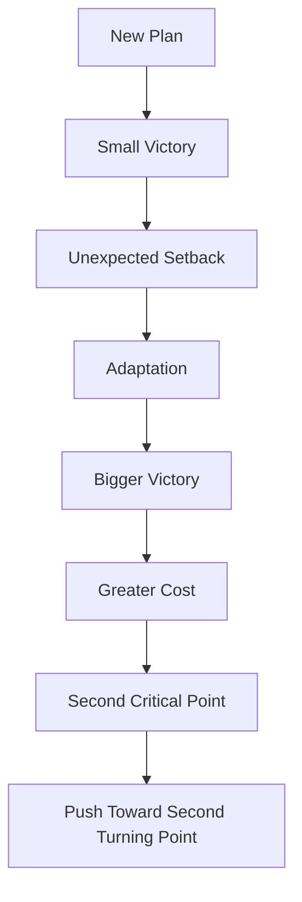
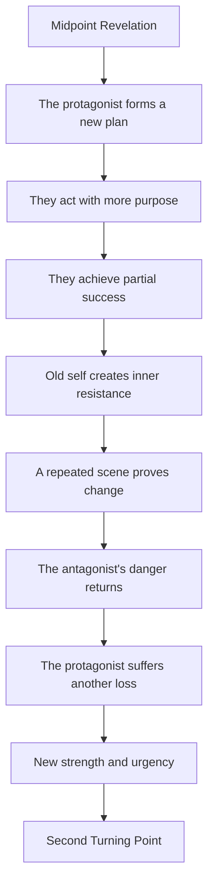

# 012 - Bringing Action Into Act 2

## Section

**02 - The 3 Act Narrative Structure**

## Original Lecture Title

**Bringing Action Into Act 2**

## Duration

**6:49**

---

# 1. Lesson Overview

After the **midpoint**, the protagonist has gained a new understanding of the conflict.

They may now believe they know how to win.

The second half of Act 2 begins here. This section usually runs from the midpoint to around **75% of the story**. It shows the protagonist becoming more active, more strategic, and more willing to fight for the goal.

However, this does not mean the story is almost over.

The protagonist has changed, but the transformation is not complete. They are still caught between their old self and their new self.

Act 2B should therefore be full of:

* Action
* Pursuit
* Setbacks
* Adaptation
* Escalation
* Emotional conflict
* Proof of change
* Renewed danger from the antagonist

---

# 2. Core Idea

The second half of Act 2 is where the protagonist starts fighting with purpose.

Before the midpoint, they may have been trying to survive.

After the midpoint, they begin to act.

The protagonist is no longer simply being punched from every direction. They now know, or at least think they know, where to strike back.

---

# 3. Why Act 2 Needs Action

Act 2 cannot rely only on internal reflection.

The protagonist may be changing emotionally, but the story still needs concrete movement. The reader must see that the character’s choices are affecting the plot.

A strong Act 2 includes scenes where the protagonist:

* Pursues a goal
* Encounters resistance
* Makes a plan
* Changes strategy
* Wins something
* Loses something
* Learns something new
* Takes a meaningful risk

Every scene should change the protagonist’s situation, plan, or understanding.

If a scene does not change anything, it may need to be cut, compressed, or combined with another scene.

---

# 4. Four Ingredients of Act 2B

The second half of Act 2 should usually include four major ingredients:

1. The birth of a new self
2. The conflict between the old self and the new self
3. A repeated scene that proves change
4. A second critical point that reminds everyone of the danger

---

# 5. Ingredient 1: The Birth of a New Self

Thanks to the midpoint revelation, the protagonist can now try solutions their old self could not have imagined.

They may have:

* New knowledge
* New confidence
* New allies
* New tools
* A new emotional understanding
* A new strategy
* A clearer view of the antagonist

This is where the protagonist begins acting like someone who has changed.

## Examples

### Big Hero 6

Baymax receives new gear and becomes more prepared for the fight ahead.

### The Incredibles

Bob discovers Syndrome’s plan by accessing his computer. This gives him a clearer understanding of the enemy.

### Despicable Me

Gru realizes that he truly loves the girls and wants to fight to keep them in his life. His goal is no longer only selfish.

---

# 6. Ingredient 2: Trapped Between the Old Self and the New Self

The protagonist now knows the truth, but that does not mean they are free from their old desires.

They are caught between two versions of themselves:

| Old Self                                | New Self                                  |
| --------------------------------------- | ----------------------------------------- |
| Wants what they wanted at the beginning | Begins to understand what they truly need |
| Acts from habit                         | Acts from new awareness                   |
| Protects the old identity               | Moves toward transformation               |
| Avoids sacrifice                        | Begins to face sacrifice                  |
| Reacts defensively                      | Acts with purpose                         |

This creates inner tension.

The protagonist is not fully transformed yet. They may still hesitate, relapse, or make mistakes because their old self still has power over them.

This is sometimes called a **vacillation escalation**: the protagonist is pulled between two opposing forces inside themselves.

---

# 7. Example: Toy Story

In *Toy Story*, Woody goes to save Buzz.

His old self is still jealous of Buzz. Earlier in the story, Woody might have abandoned him because Buzz was taking Andy’s attention away.

However, Woody’s new self pushes him to save Buzz anyway.

This shows that Woody is changing, but his transformation is not yet complete. His attitude still creates problems with the other toys. Woody and Buzz are forced to behave as friends if they want to survive and return home.

---

# 8. Example: Jane Eyre

In *Jane Eyre*, Jane seems to know what she wants: love, belonging, and emotional security.

When Rochester proposes, she accepts because marriage appears to offer everything she has longed for.

But something still feels wrong.

Her marriage to Rochester seems like the fulfillment of her dream, but it also threatens her independence.

Jane is caught between two selves:

| Jane Who Desires Love       | Independent Jane                |
| --------------------------- | ------------------------------- |
| Wants to be chosen          | Wants to preserve her dignity   |
| Desires emotional belonging | Desires freedom                 |
| Accepts Rochester’s love    | Questions the cost of that love |
| Dreams of marriage          | Fears losing herself            |

The tension is not only romantic. It is also moral and psychological.

---

# 9. Ingredient 3: The Scene Repeated Before and After

In Act 2, writers often repeat a type of scene that appeared earlier in the story.

The purpose is to show how much the protagonist has changed.

The situation may be similar, but the protagonist’s choice is different.

This contrast allows the reader to see transformation through action, not explanation.

---

# 10. Example: Thor

At the beginning of *Thor*, Thor is self-absorbed and obsessed with battle. His pride almost causes him to leave his friends to die.

Later, in Act 2, his friends come to Earth to save him.

Instead of fighting recklessly like his old self, Thor expresses gratitude and chooses to help evacuate the townsfolk.

This repeated situation proves that Thor has changed.

He is no longer only a warrior seeking glory. He is beginning to become someone who protects others.

---

# 11. Ingredient 4: The Second Critical Point

Just when things appear to be going well, the story must remind the protagonist and the reader that the danger is still real.

This is the role of the **second critical point**.

The second critical point usually shows:

* The antagonist is still powerful
* The situation is worse than expected
* The protagonist is not fully ready
* The cost of failure is increasing
* A new loss or danger appears
* The final battle will require more sacrifice

This moment prepares the story for the next major wall: the **Second Turning Point**.

The protagonist may lose another battle here, but the loss gives them new strength and urgency.

---

# 12. Examples of the Second Critical Point

## Apollo 13

In *Apollo 13*, Mission Control realizes that the astronauts are in danger from carbon monoxide poisoning.

The team must urgently find a way to filter the air inside the spacecraft.

This reminds everyone that the danger is not over. Survival is still uncertain.

---

## Forrest Gump

In *Forrest Gump*, after a painful period involving Lieutenant Dan’s injury and emotional suffering, Forrest’s life takes another turn after he is discharged from the Army.

The story reminds us that life remains difficult and unpredictable.

---

## Harry Potter and the Chamber of Secrets

In *Harry Potter and the Chamber of Secrets*, Hermione is found petrified.

Harry and Ron go to find Hagrid, but they witness him being arrested by the Ministry of Magic and Lucius Malfoy.

This moment makes the danger feel worse than before. The heroes lose important support, and the antagonist force becomes more threatening.

---

# 13. Victory and Setback Rhythm

Act 2B should not be only failure or only success.

If the protagonist only fails, the story becomes exhausting.

If the protagonist only succeeds, the story becomes too easy.

A strong Act 2 alternates between victory and setback.

This rhythm keeps tension alive.

The reader feels progress, but also understands that victory will not come without cost.

---

# 14. What Every Act 2 Scene Should Do

Every scene in Act 2 should change something.

A scene should affect at least one of these:

| Scene Function | Question to Ask                                                   |
| -------------- | ----------------------------------------------------------------- |
| Situation      | Is the protagonist in a different position after the scene?       |
| Plan           | Does the protagonist change strategy?                             |
| Understanding  | Does the protagonist learn something new?                         |
| Relationship   | Does a relationship improve, break, or become more complicated?   |
| Stakes         | Does the danger or cost increase?                                 |
| Inner conflict | Does the protagonist struggle between old self and new self?      |
| Momentum       | Does the scene push the story closer to the Second Turning Point? |

If a scene does none of these, it may not belong in Act 2.

---

# 15. Act 2B Structure Map

---

# 16. Key Points

* The second half of Act 2 begins after the midpoint.
* The protagonist moves from passive to proactive.
* The story should include concrete action, not only reflection.
* The protagonist has changed, but their transformation is not complete.
* They are still trapped between the old self and the new self.
* A repeated scene can show how much they have changed.
* The second critical point reminds the reader of the antagonist’s danger.
* Victories and setbacks should alternate to maintain tension.
* Every Act 2 scene should change the protagonist’s situation, plan, or understanding.

---

# 17. Practical Exercise

Audit your Act 2 scene list.

For each scene, ask:

1. What does the protagonist want in this scene?
2. What action do they take?
3. What obstacle blocks them?
4. Do they win, lose, or partly succeed?
5. What changes by the end of the scene?
6. Does this scene show the protagonist becoming more proactive?
7. Could the scene be cut without damaging the plot?

Mark any scene that does not change the protagonist’s situation, plan, or understanding.

---

# 18. Reflection Questions

## Main Reflection Question

Which Act 2 scene could you cut with the least damage to the overall plot?

## Additional Questions

1. What revelation did your protagonist have at the midpoint?
2. How has this revelation changed the way they see the conflict?
3. What new plan do they create after the midpoint?
4. Why will they lose another battle despite this revelation?
5. What sacrifice are they still unwilling to make?
6. Why are they unwilling to make that sacrifice?
7. What scene could show that your protagonist is no longer the same person they were before?
8. What event could show the danger of the antagonist again?
9. How does the second critical point push the protagonist toward the Second Turning Point?
10. Where does your protagonist still behave like their old self?

---

# 19. Act 2 Scene Audit Template

Use this table to evaluate your Act 2 scenes.

| Scene   | Protagonist’s Goal | Action Taken | Obstacle | Result | What Changes? | Keep / Cut / Revise |
| ------- | ------------------ | ------------ | -------- | ------ | ------------- | ------------------- |
| Scene 1 |                    |              |          |        |               |                     |
| Scene 2 |                    |              |          |        |               |                     |
| Scene 3 |                    |              |          |        |               |                     |
| Scene 4 |                    |              |          |        |               |                     |
| Scene 5 |                    |              |          |        |               |                     |

A useful Act 2 scene should not merely exist. It should move the story.

---

# 20. Summary

The second half of Act 2 is where the protagonist begins to fight with purpose.

After the midpoint, they have gained a new understanding of the conflict. They may believe they know how to win, but they are not fully transformed yet.

They are still caught between the old self and the new self.

This part of the story should show action, adaptation, progress, setbacks, and renewed danger. The protagonist should win some battles and lose others. Each scene should change their situation, plan, or understanding.

Act 2B drives the story like a speeding train toward the next major wall:

**The Second Turning Point.**
