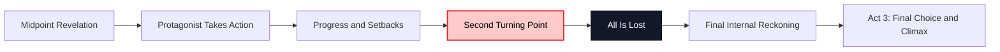
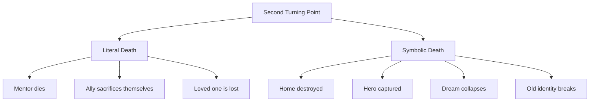
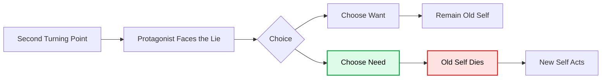
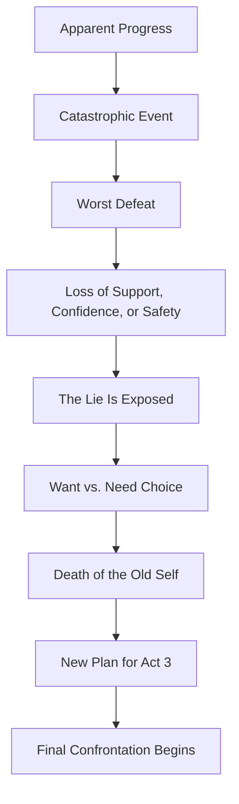
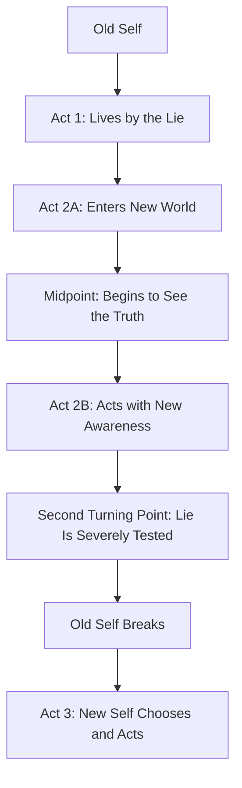

# 013 - The Second Turning Point

## Section

**02 - The 3 Act Narrative Structure**

## Original Lecture Title

**The Second Turning Point**

## Duration

**6:05**

---

# 1. Lesson Overview

The **Second Turning Point** occurs near the end of Act 2.

It is usually the protagonist’s lowest point: the moment when everything seems lost, the plan collapses, and the character is forced to face the deepest truth about themselves.

After the midpoint, the protagonist may believe they finally understand the conflict and know how to win. But before they can enter Act 3, the story must test them one final time.

This test is often catastrophic.

The Second Turning Point may involve:

* A devastating defeat
* The loss of an ally
* A literal or symbolic death
* The collapse of the protagonist’s plan
* The destruction of their confidence
* The exposure of their deepest lie
* A final choice between what they want and what they need

This moment pushes the protagonist to the edge of the abyss.

---

# 2. Core Idea

The Second Turning Point strips the protagonist down to what truly matters.

It removes the illusion that they can win without changing.

At this point, the protagonist can no longer avoid the truth.

They must confront the lie they have been living.

---

# 3. Why the Second Turning Point Matters

The Second Turning Point is one of the most important moments in the protagonist’s transformational arc.

It is often the worst moment of their life because it attacks the core of who they used to be.

The protagonist must face:

* The old belief that shaped them
* The fear they have avoided
* The desire that has controlled them
* The flaw that caused the defeat
* The truth they can no longer deny

This is where the story asks:

> Will the protagonist remain trapped in the old self, or will they become someone new?

---

# 4. The “All Is Lost” Moment

The Second Turning Point often creates the classic **all is lost** moment.

This does not mean the protagonist has literally lost everything, but it should feel as if victory is impossible.

The protagonist may lose:

| What Is Lost | Possible Story Form                                   |
| ------------ | ----------------------------------------------------- |
| Resources    | Weapons, money, shelter, power, information           |
| Allies       | A friend leaves, dies, is captured, or loses trust    |
| Confidence   | The protagonist realizes their plan was wrong         |
| Identity     | They discover they are not who they thought they were |
| Safety       | The antagonist gains control                          |
| Hope         | The goal appears impossible                           |
| Illusion     | The lie they believed is finally exposed              |

The purpose is not cruelty for its own sake.

The purpose is transformation.

---

# 5. The Death of the Old Self

The Second Turning Point often includes a death.

This death can be literal or symbolic.

## Literal Death

A major character may die.

Examples include:

* A mentor dying
* A friend sacrificing themselves
* A loved one being killed
* A key ally being lost

## Symbolic Death

No one has to physically die. Death may be represented through:

* Capture
* Exile
* Betrayal
* Public humiliation
* Loss of home
* Loss of identity
* Loss of a dream
* Destruction of a plan
* The collapse of the old worldview

The important thing is that something connected to the protagonist’s old life must end.

Only then can the new self fully emerge.

---

# 6. Want vs. Need

At the Second Turning Point, the protagonist usually realizes they cannot have both what they **want** and what they **need**.

Earlier, they may have believed these two things could coexist.

Now they understand that a choice must be made.

| Want                                                | Need                                            |
| --------------------------------------------------- | ----------------------------------------------- |
| What the protagonist has pursued from the beginning | What the protagonist must accept to grow        |
| Often tied to the old self                          | Often tied to the new self                      |
| May be selfish, incomplete, or fear-based           | Usually truthful, difficult, and transformative |
| Feels emotionally urgent                            | Creates moral or personal growth                |
| Keeps the protagonist attached to the lie           | Helps the protagonist reject the lie            |

The more difficult this choice is, the more powerful the climax becomes.

---

# 7. Internal Conflict Becomes External Action

The Second Turning Point is not only an emotional realization.

The protagonist’s internal decision must become a concrete action.

They must do something their old self could never have done.

This action may be:

* Confessing the truth
* Sacrificing something valuable
* Returning to face the antagonist
* Letting go of the original desire
* Saving someone they once hated
* Refusing the easy path
* Accepting responsibility
* Choosing love, courage, freedom, or truth over fear

The old self dies metaphorically, and the new self moves toward the final conflict.

---

# 8. Structure of the Second Turning Point

This structure turns defeat into transformation.

The protagonist does not enter Act 3 because everything is easy.

They enter Act 3 because they have finally become ready to face the truth.

---

# 9. Examples of the Second Turning Point

## Star Wars

In *Star Wars*, Obi-Wan dies.

His death is both a literal loss and a symbolic turning point. Luke loses a mentor, but this loss pushes him closer to becoming the hero he must become.

---

## The Incredibles

In *The Incredibles*, the heroes are captured.

This symbolic defeat strips them of control and shows the power of Syndrome’s threat. The family must confront danger together and move toward the final battle.

---

## About a Boy

In *About a Boy*, the attempted suicide of Kurt Cobain coincides with Fiona’s suicide attempt.

This creates a deeply emotional turning point and forces the characters to confront pain, loneliness, and responsibility.

---

## Batman Begins

At the Second Turning Point of *Batman Begins*, Ducard crashes Bruce Wayne’s birthday party.

With his henchmen, Ducard burns Wayne Manor down. Bruce barely escapes to the Batcave with Alfred’s help.

This is a symbolic death of Bruce’s old world.

His home, wealth, safety, and illusion of control are shattered. He must rise again with a clearer understanding of what Batman must become.

---

## Little Women

In *Little Women*, Jo returns home after Beth’s death.

Through this grief, Jo finally accepts that life is change. She relives the past with her beloved sister by writing a book about their childhood.

The loss becomes the emotional force that shapes her creative transformation.

---

## Forrest Gump

In *Forrest Gump*, after making a fortune selling shrimp, Forrest discovers that his mother is dying of cancer.

He returns to Alabama.

This becomes a moment of profound sadness and reflection. Forrest must face mortality, love, memory, and the passage of life.

---

## A Christmas Carol

In *A Christmas Carol*, Scrooge is visited by the Ghost of Christmas Future.

He sees a possible future where Tiny Tim dies and Scrooge also dies, but no one mourns him.

This vision reveals the terrible price of greed and emotional isolation.

Scrooge finally understands the lie he has been living and decides to radically change his life.

---

## Fight Club

In *Fight Club*, the conflict between the narrator and Tyler has gone beyond control.

At the Second Turning Point, Tyler disappears. The narrator begins a long and exhausting search, only to discover the shocking truth:

Tyler and the narrator are the same person.

This revelation is almost unbearable because it means the narrator has been responsible for the chaos he blamed on Tyler.

He can no longer get what he wants — stopping Tyler’s destruction — without doing what he needs: confronting himself.

---

# 10. What the Second Turning Point Should Do

A strong Second Turning Point should:

* Transform apparent success into devastating defeat
* Expose the protagonist’s deepest flaw
* Force the protagonist to confront the lie
* Remove easy solutions
* Create a sense of true loss
* Make the final choice unavoidable
* Represent the death of the old self
* Push the protagonist into Act 3 with a new plan
* Show that the old self cannot win the final conflict

---

# 11. The Second Turning Point and Character Arc

The Second Turning Point is where the character arc reaches its most painful test.

The protagonist may have learned the truth at the midpoint, but they have not fully paid the price of that truth yet.

The Second Turning Point demands payment.

---

# 12. Key Points

* The Second Turning Point usually occurs at the end of Act 2.
* It often creates the protagonist’s lowest point.
* It may involve literal or symbolic death.
* It strips away support, resources, confidence, or illusions.
* It forces the protagonist to confront their lie.
* It creates the final choice between want and need.
* The protagonist must act in a way their old self could not.
* This moment prepares the story for Act 3 and the climax.

---

# 13. Practical Exercise

Write the scene where your protagonist has the least support and the highest stakes right before the climax.

In this scene, show:

1. What the protagonist loses
2. Why the defeat hurts deeply
3. Which flaw or old belief helped cause the defeat
4. What truth the protagonist finally understands
5. What choice they must now make
6. What remains after everything else is stripped away
7. How this prepares them for the final confrontation

---

# 14. Reflection Questions

## Main Reflection Question

What does your protagonist have left after this low point, and how does that set up their final choice?

## Additional Questions

1. What catastrophic event could transform apparent success into the worst defeat?
2. Which flaw tied to the old self could lead to this defeat?
3. How does this defeat finally open the protagonist’s eyes?
4. What truth can they no longer deny?
5. What do they want at this point?
6. What do they need at this point?
7. Why can they no longer have both?
8. What plan can they now create for Act 3?
9. What action can they now take that their old self never could?
10. How can you make it obvious to the reader that this action proves transformation?
11. How can you represent the death of the old self, literally or symbolically?
12. What has to be shattered so the protagonist can become someone new?

---

# 15. Second Turning Point Design Checklist

Use this checklist to test your Second Turning Point.

| Question                                                          | Yes / No |
| ----------------------------------------------------------------- | -------- |
| Does this moment happen near the end of Act 2?                    |          |
| Does it feel like the protagonist’s lowest point?                 |          |
| Does it destroy or damage the protagonist’s plan?                 |          |
| Does it strip away resources, allies, safety, or confidence?      |          |
| Does it expose the protagonist’s lie?                             |          |
| Does it force a choice between want and need?                     |          |
| Does it include literal or symbolic death?                        |          |
| Does the protagonist lose something meaningful?                   |          |
| Does the defeat arise partly from the protagonist’s flaw?         |          |
| Does it prepare the protagonist for Act 3?                        |          |
| Does it make the climax feel necessary?                           |          |
| Would the story lose emotional power if this moment were removed? |          |

---

# 16. Act 2 Ending Map

```mermaid id="uptlzw"
flowchart LR
    A[Act 2B Progress] --> B[Second Critical Point]
    B --> C[Renewed Push Forward]
    C --> D[Apparent Success]
    D --> E[Second Turning Point]
    E --> F[All Is Lost]
    F --> G[Death of Old Self]
    G --> H[Act 3 Begins]

    E:::turning
    F:::loss
    G:::death

    classDef turning fill:#fecaca,stroke:#dc2626,stroke-width:2px,color:#000;
    classDef loss fill:#111827,stroke:#000,color:#fff;
    classDef death fill:#fef3c7,stroke:#d97706,stroke-width:2px,color:#000;
```

---

# 17. Summary

The Second Turning Point is the devastating moment at the end of Act 2 when the protagonist is pushed to their lowest point.

It is where apparent progress turns into defeat, where the old plan collapses, and where the protagonist must finally confront the lie they have been living.

This moment often includes literal or symbolic death. Something connected to the old self must end.

The protagonist must now choose between what they wanted and what they truly need.

By the end of the Second Turning Point, the old self has been shattered, and the new self is ready to enter Act 3.

The story now moves toward the final confrontation.

---

# Bài luyện tập

## Mục tiêu

## Đề bài

## Yêu cầu hoàn thành

- [ ] 
- [ ] 
- [ ] 

## Kết quả / lời giải

## Ghi chú
