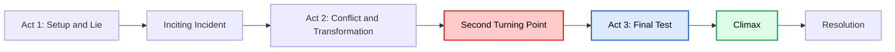
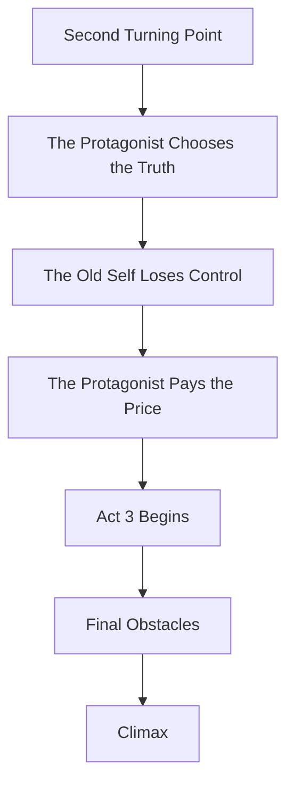
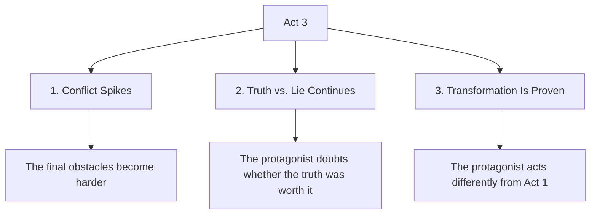
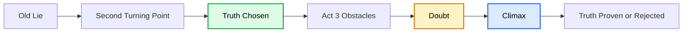
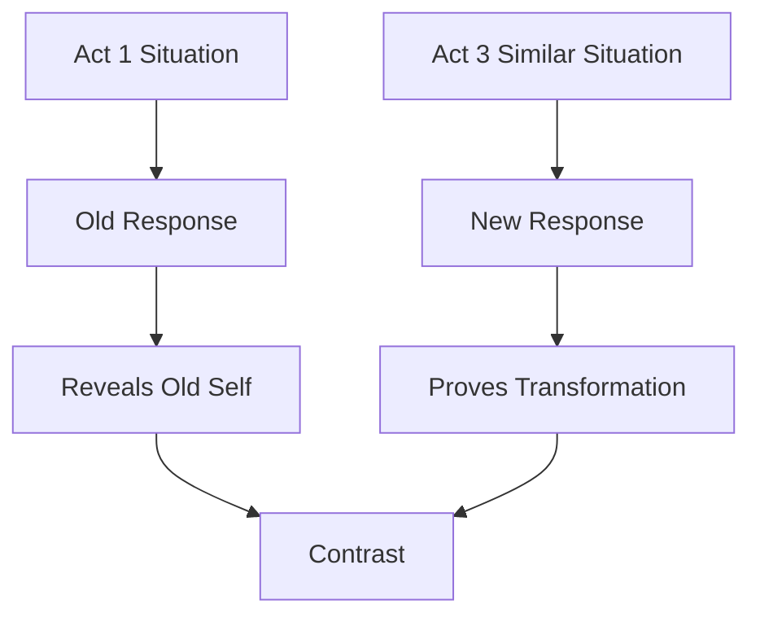
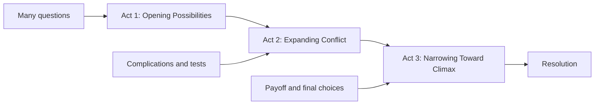
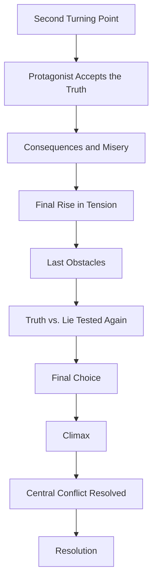

# 014 - Act 3

## Section

**02 - The 3 Act Narrative Structure**

## Original Lecture Title

**Act 3**

## Duration

**4:17**

---

# 1. Lesson Overview

Act 3 is the final quarter of the story.

By this point, the protagonist has passed through the **Second Turning Point**. They have faced their lowest moment, confronted the lie they were living, and made a decisive choice.

They have chosen the truth.

However, this choice is not painless.

The protagonist may have given up something they once wanted. Their old dream may be broken. Their life is no longer the same as it was at the beginning of the story.

Act 3 is about answering one central question:

> Can the protagonist regain control over a life that has now been completely transformed?

---

# 2. Core Idea

Act 3 resolves the central conflict that began with the inciting incident.

The protagonist must use everything they have learned to face the final challenge.

Act 3 should not feel like a new story.

It should feel like the payoff of everything that came before.

---

# 3. What Act 3 Must Do

Act 3 should:

* Resolve the main conflict
* Answer the dramatic question raised near the beginning
* Show the consequences of the protagonist’s transformation
* Prove whether the protagonist has truly changed
* Bring major plot threads to a satisfying conclusion
* Deliver emotional and narrative payoff
* Move faster than Act 2
* Avoid unnecessary new complications

This is not the place to introduce too many new problems.

It is the place to bring existing conflicts to their final result.

---

# 4. The Protagonist’s State at the Beginning of Act 3

At the beginning of Act 3, the protagonist is no longer the same person they were in Act 1.

They have:

* Faced the lie
* Chosen the truth
* Lost something important
* Accepted painful consequences
* Reached a new level of awareness
* Become capable of actions their old self could not perform

However, they are not safe yet.

The final conflict still remains.

---

# 5. Three Key Elements of Act 3

Every strong Act 3 usually includes three essential elements:

1. The tension of the conflict spikes
2. The conflict between truth and lie continues
3. The story highlights how far the protagonist has come

---

# 6. Element 1: The Tension of the Conflict Spikes

The Second Turning Point was like a stab in the back.

Because of this, the protagonist should not recover too easily.

The beginning of Act 3 is a good time to let the protagonist sit with the consequences of what has happened. They may feel grief, doubt, fear, guilt, or exhaustion.

Then the conflict should intensify one final time.

The stakes rise again.

The antagonist may seem stronger. The protagonist’s plan may seem impossible. The cost of victory may become even greater.

## Examples

### About a Boy

At the Second Turning Point, Kurt Cobain has attempted suicide, and Sonia later attempts suicide as well.

In Act 3, Cobain’s actual suicide suggests the possibility of a truly tragic ending.

The emotional tension becomes heavier.

---

### Fight Club

In Act 3, the narrator tries to surrender to the police.

However, he discovers that many police officers are themselves members of Fight Club.

His attempt to stop the disaster appears to have failed completely.

The conflict becomes more desperate.

---

### Harry Potter and the Deathly Hallows

After Harry’s apparent death, Hogwarts falls under the control of Voldemort and his army.

It seems that all hope is lost.

The final battle becomes even more urgent.

---

# 7. Element 2: Keep the Conflict Between Truth and Lie Alive

The Second Turning Point forced the protagonist to choose the truth.

But Act 3 should not immediately confirm that this was the right choice.

The reader should still wonder:

> Was the protagonist right to choose the truth?

The protagonist may also wonder this.

The truth may have cost them something painful. They may have lost the thing they wanted most. They may not know whether their sacrifice will be rewarded.

This uncertainty should continue until the climax.

## Examples

### Apollo 13

The astronauts attempt to return to Earth.

However, nobody knows whether the emergency solution they created will survive re-entry into the atmosphere.

The truth has been chosen, but the result is still uncertain.

---

### Kung Fu Panda

Po confronts Tai Lung.

Even at the end, Po is still asking himself the same question the audience is asking:

> Am I really the chosen one?

The final fight tests whether his new identity is real.

---

# 8. Element 3: Highlight the Road Traveled

By Act 3, the protagonist has already traveled a long transformational road.

They should now be visibly different from the person they were in Act 1.

Act 3 is the best place to prove that change.

One powerful method is to place the protagonist in a situation similar to one from earlier in the story.

The situation may look familiar, but the protagonist’s response should be different.

This allows the reader to see change through action.

The story does not need to explain that the protagonist has changed. The protagonist’s choices prove it.

---

# 9. Example: Jurassic Park

In *Jurassic Park*, Dr. Grant begins the story with a distant and uncomfortable attitude toward children.

By Act 3, his behavior has changed.

He becomes thoughtful, caring, reassuring, and protective toward the kids.

This change proves that his arc has affected his actions.

He is not simply saying he has changed.

He is acting differently.

---

# 10. Act 3 and the Dramatic Question

A strong Act 3 answers the dramatic question raised by the opening of the story.

The dramatic question might be:

* Will the protagonist survive?
* Will they defeat the antagonist?
* Will they find love?
* Will they return home?
* Will they accept the truth?
* Will they become the person they need to become?
* Will they save the person, place, or dream that matters?

Act 3 should not ignore this question.

It should answer it clearly through the climax and resolution.

---

# 11. Act 3 Should Move Faster Than Act 2

Act 3 usually has a faster pace than Act 2.

This does not mean every scene must be action-heavy. Emotional scenes can still exist.

However, the story should feel like it is moving toward a final result.

Act 3 should include:

* Fewer detours
* Fewer new complications
* Fewer unrelated subplots
* More payoff
* More urgency
* More consequence
* More direct movement toward the climax

The reader should feel that the story is narrowing toward its final confrontation.

---

# 12. The Function of the Climax

The climax is the final test of the protagonist’s transformation.

It should force the protagonist to make a choice or take an action that proves who they have become.

The climax should answer:

| Question                                | Purpose                          |
| --------------------------------------- | -------------------------------- |
| What does the protagonist choose?       | Shows their final value system   |
| What do they sacrifice?                 | Shows the cost of transformation |
| What do they do differently from Act 1? | Proves growth                    |
| How is the antagonist confronted?       | Resolves the external conflict   |
| How is the lie defeated or confirmed?   | Resolves the internal conflict   |
| What remains after the conflict?        | Leads into resolution            |

The climax is not only about winning or losing.

It is about revealing the final truth of the character.

---

# 13. Act 3 Structure Map

---

# 14. Key Points

* Act 3 is the final quarter of the story.
* It resolves the conflict set up since the inciting incident.
* The protagonist has chosen the truth, but the consequences are painful.
* The tension should rise one final time.
* The story should keep the truth-versus-lie conflict alive until the climax.
* The protagonist’s final actions should prove their transformation.
* Act 3 should move faster than Act 2.
* Act 3 should focus on payoff, not excessive new complications.
* The climax should answer the story’s central dramatic question.

---

# 15. Practical Exercise

List the three biggest unresolved questions from Acts 1 and 2.

Then confirm that each one has a planned resolution in Act 3.

| Unresolved Question | Where It Began | How Act 3 Resolves It |
| ------------------- | -------------- | --------------------- |
| Question 1          |                |                       |
| Question 2          |                |                       |
| Question 3          |                |                       |

---

# 16. Reflection Questions

## Main Reflection Question

Does your Act 3 answer the dramatic question your opening hook first raised?

## Additional Questions

1. How does your protagonist react at the Second Turning Point?
2. How does the truth turn their life upside down?
3. What has the protagonist lost by choosing the truth?
4. How can you make the final obstacles more difficult?
5. How do these obstacles make the protagonist doubt their choice?
6. What does the protagonist do differently compared to the beginning of the story?
7. What scene could prove that the protagonist has changed?
8. How does the climax resolve the external conflict?
9. How does the climax resolve the internal conflict?
10. What final image or moment shows the result of the protagonist’s transformation?

---

# 17. Act 3 Design Checklist

Use this checklist to test whether your Act 3 is strong.

| Question                                                                          | Yes / No |
| --------------------------------------------------------------------------------- | -------- |
| Does Act 3 resolve the main conflict?                                             |          |
| Does it answer the dramatic question raised near the beginning?                   |          |
| Does it show the consequences of the Second Turning Point?                        |          |
| Does the protagonist continue to struggle with the cost of the truth?             |          |
| Does the tension rise one final time?                                             |          |
| Are there fewer new complications than in Act 2?                                  |          |
| Does the protagonist act differently from Act 1?                                  |          |
| Does the climax test the protagonist’s transformation?                            |          |
| Does the final choice feel difficult and meaningful?                              |          |
| Are the major unresolved questions answered?                                      |          |
| Does the resolution show what the protagonist’s life looks like after the change? |          |

---

# 18. Summary

Act 3 is the final movement of the story.

The protagonist has chosen the truth, but this choice has changed their life and destroyed the old dream they once pursued.

Now they must face the final consequences of that choice.

The conflict should intensify one last time. The protagonist should doubt whether the truth was worth the cost. The climax should then test their transformation and prove whether they have truly changed.

A strong Act 3 resolves the central conflict, answers the dramatic question, and shows the protagonist acting in a way their old self never could.

Act 3 is where the story pays off the entire journey.
