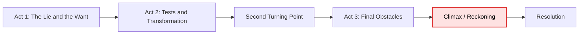
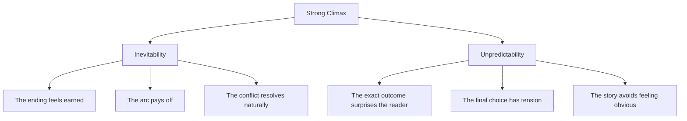
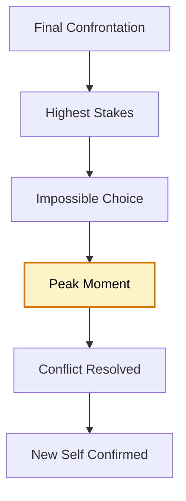
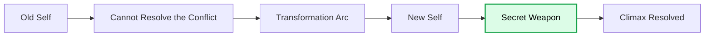
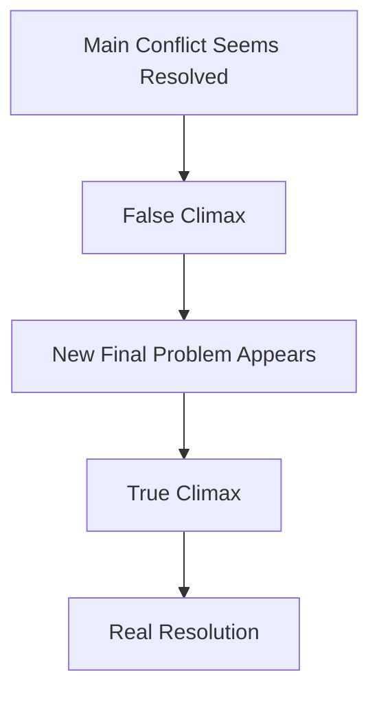
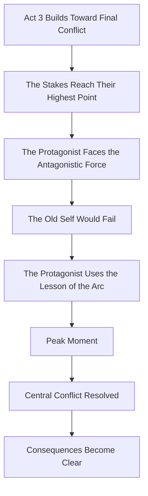

# 015 - The Climax / Reckoning

## Section

**02 - The 3 Act Narrative Structure**

## Original Lecture Title

**The Climax / Reckoning**

## Duration

**6:22**

---

# 1. Lesson Overview

The **climax** happens near the end of the story, usually around the final 90% mark.

This is the moment where the central conflict is finally confronted and resolved.

The protagonist and antagonist collide. The external conflict reaches its highest intensity. The internal conflict reaches its final test. Everything the protagonist has learned, lost, chosen, and become must now matter.

The climax is not just the biggest scene.

It is the scene that proves why the entire story had to happen.

---

# 2. Core Idea

The climax is the final confrontation between the protagonist and the central conflict.

It is where the protagonist must prove, through action, that they have changed.

At the climax, the protagonist should face a challenge that their Act 1 self could not have overcome.

---

# 3. What the Climax Must Do

A strong climax should:

* Resolve the central conflict
* Bring the protagonist and antagonist into direct confrontation
* Test the protagonist’s transformation
* Force the highest-stakes choice in the story
* Require the lesson of the protagonist’s arc
* Deliver emotional and narrative payoff
* Feel both surprising and inevitable
* Show whether the protagonist gets what they want, what they need, or both

The climax should not be solved by an unrelated skill, coincidence, or sudden new information.

It should be solved by the specific growth the protagonist has earned throughout the story.

---

# 4. Inevitability and Unpredictability

A great climax creates two feelings at the same time.

The reader should think:

> “That is exactly how this story had to end.”

But they should also think:

> “I did not fully see that coming.”

This is difficult because these two qualities seem opposite.

| Quality          | Meaning                                                           |
| ---------------- | ----------------------------------------------------------------- |
| Inevitability    | The ending feels emotionally and logically right.                 |
| Unpredictability | The ending still contains surprise, tension, or a powerful twist. |

The best climaxes are not random shocks. They are surprising outcomes that feel correct once they happen.

---

# 5. The Peak Moment

The **peak moment** is the climax of the climax.

It is the single decisive moment that resolves the conflict.

This may be:

* A final choice
* A confession
* A sacrifice
* A victory
* A defeat
* A rescue
* A death
* A return home
* An act of forgiveness
* A moment of acceptance
* The protagonist finally choosing what they need

In a positive character arc, this is usually the moment when the protagonist fully receives or embraces what they need.

---

# 6. The Climax as Proof of Transformation

The climax should prove that the protagonist is no longer the person they were in Act 1.

The reader should be able to compare:

| Act 1 Protagonist             | Climax Protagonist                 |
| ----------------------------- | ---------------------------------- |
| Controlled by the lie         | Acts from the truth                |
| Avoids the hard choice        | Makes the hard choice              |
| Wants the wrong thing         | Understands what they need         |
| Reacts from fear              | Acts with courage or clarity       |
| Protects the old self         | Lets the old self die              |
| Could not defeat the conflict | Can now face the conflict directly |

The climax should answer this question:

> If the protagonist had not changed, would they fail here?

If the answer is no, the climax may not be connected strongly enough to the character arc.

---

# 7. The Secret Weapon of the New Self

The protagonist’s “secret weapon” at the climax should come from their transformation.

It may be:

* Humility
* Courage
* Love
* Forgiveness
* Self-knowledge
* Sacrifice
* Trust
* Responsibility
* Acceptance
* Moral clarity
* The ability to let go
* The ability to ask for help
* The ability to act for someone other than themselves

This secret weapon should be something the old self did not possess.

---

# 8. The Climax Does Not Have to Be a Fight

The climax can be a physical confrontation, but it does not have to be.

In some stories, the climax is an inner victory.

The protagonist may:

* Accept defeat
* Admit a mistake
* Forgive someone
* Confess love
* Tell the truth
* Let someone go
* Choose dignity over desire
* Refuse revenge
* Sacrifice themselves
* Stop running from grief
* Take responsibility for harm they caused

The climax is not defined by explosions or combat.

It is defined by final reckoning.

---

# 9. Possible Forms of the Climax

| Type of Climax       | Example Form                                                                |
| -------------------- | --------------------------------------------------------------------------- |
| Physical climax      | The hero fights the villain.                                                |
| Emotional climax     | Two characters confess love, grief, or truth.                               |
| Moral climax         | The protagonist chooses the right thing at great cost.                      |
| Psychological climax | The protagonist confronts their own identity or delusion.                   |
| Spiritual climax     | The protagonist accepts meaning, mortality, forgiveness, or faith.          |
| Tragic climax        | The protagonist fails, dies, or loses what matters.                         |
| Redemptive climax    | The protagonist sacrifices something to become whole.                       |
| False climax         | The protagonist thinks the conflict is over, but one final problem remains. |

---

# 10. Examples of Climaxes

## Little Women

In *Little Women*, the climax may take the form of marriage and emotional fulfillment.

The scene matters because it resolves emotional questions that have been built throughout the story.

---

## Harry Potter

In *Harry Potter*, the climax often centers on the final confrontation with Voldemort.

The external conflict is direct: Harry must face the villain.

But the emotional power comes from everything Harry has learned about courage, sacrifice, death, friendship, and love.

---

## Children of Men

In *Children of Men*, the climax involves saving a character.

The stakes are not only personal. They are tied to the survival of hope itself.

---

## Apollo 13

In *Apollo 13*, the climax is the astronauts’ return to Earth.

The question is simple and powerful:

> Will they survive re-entry and return home?

The climax resolves the survival conflict that has driven the story.

---

## Fight Club

In *Fight Club*, the climax becomes a psychological reckoning.

The narrator realizes that Tyler is not an external enemy but a part of himself. To stop Tyler, he must act against himself.

The climactic act is shocking, but it is directly tied to the narrator’s internal conflict.

He cannot resolve the story by defeating someone else.

He must confront who he is.

---

## Pride and Prejudice

In *Pride and Prejudice*, the climax is not a battle.

Darcy and Elizabeth walk together, confess their mistakes, and confess their love.

Darcy proposes again, and Elizabeth accepts.

The conflict resolves through humility, emotional honesty, and mutual transformation.

---

## The Fault in Our Stars

In *The Fault in Our Stars*, Hazel confronts the author of her favorite book.

He admits that his character was inspired by his daughter, who died of cancer.

Hazel realizes that he does not have more answers to life’s ambiguities than she does. She forgives him for his behavior in Amsterdam and encourages him to write again.

The climax is quiet, emotional, and reflective.

It resolves a question of meaning rather than a physical conflict.

---

## The Green Mile

In *The Green Mile*, the climax centers on John Coffey’s execution.

The scene is devastating because the audience knows John is innocent and has the power to heal others.

The climax is not about victory. It is about moral helplessness, grief, injustice, and the burden of witnessing something that cannot be undone.

---

## Toy Story

In *Toy Story*, Woody and Buzz defeat Sid, the boy next door.

However, this creates a **false climax**.

They think they have overcome the main danger, but then they realize they are about to miss the moving van that will take them back to Andy.

The story still has one final problem to resolve.

---

# 11. False Climax

A **false climax** happens when the protagonist appears to have reached the end of the conflict, but the story is not truly finished.

The false climax can be useful because it creates one final burst of tension.

A false climax should not feel like a trick. It should reveal that one final piece of the conflict still needs to be resolved.

---

# 12. Climax Structure Map

---

# 13. Want vs. Need at the Climax

The climax should clarify the relationship between what the protagonist wanted and what they needed.

Possible outcomes include:

| Outcome                                                             | Meaning                                  |
| ------------------------------------------------------------------- | ---------------------------------------- |
| They get what they want and what they need                          | A fulfilling positive arc.               |
| They get what they need but lose what they wanted                   | A bittersweet but transformative ending. |
| They get what they wanted but fail to get what they needed          | A tragic or negative arc.                |
| They lose both                                                      | A darker tragedy.                        |
| They reject what they wanted because they understand what they need | A strong transformation arc.             |

The climax should make this outcome emotionally clear.

---

# 14. Key Points

* The climax usually happens near the final 90% of the story.
* It is the final confrontation with the central conflict.
* The stakes should be at their highest.
* The protagonist must prove they have changed.
* The climax should require the lesson of the protagonist’s arc.
* It should feel both inevitable and surprising.
* The peak moment is the decisive action or choice that resolves the conflict.
* The climax does not have to be physical; it can be emotional, moral, or psychological.
* A false climax can appear before the true climax.
* The outcome should clarify whether the protagonist gets what they want, what they need, or both.

---

# 15. Practical Exercise

Write the core climactic choice your protagonist must make.

Then test it with these questions:

1. What is the final conflict?
2. What is at stake?
3. What does the protagonist want at this moment?
4. What does the protagonist need at this moment?
5. What choice must they make?
6. Why would their Act 1 self fail here?
7. What lesson from their arc allows them to succeed?
8. What action proves they have changed?

---

# 16. Reflection Questions

## Main Reflection Question

If your protagonist had not changed since Act 1, would they fail this climax?

## Additional Questions

1. How can your protagonist prove they are a different person at the climax?
2. What is the “secret weapon” of the new person they have become?
3. How does this secret weapon resolve the conflict?
4. What scene has the reader been waiting for since the beginning?
5. What is the peak moment of the climax?
6. Does the climax feel inevitable?
7. Does the climax still contain surprise?
8. Will the protagonist get what they want?
9. Will the protagonist get what they need?
10. What does the climax reveal about the meaning of the story?

---

# 17. Climax Design Checklist

Use this checklist to test whether your climax is strong.

| Question                                               | Yes / No |
| ------------------------------------------------------ | -------- |
| Does the climax resolve the central conflict?          |          |
| Are the stakes at their highest point?                 |          |
| Does the protagonist face the main antagonistic force? |          |
| Does the climax require the protagonist’s growth?      |          |
| Would the Act 1 version of the protagonist fail here?  |          |
| Is there a clear peak moment?                          |          |
| Does the climax feel emotionally earned?               |          |
| Does it contain some element of surprise?              |          |
| Does it answer the story’s main dramatic question?     |          |
| Does it clarify the protagonist’s want vs. need?       |          |
| Does it avoid being solved by coincidence?             |          |
| Does it lead naturally into the resolution?            |          |

---

# 18. Summary

The climax is the final reckoning of the story.

It is where the protagonist confronts the central conflict and proves whether their transformation is real.

The stakes should be at their highest. The protagonist should be forced to use the specific lesson they have learned through their arc. Their Act 1 self should not be capable of winning this moment.

A powerful climax feels both inevitable and surprising.

It gives the reader the scene they have been waiting for, while still delivering emotional force, tension, and revelation.

The climax is where the story finally answers:

> Who has the protagonist become?

---

# Bài luyện tập

## Mục tiêu

## Đề bài

## Yêu cầu hoàn thành

- [ ] 
- [ ] 
- [ ] 

## Kết quả / lời giải

## Ghi chú
