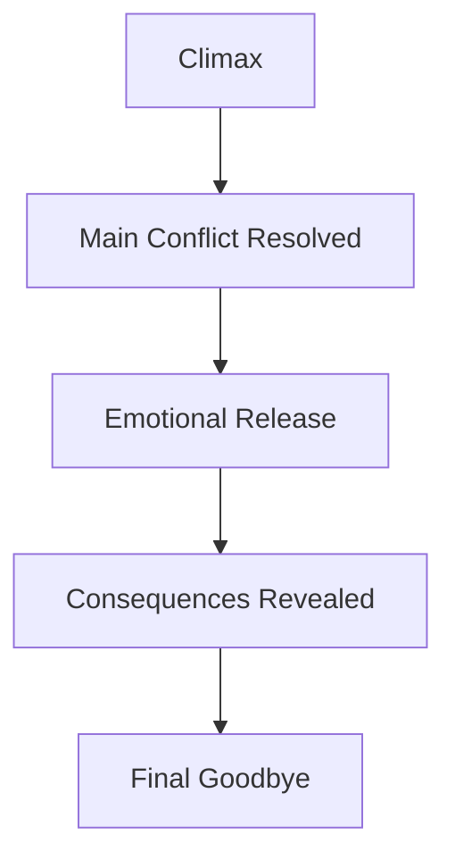
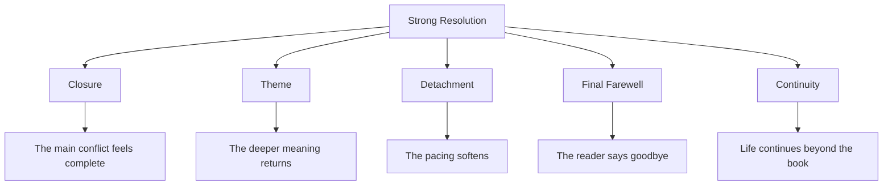
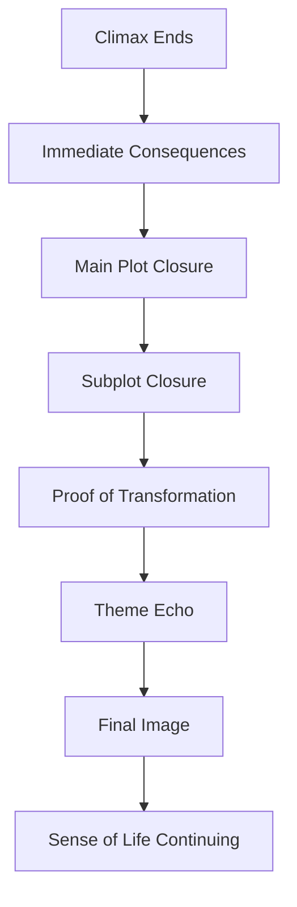
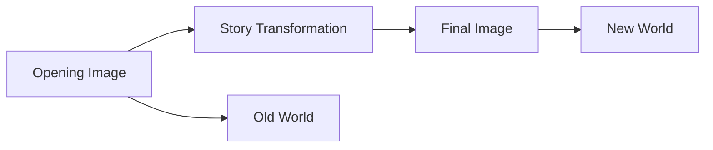

# 016 - Resolving Act 3

## Section

**02 - The 3 Act Narrative Structure**

## Original Lecture Title

**Resolving Act 3**

## Duration

**6:42**

---

# 1. Lesson Overview

The **resolution** begins immediately after the climax and continues until the end of the book.

It is usually short, often only a few pages, but it is essential.

The climax resolves the central conflict. The resolution shows what that victory, defeat, sacrifice, or transformation means for the protagonist’s life.

This is where the story finally answers:

> What has changed because of everything that happened?

---

# 2. Core Idea

The resolution is not the place to create a new story.

It is the place to show the new state of the world after the story’s major conflicts have been resolved.

The reader has followed the protagonist through danger, loss, growth, and emotional stress.

The resolution gives the reader a final moment of release.

---

# 3. What the Resolution Must Do

A strong resolution should:

* Tie up the main plot
* Close important subplots
* Show the consequences of the climax
* Reveal the protagonist’s new life
* Confirm the character’s transformation
* Give secondary characters a sense of closure
* Return to the story’s theme
* Leave the reader with emotional satisfaction
* Avoid introducing major new conflicts or information

The resolution should feel like a payoff, not an afterthought.

---

# 4. Why You Should Not Skip the Resolution

Even if the climax has already solved the main conflict, the story still needs a final emotional landing.

Without a resolution, the reader may feel abandoned.

After intense conflict, the reader wants a moment to breathe, reflect, and say goodbye to the characters.

The resolution is like standing with the protagonist at the top of a mountain after a long climb.

The battle is over.

Now the reader needs to see the view.

---

# 5. The Balance of Detail and Imagination

The resolution must find the right balance.

If you leave too many loose ends, the reader may feel cheated.

If you explain every detail, the ending may feel overcontrolled and lifeless.

| Too Little Resolution             | Too Much Resolution             |
| --------------------------------- | ------------------------------- |
| Leaves major questions unanswered | Explains everything too heavily |
| Makes subplots feel abandoned     | Removes mystery and imagination |
| Can frustrate the reader          | Can slow the ending             |
| Feels incomplete                  | Feels excessive                 |

A good resolution gives enough closure for satisfaction, while leaving enough space for the reader’s imagination.

---

# 6. Five Qualities of a Strong Ending

The lesson highlights five reasons why strong endings are memorable:

1. They give a sense of closure
2. They recall the theme of the story
3. They help the reader detach from the story world
4. They allow a final farewell
5. They create a sense of continuity

---

# 7. Quality 1: A Sense of Closure

The final pages should let the reader feel that the central conflict has truly ended.

This does not mean every possible question must be answered.

However, the reader should not feel that another major disaster is about to happen immediately after the final page.

A sense of closure can come from:

* Safety after danger
* Peace after conflict
* Acceptance after grief
* Reunion after separation
* Truth after deception
* Rest after struggle
* A final image that confirms change

Many strong endings place the protagonist in a condition of calm, stillness, or emotional clarity.

---

# 8. Quality 2: A Return to the Theme

The ending is an excellent place to remind the reader what the story was really about.

During the middle of the story, the reader is often focused on plot, conflict, and character decisions.

At the end, the story can quietly return to its deeper meaning.

## Example: The Old Man and the Sea

In *The Old Man and the Sea*, the ending returns to the heart of the story: endurance, courage, purpose, and human dignity.

After a brutal struggle with nature, the old man is physically exhausted and injured.

Yet he continues to represent a life lived with courage and purpose.

His final dream of lions suggests that, even after suffering and defeat, something noble and vital remains alive within him.

---

# 9. Quality 3: Helping the Reader Detach

The final part of a book should have a different rhythm from the rest of the story.

Like the final notes of a song, the last pages should help the reader prepare to leave the story world.

The pacing usually becomes:

* Slower
* Softer
* More reflective
* More spacious
* More emotionally focused

This allows the reader to transition back to ordinary life.

## Example: Alice in Wonderland

At the end of *Alice in Wonderland*, Alice has become more mature.

The ending reflects on memory, childhood, imagination, and the future.

Instead of ending with abrupt action, the story gently guides the reader out of Wonderland and back into the real world.

---

# 10. Quality 4: A Final Farewell

The resolution gives the reader one last moment with the characters.

This farewell matters because the reader has spent the entire story becoming emotionally attached to them.

The final farewell may be:

* A quiet conversation
* A last look
* A symbolic gesture
* A goodbye between characters
* A return home
* A final image of peace
* A moment of grief
* A moment of hope

The reader should feel that they have been allowed to say goodbye properly.

---

# 11. Quality 5: A Sense of Continuity

A good resolution does not make the story world feel dead.

It gives the impression that life continues beyond the final page.

The book ends, but the characters’ lives seem to keep going.

This creates emotional richness because the reader can imagine the future of the characters after the story is over.

From this perspective, the resolution is not only the end of the book.

It is also the beginning of a new life.

---

# 12. Example: Casablanca

*Casablanca* offers one of the most memorable open endings.

The main plot has been resolved. The major emotional and narrative knots have been untangled.

However, the story does not explain everything that will happen afterward.

The future of Rick and Louis is left open to the viewer’s imagination.

This works because the central conflict is complete, but the characters’ lives still feel alive beyond the ending.

The famous final idea is that this may be the beginning of a new friendship.

That sense of continuation makes the ending memorable.

---

# 13. What Not to Do in the Resolution

The resolution should not introduce major new elements that should have been set up earlier.

Avoid:

* New villains
* New major conflicts
* New central mysteries
* Sudden unexplained revelations
* Major information that changes the whole story too late
* Long explanations of things the reader already understands
* Excessive detail about every character’s future

The resolution should pay off the story.

It should not restart it.

---

# 14. Resolving Subplots

Secondary characters and subplots should receive closure too.

This closure can be brief.

A subplot does not always need a full scene, but the reader should understand its final direction.

| Plot Thread Type   | Possible Resolution                                            |
| ------------------ | -------------------------------------------------------------- |
| Romantic subplot   | The relationship begins, ends, heals, or changes form.         |
| Friendship subplot | Trust is restored, broken, or redefined.                       |
| Family subplot     | Forgiveness, distance, reunion, or acceptance occurs.          |
| Mentor subplot     | The lesson is honored or rejected.                             |
| Rival subplot      | The rivalry ends, transforms, or remains unresolved by design. |
| Mystery subplot    | The key answer is revealed.                                    |
| Inner conflict     | The protagonist acts from the truth rather than the lie.       |

Every important thread should receive at least one line of resolution.

---

# 15. Resolution Structure Map

---

# 16. The Final Image

The final image is one of the most powerful tools in the resolution.

It can show the reader what has changed without overexplaining.

A strong final image may show:

* The protagonist in a new place
* The protagonist making a new kind of choice
* A healed relationship
* A quiet symbol of the theme
* A return to an earlier image with new meaning
* A contrast with the opening scene
* A sign that life continues

The final image should make the reader feel the emotional distance between the beginning and the end.

---

# 17. Key Points

* The resolution begins immediately after the climax.
* It shows how the climax changed the protagonist’s life.
* It ties up the plot, subplots, and transformational arc.
* It should give the reader emotional release.
* It should avoid introducing major new conflicts or information.
* It should provide closure without explaining every tiny detail.
* It should echo the theme of the story.
* It should help the reader detach from the story world.
* It should allow a final farewell to the characters.
* It should suggest that life continues beyond the final page.

---

# 18. Practical Exercise

List every open plot thread in your story.

Then confirm that each one receives at least one line of resolution.

| Plot Thread                  | Where It Began | How It Is Resolved | Needs More Closure? |
| ---------------------------- | -------------- | ------------------ | ------------------- |
| Main conflict                |                |                    |                     |
| Protagonist’s inner conflict |                |                    |                     |
| Romantic subplot             |                |                    |                     |
| Friendship subplot           |                |                    |                     |
| Family subplot               |                |                    |                     |
| Antagonist thread            |                |                    |                     |
| Mentor thread                |                |                    |                     |
| Mystery or question          |                |                    |                     |

---

# 19. Reflection Questions

## Main Reflection Question

Which subplot risks feeling unfinished if you do not address it in this section?

## Additional Questions

1. What changes in the protagonist’s life after the climax?
2. What is the new state of the world?
3. Which plot threads still need closure?
4. Which secondary characters need a final moment?
5. What emotional state should the reader feel at the end?
6. What theme should the final pages remind the reader of?
7. What should be left to the reader’s imagination?
8. What should not be left unresolved?
9. What final image best shows the protagonist’s transformation?
10. How can the ending suggest that life continues beyond the book?

---

# 20. Resolution Design Checklist

Use this checklist to test whether your resolution is complete.

| Question                                          | Yes / No |
| ------------------------------------------------- | -------- |
| Does the resolution begin after the climax?       |          |
| Does it show the consequences of the climax?      |          |
| Does it reveal the protagonist’s new life?        |          |
| Does it confirm the protagonist’s transformation? |          |
| Does it close the main plot?                      |          |
| Does it give secondary characters some closure?   |          |
| Does it address important subplots?               |          |
| Does it avoid major new conflicts?                |          |
| Does it avoid excessive explanation?              |          |
| Does it echo the theme?                           |          |
| Does it give the reader emotional release?        |          |
| Does it include a strong final image?             |          |
| Does it suggest life continues beyond the story?  |          |

---

# 21. Summary

The resolution is the final movement of the story.

It begins after the climax and shows the consequences of everything the protagonist has done, lost, chosen, and become.

The reader needs this moment.

After the emotional intensity of the climax, the resolution provides release, closure, and farewell. It ties up the main plot, gives subplots a sense of completion, and shows the new state of the world.

A strong resolution does not explain everything.

It gives enough closure to satisfy the reader while leaving enough space for imagination.

The story ends, but the characters’ lives feel as though they continue beyond the final page.
