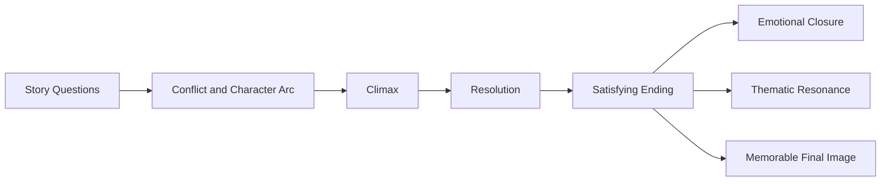
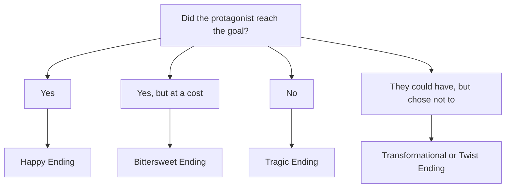
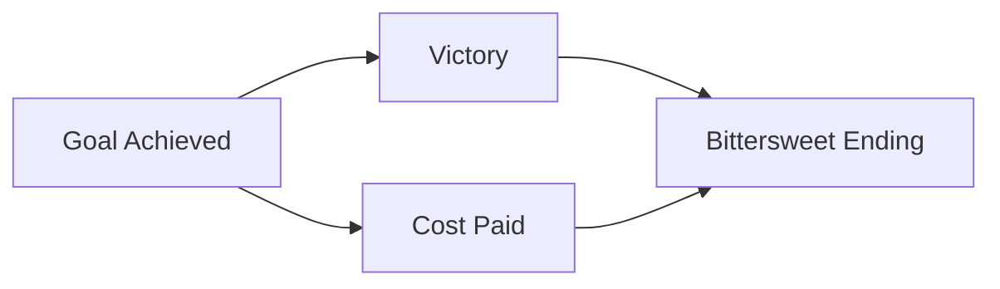
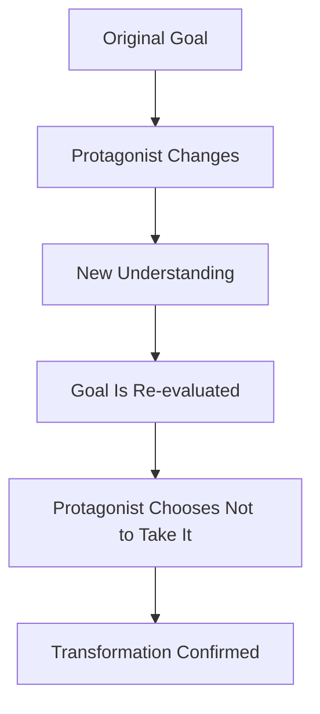
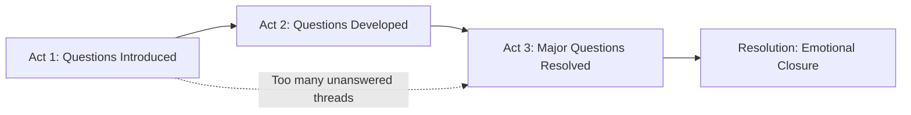
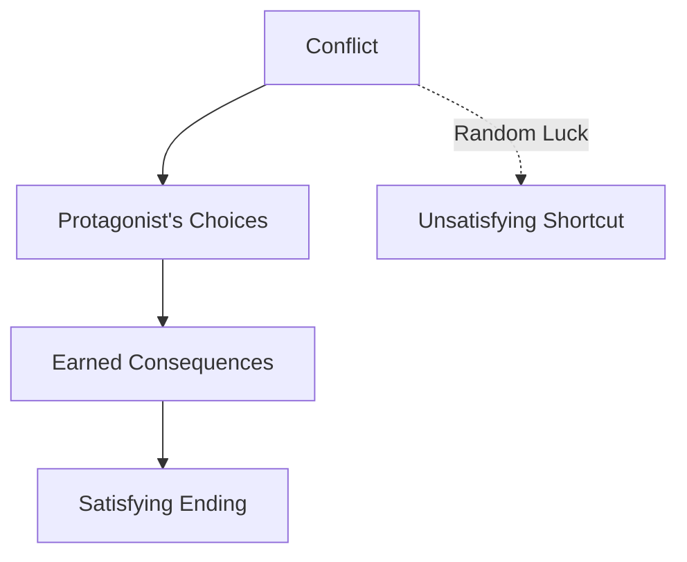
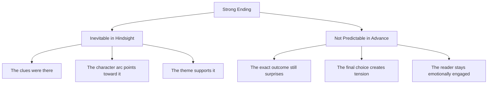
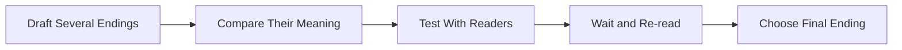
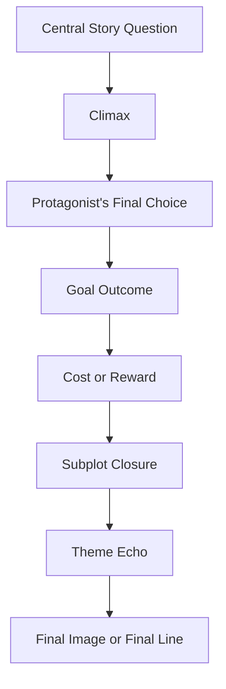

# 017 - Tips for the Ending

## Section

**02 - The 3 Act Narrative Structure**

## Original Lecture Title

**Tips for the Ending**

## Duration

**8:25**

---

# 1. Lesson Overview

A good ending should leave the reader emotionally satisfied.

The reader has spent time with your characters. They have suffered, hoped, feared, and celebrated alongside them. By the end, they want to feel that the journey was worth it.

The ending is often the part of the story that stays longest in the reader’s mind and heart.

For that reason, the ending should be one of the most emotionally powerful parts of the book.

A satisfying ending should:

* Answer the story’s central question
* Resolve the main conflict
* Give emotional payoff
* Show the final result of the protagonist’s arc
* Avoid over-explaining the theme
* Leave the reader with a resonant final image or final line

---

# 2. Core Idea

The ending should feel both complete and meaningful.

It should not merely stop the story. It should show why the story mattered.

A strong ending makes the reader feel:

> “Yes. This is where the story was always going.”

---

# 3. The Central Question of the Ending

One of the most important questions to ask is:

> Have I answered all the questions I opened throughout the story?

Unless you are writing a saga or a multi-book series, the major questions introduced in the story should be answered by the end.

In a saga, such as *Harry Potter* or *The Lord of the Rings*, one book may resolve its own immediate conflict while leaving larger story questions open for the full series.

But within a standalone book, the reader expects meaningful closure.

---

# 4. Did the Protagonist Reach Their Goal?

A major question that shapes the ending is:

> Did the protagonist reach their goal?

There are four main possible answers.

---

# 5. Ending Type 1: Yes, They Reached the Goal

This is the classic happy ending.

The protagonist gets what they wanted.

Examples:

* They propose to the person they love.
* They rescue the hostages.
* They get their dream job.
* They defeat the antagonist.
* They return home safely.

Sometimes the ending gives the protagonist even more than they expected.

For example:

* They propose to their beloved, and they are now expecting a child.
* They rescue the hostages, and a new love story begins.
* They win the conflict and gain a new family, identity, or purpose.

This type of ending works best when the victory feels earned.

---

# 6. Ending Type 2: Yes, But at a Cost

This is a bittersweet ending.

The protagonist reaches the goal, but they pay a painful price.

Examples:

* They propose to their beloved, but lose their job.
* They rescue the hostages, but their partner dies.
* They defeat the villain, but lose their home.
* They save the world, but can no longer return to their old life.

This ending can be very powerful because it combines victory with sacrifice.

The reader feels satisfaction, but also grief.

---

# 7. Ending Type 3: No, They Did Not Reach the Goal

This is often the structure of a tragic ending.

The protagonist fails to achieve the goal.

But this failure can have many shades.

Examples:

* They do not propose to their beloved, and that person marries someone else.
* They do not win the final battle.
* They fail to save someone.
* They lose the thing they spent the whole story pursuing.

However, a tragic ending does not always mean total emptiness.

Sometimes the protagonist fails to get what they wanted, but gains something else:

* Wisdom
* Acceptance
* A new friendship
* Moral clarity
* Self-knowledge
* Peace

A tragic ending is strongest when the failure feels meaningful, not random.

---

# 8. Ending Type 4: They Could Reach the Goal, But Choose Not To

In this type of ending, the protagonist is in a position to achieve the original goal, but deliberately chooses not to.

Why?

Because they have changed.

They now understand that the original goal is no longer right for them.

Examples:

* They do not propose because they realize the person is not right for them.
* They do not take revenge because they no longer want to become cruel.
* They do not rescue the supposed hostages because they discover the situation is not what it seemed.
* They refuse the dream job because it would cost them their integrity.
* They walk away from success because they have found a deeper truth.

This type of ending often creates a memorable twist because it changes the meaning of the goal itself.

---

# 9. Want vs. Need in the Ending

The ending should clarify the relationship between what the protagonist wanted and what they needed.

| Ending Result                                   | Meaning                         |
| ----------------------------------------------- | ------------------------------- |
| Gets the want and the need                      | Happy and fulfilling ending     |
| Gets the want but loses something important     | Bittersweet ending              |
| Does not get the want but gets the need         | Mature transformational ending  |
| Gets the want but rejects the need              | Negative or tragic arc          |
| Loses both                                      | Dark tragedy                    |
| Could get the want but chooses the need instead | Strong character transformation |

The ending becomes more powerful when it reveals what the protagonist now values most.

---

# 10. Mistake 1: Going Into the Climax With Too Many Loose Ends

Beginning writers often try to solve every problem in the final scenes.

This is tempting, but usually weakens the ending.

A story should not save every answer for the last few pages.

Instead, each question, mystery, conflict, or subplot should be answered gradually throughout the story.

The ending should feel like the final movement of a carefully built machine, not like a rushed attempt to clean up everything at once.

---

# 11. Example: Lost

The ending of *Lost* became one of the most debated endings in television.

Across six seasons, the series introduced many mysteries, theories, and unanswered questions.

By the time the story reached its conclusion, there were so many mysteries that it became extremely difficult to create a fully satisfying resolution.

The lesson is clear:

> Do not create more mysteries than your ending can honestly resolve.

A strong ending depends on careful management of the questions you open throughout the story.

---

# 12. Mistake 2: Happy Coincidences

Avoid solving the main conflict through pure luck.

Miracles can happen in real life, but in fiction they often feel unearned.

For example, if the protagonist’s biggest problem is solved because they suddenly win the lottery, the reader will likely feel cheated.

A satisfying ending should come from:

* The protagonist’s choices
* The protagonist’s growth
* Setups planted earlier
* Consequences of previous actions
* The logic of the story world

Not from random fortune.

---

# 13. Mistake 3: Sudden Contrived Drama

Avoid creating last-minute drama that feels random or manipulative.

Killing a major character through a sudden accident may shock the reader, but shock alone is not enough.

If the death does not grow naturally from the story, it may feel artificial.

The lesson:

> Do not confuse surprise with emotional truth.

A painful event can work, but it must feel earned by the story’s structure, themes, and character arcs.

---

# 14. Mistake 4: Letting the Protagonist Succeed Too Early

The protagonist should not succeed before the right moment.

After a whole story of trials, the reader wants to see the protagonist pushed into difficulty.

They want to feel the full effort required to win.

The more the reader suffers with the protagonist, the more satisfying the final victory becomes.

This does not mean the story should be cruel without purpose.

It means the protagonist should be tested until the climax has real emotional weight.

---

# 15. Mistake 5: Abusing Tricks

A final secret that changes the meaning of the whole story can be powerful.

But it is difficult to execute well.

When it works, the reader feels amazed.

When it fails, the reader feels deceived.

Examples of successful major twists include:

* *Fight Club*
* *The Sixth Sense*

The key is that the twist must be properly prepared.

A good twist should make the reader think:

> “I did not see it coming, but now that I look back, it makes sense.”

A bad twist makes the reader think:

> “The story lied to me.”

---

# 16. Inevitable but Not Predictable

A great ending should feel inevitable in hindsight, but not predictable in advance.

This is one of the hardest balances in storytelling.

The ending should not feel random.

But it should not feel obvious either.

---

# 17. Four-Step Method for Writing the Ending

The lesson recommends a four-step process.

## Step 1: Work on More Than One Ending

Do not rush into the first ending that comes to mind.

Write at least three alternate endings.

Explore different possibilities:

* Happy ending
* Bittersweet ending
* Tragic ending
* Transformational ending
* Open ending
* Twist ending

Sometimes the first idea is obvious, but not the deepest.

---

## Step 2: Choose the Best Ending

After creating alternate endings, analyze how each one changes the meaning of the story.

Ask:

* Which ending best completes the protagonist’s arc?
* Which ending answers the central question most powerfully?
* Which ending feels emotionally honest?
* Which ending gives the story a higher meaning?
* Which ending avoids being too easy or too forced?

The best ending is not always the happiest or most shocking.

It is the one that best fulfills the story.

---

## Step 3: Test It on Real Readers

Because writers are emotionally close to their own stories, they can lose objectivity.

Testing the ending with readers can help.

Ask readers:

* How did the ending make you feel?
* Did anything feel unresolved?
* Did the ending feel earned?
* Were you surprised?
* Were you satisfied?
* Did the final choice make sense?
* Did you feel emotionally moved?

The goal is not to obey every opinion.

The goal is to understand the reader’s emotional experience.

---

## Step 4: Wait Before You Decide

Writing a novel is exhausting.

By the time you reach the ending, you may be too close to the work to judge it clearly.

Put the manuscript away for a while.

Then return to it with fresh eyes.

Distance helps you see:

* What is too obvious
* What is too rushed
* What is emotionally false
* What is missing
* What actually works

---

# 18. Ending Design Framework

Use this structure when designing your ending:

The ending should answer both the plot question and the emotional question.

---

# 19. Final Line Strategy

The final line should carry emotional weight.

It should not explain the theme too directly.

A strong final line may:

* Echo the opening
* Reveal the protagonist’s transformation
* Suggest continuity
* Create peace
* Create heartbreak
* Return to the central image
* Leave the reader with wonder
* Make the theme felt without stating it

## Practical Exercise

Write two possible final lines for your novel.

Then compare them.

| Final Line   | Emotional Effect | Why It Works / Does Not Work |
| ------------ | ---------------- | ---------------------------- |
| Final Line 1 |                  |                              |
| Final Line 2 |                  |                              |

Choose the one that earns its emotional weight more honestly.

---

# 20. Key Points

* A good ending must leave the reader emotionally satisfied.
* The ending should answer the story’s central question.
* The protagonist may achieve the goal, fail, pay a price, or choose a new goal.
* The ending should clarify the relationship between want and need.
* Do not enter the climax with too many loose ends.
* Do not solve the story through happy coincidence.
* Do not add sudden contrived drama just for shock.
* Do not let the protagonist succeed too early.
* Do not abuse final twists.
* Write more than one possible ending.
* Test the ending with readers.
* Wait before making the final decision.
* Trust the events of the story to express the theme.

---

# 21. Practical Exercise

Write two possible final lines for your novel.

Then ask:

1. Which line feels more emotionally honest?
2. Which line better reflects the protagonist’s transformation?
3. Which line echoes the theme without explaining it?
4. Which line feels earned by the events of the story?
5. Which line leaves the stronger final image?
6. Which line would stay longer in the reader’s memory?

---

# 22. Reflection Questions

## Main Reflection Question

Does your ending feel inevitable in hindsight, even though it was not predictable in advance?

## Additional Questions

1. What is the central question your ending must answer?
2. Does the protagonist reach their original goal?
3. If they reach the goal, what price do they pay?
4. If they fail, what meaning does the failure carry?
5. If they reject the goal, what transformation does that reveal?
6. What does the protagonist get: the want, the need, both, or neither?
7. Are there too many unresolved knots before the climax?
8. Does any solution rely too much on coincidence?
9. Does any final event feel contrived?
10. Does the ending arrive too easily?
11. Does the ending over-explain the theme?
12. What final image best represents the whole story?

---

# 23. Ending Checklist

Use this checklist to test whether your ending is satisfying.

| Question                                                     | Yes / No |
| ------------------------------------------------------------ | -------- |
| Does the ending answer the central story question?           |          |
| Does it resolve the main conflict?                           |          |
| Does it clarify whether the protagonist reached the goal?    |          |
| Does it show the cost, reward, or consequence of the climax? |          |
| Does it match the emotional tone of the character arc?       |          |
| Does it avoid relying on coincidence?                        |          |
| Does it avoid sudden contrived drama?                        |          |
| Does it avoid over-explaining the theme?                     |          |
| Does it resolve important open questions?                    |          |
| Does it leave some space for imagination?                    |          |
| Does it feel earned by the protagonist’s journey?            |          |
| Does it feel inevitable in hindsight?                        |          |
| Does it still contain some emotional surprise?               |          |
| Does the final image or line resonate?                       |          |

---

# 24. Summary

A good ending leaves the reader satisfied because it proves that the journey mattered.

It answers the central question, resolves the main conflict, and shows the final meaning of the protagonist’s transformation.

The protagonist may reach the goal, fail to reach it, pay a terrible price, or choose to abandon the original goal because they have changed.

Whatever form the ending takes, it must feel earned.

Avoid coincidence, contrived drama, excessive loose ends, and overused tricks. Trust the story’s events to express the theme.

A powerful ending feels inevitable in hindsight, even if the reader could not predict it in advance.

The final pages should leave the reader with emotional closure, a resonant final image, and the feeling that the story was worth the journey.
