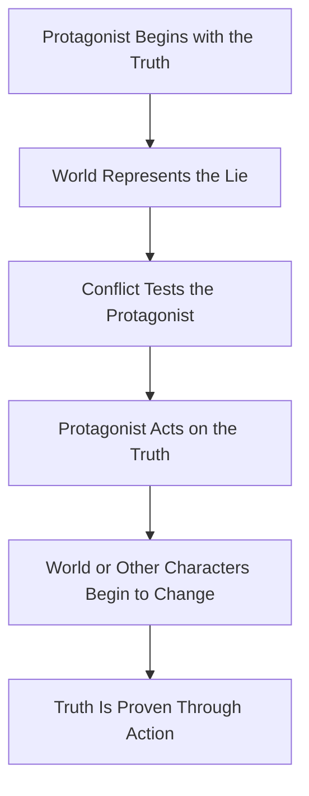
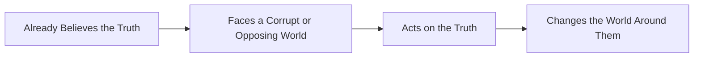
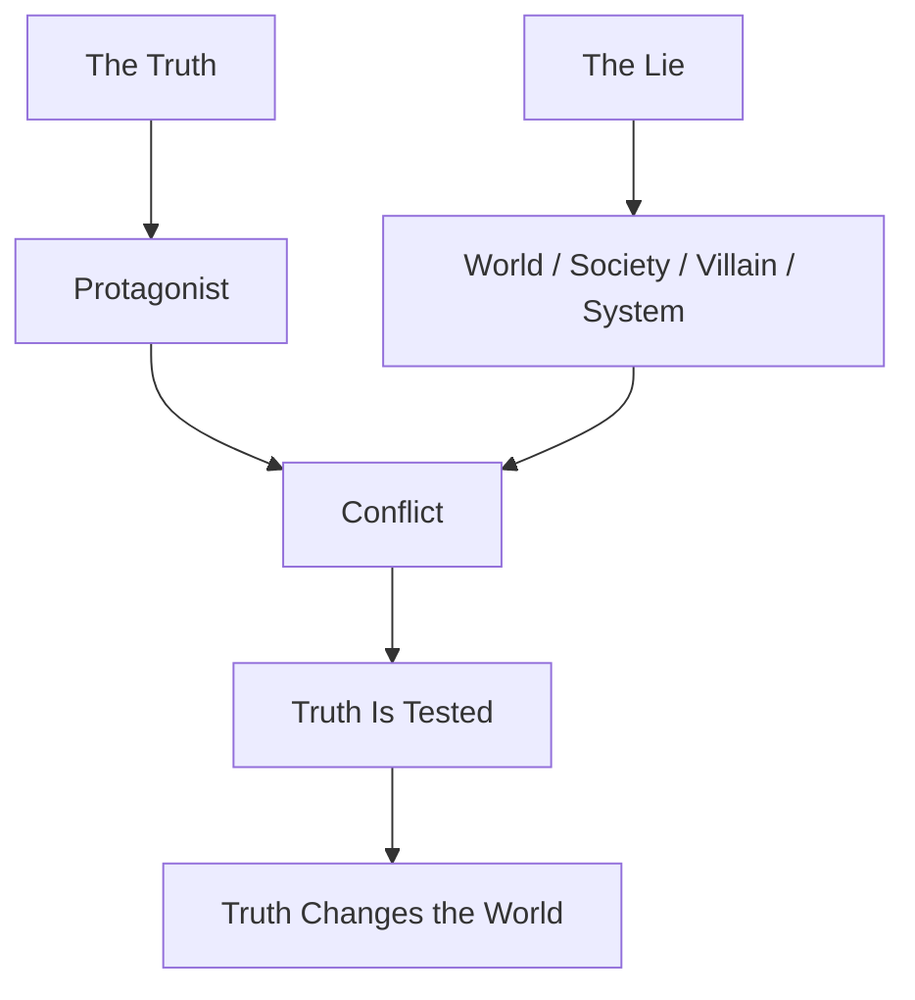
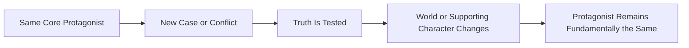
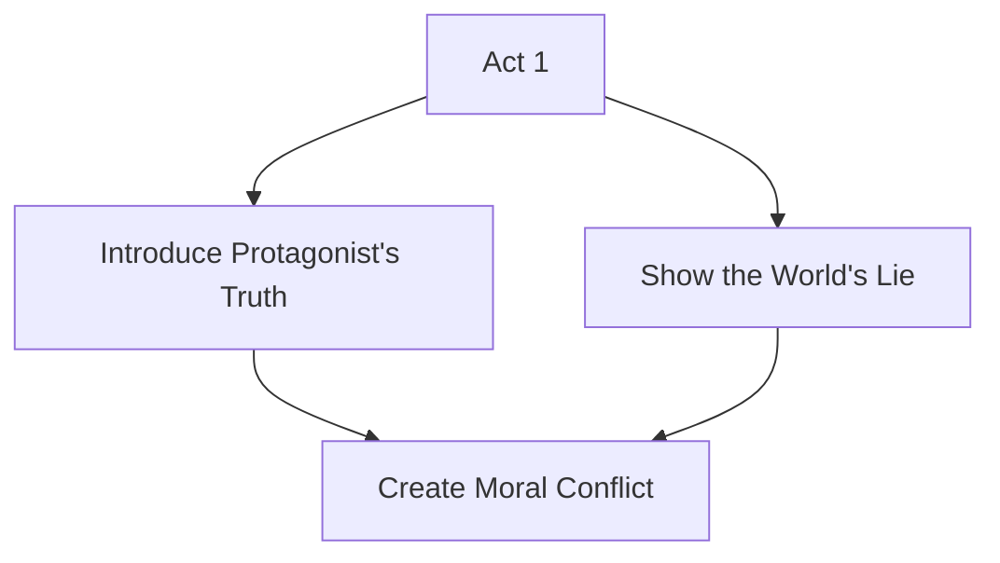
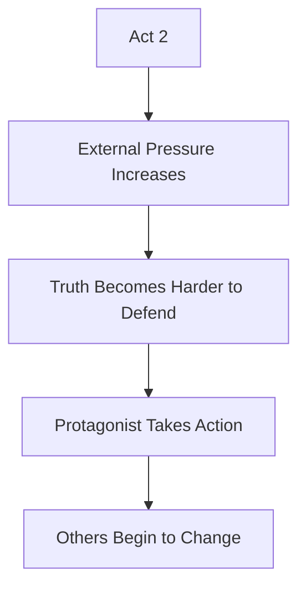
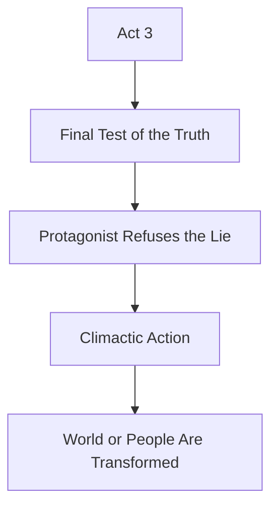
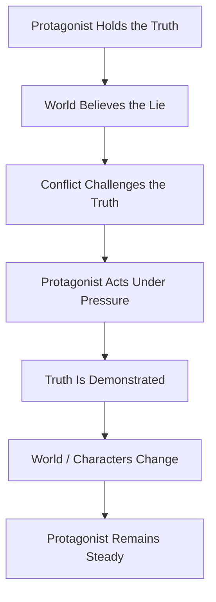

# 018 - The Flat Character Arc

## Section

**02 - The 3 Act Narrative Structure**

## Original Lecture Title

**The Flat Character Arc**

## Duration

**5:10**

---

# 1. Core Idea

A **flat character arc** is a story structure where the protagonist does **not fundamentally change**.

Instead, the protagonist already possesses a **core truth** from the beginning of the story. Their role is to **hold onto that truth** and use it to challenge, transform, or expose the world around them.

In this type of arc, the story is not about the hero becoming a better person. It is about the hero proving, defending, and spreading a truth that the surrounding world has forgotten, denied, or corrupted.

---

# 2. What Is a Flat Character Arc?

In a flat arc, the protagonist usually knows what they need from the start.

They may face conflict, pressure, doubt, danger, or emotional pain, but these forces do not permanently change their core belief. Instead, their belief becomes the force that changes others.

## Simple Definition

> A flat arc protagonist does not change because they already believe the truth.
> The story changes the world around them.

---

# 3. Basic Structure of a Flat Arc



---

# 4. Flat Arc vs Positive Arc

## Positive Character Arc

In a positive arc, the protagonist begins by believing a **lie**. Through the events of the story, they gradually discover the **truth** and become a better version of themselves.


## Flat Character Arc

In a flat arc, the protagonist begins with the **truth**. The world around them believes the **lie**, and the protagonist must resist that lie.



---

# 5. Key Difference

| Character Arc Type | Starting Point                         | Main Conflict             | Ending Result          |
| ------------------ | -------------------------------------- | ------------------------- | ---------------------- |
| Positive Arc       | Protagonist believes a lie             | Must learn the truth      | Protagonist changes    |
| Flat Arc           | Protagonist already believes the truth | Must defend the truth     | World or others change |
| Negative Arc       | Protagonist rejects the truth          | Falls deeper into the lie | Protagonist declines   |

---

# 6. Why a Flat Arc Is Not Boring

A flat arc can sound simple, but it is not the same as a flat or passive story.

The protagonist may not change internally, but they still face powerful external and moral challenges. The tension comes from watching whether they can remain loyal to their truth when the world pressures them to abandon it.

A flat arc works especially well in:

* Mystery stories
* Detective fiction
* Superhero stories
* Serial fiction
* TV series
* Action-adventure stories
* Stories about moral resistance

---

# 7. The Main Risk of a Flat Arc

The biggest danger of a flat character arc is **passivity**.

Because the protagonist already knows the truth, the writer may accidentally make them too stable, too perfect, or too inactive.

To avoid this, the protagonist must still:

* Make active choices
* Face real pressure
* Suffer consequences
* Challenge the world
* Influence other characters
* Prove their belief through action

A flat arc character should not simply “be right.”
They must **act on what is right**.

---

# 8. The Truth vs The Lie

The flat arc is built around a central opposition:



## The Truth

The truth is the belief the protagonist holds from the beginning.

Examples:

* Compassion is stronger than fear.
* Justice is not revenge.
* Family is worth protecting.
* People deserve dignity.
* Corruption must be resisted.
* A society without mercy destroys itself.

## The Lie

The lie is the opposing belief represented by the world, villain, system, or other characters.

Examples:

* Fear is the only way to control people.
* Revenge is justice.
* Power matters more than love.
* Survival requires cruelty.
* People are disposable.
* The weak deserve to suffer.

---

# 9. Examples of Flat Character Arcs

## Katniss Everdeen — *The Hunger Games*

Katniss believes that people should be treated with compassion and dignity.

The world of *The Hunger Games* is built on fear, violence, spectacle, and cruelty. Her truth directly challenges the lie of the Capitol.

| Element            | Example                                                      |
| ------------------ | ------------------------------------------------------------ |
| Truth              | Society should be based on compassion, not fear              |
| Lie                | Power is maintained through violence and spectacle           |
| World              | A cruel government controls people through the Hunger Games  |
| Protagonist’s Role | Katniss resists the system and becomes a symbol of rebellion |

---

## Bruce Wayne — *Batman Begins*

Bruce Wayne’s truth is that justice and revenge are not the same thing.

He must learn to fight crime without becoming consumed by vengeance. The corrupt world of Gotham gives him the perfect setting to prove this truth.

| Element            | Example                                         |
| ------------------ | ----------------------------------------------- |
| Truth              | Justice is about restoring balance              |
| Lie                | Revenge will heal pain                          |
| World              | Gotham is corrupt, violent, and morally broken  |
| Protagonist’s Role | Batman becomes a symbol of justice, not revenge |

---

## Maximus — *Gladiator*

Maximus believes in loyalty, honor, and the preservation of Rome’s ideals.

The world around him is collapsing because of corruption, betrayal, and selfish ambition.

| Element            | Example                                     |
| ------------------ | ------------------------------------------- |
| Truth              | Rome must be protected from corruption      |
| Lie                | Power belongs to whoever can seize it       |
| World              | Rome is crumbling under unworthy leadership |
| Protagonist’s Role | Maximus defends honor in a corrupt empire   |

---

## Gregory House — *House M.D.*

Gregory House does not significantly change from episode to episode.

He is cynical, brilliant, difficult, and emotionally guarded. However, his methods and insight allow him to solve medical mysteries and expose truths others cannot see.

| Element            | Example                                                           |
| ------------------ | ----------------------------------------------------------------- |
| Truth              | The answer exists if one is willing to look deeply enough         |
| Lie                | Surface appearances are enough                                    |
| World              | Patients, colleagues, and systems hide or misunderstand the truth |
| Protagonist’s Role | House solves the puzzle and forces others to confront reality     |

---

# 10. Flat Arc in Serial Fiction

Flat arcs are especially useful in serial storytelling.

In many detective novels, superhero stories, and long-running TV series, the protagonist remains mostly the same. The audience returns not because the character transforms every time, but because they want to see how this stable character responds to new problems.

## Serial Story Pattern



Examples include:

* Sherlock Holmes
* Hercule Poirot
* Batman
* Gregory House
* Inspector Montalbano
* Many superhero protagonists
* Many mystery detectives

---

# 11. How the Flat Arc Works in a 3-Act Structure

## Act 1: Introduce the Truth and the Lie

The protagonist already believes the truth, but the world around them may be controlled by the lie.

The story should establish:

* What the protagonist believes
* What the world believes
* Why these two beliefs are incompatible
* What pressure will test the protagonist



---

## Act 2: Pressure Tests the Truth

The protagonist faces increasingly difficult challenges.

They may be tempted to compromise, give up, stay silent, or accept the lie. However, their role is to keep acting according to the truth.



---

## Act 3: The Truth Is Proven

The final act should place the protagonist’s belief under its greatest test.

The climax should prove that the protagonist’s truth matters. The world may not become perfect, but something or someone should be changed by the protagonist’s devotion to the truth.



---

# 12. The Flat Arc Formula

```text
A protagonist already believes the truth.
The world around them believes the lie.
The story tests the protagonist’s devotion to the truth.
Through action, the protagonist proves the truth.
The world or other characters change as a result.
```

---

# 13. Practical Exercise

If your protagonist has a flat arc, write the scene where their steady belief is most severely tested by outside pressure.

Ask yourself:

* What does the protagonist believe?
* Who or what challenges that belief?
* What would be easier than staying loyal to the truth?
* What would the protagonist lose by staying loyal?
* What action proves their devotion?

---

# 14. Reflection Question

## Main Reflection

What would your world look like if your protagonist’s core belief were proven wrong?

This question helps you understand the stakes of the story. If the protagonist’s truth does not matter, then the conflict will feel weak.

---

# 15. Six Questions for Writing a Flat Arc

Use these questions to design your protagonist’s flat character arc.

## 1. What truth does your protagonist believe from the beginning?

This is the moral, emotional, or philosophical center of the story.

Example:

> “People deserve compassion, even in a cruel world.”

---

## 2. Did they learn this truth from a traumatic or important past event?

A flat arc protagonist may already know the truth because of something they experienced before the story begins.

This backstory can explain why their belief is so strong.

---

## 3. What lie opposes the truth?

The lie should be powerful enough to challenge the protagonist.

Example:

> “Compassion is weakness.”

---

## 4. Does the world support the truth or represent the lie?

Most flat arc stories place the protagonist in a world that contradicts their belief.

This creates conflict between the protagonist and their environment.

---

## 5. Has the protagonist already chosen to fight the lie?

Some protagonists begin the story already committed to fighting the lie.

Others may need an early scene where they choose between:

* What they want
* What they need
* What is comfortable
* What is right

---

## 6. How can you create a scene that proves their complete devotion to the truth?

This should be a major test.

The protagonist should have something real to lose, such as:

* Safety
* Reputation
* Love
* Freedom
* Family
* Status
* Their dream
* Their life

---

# 16. Flat Arc Character Design Template

## Protagonist’s Name

`____________________________`

## Core Truth

`____________________________`

## Opposing Lie

`____________________________`

## World or System That Represents the Lie

`____________________________`

## Backstory Event That Taught the Truth

`____________________________`

## Greatest Test of the Truth

`____________________________`

## Who Changes Because of the Protagonist?

`____________________________`

## Final Proof of the Truth

`____________________________`

---

# 17. Summary

A flat character arc is not about a protagonist who stays the same because nothing happens.

It is about a protagonist who stays faithful to the truth while the world around them pressures them to abandon it.

The protagonist may not transform internally, but their actions transform the story world.

## Core Takeaway

> In a flat arc, the hero does not change because the hero already carries the truth.
> The real transformation happens in the world around them.

---

# 18. Final Diagram



---

# Bài luyện tập

## Mục tiêu


## Đề bài


## Yêu cầu hoàn thành

- [ ] 
- [ ] 
- [ ] 

## Kết quả / lời giải


## Ghi chú
