# 019 - The Negative Character Arc

## Section

**02 - The 3 Act Narrative Structure**

## Original Lecture Title

**The Negative Character Arc**

## Duration

**5:26**

---

# 1. Core Idea

A **negative character arc** is the story of a character’s fall.

Instead of overcoming their flaw, lie, fear, or destructive desire, the protagonist gives in to it. They move further away from the truth and end the story in a worse moral, emotional, or spiritual condition than where they began.

A negative arc can be tragic, bitter, painful, or cautionary, but it can also be deeply powerful because it shows what happens when a character repeatedly chooses the wrong path.

---

# 2. Simple Definition

> A negative character arc shows a protagonist who rejects the truth, follows the lie, and becomes worse because of their choices.

The character does not simply “become bad” suddenly. Their fall must be built step by step through choices that feel understandable, believable, and inevitable in hindsight.

---

# 3. Basic Negative Arc Structure

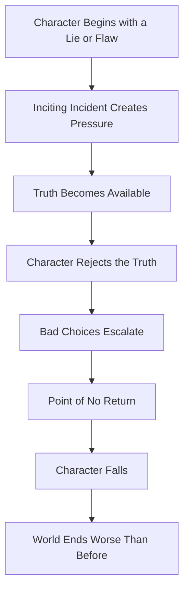

---

# 4. Negative Arc vs Positive Arc

## Positive Character Arc

In a positive arc, the protagonist begins by believing a lie, but eventually discovers the truth and changes for the better.

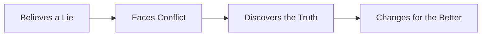

## Negative Character Arc

In a negative arc, the protagonist is also confronted with the truth, but chooses to reject it.

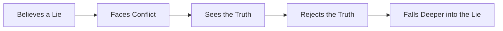

---

# 5. Key Difference

| Character Arc Type | Starting Point                       | Main Choice       | Ending Result     |
| ------------------ | ------------------------------------ | ----------------- | ----------------- |
| Positive Arc       | Character believes a lie             | Accepts the truth | Becomes better    |
| Flat Arc           | Character already believes the truth | Defends the truth | Changes the world |
| Negative Arc       | Character believes or chooses a lie  | Rejects the truth | Becomes worse     |

---

# 6. Why Negative Arcs Are Powerful

Everyone enjoys a happy ending, but not every story needs one.

A tragic or negative ending can leave a stronger emotional impact because it shows the cost of:

* Refusing to change
* Choosing desire over truth
* Letting fear control decisions
* Pursuing power at any cost
* Mistaking illusion for happiness
* Rejecting love, responsibility, or morality

A negative arc often feels like a warning.

It tells the reader:

> “This is what happens when the lie wins.”

---

# 7. The Midpoint in a Negative Arc

In a positive arc, the midpoint often gives the protagonist a major revelation that moves them closer to the truth.

In a negative arc, the midpoint also brings a revelation, but the protagonist responds differently.

Instead of accepting the truth, they reject it, twist it, deny it, or use it to justify worse behavior.

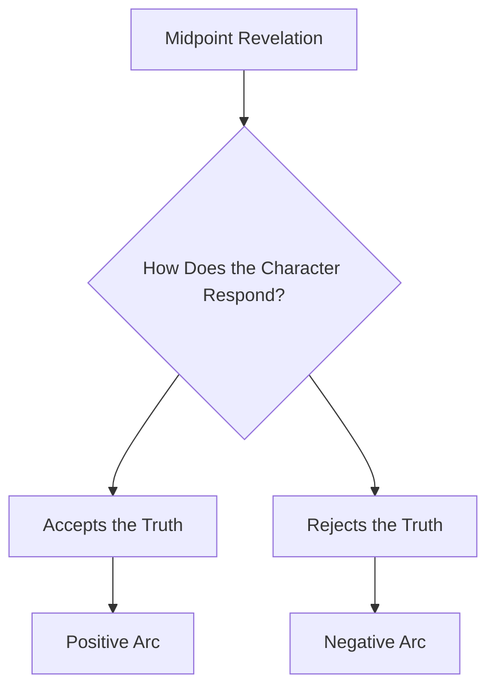

---

# 8. The Core Movement of a Negative Arc

```text id="qazb47"
The character is offered the truth.
The character chooses the lie.
The lie gives short-term power, comfort, or escape.
Each choice makes the truth harder to accept.
Eventually, the fall becomes irreversible.
```

---

# 9. Three Major Types of Negative Character Arcs

There are three common variations of the negative character arc:

1. **The Disillusionment Arc**
2. **The Fall Arc**
3. **The Corruption Arc**

Each one shows a different kind of decline.

---

# 10. Type 1: The Disillusionment Arc

## Definition

In a **disillusionment arc**, the protagonist begins with a relatively innocent, hopeful, or idealistic belief. They search for the truth, and they may even become wiser.

However, the truth they discover is darker, uglier, or more painful than the lie they once believed.

The character does not necessarily become evil, but they lose their innocence.

---

## Structure

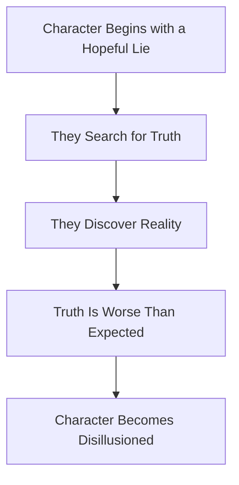

---

## Example: *The Great Gatsby*

Nick begins with the belief that wealth, beauty, and high society are connected to happiness and excitement.

At first, the world of New York seems glamorous. However, as the story progresses, Nick sees the emptiness, selfishness, and moral carelessness behind that beauty.

The peak of his disillusionment comes after Gatsby’s death, when the people who once enjoyed his parties do not come to mourn him.

| Element          | Example                                                   |
| ---------------- | --------------------------------------------------------- |
| Starting Lie     | Beauty and wealth lead to happiness                       |
| Truth Discovered | High society is morally empty and careless                |
| Key Tragedy      | Gatsby dies, and almost no one truly honors him           |
| Result           | Nick becomes disillusioned with the world he once admired |

---

# 11. Type 2: The Fall Arc

## Definition

In a **fall arc**, the protagonist begins already struggling with a lie, flaw, or inner conflict.

Instead of overcoming it, they believe the lie more deeply as the story progresses. Their choices pull them downward, and often they drag other people down with them.

This is one of the most common tragic structures.

---

## Structure

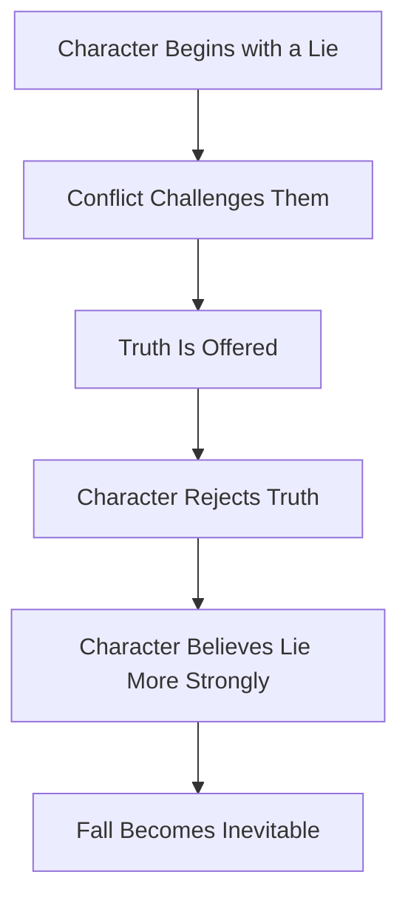

---

## Example: *The Bridges of Madison County*

Francesca experiences a powerful love with Robert, a freelance photographer, while her husband and children are away.

She has the chance to leave her ordinary life and begin again with someone who makes her feel alive and seen.

However, after a long inner struggle, she chooses the lie:

> True love cannot really survive, especially when it comes too late.

| Element           | Example                                                        |
| ----------------- | -------------------------------------------------------------- |
| Starting Conflict | Francesca feels trapped between duty and desire                |
| Truth             | Love and emotional fulfillment are possible                    |
| Lie               | True love cannot win after life choices have already been made |
| Final Choice      | She stays in her normal world                                  |
| Result            | Her emotional fall is quiet, painful, and tragic               |

---

# 12. Type 3: The Corruption Arc

## Definition

In a **corruption arc**, the protagonist begins in a relatively positive or stable world.

They may already have what they need to live well or resolve their conflict. However, they reject the truth and choose a new lie that gradually corrupts them.

This arc is dynamic because the audience watches the full transformation from ordinary person to morally fallen person.

---

## Structure

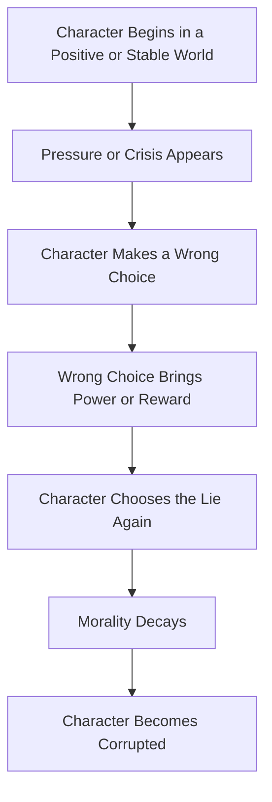

---

## Example: *Breaking Bad*

Walter White begins as a science teacher with a family and an honest life.

When he discovers he has late-stage lung cancer, he starts selling methamphetamine with Jesse Pinkman. At first, his motivation appears understandable: he wants money for treatment and financial security for his family.

But as the story continues, Walter becomes addicted to power, control, pride, and criminal success. He loses his moral center and becomes increasingly ruthless.

| Element            | Example                                              |
| ------------------ | ---------------------------------------------------- |
| Starting World     | Family, work, ordinary life                          |
| Crisis             | Lung cancer diagnosis                                |
| Initial Motivation | Provide money for treatment and family               |
| Lie                | Power and control will restore his dignity           |
| Corruption         | Drug dealing, violence, manipulation, murder         |
| Result             | Walter destroys his world and becomes morally ruined |

---

# 13. Comparison of the Three Negative Arcs

| Negative Arc Type   | Starting Point                              | Movement                            | Ending             |
| ------------------- | ------------------------------------------- | ----------------------------------- | ------------------ |
| Disillusionment Arc | Character believes a hopeful lie            | Discovers a painful truth           | Loses innocence    |
| Fall Arc            | Character already struggles with a lie      | Chooses the lie more deeply         | Falls into tragedy |
| Corruption Arc      | Character starts in a relatively good place | Rejects truth and creates a new lie | Becomes corrupted  |

---

# 14. Negative Arc and the 3-Act Structure

## Act 1: The Lie Is Established

The protagonist begins with a flaw, false belief, wound, or desire.

The story should establish:

* What the character wants
* What the character actually needs
* What lie they believe
* What truth they are avoiding
* What weakness may lead to their downfall

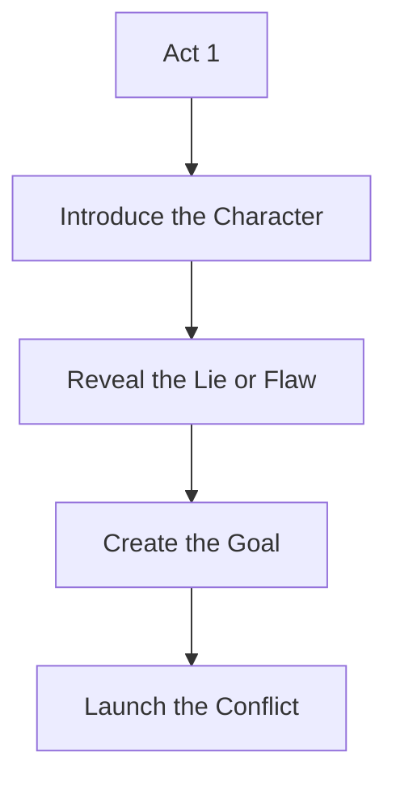

---

## Act 2: The Character Chooses the Lie

The protagonist faces pressure and opportunities to change.

The truth appears, but the character rejects it. Each choice leads them further away from redemption.

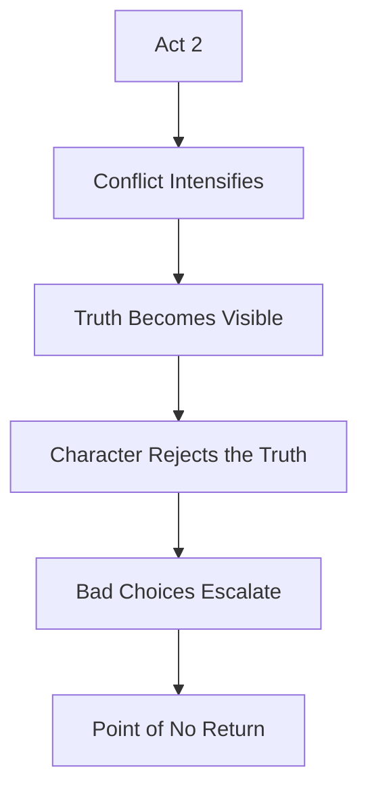

---

## Act 3: The Fall Is Completed

The protagonist reaches the final consequence of their choices.

The ending may be tragic, bitter, ironic, or morally devastating. The world is often worse than it was at the beginning.

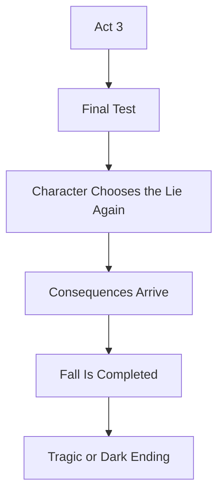

---

# 15. The Point of No Return

A strong negative arc usually has a moment where the character’s fall becomes irreversible.

This may happen when the character:

* Betrays someone who trusted them
* Commits a serious moral violation
* Rejects the truth knowingly
* Chooses power over love
* Sacrifices innocence for ambition
* Silences their conscience
* Hurts others to protect their lie

The point of no return should not feel random. It should feel like the natural result of earlier choices.

---

# 16. Escalating Choices

A negative arc is built through escalation.

The character should not collapse all at once. Instead, they make a series of choices that gradually pull them deeper into the lie.

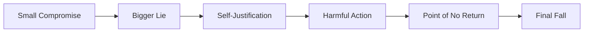

---

# 17. Practical Exercise

If your protagonist has a negative arc, map the three choices that lead them progressively deeper into their flaw.

## Choice 1: The First Compromise

What small wrong choice does the character make?

`____________________________`

## Choice 2: The Deeper Commitment

What choice shows that the character is beginning to believe the lie more strongly?

`____________________________`

## Choice 3: The Irreversible Choice

What choice makes the fall impossible to fully undo?

`____________________________`

---

# 18. Reflection Question

## Main Reflection

At what point does your character’s fall become irreversible, and do readers see it coming?

A good negative arc should surprise the reader emotionally, but it should also feel inevitable when they look back.

The reader should think:

> “I hoped they would choose differently, but I understand why they didn’t.”

---

# 19. Five Questions for Writing a Negative Arc

Use these questions to design your protagonist’s fall.

---

## 1. What is the lie your character chooses to follow?

This lie is the false belief that drives the negative arc.

Examples:

* Power will make me safe.
* Love is weakness.
* I deserve more than everyone else.
* Revenge will heal me.
* The rules do not apply to me.
* If I control everything, I cannot be hurt.

---

## 2. How does the lie manifest throughout the story?

The lie should appear in the character’s:

* Decisions
* Relationships
* Dialogue
* Fears
* Goals
* Reactions under pressure

The more pressure they face, the more strongly the lie should influence their behavior.

---

## 3. Is there a traumatic event that generated the negative arc?

A painful past event can explain why the character is vulnerable to the lie.

This does not excuse their actions, but it helps readers understand them.

Possible causes include:

* Betrayal
* Loss
* Humiliation
* Rejection
* Poverty
* Abuse of power
* Failure
* Fear of abandonment

---

## 4. What does the character need, and what do they want instead?

The gap between **want** and **need** is central to the arc.

| Element | Meaning                                                  |
| ------- | -------------------------------------------------------- |
| Want    | The external thing the character pursues                 |
| Need    | The truth that would actually heal or save them          |
| Lie     | The false belief that keeps them chasing the wrong thing |

Example:

| Want  | Need                         | Lie                              |
| ----- | ---------------------------- | -------------------------------- |
| Power | Vulnerability and connection | Power is the only way to be safe |

---

## 5. Why does the character deliberately choose not to follow the truth?

The character must have a reason for rejecting the truth.

They may reject it because:

* It is painful
* It requires sacrifice
* It threatens their identity
* It forces them to admit guilt
* It asks them to give up power
* It demands vulnerability
* It means forgiving someone
* It means facing the consequences of their actions

---

# 20. Negative Arc Character Design Template

## Protagonist’s Name

`____________________________`

## Starting Lie

`____________________________`

## Hidden Truth

`____________________________`

## What the Character Wants

`____________________________`

## What the Character Needs

`____________________________`

## Wound or Past Trauma

`____________________________`

## First Wrong Choice

`____________________________`

## Midpoint Rejection of the Truth

`____________________________`

## Point of No Return

`____________________________`

## Final Consequence

`____________________________`

---

# 21. Full Negative Arc Diagram

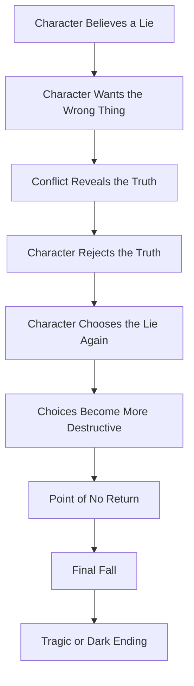

---

# 22. Summary

A negative character arc is not simply a sad ending.

It is a carefully built transformation in which the protagonist moves away from truth and deeper into the lie.

The fall must be earned through repeated choices. The reader should understand why the character falls, even if they do not approve of what the character becomes.

## Core Takeaway

> In a negative arc, the protagonist is offered the truth but chooses the lie.
> The tragedy comes from watching that choice destroy them.
