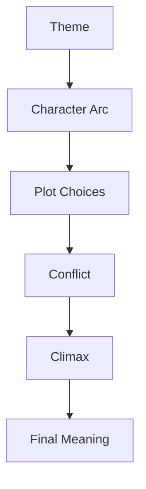
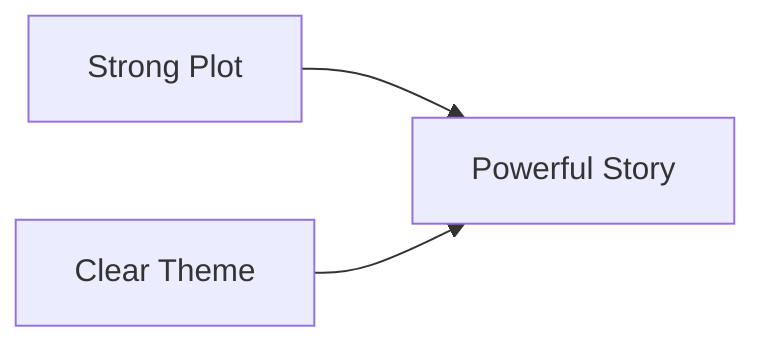
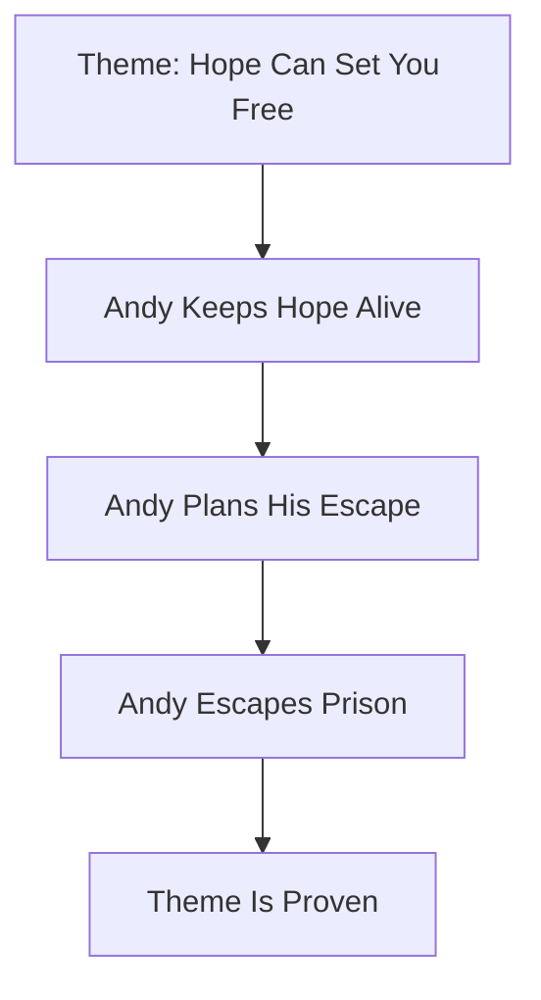
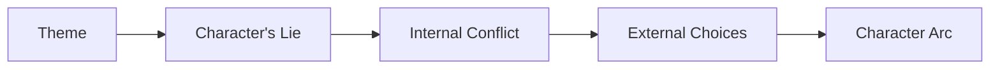
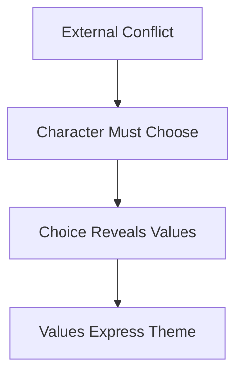
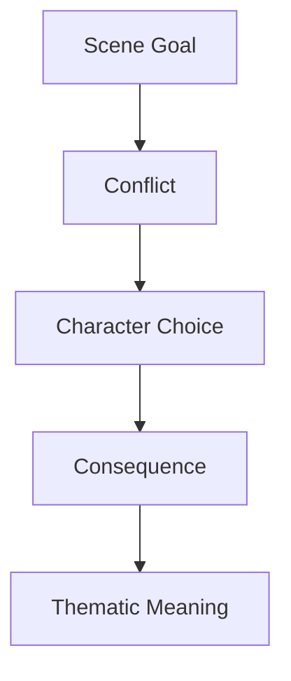
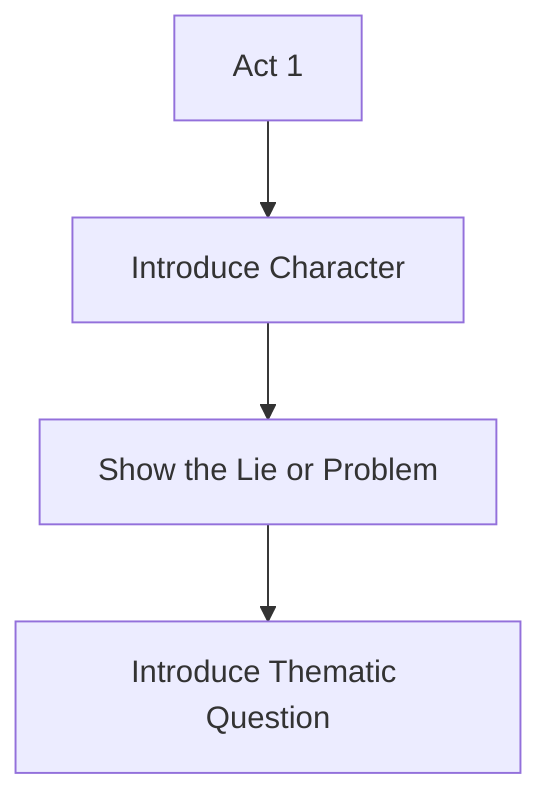
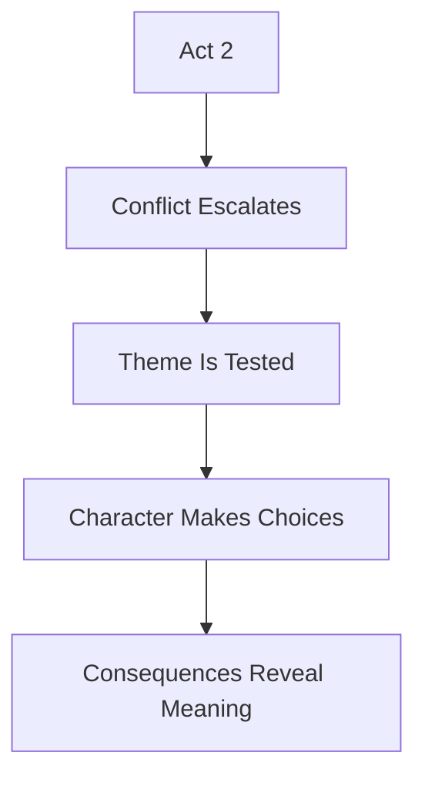
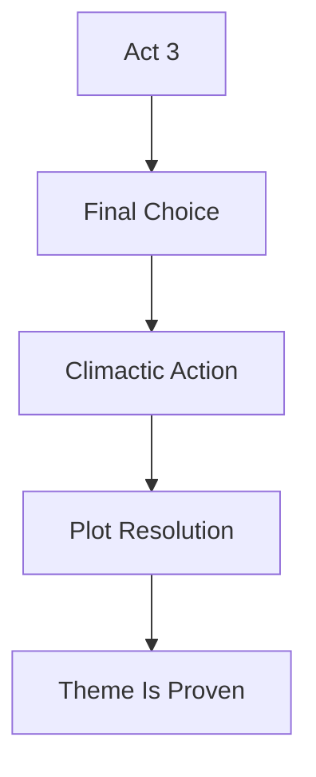
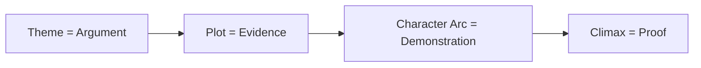

# 020 - Theme and Plot

## Section

**02 - The 3 Act Narrative Structure**

## Original Lecture Title

**Theme and Plot**

## Duration

**4:29**

---

# 1. Core Idea

**Plot** and **theme** are connected, but they are not the same thing.

The **plot** is what happens in the story.

The **theme** is what those events mean.

A strong story uses plot events to dramatize its theme. The events should not feel random or purely mechanical. They should prove, challenge, or explore the deeper idea behind the story.

---

# 2. Simple Definition

## Plot

> Plot is the sequence of external events that happen in the story.

Examples:

* A man and a woman meet in a park and argue.
* A hero saves a princess.
* A prisoner escapes from prison.
* A young woman and a rich man fall in love.

## Theme

> Theme is the deeper moral, emotional, or philosophical meaning behind those events.

Examples:

* Love requires overcoming pride and prejudice.
* Hope can set a person free.
* Belonging can be built through shared values, not just origin.
* Fear can trap people more deeply than physical walls.

---

# 3. Plot vs Theme

| Element       | Plot                    | Theme                                  |
| ------------- | ----------------------- | -------------------------------------- |
| Main Question | What happens?           | What does it mean?                     |
| Level         | External                | Internal / moral / abstract            |
| Focus         | Events and actions      | Meaning and message                    |
| Example       | A man betrays a woman   | Trust can be broken by love and desire |
| Function      | Moves the story forward | Gives the story depth                  |

---

# 4. Basic Relationship Between Theme and Plot

The theme should guide the plot.

The plot should prove the theme.

If the plot and theme do not support each other, the story may feel disconnected.

---

# 5. Why Theme Matters

A story can have a clear plot but still feel empty.

This happens when events occur without a deeper purpose. The reader may understand what happened, but they may not feel why it mattered.

A story can also have a strong theme but weak structure. In that case, the story may feel unfocused, preachy, or abstract.

A great story needs both:

---

# 6. The Danger of Confusing Plot and Theme

If you confuse plot with theme, you may create scenes only because they are exciting, dramatic, or logical on the surface.

But you may forget to ask:

> What message do these events communicate?

The theme should help you decide:

* Which scenes belong in the story
* Which conflicts matter most
* How the protagonist should change
* What the climax should prove
* What emotional meaning the ending should leave behind

---

# 7. Example: *Pride and Prejudice*

## Plot Summary

A young woman and a rich man fall in love.

## Theme

Love becomes possible only after both characters overcome pride, prejudice, and false judgment.

| Element          | Example                                                          |
| ---------------- | ---------------------------------------------------------------- |
| Plot             | Elizabeth Bennet and Mr. Darcy fall in love                      |
| Theme            | Love requires humility, self-awareness, and overcoming prejudice |
| Character Arc    | Both characters must revise their assumptions                    |
| Title Connection | The theme is directly reflected in the title                     |

The plot tells us what happens.

The theme tells us why the story matters.

---

# 8. Example: *The Shawshank Redemption*

The climax of *The Shawshank Redemption* is Andy’s escape from prison.

But this is not just a plot event.

It is the final proof of the story’s theme:

> Fear can hold you prisoner. Hope can set you free.

If Andy failed to escape, the problem would not only be that he remained in prison. The deeper problem would be that the plot would contradict the theme.

---

# 9. Theme Should Shape the Character Arc

The character arc is one of the main ways a theme becomes visible.

If your theme is about courage, your protagonist should be forced to face fear.

If your theme is about trust, your protagonist should face betrayal, suspicion, or vulnerability.

If your theme is about freedom, your protagonist should face imprisonment, control, or limitation.

---

# 10. Four Questions for Connecting Theme and Plot

## Question 1: Does the plot help develop the character arc?

The theme should be showcased through the protagonist’s transformation.

The events of the plot should force the character to confront the central idea of the story.

Ask:

* Does each major plot point challenge the protagonist’s belief?
* Does the protagonist’s arc strengthen the theme?
* Does the climax prove the theme?
* Would the ending contradict the theme if it changed?

---

## Question 2: Do the external conflicts have deeper meaning?

The conflicts in the plot should mean more than just “something bad happens.”

They should raise the story’s central question again and again.

For example, in *Avatar*, the story asks whether belonging can go beyond race, origin, and physical identity. Every obstacle challenges that question.

A good external conflict should also be a thematic conflict.

---

## Question 3: Do external changes reflect internal changes?

In strong stories, the outer journey and inner journey mirror each other.

The protagonist’s external obstacles should reflect their internal struggle.

For example, in *Five Flights Up*, the sick dog becomes a reflection of the protagonists’ own fear, uncertainty, and emotional confinement. The dog is trapped in a cage, unable to walk, just as the protagonists feel trapped by the decision of whether to leave the home where they have lived for decades.

| External Situation           | Internal Meaning                                  |
| ---------------------------- | ------------------------------------------------- |
| A sick dog trapped in a cage | The protagonists feel trapped by change           |
| The dog cannot walk          | The protagonists struggle to move forward         |
| The dog is away from home    | The protagonists fear losing their home           |
| Surgery creates uncertainty  | Their life decision creates emotional uncertainty |

The external plot becomes a mirror of the inner conflict.

---

## Question 4: Is the theme represented in every scene?

Theme should not appear only at the end.

It should quietly guide the construction of every scene.

This does not mean every scene must explain the theme directly. In fact, that would feel heavy-handed.

Instead, each scene should connect to the theme through:

* Conflict
* Choice
* Symbol
* Dialogue
* Consequence
* Character behavior
* Emotional contrast

---

# 11. How Theme Works Inside a Scene

A scene becomes thematically strong when the character’s choice reveals something about the story’s deeper argument.

---

# 12. Theme and the 3-Act Structure

## Act 1: Introduce the Thematic Question

Act 1 should establish the protagonist’s world, desire, flaw, and central conflict.

The theme usually appears as a question.

Examples:

* Can hope survive in a place built on fear?
* Can love overcome pride?
* Can belonging exist beyond race or origin?
* Can people change after years of regret?

---

## Act 2: Test the Theme Through Conflict

Act 2 should repeatedly test the theme.

The protagonist should face obstacles that force them to choose between the lie and the truth.

---

## Act 3: Prove the Theme

Act 3 should embody the theme through action.

The climax should not only resolve the plot. It should prove the story’s deeper idea.

---

# 13. Theme as the Story’s Argument

A story’s theme can be understood as an argument.

The plot is the evidence.

The character arc is the demonstration.

The climax is the final proof.

Example:

| Theme Argument             | Plot Evidence                           |
| -------------------------- | --------------------------------------- |
| Hope can set you free      | Andy survives prison through hope       |
| Pride blocks love          | Elizabeth and Darcy misjudge each other |
| Power corrupts             | Walter White becomes morally ruined     |
| Compassion resists cruelty | Katniss challenges the Capitol          |

---

# 14. Practical Exercise

Match each act of your story to the part of your theme statement it is meant to prove.

## Theme Statement

`____________________________`

## Act 1: The Theme Is Introduced

What question, lie, or problem introduces the theme?

`____________________________`

## Act 2: The Theme Is Tested

What conflicts force the protagonist to confront the theme?

`____________________________`

## Act 3: The Theme Is Proven or Broken

How does the climax embody, prove, or contradict the theme?

`____________________________`

---

# 15. Reflection Question

## Main Reflection

Is there a structural beat in your outline that currently works against your theme rather than for it?

A scene may work on the plot level but fail on the thematic level.

Ask yourself:

* Does this scene support the story’s deeper idea?
* Does this event challenge the protagonist in a meaningful way?
* Does the climax prove the theme?
* Does the ending emotionally match the message?
* Is there any scene that exists only because it is exciting, convenient, or dramatic?

---

# 16. Theme and Plot Checklist

Use this checklist when reviewing your outline.

## Plot-Level Questions

* What happens in the story?
* What does the protagonist want?
* What obstacles block the protagonist?
* What choices move the plot forward?
* What changes by the end?

## Theme-Level Questions

* What is the story really about?
* What truth is the story trying to explore?
* What lie does the story challenge?
* What does the protagonist learn, prove, or fail to understand?
* What does the ending say about life, love, power, fear, hope, or identity?

---

# 17. Theme-to-Plot Design Template

## One-Line Theme

`____________________________`

## The Lie Opposing the Theme

`____________________________`

## Protagonist’s Starting Belief

`____________________________`

## Protagonist’s Want

`____________________________`

## Protagonist’s Need

`____________________________`

## Act 1 Thematic Setup

`____________________________`

## Act 2 Thematic Tests

`____________________________`

## Act 3 Thematic Proof

`____________________________`

## Final Image or Final Line

`____________________________`

---

# 18. Summary

Plot and theme are both about the story, but they operate on different levels.

The plot describes the external events.

The theme expresses the deeper meaning behind those events.

A strong story does not add theme at the end. It uses theme as a guide from the beginning, allowing every major event, conflict, choice, and consequence to support the story’s central idea.

## Core Takeaway

> Plot is what happens.
> Theme is what it means.
> A powerful story uses plot to prove theme.
