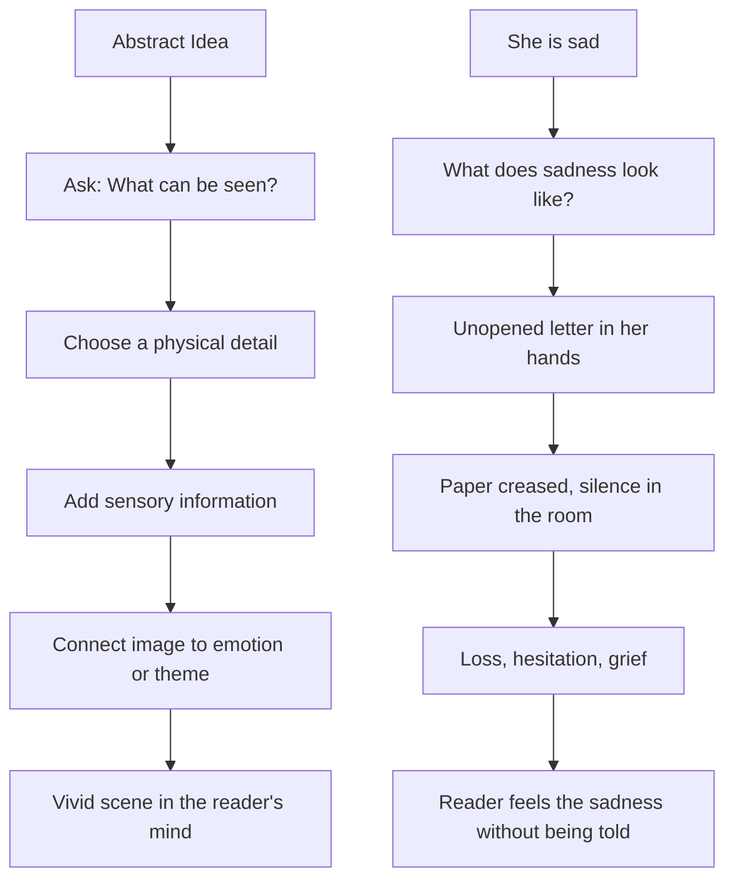

# 001 — Don’t Just Write Words, Write Images

## Module

**03 — Show, Don’t Tell**

## Original Lecture Title

**Đừng chỉ viết từ, hãy viết hình ảnh**

## Duration

**4:45**

---

## 1. Core Idea

When readers open a book, their eyes only see **words on a page**.

But what they remember is rarely the printed text itself.
They remember the **images** those words created in their minds.

A powerful writer does not simply explain what happens.
A powerful writer helps the reader **see**, **feel**, and **experience** the scene.

> Writing turns the reader into a movie director.

Every reader silently transforms words into mental images.
Because of that, the writer’s job is to use language in a way that creates vivid, lasting pictures.

---

## 2. Why Images Matter in Fiction

Abstract writing tells the reader what to think.

Visual writing lets the reader experience the moment directly.

| Telling                   | Showing Through Image                                                                    |
| ------------------------- | ---------------------------------------------------------------------------------------- |
| She was sad.              | She folded the letter twice, then pressed it against her chest without opening it again. |
| He was nervous.           | His fingers kept tapping the edge of the glass, faster each time the door opened.        |
| The room was frightening. | The wallpaper peeled in strips, and something scratched softly behind the wall.          |
| She felt lonely.          | Her phone lit up only to show the time: 2:13 a.m.                                        |

The second version is stronger because it gives the reader something to **see**.

---

## 3. Main Lesson

To create memorable prose, do not only write concepts.

Write:

* concrete details
* physical gestures
* sensory impressions
* symbolic objects
* images that imply emotion

Instead of naming the emotion directly, choose an image that allows the reader to discover it.

---

## 4. Four Ways to Write Images That Stay in the Reader’s Mind

### 4.1 Recall the Visceral Sensations of Other Books

The first step is to become aware of what affects you as a reader.

Choose a book you love and revisit the passages that moved you.

Ask yourself:

* What images appear in my mind while I read this?
* Which words create an immediate emotional reaction?
* Which sentences make me smile, feel discomfort, or feel sadness?
* Which passages leave no emotional effect?
* Why do some images stay with me while others disappear?

Learning to recognize this experience as a reader will help you recreate it as a writer.

---

### 4.2 Exercise Your Creativity

Thinking in images is a skill.
It must be trained.

Modern life is often full of routine, stress, and distraction, so the imagination needs deliberate practice.

You can train your visual imagination almost anywhere:

* at the office
* at a gas station
* during a trip
* during dinner
* while walking outside
* while sitting in a waiting room

Observe your surroundings carefully.

Then ask:

> How would I describe this place if it appeared in a novel?

Try to collect images, not just facts.

For example:

| Ordinary Observation     | Writer’s Observation                                                                |
| ------------------------ | ----------------------------------------------------------------------------------- |
| There is a man waiting.  | A man in a gray coat checks his watch every few seconds, though no one is coming.   |
| The restaurant is noisy. | Forks strike plates, glasses clink, and laughter rises like steam from every table. |
| It is raining.           | Rain gathers at the window until the whole street looks like it is melting.         |

---

### 4.3 Use Symbolism in Images

Some images stay with us because they suggest something deeper than their literal meaning.

A simple object can carry emotional or thematic weight.

Examples:

| Image            | Possible Symbolic Meaning                   |
| ---------------- | ------------------------------------------- |
| Dawn             | A new beginning, rebirth, hope              |
| A mirror         | Identity, self-awareness, inner conflict    |
| A locked door    | Fear, secrecy, emotional distance           |
| A broken watch   | Lost time, regret, unfinished business      |
| An empty chair   | Absence, grief, waiting                     |
| A burning letter | Rejection, release, destruction of the past |

Symbolic images are powerful because they allow the story to communicate meaning without explaining everything directly.

A good writer notices when a scene, object, or gesture may represent something larger than itself.

---

### 4.4 Learn How to Show a Scene

One of the strongest ways to write through images is to place the reader directly inside the scene.

This is the foundation of:

> **Show, Don’t Tell**

Instead of explaining the scene from a distance, make the reader feel present.

Use details that a person inside the scene could notice:

* what they see
* what they hear
* what they smell
* what they touch
* how bodies move
* what objects are present
* what small changes reveal emotion

---

## 5. Diagram — From Abstract Idea to Vivid Image



---

## 6. Practical Exercise

Take one abstract sentence from your draft and rewrite it as a concrete image.

### Example

#### Abstract Version

> He was nervous.

#### Image-Based Version

> He rubbed his thumb over the same scratch on the table until the skin turned red.

### Your Turn

Choose one sentence from your story, such as:

* She was angry.
* He felt afraid.
* The house was lonely.
* The child was excited.
* The old man was tired.

Then rewrite it using only observable details.

---

## 7. Writing Practice Template

Use this template when revising a telling sentence:

```markdown
## Original Sentence

[Write the abstract sentence here.]

## Emotion or Idea

[What is the sentence trying to communicate?]

## Observable Details

- What does the character do?
- What object is nearby?
- What sound, smell, or texture is present?
- What small physical detail reveals the emotion?

## Rewritten Image-Based Version

[Rewrite the sentence as a concrete image.]
```

---

## 8. Reflection Questions

1. Which sentence in your current draft tells an emotion that could be shown through a physical detail?

2. What image from your story’s key scene appears most clearly in your mind?

3. Is there an object in your scene that could carry symbolic meaning?

4. Which sensory detail would make the scene more vivid?

5. If this scene were a movie, what would the camera focus on first?

---

## 9. Application to Your Novel

Think about one pivotal scene in your story.

It may be:

* the death of a character
* the moment the protagonist approaches their goal
* the first meeting with the antagonist
* a betrayal
* a confession
* a discovery
* a final goodbye

Close your eyes and imagine the scene.

Do not begin with explanation.
Begin with images.

Ask yourself:

* What do I see first?
* What is the strongest visual detail?
* What object stands out?
* What is the character doing physically?
* What sound belongs in this scene?
* What image best captures the emotional meaning of the moment?

The clearer the image is in your mind, the easier it becomes to write it vividly.

---

## 10. Key Takeaways

* Readers remember images more than explanations.
* Strong prose creates a mental movie.
* Abstract emotions become powerful when expressed through concrete details.
* Symbolic images can carry theme without direct explanation.
* “Show, Don’t Tell” begins with learning how to see the scene clearly.
* Before writing an important scene, picture it first.

---

## 11. Short Summary

This lesson introduces the foundation of **Show, Don’t Tell**: writing in images.

Instead of simply naming emotions or ideas, the writer should create concrete sensory details that allow the reader to experience the scene. By studying powerful passages, observing the real world, using symbolism, and placing the reader inside the scene, writers can create prose that stays in the reader’s memory.

The goal is not just to write words.

The goal is to write images.

---

# Bài luyện tập

## Mục tiêu


## Đề bài


## Yêu cầu hoàn thành

- [ ] 
- [ ] 
- [ ] 

## Kết quả / lời giải


## Ghi chú
