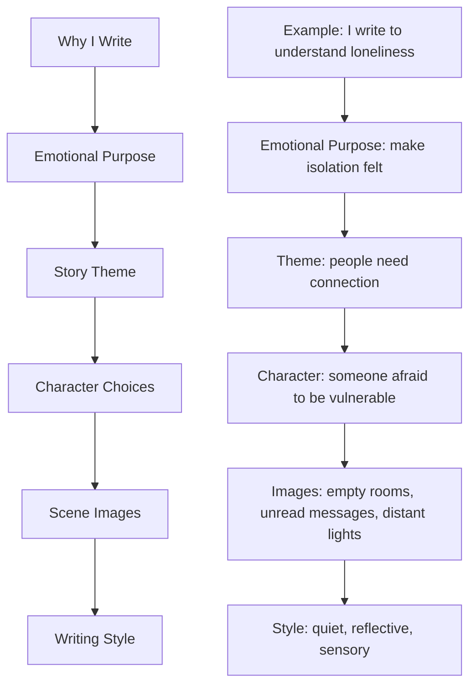

# 002 — Why I Write

## Module

**03 — Show, Don’t Tell**

## Original Lecture Title

**Vì sao tôi viết?**

## Duration

**Not listed**
Writing exercise / discussion segment

---

## 1. Core Idea

Before improving your prose, you need to understand why you write.

A writer’s **motivation** shapes every craft choice:

* what kind of stories they choose
* what emotions they focus on
* what style they develop
* what themes they return to
* how they survive revision, failure, and doubt

Writing is not only about technique.
It is also about knowing what your technique is meant to serve.

> If you know why you write, you will understand what kind of truth your story is trying to carry.

---

## 2. Why This Lesson Matters

Many writers begin with excitement, but later struggle when the work becomes difficult.

Common problems include:

* losing motivation during revision
* doubting whether the story matters
* comparing your style to other writers
* feeling unsure about your voice
* forgetting the emotional reason the story began

This lesson asks you to reconnect with your personal reason for writing.

Your “why” becomes a source of direction.

---

## 3. Connection to “Show, Don’t Tell”

This lesson belongs to the **Show, Don’t Tell** module because your reason for writing affects how you show the world.

For example:

| Your Reason for Writing | Possible Craft Focus                              |
| ----------------------- | ------------------------------------------------- |
| To explore grief        | quiet gestures, silence, memory, symbolic objects |
| To entertain readers    | pacing, suspense, humor, vivid action             |
| To express loneliness   | atmosphere, interiority, empty spaces             |
| To understand people    | complex characters, contradictions, dialogue      |
| To challenge society    | conflict, irony, theme, moral tension             |
| To preserve memory      | sensory detail, nostalgia, specific images        |

Your motivation influences your images.

A writer who writes to explore loss may notice abandoned rooms.
A writer who writes to celebrate life may notice light, movement, and color.

---

## 4. Key Points

### 4.1 Your Motivation Clarifies Your Craft

Knowing why you write helps you decide what your prose should do.

Should it be:

* lyrical?
* simple?
* intense?
* cinematic?
* humorous?
* reflective?
* dark?
* emotional?
* symbolic?

Your style should not exist only to sound beautiful.
It should serve the emotional purpose of the story.

---

### 4.2 Motivation Helps You Continue

Writing a novel is long and tiring.

There will be moments when:

* the first draft feels weak
* the story loses energy
* revision becomes boring
* feedback hurts
* you question your ability

Writers who know their “why” are more likely to continue.

> Motivation does not remove difficulty, but it gives difficulty a reason.

---

### 4.3 Your “Why” Connects Personal Theme and Technique

Earlier lessons focused on personal themes and character.
This lesson connects those ideas to prose style.

Ask yourself:

* What question keeps returning in my life?
* Why does this story matter to me?
* What emotional truth am I trying to express?
* What kind of reader do I hope to reach?
* What do I want my writing to make people feel?

Your answer can guide your use of description, dialogue, symbolism, and scene-building.

---

## 5. Diagram — From Personal Motivation to Writing Style



---

## 6. Assignment

## Why Do I Write?

Write a short personal statement answering the following question:

> **Why do I write? What do I like and dislike about my writing style?**

### Requirements

* Be honest.
* Maximum length: **1,000 characters**.
* Focus on your real motivation, not what sounds impressive.
* Mention both strengths and weaknesses in your writing style.

---

## 7. Suggested Structure for the Assignment

You can organize your answer into three parts:

```markdown id="il9qtx"
## Why I Write

I write because...

## What I Like About My Writing Style

I like that my writing...

## What I Don’t Like About My Writing Style

I struggle with...
```

---

## 8. Example Answer

```markdown id="swtofs"
I write because stories help me understand emotions I cannot easily explain in real life. Through characters, I can explore fear, regret, love, loneliness, and hope without speaking about myself directly. Writing gives shape to thoughts that would otherwise remain confused.

What I like about my writing style is that I often imagine scenes visually. I enjoy creating atmosphere, small gestures, and emotional details that make a moment feel alive.

What I don’t like is that I sometimes rush through scenes too quickly. I know what happens in my head, so I forget to slow down and let the reader experience it. I also need to improve my dialogue and learn when to show emotion instead of explaining it.
```

---

## 9. Shorter Example Under 1,000 Characters

```markdown id="gkgzax"
I write because stories let me express feelings that are difficult to say directly. Through fiction, I can turn fear, loneliness, hope, and regret into characters and scenes. Writing helps me understand myself and the world around me.

What I like about my writing style is that I often think in images. I enjoy creating atmosphere and emotional moments through small details.

What I don’t like is that I sometimes explain too much instead of letting the scene speak for itself. I also tend to rush because I want to write everything in my mind at once. I want to improve by slowing down, showing more concrete details, and trusting the reader.
```

---

## 10. Reflection Questions

1. Why did you begin writing this story?

2. Does your current draft still reflect that original reason?

3. What kind of emotion do you want your reader to feel?

4. What do you naturally do well in your writing?

5. What part of your writing style frustrates you?

6. Are you trying to imitate another writer, or are you developing your own voice?

7. What kind of scene best represents your reason for writing?

---

## 11. Practical Exercise

Write a half-page personal statement about your story.

Answer these questions:

* Why does this particular story need to exist?
* Why are you the right person to write it?
* What personal question, fear, desire, or memory is hidden inside it?
* What do you want readers to remember after finishing it?

---

## 12. Application to Your Novel

Use your answer to guide revision.

For example:

| If You Write Because...       | Then Your Draft Should...                                     |
| ----------------------------- | ------------------------------------------------------------- |
| You want to express grief     | give enough space to silence, memory, and emotional aftermath |
| You want to entertain         | maintain clear conflict, pacing, and surprise                 |
| You want to explore identity  | show inner conflict, mirrors, masks, names, roles             |
| You want to question morality | create difficult choices with no easy answer                  |
| You want to show healing      | build emotional progression scene by scene                    |

Your reason for writing should not remain outside the story.
It should become visible through your scenes, characters, images, and choices.

---

## 13. Key Takeaways

* Your reason for writing shapes your prose.
* Motivation helps you continue when writing becomes difficult.
* Style should serve the emotional purpose of the story.
* Honest self-reflection helps you improve faster.
* Knowing what you like and dislike about your style gives you a clearer revision path.
* Your personal “why” can become the emotional center of your novel.

---

## 14. Short Summary

This lesson asks writers to reflect honestly on why they write and what they think about their own writing style.

Understanding your motivation helps clarify your creative direction. It also gives you strength during revision and connects your personal themes to your craft choices.

Before you can fully master “Show, Don’t Tell,” you need to know what you are trying to show — and why it matters to you.

---

# Bài luyện tập

## Mục tiêu


## Đề bài


## Yêu cầu hoàn thành

- [ ] 
- [ ] 
- [ ] 

## Kết quả / lời giải


## Ghi chú
