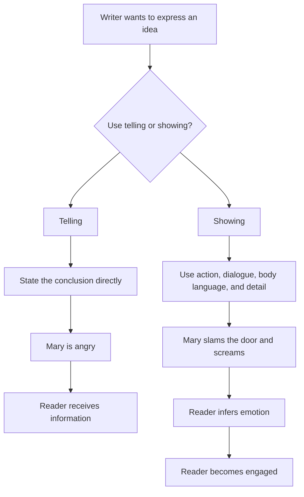
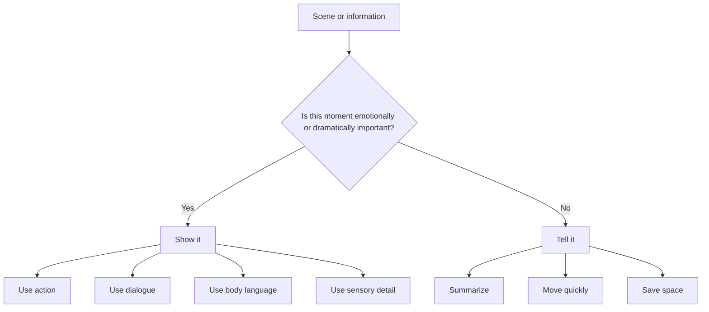

# 003 - How to Show a Scene

## Section

**03 - Show, Don't Tell**

## Original Lecture Title

**Cách "show" một cảnh**

## Duration

**6:29**

---

# How to Show a Scene

## 1. Core Idea

To **show** a scene means to let the reader experience the moment through:

* **Action**
* **Dialogue**
* **Body language**
* **Sensory detail**
* **Specific concrete behavior**
* **Real-time dramatic movement**

Instead of directly explaining what a character feels, the writer gives the reader enough vivid details to **infer** the emotion for themselves.

---

## 2. Telling vs. Showing

### Telling

> Mary is angry.

This sentence is clear and efficient, but it is incomplete.

It tells the reader Mary’s emotional state, but it does not show:

* How angry she is
* What she does when angry
* Who she is angry with
* Why she is angry
* How her anger affects the scene
* What kind of person she is

Telling gives information, but it does not create a vivid scene.

---

### Showing

> Mary walked into the house, slammed the door, and screamed, “Where the hell were you last night?”

This version never uses the word **angry**, but the reader understands Mary’s anger through her behavior.

The sentence shows:

* Her action: walking in and slamming the door
* Her tone: screaming
* Her target: the person she is confronting
* The possible cause: someone was absent last night
* Her emotional state: anger, suspicion, betrayal, or frustration

The reader is not simply told what to think. They are invited to interpret the scene.

---

## 3. Why Showing Works Better

Showing is powerful because it gives the reader **evidence**, not conclusions.

Instead of saying:

> Mary is angry.

The writer creates a situation where the reader thinks:

> Mary must be furious.

This makes the reader more active. They are not passively receiving information. They are participating in the story by interpreting the character’s actions.

---

## 4. Example: Showing Age

### Telling

> Mark is old.

This sentence is vague.

“Old” can mean different things to different readers. A child may imagine someone in their forties. A middle-aged reader may imagine someone much older.

It also does not explain why Mark’s age matters to the story.

---

### Showing

> Mark saw the thief slip into an alley. He ran after him, but after only a few steps, he had to stop and catch his breath. After twenty years of distinguished service, that life was not for him anymore.

This version does not directly say Mark is old.

Instead, it shows age through:

* Physical limitation
* Slowed movement
* Exhaustion
* His past career
* The contrast between who he was and who he is now

The reader understands that Mark is no longer suited to the life he once lived.

---

## 5. Main Difference Between Telling and Showing

| Telling                                    | Showing                                  |
| ------------------------------------------ | ---------------------------------------- |
| Gives the conclusion                       | Gives concrete evidence                  |
| Explains what the reader should understand | Lets the reader interpret                |
| Is abstract                                | Is concrete                              |
| Gives facts                                | Creates images                           |
| Summarizes emotion                         | Dramatizes emotion                       |
| Moves quickly                              | Slows down the moment                    |
| Works well for background information      | Works well for important dramatic scenes |

---

## 6. Simple Diagram

---

## 7. Newspaper vs. Scene

Telling is like reading in a newspaper:

> There was a car accident yesterday.

Showing is like placing the reader on a bench in the city one second before the accident happens.

The first gives information.

The second creates experience.

---

## 8. Benefits of Telling

Telling is not always bad.

Telling is useful when you need to:

* Summarize past events
* Move quickly through unimportant moments
* Provide necessary background
* Avoid slowing down the story
* Transition between scenes

Example:

> For the next three weeks, Mark avoided the station.

This is efficient because those three weeks may not need to become full scenes.

---

## 9. Benefits of Showing

Showing is best when the moment is emotionally or dramatically important.

Use showing when you want the reader to:

* Feel the emotion
* Visualize the scene
* Understand character through behavior
* Experience tension in real time
* Become curious
* Stay engaged

Showing helps fiction feel alive because readers do not read stories only to receive facts. They read to imagine, feel, and live through another world.

---

## 10. Key Principle

> **Telling gives the reader information. Showing gives the reader an experience.**

Telling says:

> She was afraid.

Showing says:

> Her hand hovered over the doorknob. Behind the door, something scratched once, then went silent.

The second version creates an image, builds tension, and lets the reader feel the fear.

---

## 11. When to Show and When to Tell

---

## 12. Practical Technique

When you find a telling sentence, ask:

1. What does this emotion look like physically?
2. What does the character do with their hands, face, or body?
3. What would they say or refuse to say?
4. What detail in the environment reflects the mood?
5. What action can reveal the feeling without naming it?

---

## 13. Example Transformations

### Example 1

#### Telling

> Mary is angry.

#### Showing

> Mary kicked the chair out of her way, grabbed the keys from the table, and said, “Don’t follow me.”

---

### Example 2

#### Telling

> Mark is old.

#### Showing

> Mark gripped the railing before taking the next step. The stairs had never seemed this steep before.

---

### Example 3

#### Telling

> Anna was nervous.

#### Showing

> Anna folded and unfolded the corner of the napkin until it tore in her hands.

---

### Example 4

#### Telling

> David was jealous.

#### Showing

> David laughed when she mentioned Tom’s name, but his smile disappeared before she finished the sentence.

---

## 14. Practical Exercise

Take one summarized paragraph from your draft and expand it into a fully dramatized scene.

Start with two telling sentences:

> Mary is angry.
> Mark is old.

Now rewrite them using:

* Action
* Body language
* Dialogue
* Concrete details
* Movement within the scene

Do not use the words **angry** or **old**.

---

## 15. Reflection Question

Which moments in your outline deserve to become full scenes, and which moments are fine as brief summary?

Use full scenes for turning points, emotional confrontations, decisions, discoveries, and moments of change.

Use summary for transitions, repeated actions, background information, and moments that do not need dramatic focus.

---

## 16. Final Summary

A shown scene allows the reader to live through the story instead of simply receiving information about it.

Telling gives the reader a conclusion.

Showing gives the reader concrete details and lets them draw their own conclusion.

The goal is not to eliminate telling completely. The goal is to know when a moment deserves to be dramatized. Important emotional and dramatic moments should usually be shown because showing creates images, emotion, curiosity, and engagement.

In fiction, the reader does not only want to know what happened.

They want to feel as if they were there.

---

# Bài luyện tập

## Mục tiêu

## Đề bài

## Yêu cầu hoàn thành

- [ ] 
- [ ] 
- [ ] 

## Kết quả / lời giải

## Ghi chú
