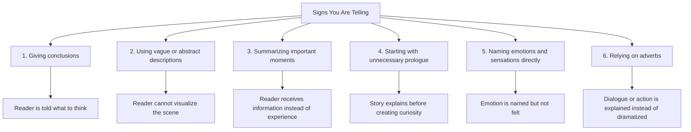
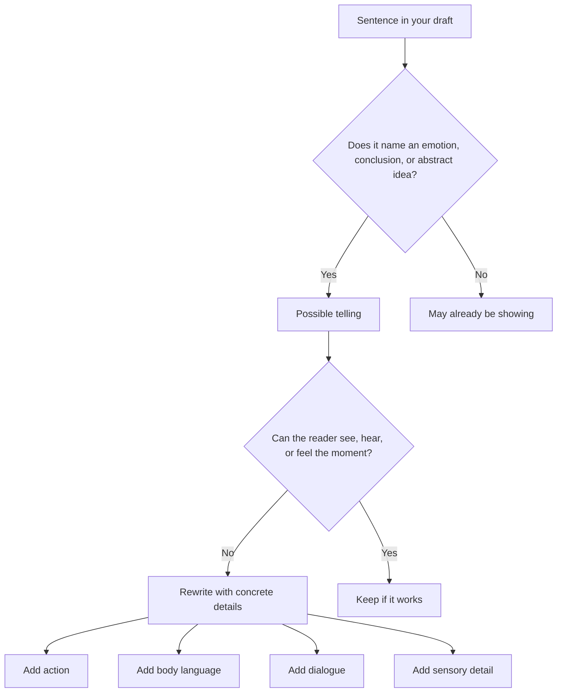

# 004 - 6 Signs You're Telling

## Section

**03 - Show, Don't Tell**

## Original Lecture Title

**6 dấu hiệu cho thấy bạn đang "telling"**

## Duration

**8:12**

---

# 6 Signs You're Telling

## 1. Core Idea

Once you begin learning the technique of **Show, Don’t Tell**, you may start seeing your writing differently.

However, it can still be difficult to recognize exactly where your prose is **telling** instead of **showing**.

This lesson introduces six common signs that your writing may be relying too much on telling.

---

# Overview Diagram

---

# 1. Giving Conclusions

## The Problem

Whenever you give the reader your own conclusion, you are telling.

You are deciding what the reader should understand instead of giving them details and allowing them to reach that conclusion by themselves.

---

## Example of Telling

> Those two were about to get into a fight.

This sentence gives the reader a conclusion directly.

The writer tells us how to interpret the situation before we have seen it happen.

---

## Example of Showing

> “Say that again, if you dare,” he said, stepping closer. His lips curled into a hard frown as he rolled up his sleeves.

This version does not directly say that a fight is about to happen.

Instead, it shows:

* Threatening dialogue
* Physical movement
* Facial expression
* Body language
* Rising tension

The reader can easily infer that violence may occur.

---

## Key Principle

> Do not give the reader the conclusion. Give them the evidence.

---

# 2. Vague or Abstract Descriptions

## The Problem

A scene may be clear in meaning but still weak because it does not create a vivid image.

To check this, ask yourself:

> Can I visualize this scene like a movie?

If the answer is no, the scene may need to be rewritten with more concrete detail.

---

## Example of Telling

> The snake attacked him, and before he could say anything, it killed him.

This is clear, but it is too general.

The reader understands what happened, but they do not feel the danger, horror, or physical reality of the moment.

---

## Better Approach

A stronger version would show:

* The movement of the snake
* The victim’s reaction
* The sound of the attack
* The physical details of injury
* The helplessness of the moment

---

## What Showing Adds

| Weak Telling             | Strong Showing                                |
| ------------------------ | --------------------------------------------- |
| The snake attacked him   | The snake lunges, coils, strikes, or pierces  |
| He died                  | His body weakens, collapses, or stops moving  |
| The event is summarized  | The reader experiences the event in real time |
| The scene is informative | The scene becomes memorable                   |

---

# 3. Summaries

## The Problem

If you are summarizing an important scene, you are probably telling.

Summary can be useful, but it weakens scenes that should create tension, fear, emotion, or suspense.

---

## Example of Telling

> I walked up to the corpse and moved it because it lay in front of the door I had to open.

The action is clear, but it is not frightening.

For a horror scene, this is a missed opportunity.

---

## Stronger Showing Approach

Instead of summarizing, describe the scene moment by moment:

* Where the corpse is
* How the body looks
* What the character notices first
* What the character touches
* What physically happens when the body is moved
* How the character reacts

---

## Why This Matters

In horror, suspense, romance, action, and tragedy, the reader needs to **experience** the moment.

A summary tells the reader what happened.

A scene makes the reader feel as if they are there.

---

# 4. An Unnecessary Prologue

## The Problem

A long introductory explanation often becomes telling.

Writers sometimes add a prologue because they fear the reader will not understand the characters, world, conflict, or plot.

But too much explanation at the beginning can weaken curiosity.

---

## A Strong Beginning Should Do Three Things

A strong opening should:

1. Introduce the character
2. Show the character struggling with conflict
3. Stimulate the reader’s curiosity

---

## Example of a Strong Opening

Ernest Hemingway begins *The Short Happy Life of Francis Macomber* by immediately placing the reader inside a scene:

> It was now lunch time and they were all sitting under the double green fly of the dining tent pretending that nothing had happened.

This opening creates questions:

* What happened?
* Why are they pretending nothing happened?
* What are they hiding?
* Why is the atmosphere tense?

The reader keeps reading because they want answers.

---

## Key Principle

> Do not explain everything before the story begins. Start with tension, conflict, or curiosity.

---

# 5. Naming Emotions and Sensations Directly

## The Problem

If you write a character’s emotion directly, you may be telling.

---

## Example of Telling

> Anna felt anxious and nervous.

This sentence is clear, but it does not transfer the emotion to the reader.

The reader knows Anna is anxious, but they may not feel her anxiety.

---

## Example of Showing

> Anna had been twisting and turning in bed for over an hour, but sleep still would not come.

This version shows anxiety through physical behavior.

The reader sees:

* Restlessness
* Sleeplessness
* Tension
* Repeated movement
* Mental discomfort

---

## Physical Reactions Can Show Emotion

Instead of naming the emotion, describe what happens in the body.

| Emotion  | Possible Physical Signs                       |
| -------- | --------------------------------------------- |
| Fear     | Goosebumps, shallow breathing, frozen hands   |
| Anger    | Tight jaw, clenched fists, sharp movements    |
| Anxiety  | Restlessness, sweating, fidgeting             |
| Shame    | Blushing, avoiding eye contact, lowered voice |
| Sadness  | Heavy posture, silence, slow movement         |
| Jealousy | Forced smile, sudden silence, narrowed eyes   |

---

# 6. Overusing Adverbs

## The Problem

Adverbs often explain emotion instead of showing it.

This is especially common in dialogue tags.

---

## Example of Telling

> “Leave me alone,” she said angrily.

The adverb **angrily** tells the reader how the line should be understood.

---

## Example of Showing

> “Leave me alone.” She shoved the chair back so hard it scraped against the floor.

This version removes the adverb and replaces it with action.

The anger is shown through movement and sound.

---

## Common Adverb Warning Signs

Look for words ending in **-ly**, such as:

* Angrily
* Sadly
* Nervously
* Quietly
* Happily
* Fearfully
* Impatiently
* Desperately

Not every adverb is bad, but many can be replaced with stronger action, dialogue, or detail.

---

# Telling vs. Showing Diagnostic Diagram

---

# Practical Checklist: How to Find Telling

When revising your draft, look for:

## 1. Direct Conclusions

Examples:

* They were about to fight.
* He was a bad man.
* She was clearly lying.
* Everyone was uncomfortable.

Ask:

> What concrete details would make the reader reach this conclusion?

---

## 2. Abstract Descriptions

Examples:

* It was a terrible place.
* The room felt strange.
* The night was scary.
* He looked old.

Ask:

> What exactly does the reader see, hear, smell, or notice?

---

## 3. Summaries of Important Scenes

Examples:

* They argued for hours.
* He fought the monster and escaped.
* She cried all night.
* The meeting went badly.

Ask:

> Is this moment important enough to dramatize?

---

## 4. Expository Prologue

Examples:

* Long history before the first scene
* Long character background before conflict appears
* Worldbuilding before action begins
* Explaining the theme before the reader cares

Ask:

> Can I start closer to conflict?

---

## 5. Direct Emotion Words

Examples:

* Angry
* Sad
* Nervous
* Afraid
* Happy
* Jealous
* Confused
* Lonely

Ask:

> What does this emotion make the character do?

---

## 6. Adverbs

Examples:

* She said angrily.
* He whispered nervously.
* They laughed happily.
* She replied coldly.

Ask:

> Can I replace the adverb with action, gesture, or sharper dialogue?

---

# Revision Exercise

Print out the first ten lines of your novel or story.

Read each line carefully with a red pen.

Mark the following:

1. Words related to the five senses
2. Direct emotion words
3. Adverbs ending in **-ly**
4. Verbs such as **feel**, **see**, **hear**, **decide**, or **realize**
5. Sentences that summarize important events
6. Lines where the narrator gives a conclusion

Then choose two or three marked sentences and rewrite them with:

* Action
* Dialogue
* Gestures
* Physical reactions
* Specific sensory details

---

# Example Revision Process

## Telling Sentence

> He felt scared.

## Questions to Ask

* What happens to his body?
* What does he hear?
* What does he notice?
* What does he do?
* What does he avoid doing?

## Showing Version

> His fingers tightened around the flashlight. From the basement below, something dragged slowly across the floorboards.

---

# Final Summary

Telling often appears when the writer gives the reader a conclusion, summarizes an important moment, names an emotion directly, or relies on adverbs to explain how something should be understood.

Showing gives the reader concrete details and lets them interpret the scene.

The goal is not to remove all telling. Some telling is useful for pacing, transitions, and background information.

The real goal is to recognize when a moment deserves to be dramatized.

Important scenes should usually be shown because they create images, emotion, tension, and curiosity.

> **Telling explains the story. Showing makes the reader experience it.**

---

# Bài luyện tập

## Mục tiêu

## Đề bài

## Yêu cầu hoàn thành

- [ ] 
- [ ] 
- [ ] 

## Kết quả / lời giải

## Ghi chú
