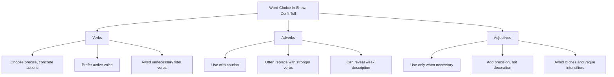
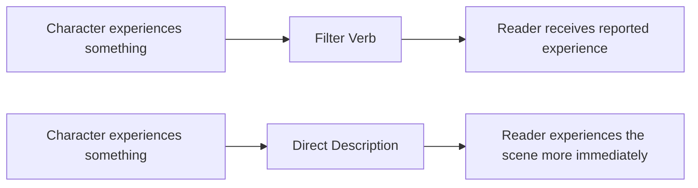
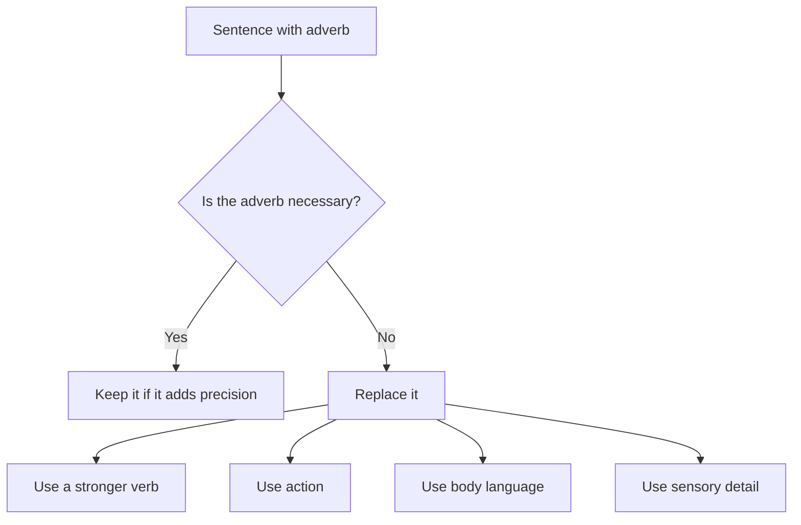

# 005 - Using Verbs, Adverbs, and Adjectives

## Section

**03 - Show, Don't Tell**

## Original Lecture Title

**Cách dùng động từ, trạng từ, tính từ**

## Duration

**6:34**

---

# Using Verbs, Adverbs, and Adjectives

## 1. Core Idea

To make a scene feel alive, the reader must be able to experience sensory details:

* Sight
* Hearing
* Touch
* Taste
* Smell

Because of this, **verbs**, **adverbs**, and **adjectives** are powerful tools.

They help create clear images in the reader’s mind. But they must be used carefully.

At the sentence level, **Show, Don’t Tell** often depends on choosing the right word.

---

# Overview Diagram

---

# 2. Verbs

## Choose Precise and Concrete Verbs

Verbs are one of the most important tools for showing.

A strong verb can create action, emotion, and context at the same time.

---

## Weak Verb

> Mario was killed.

This sentence is clear, but it is vague.

It does not show how Mario died, who acted, or what kind of situation he was in.

---

## Stronger Verbs

> Mario was shot.

> Mario was stabbed.

These verbs are more precise.

They immediately create a clearer image and suggest a different kind of scene.

| Verb Choice | Effect                                           |
| ----------- | ------------------------------------------------ |
| Killed      | General and vague                                |
| Shot        | Suggests distance, weapon, violence, attack      |
| Stabbed     | Suggests closeness, brutality, physical struggle |

A precise verb gives the reader more information without needing extra explanation.

---

# 3. Avoid Filter Verbs

## What Are Filter Verbs?

Filter verbs describe the character’s act of perceiving instead of letting the reader experience the perception directly.

Common filter verbs include:

* Saw
* Heard
* Felt
* Smelled
* Thought
* Knew
* Realized
* Noticed

These words are not always wrong, but they can create distance between the reader and the scene.

---

## Example of Filtering

> He felt that he was losing control.

The word **felt** creates a layer between the reader and the experience.

The sentence tells us what the character is experiencing instead of placing us directly inside the experience.

---

## Stronger Version

> He was losing control.

This version is more immediate.

The reader is closer to the action because the sentence removes the unnecessary filter.

---

## Filter Verb Diagram

---

# 4. Prefer Active Voice

## The Problem with Passive Voice

Passive voice can push the person doing the action into the background.

Sometimes passive voice is useful, but if overused, it weakens energy and clarity.

---

## Passive Voice

> The piano is played by Anna.

The meaning is clear, but Anna feels less central.

The sentence places the object, **the piano**, in the foreground.

---

## Active Voice

> Anna plays the piano.

This version places Anna at the center of the action.

Now the reader expects something from Anna. Maybe she has not played in years. Maybe she is performing under pressure. Maybe this moment reveals something about her.

The active sentence points the light at the character who carries the scene forward.

---

## Active vs. Passive

| Passive Voice                    | Active Voice            |
| -------------------------------- | ----------------------- |
| The piano is played by Anna.     | Anna plays the piano.   |
| The door was opened by Mark.     | Mark opened the door.   |
| The letter was written by Clara. | Clara wrote the letter. |
| The gun was dropped by him.      | He dropped the gun.     |

---

# 5. Adverbs

## What Adverbs Do

Adverbs modify verbs.

They explain how an action is performed.

For example:

> He walked slowly.

The adverb **slowly** tells us how he walked.

But the problem is that there are many ways to walk slowly.

Was he:

* Limping?
* Tiptoeing?
* Dragging his feet?
* Staggering?
* Creeping?
* Hesitating?

A vague adverb often hides a chance to use a stronger, more specific action.

---

## Example of Weak Adverb Use

> I walked slowly toward the car until I saw him. Someone had just killed him.

This sentence is understandable, but it misses an opportunity to build suspense.

The scene is about to reveal a murder. It deserves more atmosphere, tension, and detail.

---

## Stronger Showing Version

> The only thing he could hear was his heart. He made his way to the truck and crouched beside the open door. The man had fallen sideways over the console, still trapped in the shoulder belt. Fresh blood was everywhere.

This version replaces the vague adverb with:

* Sound
* Movement
* Position
* Visual detail
* Suspense
* Physical evidence

The reader does not just learn that the character moved slowly. The reader feels the tension of the approach.

---

# 6. Replacing Adverbs with Stronger Verbs

A strong verb often removes the need for an adverb.

| Weak Version         | Stronger Version |
| -------------------- | ---------------- |
| He walked slowly.    | He limped.       |
| She said angrily.    | She snapped.     |
| He looked carefully. | He examined.     |
| She moved quietly.   | She crept.       |
| He held tightly.     | He clutched.     |
| She cried loudly.    | She sobbed.      |
| He breathed heavily. | He panted.       |
| She smiled happily.  | She beamed.      |

---

## Adverb Revision Diagram

---

# 7. Adjectives

## What Adjectives Do

Adjectives define or specify the meaning of nouns.

They can help describe:

* A character
* A setting
* An object
* A mood
* A physical detail

But adjectives must be necessary.

They should add precision and clarity, not just decoration.

---

## Ask This Question

Before keeping an adjective, ask:

> What value does this adjective add to the noun?

If you cannot answer, cut it.

---

## Weak Adjective Use

> She was very happy.

> He was very sad.

The word **very** usually adds little value.

It intensifies the adjective but does not create a stronger image.

---

## Stronger Alternatives

Instead of:

> She was very happy.

Write:

> She pressed both hands over her mouth, but the smile still broke through.

Instead of:

> He was very sad.

Write:

> He sat at the edge of the bed, holding the phone long after the call had ended.

The stronger versions show emotion through action and physical detail.

---

# 8. Avoid Overused Pairings

Some adjective-noun combinations are not technically wrong, but they are overused.

Examples:

* Shimmering eyes
* Lingering look
* Icy stare
* Warm smile
* Cold silence
* Heavy heart
* Piercing gaze

These phrases can feel familiar or predictable.

A fresher description is usually more memorable.

---

## Better Strategy

Instead of using a common adjective, describe something specific and unusual.

Ask:

* What exactly makes the stare “icy”?
* What does the smile hide?
* What does the silence make the character do?
* What physical detail makes this person memorable?

---

# 9. Character Description Example

A good description does not need many dramatic adjectives.

It can become vivid through precise, unusual details.

Example:

> He was not conspicuously tall. His features were striking, but not conspicuously handsome. His hair was wiry and gingerish, brushed backward from the temples. His skin seemed to be pulled backward from the nose. There was something very slightly odd about him, but it was difficult to say what it was. Perhaps it was that his eyes did not blink often enough, or perhaps that he smiled slightly too broadly and gave people the unnerving impression that he was about to go for their neck.

This description works because it does not simply say:

> He looked strange.

Instead, it gives specific details:

* Wiry gingerish hair
* Skin pulled backward from the nose
* Eyes that do not blink often enough
* A smile that is too broad
* An unsettling impression

The reader is allowed to feel discomfort without being directly told what to feel.

---

# 10. Word Choice Checklist

When revising a scene, examine your verbs, adverbs, and adjectives carefully.

## Verbs

Ask:

* Is this verb specific?
* Can I replace a weak verb with a stronger one?
* Am I using too many filter verbs?
* Is the sentence active or passive?

## Adverbs

Ask:

* Is this adverb doing real work?
* Could a stronger verb replace it?
* Could action or body language show the same thing?
* Does the adverb explain emotion instead of dramatizing it?

## Adjectives

Ask:

* Does this adjective add precision?
* Is it vague or decorative?
* Is it a cliché?
* Would a concrete image be stronger?

---

# 11. Practical Exercise

Take a sentence from your draft that uses an adverb.

Rewrite it using only a stronger verb.

---

## Example

### Original

> She walked nervously into the room.

### Revised

> She crept into the room.

Or:

> She paused at the doorway, wiped her palms on her skirt, and stepped inside.

The first revision uses a stronger verb.

The second revision uses action and body language.

---

# 12. Reflection Questions

After reading a chapter of your novel, close your eyes and ask:

1. What images remain in your mind?
2. Which details helped create those images?
3. Do the details reveal character?
4. Do the details strengthen the setting?
5. Do the details move the scene forward?
6. Which adjectives and adverbs could be removed?
7. Which verbs could be made stronger?

---

# 13. Revision Challenge

Choose an important scene from your book.

Now delete every adjective and adverb from that scene.

Then reread it.

Ask:

* What became stronger?
* What became weaker?
* Which words were actually necessary?
* Which words were only decorative?
* Which verbs now need to become more precise?

This exercise helps you see whether your scene depends on weak modifiers or strong dramatic action.

---

# 14. Final Summary

Verbs, adverbs, and adjectives are essential tools for creating vivid scenes, but they must be used with precision.

Strong verbs often do more work than weak verbs plus adverbs.

Adverbs can be useful, but they often reveal places where the sentence should be rewritten with stronger action, body language, or internal tension.

Adjectives should not merely decorate the sentence. They should clarify, sharpen, or reveal something meaningful.

> **A precise verb is often stronger than a weak verb plus an adverb.**
> **A concrete detail is often stronger than a pile of vague adjectives.**

At the sentence level, **Show, Don’t Tell** means choosing words that create images instead of simply explaining meaning.
