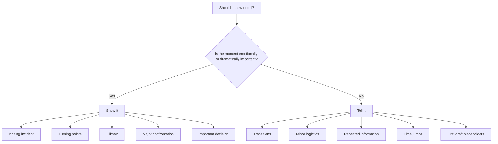
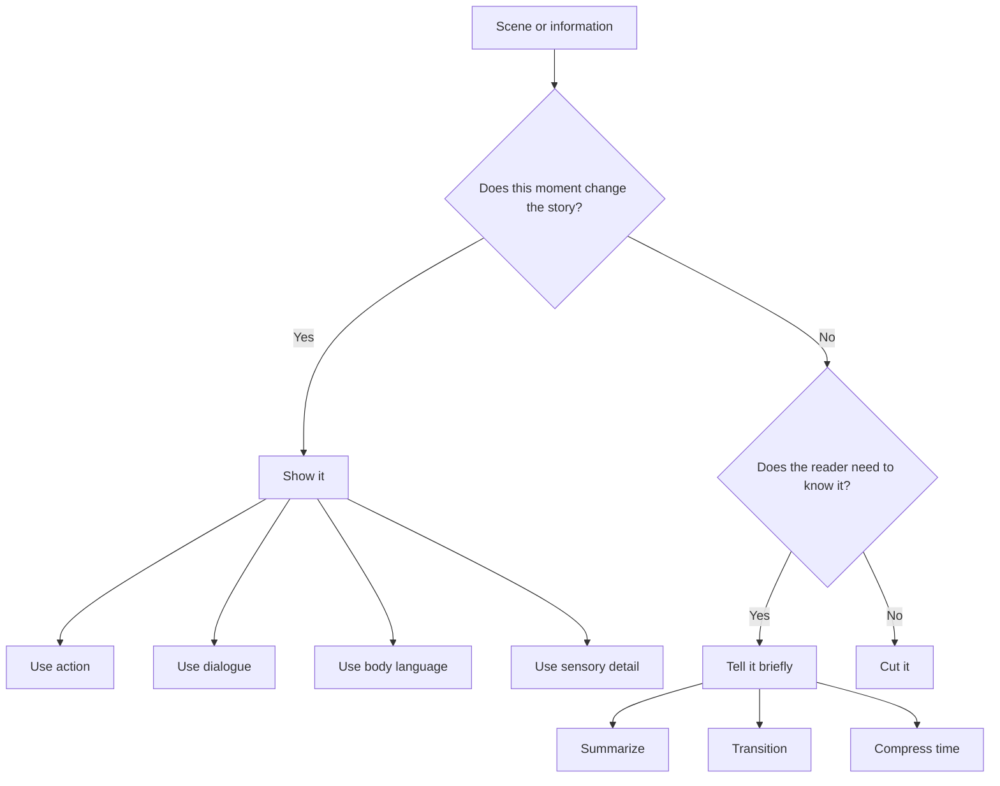

# 006 - When Telling Is the Right Choice

## Section

**03 - Show, Don't Tell**

## Original Lecture Title

**Khi nào "telling" là lựa chọn tốt**

## Duration

**5:00**

---

# When Telling Is the Right Choice

## 1. Core Idea

At this point, you may wonder:

> Do we have to stop telling completely?

The answer is **no**.

Telling is not always bad. In some cases, telling is actually the better choice.

The real skill is not avoiding telling forever. The real skill is knowing **when to show** and **when to tell**.

---

# Overview Diagram

---

# 2. Telling Irrelevant Details

## The Problem

Not every action deserves a full dramatized scene.

For example, you usually do not need to describe a character in great detail when they:

* Start their car
* Drive to work
* Season soup for dinner
* Walk from one room to another
* Pack a bag
* Wait in line

These actions are not automatically interesting enough to justify showing.

---

## When Ordinary Details Become Worth Showing

An ordinary action becomes worth showing when it carries dramatic meaning.

For example:

* Starting a car matters if there is a bomb attached to it.
* Seasoning soup matters if the soup is poisoned.
* Walking into a room matters if the character is about to face someone they fear.
* Packing a bag matters if the character is secretly leaving forever.

---

## Key Principle

> Show the moments that matter. Tell the moments that only connect them.

Important plot events should usually be shown, such as:

* The inciting incident
* Major discoveries
* Turning points
* Betrayals
* Confessions
* Climactic confrontations
* Final choices

Less important details can often be told or skipped.

---

# 3. Telling Transition Scenes

## Why Telling Helps

Telling is useful for transitions between two important scenes.

A transition can help the reader understand:

* Time has passed
* A previous scene has ended
* A new scene is beginning
* The point of view has changed
* The location has changed
* The story is moving forward

---

## Example

> There were only four days left until Christmas, and Yohannes had not shown up since he disappeared at the market a few days before.

This is telling, but it works.

It quickly gives the reader necessary information:

* The date is close to Christmas.
* Yohannes is still missing.
* Several days have passed.
* The disappearance still matters.

There is no need to dramatize every hour of waiting unless something important happens during that time.

---

# 4. Telling Repeated Information

## The Problem

Sometimes one character must tell another character information that the reader already knows.

If the reader has already witnessed the event, showing the entire explanation again can become boring.

---

## Example Situation

A character discovers a secret in Chapter 5.

In Chapter 6, they tell another character about it.

The reader does not need to hear the full explanation again word for word.

---

## Better Approach

Instead of repeating everything, summarize:

> Clara told him what she had seen in the garden.

This is telling, but it is efficient.

The reader already knows what Clara saw, so the story can move forward.

---

## Key Principle

> If the reader already knows the information, you usually do not need to dramatize it again.

---

# 5. Telling at the Beginning of a Story

## The Problem

Many writing lessons warn against too much exposition at the beginning.

That warning is useful, but it does not mean every beginning must start with action or dialogue.

A story can begin with a told overview if the narration is interesting, controlled, and purposeful.

---

## Example of a Told Beginning

> In the beginning, there was a family. Nothing extraordinary. A very normal family, just like yours and mine.

This kind of opening can work because it creates a simple frame.

It gives the reader a broad starting point before the story narrows into conflict.

---

## When a Told Beginning Works

A told beginning can work when it:

* Establishes tone
* Creates curiosity
* Gives a useful overview
* Introduces the world simply
* Prepares the reader for contrast
* Feels intentional rather than lazy

---

## Warning

A told beginning becomes weak when it only explains background information the reader does not yet care about.

The beginning should still create interest.

---

# 6. Telling to Speed Up Time

## Why Telling Helps

Sometimes nothing important happens between two scenes.

In that case, telling can compress time and keep the story moving.

---

## Example

> It took them three days by horse to reach the border.

This is better than showing three full days of travel if nothing meaningful happens during the journey.

Showing every meal, conversation, and campsite would slow the story down without adding value.

---

## Stronger Transition with Tension

Telling can also introduce suspense while moving quickly.

Example:

> We kept in touch for a few months. She said she was doing it just to stay close to me. I pushed her into taking another exam. She failed. We exchanged a few more letters. Then, for a long time, I heard nothing.

This passage summarizes time, but it still creates tension.

The reader senses distance, failure, silence, and emotional change.

---

## Key Principle

> Telling can move the story forward quickly while still carrying emotional weight.

---

# 7. Telling in the First Draft

## The Problem

During a first draft, trying to make every sentence perfect can stop your creativity.

At this stage, it is often more important to get the story written than to make every scene fully polished.

---

## Useful Advice

> Do not get it right. Get it written.

This is especially helpful for perfectionists.

In the first draft, it is acceptable to write:

> She was furious when she found out.

Later, during revision, you can decide whether that moment deserves to be shown.

---

## First Draft vs. Revision

| First Draft                            | Revision                                      |
| -------------------------------------- | --------------------------------------------- |
| Focus on getting the story down        | Focus on improving how the story is told      |
| Telling is acceptable as a placeholder | Important moments can be expanded into scenes |
| Creativity matters most                | Precision matters more                        |
| Momentum is the priority               | Emotional impact is the priority              |

---

# 8. When to Tell

Use telling when you need to:

* Move quickly through time
* Skip unimportant logistics
* Summarize repeated information
* Transition between scenes
* Change location or point of view
* Provide a brief overview
* Keep pacing tight
* Leave placeholders in a first draft

---

# 9. When to Show

Use showing when the moment involves:

* Major emotional change
* Important conflict
* A crucial decision
* A turning point
* A betrayal
* A confession
* A discovery
* A climax
* A scene the reader should experience directly

---

# Show vs. Tell Decision Diagram

---

# 10. Practical Exercise

Go through your manuscript and look for moments of telling.

For each one, ask:

1. Is this information necessary?
2. Does this moment affect the plot?
3. Does it reveal character?
4. Does it create emotional impact?
5. Would showing it improve the scene?
6. Would showing it slow the story down unnecessarily?
7. Am I telling because this moment does not matter, or because showing it feels difficult?

Then choose one scene in your outline that could be compressed into a single telling paragraph without losing anything important.

---

# 11. Example Revision

## Too Much Showing for an Unimportant Moment

> Daniel reached for the brass handle, curled his fingers around it, twisted it slowly, and pulled the door open. The hallway stretched ahead of him. He stepped forward, one foot after another, passing the framed photographs on the wall until he reached the kitchen.

If nothing important happens during this movement, this is too much detail.

---

## Better Telling Version

> Daniel went to the kitchen.

This is enough if the movement itself does not matter.

---

## When Showing Would Be Better

If Daniel is afraid someone is hiding in the house, then the same action might deserve showing:

> Daniel touched the brass handle but did not turn it. From the kitchen came the soft scrape of a chair leg against the floor.

Now the movement matters because it creates suspense.

---

# 12. Reflection Question

Are you telling a scene because it genuinely does not need to be shown, or because showing it feels difficult?

This question is important.

Sometimes telling is a smart pacing choice.

But sometimes telling is a way to avoid writing a hard emotional scene.

A writer should know the difference.

---

# 13. Final Summary

Telling is not the enemy.

Telling is useful when you need to summarize, transition, compress time, repeat known information, or move past details that do not deserve full dramatic attention.

Showing is best for the scenes that matter most emotionally or dramatically.

The goal is not to show everything.

The goal is to choose deliberately.

> **Show what the reader needs to experience. Tell what the reader only needs to know.**
