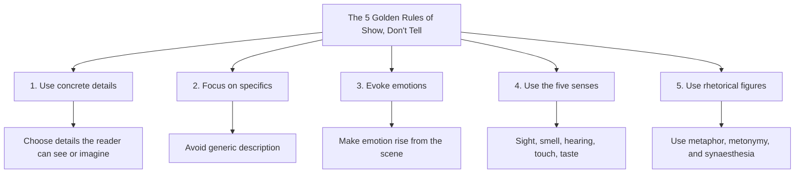
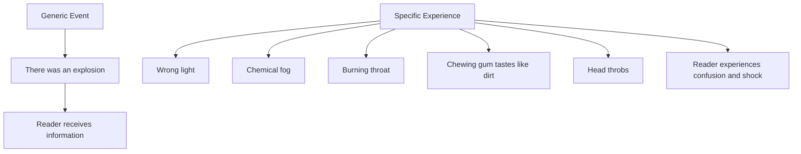
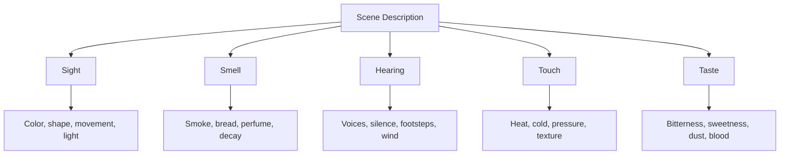
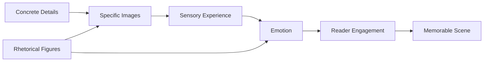

# 007 - The 5 Golden Rules of Show, Don't Tell

## Section

**03 - Show, Don't Tell**

## Original Lecture Title

**5 nguyên tắc vàng của show-don't-tell**

## Duration

**8:18**

---

# The 5 Golden Rules of Show, Don’t Tell

## 1. Core Idea

When writing fiction, you often describe scenes you have never personally experienced.

Because of that, it is easy to fall into **telling**:

> She was afraid.
> The explosion was terrifying.
> The room was disgusting.

These sentences communicate information, but they do not create a vivid experience.

To show effectively, you must learn to enter the scene through the character’s body, senses, actions, and perceptions.

The goal is to create images so the reader can experience the scene instead of simply receiving an explanation.

---

# Overview Diagram

---

# 2. Golden Rule 1: Use Concrete Details

## The Principle

When describing a setting, event, or person, use concrete details instead of general labels.

Do not simply list broad qualities.

Instead, visualize the person or place and ask:

> What specific details reveal this character, setting, or moment?

---

## Weak Telling

> She was an old woman.

This is clear, but it is generic.

It gives the reader a fact, not an image.

---

## Stronger Showing

> She laughed, nodded her head, and dipped her toast into the wide mouth of her coffee cup until it was soft enough to chew. It had been sixteen years since she had said farewell to her last tooth.

This passage does not directly say:

> She is old.

But the reader understands it through concrete details:

* She dips toast into coffee to soften it.
* She has no teeth.
* She laughs and nods with energy.
* She seems lively despite her age.

The description also reveals personality. She is not only old. She seems cheerful, practical, and full of life.

---

## Key Principle

> A concrete detail is stronger than a general label.

Instead of naming the quality, show the detail that proves it.

---

# 3. Golden Rule 2: Focus on Specifics

## The Principle

A powerful scene depends on specificity.

Generic description is easy to understand, but it rarely stays in the reader’s mind.

---

## Weak Telling

> There was an explosion.

This sentence gives information, but it does not create much tension.

It is too short and too general for a major dramatic event.

---

## Stronger Showing

> I stood there frozen, slowly realizing that something was terribly wrong. The light had changed. The air had thickened into a chemical fog that burned my throat. My chewing gum began to taste like dirt. When I turned to spit it out, my head throbbing, I saw something through the smoke so absurd that I stared at it for several seconds before I could understand what it was.

This version works because it focuses on specific details:

* The strange change in light
* The chemical fog
* The burning throat
* The taste of dirt
* The throbbing head
* The confusion after the blast

The reader is not just told that an explosion happened. The reader experiences its aftermath through the character’s senses.

---

## Specificity Diagram

---

# 4. Golden Rule 3: Evoke Emotions

## The Principle

Stories should make readers feel.

Common emotional responses include:

* Happiness
* Disgust
* Fear
* Anger
* Scorn
* Shock
* Sadness

However, you usually should not simply name the emotion.

Instead, build the scene so the emotion rises naturally from the details.

---

## Weak Telling

> Ellen felt disgusted and afraid.

This tells the reader how Ellen feels, but it does not make the reader feel it.

---

## Stronger Showing

> Someone had drawn the curtains. A thin line of sunlight slipped through them, creating a sickly twilight. It was probably warm outside, and every room had air conditioning, but this room felt colder than the rest. The worst thing was the stench. It was almost tangible. At first, Ellen thought it was poor hygiene, but there was something else beneath it, something impossible to define. It was as if the smell itself could damage anyone who stayed too long.
>
> It was fear, she thought. The smell of fear.

This passage evokes discomfort without immediately saying:

> Ellen was disgusted.
> Ellen was anxious.
> Ellen was afraid.

Instead, the scene creates emotion through:

* Dim light
* Unnatural cold
* Stench
* Physical discomfort
* A sense of invisible threat

---

## Key Principle

> Do not announce the emotion. Build the conditions that make the reader feel it.

---

# 5. Golden Rule 4: Use the Five Senses

## The Principle

A vivid image is not only visual.

A complete scene can include:

* **Sight** — what the character sees
* **Smell** — what the character smells
* **Hearing** — what the character hears
* **Touch** — what the character feels physically
* **Taste** — what the character tastes

The five senses help place the reader inside the scene.

---

## Examples of Sensory Details

| Sense   | Example                                        |
| ------- | ---------------------------------------------- |
| Sight   | A curtain moving in a dark room                |
| Smell   | Warm bread, smoke, wet soil                    |
| Hearing | A broken voice, footsteps, distant thunder     |
| Touch   | Linen, cold metal, sweat on the skin           |
| Taste   | Expired mayonnaise, blood, dust, bitter coffee |

---

## Sensory Showing Example

Instead of writing:

> The kitchen was comforting.

You could write:

> The smell of warm bread filled the kitchen. Steam curled from the soup pot, and the wooden table was still warm where the afternoon sun had touched it.

This version does not directly say the kitchen is comforting.

It creates comfort through:

* Smell
* Heat
* Light
* Texture
* Domestic detail

---

## Five Senses Diagram

---

# 6. Golden Rule 5: Use Rhetorical Figures

## The Principle

Rhetorical figures help create images, emotion, and originality.

They make description more dynamic and memorable.

Useful rhetorical tools include:

* Metaphor
* Simile
* Metonymy
* Synaesthesia
* Personification

These devices help the reader imagine something more vividly.

---

## Example: Metaphor

> The city was a furnace.

This does more than say:

> The city was hot.

It creates a physical image of oppressive heat.

---

## Example: Synaesthesia

Synaesthesia mixes senses.

Example:

> Her voice was velvet.

A voice cannot literally be velvet, but the phrase connects sound with touch. It suggests softness, smoothness, and intimacy.

---

## Example: Personification

> The old house groaned in the wind.

The house is given a human-like action, which makes the setting feel alive.

---

## Key Principle

> Rhetorical figures should sharpen the image, not decorate it randomly.

Use them when they make the scene clearer, stranger, more emotional, or more memorable.

---

# 7. How the Five Rules Work Together

The five rules are not separate tricks.

They work together to create a complete scene.

A strong shown scene usually contains:

* Concrete details
* Specific images
* Sensory information
* Emotional pressure
* Fresh language
* Room for reader interpretation

---

# 8. Telling vs. Showing Example

## Telling

> The room was frightening.

## Showing

> The curtains hung motionless over the sealed windows. Beneath the bed, something scraped once against the floorboards, then stopped.

The second version does not use the word **frightening**.

Instead, it creates fear through:

* Stillness
* Darkness
* Sound
* Uncertainty
* Suspense

The reader feels the fear because the scene gives them something to imagine.

---

# 9. Practical Writing Method

When you want to show a moment, ask yourself:

## Concrete Detail

> What exact detail reveals this person, place, or event?

## Specificity

> What makes this moment different from every similar moment?

## Emotion

> What do I want the reader to feel?

## Five Senses

> What can the character see, hear, smell, touch, or taste?

## Rhetorical Language

> Is there a metaphor, comparison, or sensory connection that makes the image stronger?

---

# 10. Revision Checklist

When revising a chapter, look for sentences like:

* She was scared.
* He was angry.
* The room was beautiful.
* The explosion was terrible.
* The man was old.
* The house was creepy.
* The dinner was awkward.

Then ask:

1. Can I replace this label with a concrete detail?
2. Can I make the description more specific?
3. Can I evoke the emotion without naming it?
4. Can I include one or more of the five senses?
5. Can I use a fresh rhetorical image?

---

# 11. Practical Exercise

Think of a thrilling or intense moment from your own life.

It could be:

* A difficult exam you passed
* A conflict with someone
* A moment when you made a life-changing decision
* A time when you were afraid
* A moment of victory
* A moment of shame or embarrassment

Now describe the scene using one rule:

> Do not add personal explanation or commentary.

You cannot write:

> I was terrified.
> I felt proud.
> I was angry because he had humiliated me.

Instead, describe only what happens in the scene.

Use:

* A stare
* A gesture
* A line of dialogue
* A physical reaction
* A sound
* A smell
* A movement
* A visible detail

---

# 12. Exercise Example

## Telling

> I was afraid of the bully when he looked at me.

## Showing

> He stopped talking when I passed his classroom. The others turned with him. My hand tightened around the strap of my bag, and I kept my eyes on the cracked tile until I reached the stairs.

This version does not explain fear directly.

It shows fear through:

* Silence
* Group attention
* Avoided eye contact
* Tight grip
* Controlled movement

---

# 13. Final Summary

The five golden rules of **Show, Don’t Tell** help you create scenes that readers can see, hear, feel, and emotionally enter.

Use concrete details instead of general labels.

Focus on specifics instead of vague description.

Evoke emotions instead of naming them.

Use the five senses to build a complete image.

Use rhetorical figures to make descriptions fresh and memorable.

The purpose of showing is not to make prose longer.

The purpose is to make the reader feel present inside the scene.

> **Tell the reader less about what something means. Show them more of what it looks, sounds, smells, tastes, and feels like.**

---

# Bài luyện tập

## Mục tiêu

## Đề bài

## Yêu cầu hoàn thành

- [ ] 
- [ ] 
- [ ] 

## Kết quả / lời giải

## Ghi chú
