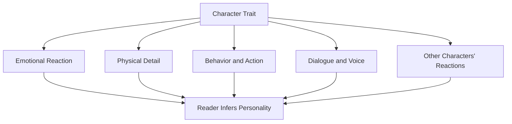
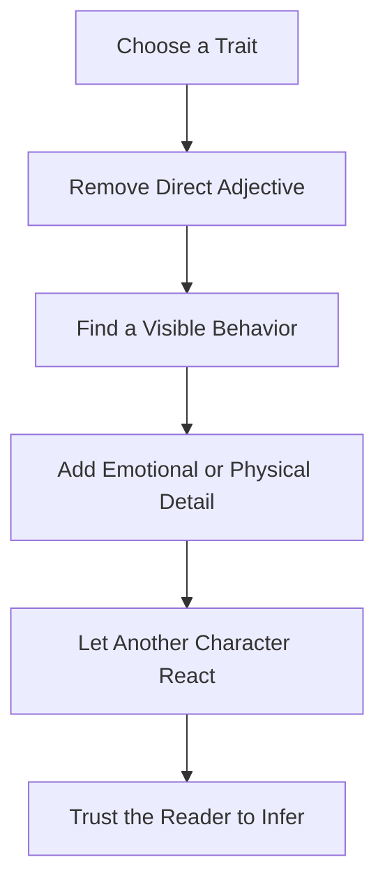

# 008 - How to Show a Character

## Section

**03 - Show, Don't Tell**

## Original Lecture Title

**Cách "show" một nhân vật**

## Duration

**6:57**

---

# Lesson Overview

Every strong novel needs characters who feel distinct, alive, and memorable. A character is not only defined by physical appearance, but also by voice, behavior, emotional reactions, choices, and the way other people respond to them.

Instead of directly telling the reader what a character is like, the writer should reveal character through observable details.

> A character becomes vivid when the reader can infer who they are without being told directly.

---

# Core Idea

## Tell vs. Show

| Telling          | Showing                                                                         |
| ---------------- | ------------------------------------------------------------------------------- |
| He was tall.     | She had to stand on tiptoe to kiss him.                                         |
| She was nervous. | Her lips trembled, and color rose and faded in her face.                        |
| He was greedy.   | He glanced at the child’s empty hand, then tightened his grip around his coins. |
| She was proud.   | She lifted her chin before answering, as if the room owed her silence.          |

---

# Diagram: How to Show a Character



---

# Five Ways to Show a Character

---

## 1. Show Real Emotional Reactions

A character’s emotions are often most powerful when shown through the body.

Instead of saying:

> She was happy and confused.

Show the emotion through visible signs:

> Her face reddened, then turned pale, then reddened again. Her lips trembled slightly, and her eyes shone with moisture.

This allows the reader to infer the emotion naturally.

### Why It Works

Readers do not need to be told that the character is overwhelmed. They can see it through:

* trembling lips
* changing facial color
* shining eyes
* silence
* hesitant gestures

### Key Principle

> Focus on the physical effects of emotion, not the abstract emotion itself.

---

## 2. Show Physical Attributes Through Action

Physical description becomes more meaningful when it affects the scene.

Instead of writing:

> He was very tall.

Write:

> She had to rise onto her toes to kiss him.

The second version lets the reader understand his height through action.

### Examples

| Trait   | Showing Through Action                                            |
| ------- | ----------------------------------------------------------------- |
| Tall    | He ducked before entering the doorway.                            |
| Short   | She stood on the lower stair to meet his eyes.                    |
| Strong  | He lifted the suitcase with one hand.                             |
| Old     | He paused halfway up the stairs, one hand pressed to the railing. |
| Elegant | Even when she sat, her posture made the chair seem formal.        |

---

## 3. Do Not Describe Everything at Once

A character description should not be dumped into one large paragraph at the beginning.

In real life, we notice people gradually:


At first, the reader may notice only basic traits. Later, as the story develops, more meaningful details can appear.

### Better Approach

Reveal character details only when they serve the story.

For example:

* describe the character’s hands when they are hiding something
* describe their eyes when they are lying
* describe their posture during conflict
* describe their clothing when it reveals status, insecurity, or ambition

### Key Principle

> Spread description across the story instead of giving everything at once.

---

## 4. Reveal Character Traits Through Physical Description

A physical description can suggest personality, contradiction, danger, or inner conflict.

For example, a sharp jaw, hooked nose, and repeated V-shaped facial features may suggest a character who feels dangerous, clever, or morally ambiguous.

A description should not only answer:

> What does this character look like?

It should also suggest:

> What kind of person might this be?

### Example Pattern

```text
Physical Detail → Implied Personality → Reader Impression
```

| Physical Detail                | Possible Implied Trait            |
| ------------------------------ | --------------------------------- |
| Tight mouth                    | Self-control, bitterness, secrecy |
| Restless fingers               | Anxiety, impatience, guilt        |
| Expensive but wrinkled clothes | Wealth mixed with carelessness    |
| Cold, steady eyes              | Confidence, cruelty, discipline   |
| Soft voice with sharp words    | Politeness masking aggression     |

---

## 5. Show the Emotional State of the Observer

Sometimes a description tells us as much about the observer as it does about the person being described.

If a narrator describes someone with intense beauty, perfection, and heavenly imagery, the reader learns two things:

1. What the person looks like
2. How strongly the narrator is attracted to them

### Example

A neutral description might say:

> Her hair was black and curly.

But a subjective description might say:

> Her black curls caught the light like something sacred, and he found himself unable to look away.

The second version reveals both the girl’s appearance and the observer’s emotional state.

### Key Principle

> Description is never neutral when filtered through a character’s point of view.

---

# Character Showing Framework

Use this framework when revising a scene:



---

# Practical Exercise

## Exercise: Showing a Greedy and Selfish Character

Imagine a scene where a child on the street asks an adult for some change.

Write the same scene in three different ways.

---

## Version 1: Focus on Emotional Reactions

Describe the body language and emotional responses of both characters.

Ask yourself:

* How does the child stand?
* Does the child hesitate?
* What does the adult do with their hands?
* Does the adult avoid eye contact?
* What emotion appears on the child’s face after being rejected?

---

## Version 2: Focus on Physical Details

Use physical description to reveal character.

Ask yourself:

* What does the adult wear?
* Are their clothes expensive?
* Do they carry signs of wealth?
* What small detail shows selfishness?
* What contrast exists between the child and the adult?

Example:

> The man’s coat looked warm enough for winter, but he pulled it tighter around himself as the barefoot child stepped closer.

---

## Version 3: Use Rhetorical Figures

Write the scene in a more stylized way using metaphors, similes, exaggeration, or symbolism.

Examples of rhetorical figures:

| Technique       | Example                                                             |
| --------------- | ------------------------------------------------------------------- |
| Simile          | His hand closed like a trap around the coins.                       |
| Metaphor        | His wallet was a locked church.                                     |
| Personification | The coins whispered from his pocket, but he ignored them.           |
| Contrast        | The child’s palm was open; the man’s fist was not.                  |
| Symbolism       | The streetlight shone on his gold watch and the child’s empty hand. |

---

# Revision Checklist

Use this checklist when revising a character description.

* [ ] Did I remove unnecessary personality adjectives?
* [ ] Did I show emotion through physical reaction?
* [ ] Did I reveal physical traits through action?
* [ ] Did I avoid describing everything at once?
* [ ] Did I use description only when it serves the story?
* [ ] Did I show how other characters react to this person?
* [ ] Did I let the reader infer the character’s traits?
* [ ] Did I filter description through a clear point of view?

---

# Reflection Question

If you deleted every adjective describing your character’s personality, would the scene still communicate who they are?

If the answer is no, revise the scene by replacing each adjective with:

```text
Action + Gesture + Dialogue + Reaction
```

---

# Key Takeaways

* Character is best revealed through action, behavior, dialogue, and emotional reaction.
* Physical description should do more than describe appearance; it should suggest personality.
* Do not describe everything about a character at once.
* Let readers discover the character gradually.
* Use the observer’s emotional state to make description more meaningful.
* Trust the reader to infer character traits from what they see happening on the page.

---

# Summary

This lesson belongs to the **Show, Don’t Tell** module.

To show a character effectively, avoid simply stating who they are. Instead, reveal them through emotional reactions, physical behavior, meaningful details, and the way other characters respond to them.

A memorable character is not built from description alone. A memorable character is built from what they do, how they react, what they hide, and what others notice about them.
