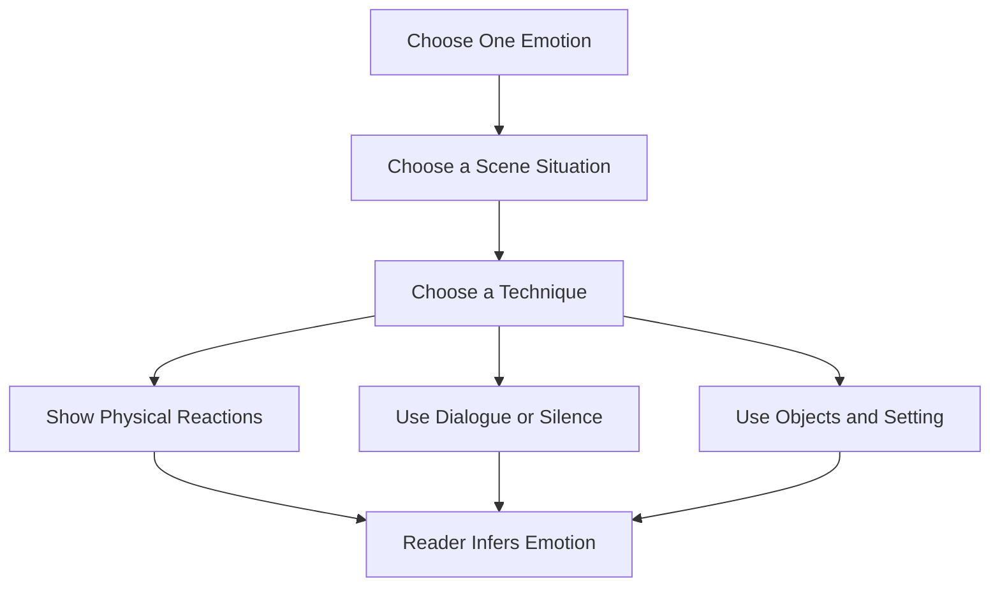
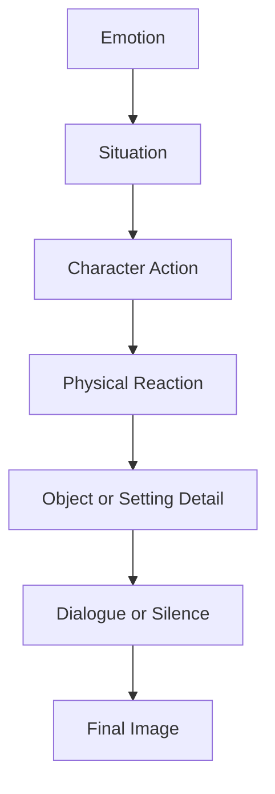
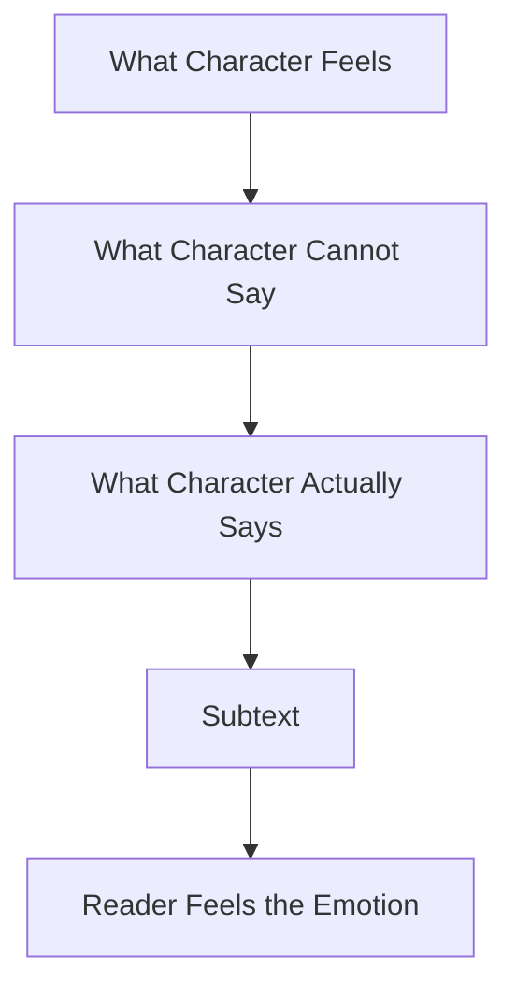
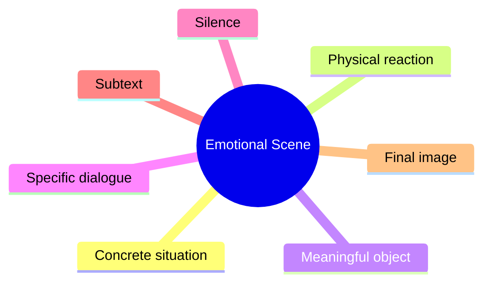

# 009 - Exercise: Writing an Emotional Scene

## Section

**03 - Show, Don’t Tell**

## Original Lecture Title

**Bài tập viết một cảnh cảm xúc**

## Duration

**Not listed**
Writing exercise / discussion segment

---

# Lesson Overview

This lesson is a practical exercise in writing emotion through **images, actions, physical sensations, dialogue, silence, and atmosphere**.

The goal is not to tell the reader what the character feels. The goal is to make the reader feel it.

Instead of writing:

> He was afraid.

You might write:

> His fingers slipped twice before he could turn the key. Behind him, the floorboard creaked again.

The emotion is never named, but the reader understands it.

---

# Core Idea

## Do Not Name the Emotion

In an emotional scene, the strongest writing often avoids directly naming the feeling.

| Direct Telling       | Emotional Showing                                                          |
| -------------------- | -------------------------------------------------------------------------- |
| She was angry.       | She folded the letter once, twice, then tore it cleanly down the middle.   |
| He was terrified.    | His breath caught before every step, as if the hallway might hear him.     |
| She was heartbroken. | She set two plates on the table, then slowly put one back in the cupboard. |
| He felt guilty.      | He kept washing his hands long after the blood was gone.                   |
| She was lonely.      | Her phone lit up only to show the time.                                    |

---

# Diagram: How to Build an Emotional Scene



---

# Key Points

## 1. Emotional Scenes Benefit Most from Showing

Emotional scenes become stronger when they are expressed through:

* physical sensation
* body language
* specific action
* concrete images
* meaningful silence
* sharp dialogue
* environmental details

Instead of explaining what the character feels, show what the feeling does to the body and the scene.

### Example

Weak version:

> Anna was sad because her father had died.

Stronger version:

> Anna opened his closet and pressed her face into the sleeve of his old coat. The smell was almost gone.

The second version lets the reader discover the sadness through action.

---

## 2. Restraint Can Intensify Emotion

A character does not always need to scream, cry, or explain themselves.

Sometimes, underreaction is more powerful than melodrama.

### Example

Melodramatic version:

> He screamed and cried because she had left him.

Restrained version:

> He read the note twice. Then he placed it under the sugar bowl, as if she might come back for tea.

The restrained version hurts because the character is trying to stay ordinary in a moment that is not ordinary at all.

---

# Diagram: Emotional Intensity Through Restraint


---

## 3. Use the Environment to Externalize Emotion

The setting can reflect or contrast the character’s inner state.

Objects, weather, sound, silence, and light can all carry emotional weight.

| Emotion    | Possible Environmental Detail                     |
| ---------- | ------------------------------------------------- |
| Fear       | A hallway light flickering; a door left open      |
| Grief      | An untouched cup of tea; a quiet room             |
| Anger      | A chair pushed too hard; rain striking the window |
| Tenderness | Warm light; a blanket being adjusted              |
| Loneliness | A phone screen glowing in an empty room           |
| Shame      | A mirror avoided; a stain being scrubbed          |

The environment should not simply decorate the scene. It should help reveal what the character cannot say.

---

# Assignment

## Write Something Emotional

Choose one emotion to show in your story.

Possible emotions:

* anger
* fear
* tenderness
* grief
* shame
* longing
* jealousy
* regret
* love
* loneliness

Then choose one technique:

* monologue
* dialogue
* description
* action scene
* memory
* silent interaction
* symbolic scene

The goal is to make the reader feel a chill while reading.

**Maximum length:** 2,500 characters

---

# Exercise Requirement

Write one full emotional scene without naming the emotion directly.

Do not use words such as:

* angry
* sad
* afraid
* happy
* lonely
* guilty
* jealous
* heartbroken
* nervous

Instead, reveal the emotion through what can be seen, heard, touched, or noticed.

---

# Emotional Scene Framework

Use this structure to build the scene:



---

# Step-by-Step Writing Guide

## Step 1: Choose the Emotion

Pick only one main emotion.

Example:

> Fear

Do not write “fear” in the scene itself. Keep it as your private target.

---

## Step 2: Choose the Situation

Give the emotion a concrete situation.

Examples:

| Emotion    | Situation                                     |
| ---------- | --------------------------------------------- |
| Fear       | A man hides from something outside the door.  |
| Grief      | A woman cleans out her husband’s room.        |
| Anger      | Two siblings argue in a car.                  |
| Tenderness | A father fixes his child’s torn backpack.     |
| Shame      | A student returns home after failing an exam. |

---

## Step 3: Show the Body

Emotion affects the body before it becomes language.

Use details such as:

* dry throat
* trembling fingers
* clenched jaw
* shallow breathing
* stiff shoulders
* sweating palms
* eyes avoiding contact
* repeated movements
* delayed reactions

### Example

Instead of:

> He was scared.

Write:

> The knife handle had grown slick in his hand. He wiped it against his shirt and gripped it again.

---

## Step 4: Use Objects

Objects can become emotional symbols.

Examples:

| Object                   | Emotional Use      |
| ------------------------ | ------------------ |
| An empty chair           | Absence            |
| A locked door            | Fear or rejection  |
| A broken cup             | Conflict           |
| A folded letter          | Regret             |
| A child’s toy            | Loss or tenderness |
| A phone with no messages | Loneliness         |

---

## Step 5: Use Dialogue Carefully

Emotional dialogue is often indirect.

People rarely say exactly what they feel. They avoid, deflect, accuse, joke, repeat themselves, or say something too small for the situation.

### Direct Dialogue

> I am hurt because you abandoned me.

### Stronger Dialogue

> “You could have called.”
>
> “I know.”
>
> “That’s all?”

The emotion appears through what is not said.

---

# Diagram: Emotional Dialogue



---

# Technique Options

## Option 1: Monologue

Use a character’s thoughts or spoken confession, but avoid naming the emotion directly.

Best for:

* regret
* longing
* grief
* guilt
* obsession

### Focus On

* fragmented thoughts
* repeated images
* contradictions
* memory details
* things the character avoids saying

---

## Option 2: Dialogue

Use conversation to create emotional tension.

Best for:

* anger
* heartbreak
* family conflict
* jealousy
* betrayal

### Focus On

* interruptions
* silence
* unfinished sentences
* body language between lines
* subtext

---

## Option 3: Description

Use setting, objects, and atmosphere to carry the emotion.

Best for:

* loneliness
* fear
* tenderness
* melancholy
* awe

### Focus On

* light
* sound
* weather
* smell
* texture
* repeated objects
* contrast between inner feeling and outer world

---

# Example Exercise Structure

## Emotion Chosen

Fear

## Technique

Description with small pieces of dialogue

## Scene Situation

A man hides in a storage room while someone familiar knocks on the door.

## Showing Tools

| Tool              | Example                                           |
| ----------------- | ------------------------------------------------- |
| Physical reaction | His hand shakes around the knife.                 |
| Sound             | The door knocks rhythmically.                     |
| Smell             | The air smells like flowers mixed with rot.       |
| Memory            | The smell reminds him of his mother.              |
| Dialogue          | “My Edwin…”                                       |
| Final image       | He tries to scream, but only a whimper comes out. |

---

# What Makes a Scene Emotional?

A scene becomes emotional when the reader understands more than the character says.

Strong emotional scenes usually contain:



---

# Revision Checklist

Before submitting your emotional scene, check the following:

* [ ] Did I choose one clear emotion?
* [ ] Did I avoid naming the emotion directly?
* [ ] Did I show the emotion through the body?
* [ ] Did I include specific actions instead of abstract explanation?
* [ ] Did I use objects or setting to reflect the inner feeling?
* [ ] Did I include silence or subtext?
* [ ] Did I avoid melodrama?
* [ ] Did I create at least one image that stays in the reader’s mind?
* [ ] Could a reader identify the emotion without being told?

---

# Reflection Question

Could a reader correctly identify the emotion in your scene without you naming it?

If not, revise by adding more:

```text
body language + concrete action + object detail + silence + subtext
```

---

# Common Mistakes

## Mistake 1: Naming the Emotion Too Early

Avoid:

> She felt devastated.

Try:

> She picked up the baby shoes, turned them over once, and placed them back in the drawer.

---

## Mistake 2: Explaining Instead of Dramatizing

Avoid:

> He was angry because his brother never respected him.

Try:

> He smiled while his brother spoke. Under the table, his fork bent slightly against his palm.

---

## Mistake 3: Overwriting the Emotion

Avoid making every sentence dramatic. Too much intensity can weaken the scene.

A quiet detail can be stronger than a loud reaction.

---

# Mini Template

Use this template to draft your scene:

```text
A character is in a specific place.
Something emotionally important happens.
The character does not name the feeling.
Their body reacts first.
An object or detail in the setting reflects the emotion.
Dialogue reveals only part of the truth.
The scene ends on a strong image.
```

---

# Key Takeaways

* Emotional scenes are strongest when they are shown, not explained.
* Do not name the emotion; make the reader infer it.
* Use physical sensation, body language, action, and dialogue.
* Restraint can make emotion more powerful.
* Setting and objects can externalize inner feeling.
* Subtext often carries more emotional force than direct confession.
* The final image of the scene should leave an emotional echo.

---

# Summary

This lesson is part of the **Show, Don’t Tell** module.

The exercise asks you to write a highly emotional scene without directly naming the emotion. You may choose anger, fear, tenderness, grief, or any other emotion, and you may use monologue, dialogue, or description.

The most important goal is to make the reader feel something through images, actions, silence, and carefully chosen details.

Do not write the emotion.
Write the evidence of the emotion.
