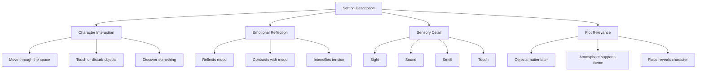

# 010 - Setting

## Section

**03 - Show, Don't Tell**

## Original Lecture Title

**Setting**

## Duration

**6:08**

---

## Overview

Setting sits somewhere between **showing** and **telling**.

A good setting description adds depth to the world of the story. It gives the reader context, atmosphere, and emotional texture. However, if handled poorly, setting can slow the story down and make the reader feel bored or impatient.

The goal is not to stop the story in order to describe a place. The goal is to let the setting become part of the action, the character, and the emotion of the scene.

---

## Key Ideas

### 1. Make the Description Dynamic

The best descriptions are not static. Instead of pausing the story to describe a room, a house, or a landscape, let the character interact with the space.

A character can:

* Walk through the setting
* Touch objects
* Break or disturb something
* Notice specific details
* React physically to the place
* Discover something through the environment

This allows the writer to show both the **character** and the **setting** at the same time.

---

## Example: A Character Interacting with Setting

Instead of simply describing an abandoned part of a manor, the scene follows Ophelia as she moves through it.

She goes up the service stairs and finds a neglected wing of the manor. The furniture in the corridors and antechambers is covered in white sheets, like sleeping ghosts. Dust makes her sneeze. The stale air prepares her for the place, but not for what waits beyond it: damask hangings, a carved bed, frescoed ceilings, and framed photographs on the wall.

This works because the description unfolds through action:

* Ophelia climbs the stairs.
* She enters the neglected wing.
* She reacts to the dust.
* She is drawn forward by curiosity.
* She studies the photographs.

The setting is not frozen. It is discovered.

---

## 2. Link Setting to Emotion

A character’s emotional state affects how they perceive a place.

Two characters can enter the same room and notice completely different things. One may notice beauty, light, and warmth. Another may notice rot, silence, and shadows.

Setting can reflect emotion, contrast with emotion, or intensify emotion.

For example, in a disturbing RV scene, the character does not simply see the place. He smells it, searches through it, turns on the lights, opens drawers, and physically reacts to the stench.

The environment creates discomfort through:

* Smell
* Light
* Touch
* Physical reaction
* Spatial detail
* Character movement

The result is much stronger than simply saying:
**“The RV was disgusting.”**

---

## 3. Avoid Long Static Descriptions

In older novels, it was common for authors to begin with long descriptions of landscapes, houses, or cities.

Modern readers usually expect the story to begin with movement, conflict, or character action. Long blocks of description can slow the pacing.

Instead of writing one long descriptive paragraph, spread the details throughout the scene.

### Weak Approach

> The house was old, large, dark, and full of dusty furniture. There were many rooms, broken windows, and old paintings on the walls.

### Stronger Approach

> Mara pushed the door open with her shoulder. Dust fell from the frame and clung to her lips. Somewhere inside the house, a loose shutter knocked again and again, like a patient hand.

The second version gives fewer details, but they are more specific and active.

---

## 4. Make the Place Match the Character

The place where a character lives or grew up can shape their personality. In turn, the character can also shape the place.

Some places feel as if they could only belong to certain characters.

A proud, violent lord may live in a fortress high above the land.
A lonely widow may live in a house filled with covered mirrors.
A nervous scholar may live in a room crowded with books, notes, and unfinished letters.

The setting should not feel random. It should reveal something about the person who lives there.

---

## 5. Describe Only What the Character Would Notice

Do not describe everything in the room.

Describe what the point-of-view character would actually notice.

A soldier might notice exits, weapons, and places to hide.
A child might notice sweets, shadows, and strange sounds.
A grieving person might notice silence, empty chairs, or objects left behind.

The same setting changes depending on who is looking at it.

---

## 6. Use More Than Sight

Many beginner descriptions rely too much on visual detail. But a place becomes more vivid when multiple senses are involved.

Use:

* Sight
* Sound
* Smell
* Touch
* Temperature
* Texture
* Movement
* Silence

A setting becomes more alive when the character can physically experience it.

---

## Setting Description Diagram

---

## Practical Exercise

Go through your manuscript and find the sections where you describe the setting.

Ask yourself:

1. Did I use a long sequence of descriptive paragraphs?
2. Can I cut the description down?
3. Can I spread the details throughout the scene instead?
4. Are the verbs strong and dynamic?
5. Is the character interacting with the environment?
6. Does the setting reveal something about the character?
7. Did I use senses other than sight?

---

## Revision Checklist

| Question                                    | Purpose                          |
| ------------------------------------------- | -------------------------------- |
| Is the setting active?                      | Prevents static description      |
| Does the character interact with the space? | Makes the scene more dynamic     |
| Are the details specific?                   | Avoids generic backdrops         |
| Are multiple senses used?                   | Makes the place feel alive       |
| Does the setting reflect emotion?           | Connects place to character      |
| Does the setting matter later?              | Prevents meaningless description |
| Is the description too long?                | Protects pacing                  |

---

## Before and After Example

### Telling / Static Description

> The room was old and depressing. It was dusty and dark. Everything looked abandoned.

### Showing / Dynamic Description

> He pushed the door open with two fingers. Dust lifted from the floorboards and drifted into the thin strip of light. The curtains hung stiff against the windows, and when he stepped inside, something small cracked beneath his shoe.

The second version is stronger because it allows the reader to experience the room through action and sensory detail.

---

## Key Takeaways

* Setting should not stop the story.
* Let characters move through and interact with the environment.
* Use setting to reveal emotion, personality, and tension.
* Avoid long descriptive blocks.
* Choose a few precise details instead of describing everything.
* Use smell, sound, touch, and movement, not only sight.
* Describe only what the point-of-view character would realistically notice.
* Make the setting feel specific, lived-in, and meaningful.

---

## Summary

Setting is more than background. It can reveal character, create atmosphere, shape emotion, and support the plot.

A strong setting description does not simply tell the reader what a place looks like. It lets the reader experience the place through the character’s body, senses, memories, fears, and desires.

The best setting is not just seen. It is entered, touched, heard, smelled, and felt.
