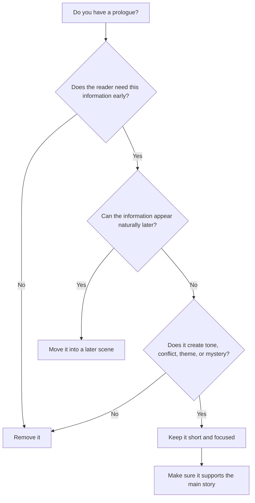
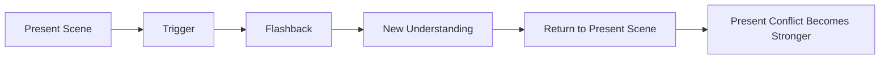

# 011 - Writing Openings and Flashbacks

## Section

**03 - Show, Don't Tell**

## Original Lecture Title

**Cách viết mở đầu truyện và hồi tưởng**
**English:** Writing Openings and Flashbacks

## Duration

**8:30**

---

# 1. Core Idea

Writers often begin their stories **too early**.

Because we fear readers will not understand the story, we tend to explain too much at the beginning. But instead of helping the reader, this often creates the opposite effect:

> We distract the reader from the real story.

A strong opening should give the reader **only what they need**, not everything the writer knows.

---

# 2. What Makes a Good Opening?

A good opening should quickly orient the reader without becoming an information dump.

## A scene opening should answer:

* **Who** is present?
* **Where** are we?
* **When** are we, roughly?
* **What is happening right now?**
* **Why should the reader keep reading?**

## Bad opening habit

Many writers begin with:

* Too much backstory
* Too much worldbuilding
* Too much explanation
* A prologue that feels disconnected
* A history lesson before the actual story begins

## Better opening principle

> Start as close as possible to the real conflict.

---

# 3. Prologue

## What Is a Prologue?

A **prologue** is a scene that happens before the main story begins.

It may take place:

* Months earlier
* Years earlier
* Decades earlier
* Centuries earlier

A prologue usually reveals something important that helps the reader understand the story later.

---

# 4. The Two Goals of a Prologue

A prologue has to achieve two opposite goals at the same time.

| Goal                                | Explanation                                                                                             |
| ----------------------------------- | ------------------------------------------------------------------------------------------------------- |
| **Grab the reader’s attention**     | It should create curiosity, mystery, tone, or emotional interest.                                       |
| **Avoid outshining the main story** | It should not feel more important, more exciting, or more stylistically powerful than the actual novel. |

A prologue should support the story, not replace the story.

---

# 5. What the Best Prologues Do

The best prologues are usually:

* Short
* Focused
* Atmospheric
* Thematically relevant
* Connected to the main conflict
* Not overloaded with explanation

They give the reader **as little information as necessary**.

Their purpose is often to help the reader understand:

* A character
* A goal
* A conflict
* A theme
* The tone of the novel

---

# 6. Examples of Prologues

## Example 1: *The Alchemist* by Paulo Coelho

The prologue introduces the myth of Narcissus.

This does not directly explain the plot, but it prepares the reader for:

* The magical tone of the novel
* The symbolic style of the story
* The theme of desire and self-knowledge

The central thematic question can be understood as:

> Is it possible to pursue one’s desires and still live a life that is truly worth living?

---

## Example 2: *Harry Potter and the Philosopher’s Stone* by J.K. Rowling

The first chapter works almost like a prologue.

It takes place ten years before the main story begins and shows Harry being left with the Dursley family.

In one chapter, the reader receives:

* The Dursley family
* The magical tone of the world
* Dumbledore and Professor McGonagall
* The mystery surrounding Harry
* The contrast between the ordinary world and the magical world

Harry himself appears only at the end, but his name is mentioned many times, building curiosity around him.

This makes the opening powerful because the reader is prepared to care about Harry before really meeting him.

---

## Example 3: *Demian* by Hermann Hesse

The prologue does not focus mainly on the plot.

Instead, it introduces the philosophical and spiritual concerns of the novel:

* Who are we?
* Why are we here?
* What makes a human life meaningful?
* What is the relationship between the individual and the divine?

This prepares the reader for a coming-of-age story about inner transformation.

---

# 7. Prologue Decision Diagram

---

# 8. Flashback

## What Is a Flashback?

A **flashback** is a scene from the past inserted into the present narrative.

Unlike a prologue, a flashback happens **during the course of the story**, not before the story begins.

A flashback allows the reader to enter a moment from the character’s past as if it were happening again.

---

# 9. The Function of a Flashback

A flashback should not exist only to provide background information.

It should change how the reader understands the present scene.

A strong flashback should:

* Reveal an important past event
* Deepen the current conflict
* Explain a character’s behavior
* Increase emotional stakes
* Change the reader’s understanding of the present moment

---

# 10. Flashback Trigger

A flashback should be triggered naturally by something in the present scene.

Possible triggers include:

* A photograph
* An object
* A smell
* A place
* A song
* A line of dialogue
* A repeated gesture
* A similar emotional situation

The trigger connects the present moment to the past.

---

# 11. Flashback Structure Diagram

---

# 12. Examples of Flashbacks

## Example 1: *The Odyssey*

One of the earliest examples of flashback appears in *The Odyssey*.

Odysseus attends a banquet held in his honor. A singer recounts the fall of Troy, which deeply affects him. This moment pushes Odysseus to reveal his identity and tell the story of his adventures.

The flashback is not random. It is triggered by a present event: the song at the banquet.

---

## Example 2: The Food Critic Scene

A food critic tastes a dish and is suddenly taken back to his childhood, when his mother made the same food for him.

This flashback explains his emotional reaction in the present.

Without the flashback, the reader or viewer may not understand why the dish changes him so deeply.

---

## Example 3: *Harry Potter*

In the *Harry Potter* series, flashbacks are often shown through the Pensieve.

The Pensieve allows characters to revisit memories directly, giving the reader access to hidden past events.

This is an effective device because the flashback is built into the fantasy world itself.

---

# 13. Seven Useful Tips for Writing Flashbacks

## 1. Keep the flashback short

If the flashback lasts too long, the reader may lose track of the present story.

The longer the interruption, the greater the risk of slowing the novel down.

---

## 2. Avoid flashbacks in the first third of the novel

Give readers time to understand:

* The main character
* The present conflict
* The world of the story
* The general timeline

If a flashback appears too early, readers may feel disoriented.

---

## 3. Follow the flashback with a strong present-day scene

After the flashback, return to a scene with tension, movement, or consequence.

If the present scene after the flashback is weak, readers may lose momentum.

---

## 4. Give clear time and place information

At the beginning of a flashback, the reader should quickly know:

* When this is happening
* Where this is happening
* Who is present
* How old the character is, if relevant

Do not let the reader feel lost.

---

## 5. Change the tense carefully

If the main story is written in present tense, the flashback should not feel identical to the present narrative.

Tense helps the reader understand when the scene is happening.

---

## 6. Do not rely on italics

Long italicized passages can be difficult to read.

Italics may work for a short memory fragment, but they are usually not ideal for a full flashback scene.

---

## 7. Avoid flashbacks inside flashbacks

Do not create a “Chinese box” effect where one memory leads into another memory, then another.

This can make the reader lose their temporal reference point.

---

# 14. Flashback Checklist

Use this checklist when revising a flashback.

| Question                                                  | Purpose                                      |
| --------------------------------------------------------- | -------------------------------------------- |
| What triggers the flashback in the present scene?         | Ensures the memory feels natural.            |
| Does the flashback reveal something necessary?            | Prevents unnecessary backstory.              |
| Does it change the reader’s understanding of the present? | Makes the flashback meaningful.              |
| Is it short enough?                                       | Protects narrative momentum.                 |
| Is the time and place clear?                              | Prevents confusion.                          |
| Does the story return to a strong present scene?          | Keeps the reader engaged.                    |
| Could this information be shown another way?              | Tests whether the flashback is truly needed. |

---

# 15. Prologue vs. Flashback

| Element      | Prologue                                                  | Flashback                                         |
| ------------ | --------------------------------------------------------- | ------------------------------------------------- |
| Placement    | Before the main story begins                              | During the main story                             |
| Function     | Prepares the reader for theme, conflict, tone, or mystery | Reveals past information that affects the present |
| Risk         | Starting too early or distracting from the main plot      | Slowing down present action                       |
| Best use     | When early context is essential                           | When past events reshape the current scene        |
| Ideal length | Short                                                     | Shorter than the present scenes around it         |

---

# 16. Revision Questions for Your Own Novel

Look at the first chapter of your novel.

## If you have a prologue, ask:

1. Does the reader truly need this information to understand the story?
2. Could this scene be removed?
3. Could this information be moved to a later scene?
4. Does the prologue create tone, theme, conflict, or mystery?
5. Is the prologue shorter and less dominant than the main story?

## If you have a flashback, ask:

1. Is the flashback clearly triggered by something in the present?
2. What is the trigger?
3. Is the flashback placed at the right moment?
4. Is the information important enough to justify interrupting the present story?
5. Could the flashback be shortened?
6. Could the same information be revealed through action, dialogue, or objects instead?

---

# 17. Practical Exercise

Choose one flashback from your draft.

Then do the following:

1. Identify the present-moment trigger.
2. Mark the exact point where the flashback begins.
3. Mark the exact point where the story returns to the present.
4. Cut the flashback by at least **20%**.
5. Check whether the present scene becomes stronger after the cut.

---

# 18. Reflection Question

> Does your flashback change how the reader understands the present scene, or is it only background information?

If it only provides background, consider removing it, shortening it, or moving the information into the present action.

---

# 19. Key Takeaways

* Writers often begin stories too early because they fear readers will not understand.
* A strong opening gives only the necessary information.
* A prologue should be short, focused, and connected to theme, tone, conflict, or mystery.
* A flashback should be triggered by something in the present scene.
* Flashbacks should serve present-tense stakes, not simple backstory curiosity.
* Keep flashbacks shorter than the present-day scenes around them.
* After a flashback, return to a strong present scene with tension or consequence.

---

# 20. Summary

This lesson explains how to handle **story openings, prologues, and flashbacks** without slowing down the narrative.

The main craft principle is restraint.

Do not begin too early.
Do not explain too much.
Do not interrupt the present story unless the past changes the reader’s understanding of the present.

In fiction, the past matters most when it makes the current scene more powerful.

---

# Bài luyện tập

## Mục tiêu

## Đề bài

## Yêu cầu hoàn thành

- [ ] 
- [ ] 
- [ ] 

## Kết quả / lời giải

## Ghi chú
