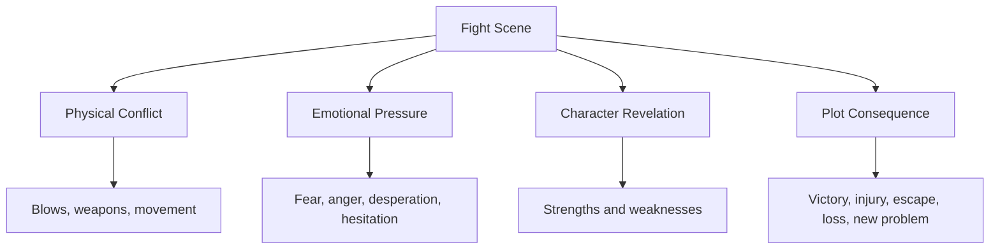
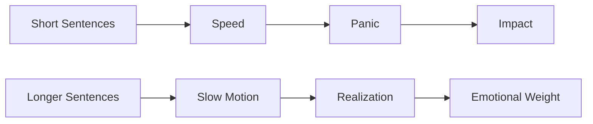
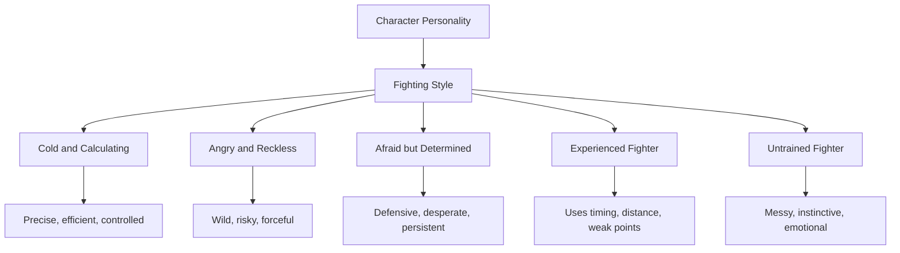
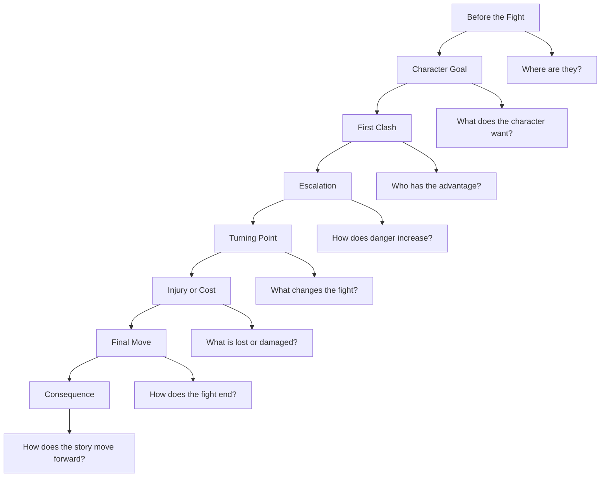

# 012 - Writing Fight Scenes

## Section

**03 - Show, Don't Tell**

## Original Lecture Title

**Writing Fight Scenes**

## Duration

**7:48**

---

## Lesson Overview

Fight scenes in fiction are very different from fight scenes in movies.

In film, the audience can see every punch, kick, dodge, explosion, or gunshot directly. The visual movement creates adrenaline.

In prose, however, describing every single blow can slow the story down. A long, detailed list of punches and movements can become confusing, frustrating, or boring for the reader.

A good fight scene is not just about physical action. It should also reveal:

* The character's physical condition
* The character's emotional state
* The stakes of the conflict
* The choices the character makes under pressure
* The consequences that push the plot forward

---

## Core Principle

> A fight scene should not be a mechanical list of blows.
> It should be a dramatic scene that reveals character and changes the story.

---

## Why Fight Scenes Often Fail

Fight scenes become weak when they are written as pure choreography:

```text
He punched.
She dodged.
He kicked.
She blocked.
He swung again.
She ducked.
```

This kind of writing may be clear, but it quickly becomes repetitive. It tells the reader what happens physically, but it does not show why the fight matters.

A stronger fight scene combines physical action with emotion, intention, danger, and consequence.

---

## What a Fight Scene Should Do

A fight scene should serve a specific function in the story.

It may allow the character to:

* Gain something important
* Escape danger
* Protect someone
* Lose something valuable
* Reveal courage, fear, cruelty, skill, or weakness
* Suffer an injury that affects later scenes
* Make a decision that changes the plot

---

## Fight Scene Function Diagram



---

## Key Techniques for Writing Fight Scenes

### 1. Balance Action and Inner Reaction

A fight scene should include physical action, but it should also show what the character feels, notices, fears, or decides.

For example, a character may:

* Panic
* Stay calm
* Misjudge the opponent
* Fight dirty
* Refuse to hurt someone
* Become reckless
* Use the environment creatively

The fight becomes more interesting when the reader understands what is happening inside the character, not just outside.

---

### 2. Use a Limited Point of View

A limited point of view can create suspense.

If the scene is written from one character's perspective, the reader only knows what that character knows. This makes the fight feel more immediate and dangerous.

The character may not see:

* An enemy behind them
* A weapon on the floor
* A second attacker
* A hidden escape route
* A spectator about to interfere

This uncertainty creates tension.

---

### 3. Keep the Action Clear

The reader should be able to understand the basic physical situation.

They should know:

* Who is fighting
* Where they are
* What weapons or objects are nearby
* Who has the advantage
* What the immediate danger is

Avoid overloading the reader with too many movements at once.

---

### 4. Vary Sentence Rhythm

Sentence length controls pace.

Short sentences make the action feel fast:

```text
He slipped.
The knife flashed.
She ducked.
Too late.
```

Longer sentences can slow the moment down for emphasis:

```text
For one strange second, he saw the broken glass glittering beneath her hand and understood what she meant to do.
```

Use short sentences for speed and longer sentences for important dramatic beats.

---

## Sentence Rhythm Diagram



---

## Example: Weak vs Strong Fight Writing

### Weak Version

```text
He punched Tyler. Tyler dodged. Then Tyler punched him back. He fell. Tyler kicked him. He stood up and punched again.
```

### Stronger Version

```text
I swung too wide.

Tyler barely moved. My fist scraped past his jaw and hit nothing but air.

He smiled.

Then his fist drove into my chest, hard and sudden, like a cartoon boxing glove on a spring. I stumbled back, gasping.

"That counted," he said.
```

### Why the Stronger Version Works

The stronger version includes:

* Clear physical action
* A limited point of view
* Character attitude
* Humor and humiliation
* A sense of rhythm
* A specific physical sensation

---

## Character and Fighting Style

The way a character fights reveals personality.

A character may fight with:

* Discipline
* Rage
* Fear
* Desperation
* Calculation
* Mercy
* Cruelty
* Improvisation
* Training
* Pure instinct

A trained fighter and an amateur should not fight the same way. A cold, controlled character should not fight like a reckless, emotional one.

---

## Character Fighting Style Map



---

## Make Every Fight Unique

Even if your character has a specific fighting style, every fight should feel different.

A fight can be shaped by:

* Location
* Weather
* Weapons
* Injury
* Number of enemies
* Emotional stakes
* Physical exhaustion
* Surprise
* Fear
* The presence of spectators
* The need to protect someone else

The character does not always need to win through strength. They may win through:

* Deception
* Strategy
* Endurance
* Luck
* A unique skill
* Environmental advantage
* Help from an ally

---

## Let the Reader Choreograph Some of the Action

You do not need to describe every movement.

Instead of explaining every punch, step, turn, and dodge, give the reader enough strong details to imagine the rest.

Focus on:

* Key impacts
* Turning points
* Emotional reactions
* Tactical changes
* Consequences

The reader can fill in some of the motion.

---

## Fight Scene Structure



---

## Fight Scene Checklist

Before writing a fight scene, answer these questions:

### Character Questions

1. What are the physical traits of your character?
2. Are they left-handed or right-handed?
3. Are they athletic or out of shape?
4. Do they have combat training?
5. Are they calm, reckless, afraid, angry, or desperate?
6. Do they want to fight, or are they forced into it?

### Enemy Questions

1. How prepared are the enemies?
2. Do they have training?
3. Are they stronger, faster, smarter, or better armed?
4. Do they have a weakness the protagonist can exploit?

### Setting Questions

1. Where does the fight happen?
2. What objects are nearby?
3. Are there possible weapons in the environment?
4. Is the space open, narrow, crowded, dark, slippery, or unstable?
5. Can the character escape?

### Weapon Questions

1. Are the fighters armed?
2. What weapons do they have?
3. Are the weapons familiar or unfamiliar to them?
4. Can the weapon break, jam, slip, or be lost?

### Stakes and Consequences

1. What does the protagonist want from this fight?
2. What happens if they lose?
3. Will anyone be injured?
4. What are the consequences of the wound?
5. Does the fight delay the character later?
6. Does the fight change the relationship between characters?
7. What should the reader learn from this fight?

### Spectator Questions

1. Is anyone watching?
2. Do they intervene?
3. Do they run away?
4. Do they call for help?
5. Do they misunderstand what is happening?

---

## Practical Exercise

Rewrite one action beat from your draft using only short, concrete sentences.

Focus on:

* One point of view
* Clear physical action
* Immediate danger
* Specific sensory detail
* No unnecessary explanation

### Exercise Template

```text
Original action beat:

[Paste your original version here.]

Rewritten version:

[Rewrite using short, concrete sentences.]

What changed?

- The action became clearer because:
- The pacing became faster because:
- The character's emotion became stronger because:
```

---

## Reflection Questions

1. Does your fight scene reveal anything about the character?
2. Does the fight change the plot?
3. Could the scene be removed without affecting the story?
4. Is the action easy to visualize?
5. Are you describing too many movements?
6. Does the scene have emotional stakes?
7. What is the most important consequence of the fight?

---

## Key Takeaways

* Fight scenes should reveal character, not just describe violence.
* Clear choreography is important, but too much detail slows the pace.
* Short sentences create speed and urgency.
* Longer sentences can emphasize key emotional or dramatic moments.
* A limited point of view creates suspense.
* Every fight should have a story function.
* The way a character fights should reflect who they are.
* The aftermath of the fight is just as important as the fight itself.

---

## Summary

This lesson belongs to the **Show, Don't Tell** module.

A strong fight scene is not simply a sequence of punches, kicks, or shots. It is a dramatic moment where physical danger, emotional pressure, and character choice collide.

The best fight scenes are clear, tense, specific, and meaningful. They move the story forward, reveal the characters under pressure, and leave consequences that matter after the violence ends.

---

# Bài luyện tập

## Mục tiêu


## Đề bài


## Yêu cầu hoàn thành

- [ ] 
- [ ] 
- [ ] 

## Kết quả / lời giải


## Ghi chú
