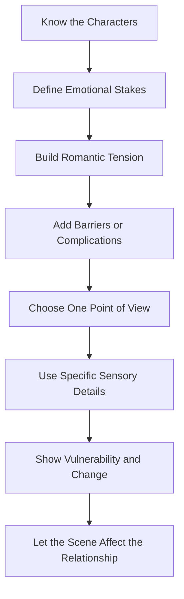

# 013 - Writing Romantic Scenes

## Section

**03 - Show, Don't Tell**

## Original Lecture Title

**Writing Romantic Scenes**

## Duration

**8:38**

---

## Lesson Overview

Writing romantic scenes can be difficult because romance and intimacy often touch the writer’s own emotions, values, embarrassment, fantasies, or discomfort.

A weak romantic scene often becomes either too vague, too melodramatic, or too mechanical. A strong romantic scene does more than describe physical attraction. It reveals character, emotional risk, vulnerability, power dynamics, and the changing relationship between two people.

The goal is not simply to write “love” directly. The goal is to make the reader feel the tension through behavior, subtext, restraint, and carefully chosen physical details.

---

## Core Principle

> A romantic scene should develop the relationship, not pause the story.

Romance should not feel like a separate decorative moment. It should affect the characters, raise emotional stakes, reveal hidden fears, or change the direction of the relationship.

---

## Key Points

### 1. Know Your Characters First

Before writing a romantic or intimate scene, understand the characters involved.

Their behavior should come from:

* Personality
* Past experiences
* Emotional wounds
* Desires
* Fears
* Moral values
* Social pressure
* Relationship history

Different characters will respond to intimacy in different ways.

For example:

* A reckless character may act quickly.
* A guarded character may hesitate.
* A hopeless romantic may idealize the moment.
* A selfish character may learn tenderness through love.
* A traumatized character may struggle with vulnerability.
* A confident character may still feel emotionally exposed.

Romantic scenes become believable when the intimacy matches the characters’ emotional truth.

---

### 2. Balance Physical Action with Emotional Meaning

A romantic scene should not focus only on physical description. It should also show what the moment means to the characters.

Ask:

* Why do these characters want each other?
* What emotional need is being expressed?
* What changes between them during the scene?
* What is being risked?
* What is being revealed?
* What remains unsaid?

A romantic scene can show characters being “naked” emotionally as much as physically.

---

### 3. Use Restraint and Subtext

Romantic tension often becomes stronger when the characters do not say exactly what they feel.

Instead of writing:

> He loved her desperately.

Show it through action:

> He reached for the cup before she did, then stopped, remembering she hated being helped when she was angry.

Small gestures can reveal attraction more powerfully than direct declarations.

Useful tools include:

* Eye contact
* Silence
* Accidental touch
* Avoided touch
* Interrupted speech
* Nervous habits
* Changes in breathing
* Noticing small details
* Delayed confession
* Emotional contradiction

---

### 4. Avoid Generic Romantic Language

Generic romantic language often feels flat because it could apply to anyone.

Avoid vague phrases such as:

* “She was beautiful.”
* “He felt desire.”
* “Their love was powerful.”
* “It was magical.”
* “They were perfect together.”

Instead, use character-specific details.

Better examples:

* What does this character uniquely notice?
* What physical detail matters only because of their relationship?
* What memory does the moment trigger?
* What small action reveals trust or hesitation?
* What detail would another character miss?

Romance becomes more vivid when it is specific.

---

### 5. Do Not Depend on Euphemisms

Some writers avoid directness by using awkward euphemisms or overly formal language. This can make a romantic scene sound unnatural or unintentionally funny.

You do not always need explicit body-part language. You can often create intimacy through suggestion, rhythm, silence, and implication.

The key is tonal consistency.

Ask:

* Does the language match the characters?
* Does the description match the genre?
* Does the scene feel emotionally honest?
* Is the wording natural, or does it sound embarrassed?

---

### 6. Create Romantic and Sexual Tension Before the Scene

A strong romantic scene usually needs preparation.

The reader should feel the tension building before the characters finally act on it.

Ways to build tension:

* Forced proximity
* Emotional conflict
* Opposing personalities
* Forbidden attraction
* Social barriers
* Unresolved arguments
* Shared danger
* Private jokes
* Repeated near-confessions
* Moments where touch almost happens but does not

The reader should wonder:

> When will these two finally admit what is happening between them?

Romantic tension works like an invisible dance. Each scene becomes another step toward intimacy.

---

### 7. Add Complication

Romance without complication often lacks tension.

Complications can be:

* Moral
* Emotional
* Social
* Physical
* Political
* Familial
* Psychological
* Situational

Examples:

* They are enemies.
* One character is hiding something.
* Their families oppose the relationship.
* One character fears vulnerability.
* One character has power over the other.
* Their goals conflict.
* The timing is wrong.
* Trust has not yet been earned.

A good romantic scene should carry consequences.

---

### 8. Avoid Clichés

Romantic clichés weaken emotional impact because the reader has seen them too many times.

Avoid overused patterns such as:

* The plain girl becoming “beautiful” overnight
* Lovers breaking up because of a silly misunderstanding
* A severely wounded hero suddenly performing impossible physical feats
* The playboy who says he was bored with every woman until “the right one”
* Instant love without emotional development
* Attraction based only on appearance
* Perfect intimacy with no awkwardness, fear, or vulnerability

A scene becomes stronger when it feels particular to these characters and this story.

---

### 9. Choose a Specific Point of View

A romantic scene should usually stay close to one character’s point of view.

This allows the reader to experience:

* What the character notices
* What they misunderstand
* What they fear
* What they desire
* What they cannot say
* What they hope the other person notices

Two characters may experience the same romantic moment very differently.

A focused point of view makes the scene more intimate, grounded, and emotionally specific.

---

## Show, Don’t Tell Techniques for Romantic Scenes

| Instead of Telling                   | Show Through                                           |
| ------------------------------------ | ------------------------------------------------------ |
| “He wanted her.”                     | Lingering attention, hesitation, changed behavior      |
| “She was nervous.”                   | Fumbled words, avoiding eye contact, restless hands    |
| “They were attracted to each other.” | Subtext, pauses, proximity, charged silence            |
| “He loved her.”                      | Sacrifice, restraint, memory, careful attention        |
| “She trusted him.”                   | Relaxed body language, vulnerability, lowered defenses |
| “The moment was romantic.”           | Sensory details, emotional stakes, meaningful action   |

---

## Scene-Building Diagram

---

## Romantic Scene Structure

---

## Practical Exercise

Rewrite a romantic scene from your draft.

Rules:

1. Cut every sentence that directly states a character’s feelings.
2. Replace stated emotion with action, body language, sensory detail, or subtext.
3. Keep the scene in one character’s point of view.
4. Make sure the scene changes the relationship in some way.

---

## Reflection Questions

1. What is emotionally at stake for each character?
2. What does each character want from the other?
3. What is each character afraid of?
4. What does the point-of-view character notice that nobody else would notice?
5. Are there social, emotional, or moral barriers between them?
6. What would ruin the relationship if it happened?
7. What could force the characters closer together?
8. How does this romantic moment change the relationship?
9. Does the scene reveal character, or only describe attraction?
10. Could the scene still work if all direct emotional labels were removed?

---

## Common Mistakes

### Mistake 1: Writing Only Physical Description

A romantic scene should not read like a list of actions. It should carry emotional meaning.

### Mistake 2: Explaining the Feelings Too Directly

Do not tell the reader what the characters feel every few lines. Let the reader infer emotion through behavior.

### Mistake 3: Using Generic Romantic Phrases

Avoid language that could fit any couple. Make the scene specific to these characters.

### Mistake 4: Forgetting the Relationship

The scene should develop the bond, conflict, trust, fear, or distance between the characters.

### Mistake 5: Ignoring Consequences

After the romantic scene, something should be different.

---

## Writing Checklist

Before finishing a romantic scene, check:

* [ ] Does the scene match the characters’ personalities?
* [ ] Does it reveal vulnerability?
* [ ] Does it contain emotional stakes?
* [ ] Does it use specific sensory details?
* [ ] Does it avoid clichés?
* [ ] Does it stay in a clear point of view?
* [ ] Does it rely on subtext instead of direct explanation?
* [ ] Does it change the relationship?
* [ ] Does it feel necessary to the story?
* [ ] Would the story lose something important if this scene were removed?

---

## Summary

Romantic scenes are difficult because they expose both the characters and the writer. The solution is not to avoid intimacy, but to write it with honesty, specificity, and purpose.

A strong romantic scene should:

* Fit the characters
* Build on earlier tension
* Use restraint and subtext
* Balance physical action with emotional meaning
* Avoid clichés
* Stay grounded in point of view
* Change the relationship in some way

Romance works best when it is not just about attraction, but about what attraction reveals.

---

# Bài luyện tập

## Mục tiêu

## Đề bài

## Yêu cầu hoàn thành

- [ ] 
- [ ] 
- [ ] 

## Kết quả / lời giải

## Ghi chú
