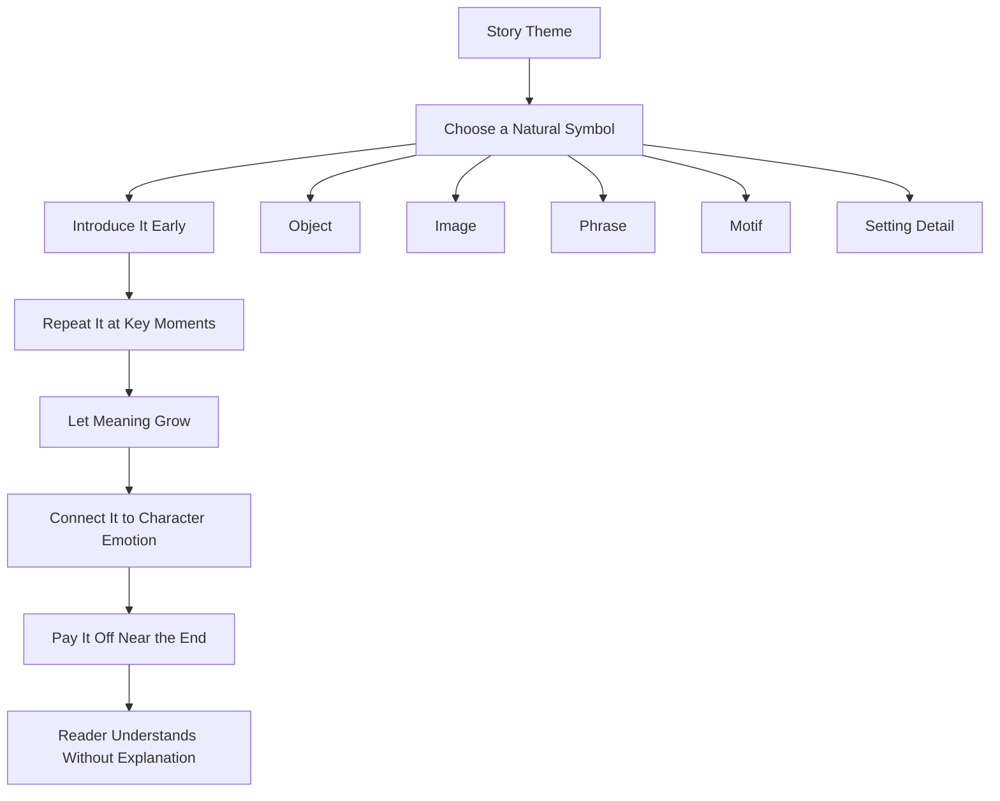
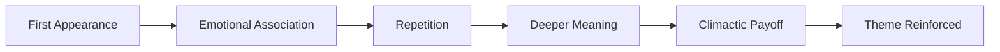

# 014 - Using Symbolism

## Section

**03 - Show, Don't Tell**

## Original Lecture Title

**Using Symbolism**

## Duration

**4:47**

---

## 1. Lesson Overview

Symbolism is the use of an object, image, phrase, motif, or recurring element to represent a deeper idea, emotion, or theme.

A symbol can give a story emotional depth without directly explaining everything to the reader. When used well, symbolism ties events together and makes the story feel more meaningful and unique.

However, if symbolism is too obvious or forced, it can make the story feel heavy-handed or artificial.

---

## 2. What Is a Symbol?

The word **symbol** comes from Latin and Greek roots meaning **sign** or **mark**.

A symbol is something concrete that points toward something abstract.

### Examples

| Symbol  | Possible Meaning              |
| ------- | ----------------------------- |
| Spring  | Rebirth, renewal, redemption  |
| Lion    | Courage                       |
| Dove    | Peace                         |
| Fire    | Anger, passion, destruction   |
| Water   | Purification, healing, change |
| Illness | Sin, corruption, inner decay  |
| Birds   | Captivity, freedom, longing   |

---

## 3. Why Symbolism Matters

Symbolism can have a strong impact on the reader’s imagination and emotions.

It allows the writer to communicate ideas indirectly. Instead of telling the reader what a character feels or what the theme means, the writer lets a recurring image or object carry that meaning.

### Symbolism helps you:

* Deepen the emotional meaning of a scene.
* Connect different parts of the story.
* Reinforce the central theme.
* Create memorable images.
* Let readers interpret meaning for themselves.

---

## 4. The Best Symbols Grow Naturally

The most powerful symbols are not inserted randomly. They grow naturally from the story world.

A good symbol should feel like it belongs in the plot from the beginning.

It should not feel like the author suddenly added it just to sound deep or literary.

### Strong symbolism should be:

* Introduced early.
* Connected to the character or plot.
* Repeated meaningfully.
* Subtle rather than over-explained.
* Linked to the story’s theme.

---

## 5. Two Types of Symbolism

### 5.1 Universal or Familiar Symbols

These are symbols that already have widely recognized meanings.

Examples:

* A lion often represents courage.
* A dove often represents peace.
* Spring often represents rebirth.
* Darkness often represents fear, danger, or ignorance.
* Light often represents truth, hope, or understanding.

These symbols are useful because readers already understand them quickly.

### 5.2 Original Story-Specific Symbols

A writer can also create a new symbol that gains meaning inside the story.

For example, a broken watch might become a symbol of a character’s inability to move on from the past.

The object itself does not have to be universally symbolic. Its meaning develops through repetition and context.

---

## 6. Key Rule: Establish the Symbol Early

A symbol should be planted early in the story.

Its significance can then grow as the story develops.

If a symbol appears only at the end, it may feel random or unearned.

### Weak Symbolism

> A mysterious object appears near the ending and suddenly represents the theme.

### Strong Symbolism

> An object appears early, returns at important emotional moments, and gains deeper meaning each time.

---

## 7. Example: *The Patriot*

A strong example of symbolism appears in the film *The Patriot* by Roland Emmerich.

After Benjamin Martin’s son is killed by a British colonel, Benjamin saves his son’s toy soldiers from their burning home.

Later, he melts the toy soldiers and turns the iron into bullets.

These toy soldiers appear throughout the movie and represent several emotions at once:

* Loss
* Grief
* Anger
* Vengeance
* Memory
* The cost of war
* A father’s love for his son

Near the final conflict, Benjamin melts the last toy soldier into a bullet that he uses against the antagonist.

The symbol works because it is tied directly to the character’s emotional journey and the plot.

---

## 8. Do Not Explain the Symbol Too Much

Good symbolism does not need to be explained directly.

The reader should understand the meaning through context, repetition, and emotional association.

### Avoid writing like this:

> The toy soldier represented Benjamin’s grief and desire for revenge.

### Stronger version:

> Benjamin held the last toy soldier over the fire. The metal softened, lost its shape, and became a bullet.

The second version allows the reader to feel the symbolism without being told what it means.

---

## 9. Example: *The Double* by José Saramago

In *The Double*, a lonely professor rents a comedy movie and sees an extra who looks exactly like him.

The man does not simply resemble him. He appears to be his double.

From that point on, the professor becomes obsessed with finding this other version of himself.

The story creates a disturbing symbolic exploration of:

* Identity
* Selfhood
* Doubles
* Alienation
* The fear of not being unique

The symbolism works because the double is not just a decorative idea. It is central to the plot and the character’s psychological conflict.

---

## 10. Symbolism as a Recurring Element

A symbol becomes powerful through repetition.

It should appear more than once and gain meaning each time.

A symbol may be:

* An object
* A phrase
* A place
* A color
* A sound
* A gesture
* A repeated image
* A natural element

The more carefully it is repeated, the more emotional weight it can carry.

---

## 11. Example: *The Princess Bride*

In *The Princess Bride*, the phrase:

> “As you wish.”

becomes symbolic.

When Westley says it to Buttercup, the phrase actually means:

> “I love you.”

The sentence returns throughout the story and helps Buttercup recognize Westley when she thinks he is dead.

It also appears near the end, when the grandfather promises the boy that he will return and tell him another story.

Here, a simple phrase becomes a symbol of love, loyalty, and storytelling itself.

---

## 12. Visual Metaphors as Symbols

Some of the best symbols in literature are also visual metaphors.

They echo important thematic ideas through imagery.

### Examples

| Visual Symbol   | Possible Meaning                      |
| --------------- | ------------------------------------- |
| Fire            | Anger, passion, destruction           |
| A stream        | Purification, renewal                 |
| Illness         | Sin, corruption, moral decay          |
| Birds           | Captivity, freedom, spiritual longing |
| A locked room   | Secrets, repression, trauma           |
| A broken mirror | Fragmented identity                   |
| A bridge        | Transition, connection, choice        |

---

## 13. Example: Birds in *Jane Eyre*

In *Jane Eyre*, birds are used as symbols of captivity and the desire for freedom.

Different birds reflect different characters and emotional states.

### Examples

| Bird Image             | Symbolic Meaning                           |
| ---------------------- | ------------------------------------------ |
| Small birds / sparrows | Jane’s vulnerability and simplicity        |
| Birds in cages         | Captivity and restriction                  |
| Birds of prey          | Rochester’s darker, more powerful presence |
| Flight imagery         | Freedom, escape, self-realization          |

The bird imagery connects directly to the novel’s themes of independence, confinement, and emotional liberation.

---

## 14. Symbolism Diagram

---

## 15. Symbol Development Structure

---

## 16. Practical Exercise

Read through your current story and look for an element that already has special meaning.

It could be:

* An object
* A place
* A phrase
* A memory
* A color
* A sound
* A piece of clothing
* A family item
* A repeated image

Then answer these questions:

1. Why does this element matter?
2. What does it mean to the character?
3. How does its meaning change over the story?
4. Where can it appear three times?
5. How can it connect to the story’s main theme?

---

## 17. Symbol Tracking Table

| Symbol               | First Appearance         | Second Appearance   | Final Payoff                         | Meaning                  |
| -------------------- | ------------------------ | ------------------- | ------------------------------------ | ------------------------ |
| Example: Toy soldier | Saved from burning house | Melted into bullets | Final bullet used against antagonist | Grief, vengeance, memory |
| Your symbol          |                          |                     |                                      |                          |

---

## 18. Reflection Questions

1. Does your central symbol connect clearly to your one-line theme statement?
2. Does the symbol arise naturally from the story world?
3. Is the symbol repeated enough to gain meaning?
4. Are you explaining the symbol too directly?
5. Does the symbol change meaning as the character changes?
6. Does the final use of the symbol feel earned?

---

## 19. Key Takeaways

* A symbol is a concrete element that represents a deeper idea.
* Symbols work best when they are introduced early.
* Do not explain symbols too directly.
* Repetition gives a symbol emotional power.
* A symbol should grow naturally from the plot, character, and theme.
* The best symbols help the reader feel meaning instead of simply being told what to think.

---

## 20. Summary

Symbolism is one of the most powerful tools in **Show, Don’t Tell**.

A recurring object, phrase, image, or motif can carry emotional and thematic meaning without direct explanation. The strongest symbols feel natural to the story world, appear early, recur at important moments, and gain meaning as the plot develops.

When used subtly, symbolism helps the reader experience the deeper meaning of the story instead of being told what it means.
