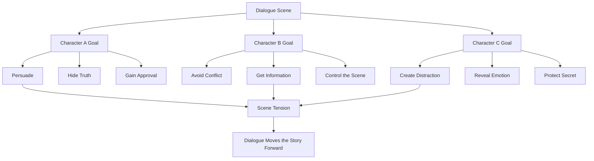

# 001 - One Character, One Line, One Goal

## Section

**04 - Dialogue**

## Original Lecture Title

**One Character, One Line, One Goal**

## Duration

**6:55**

---

## Overview

Dialogue is often defined as a conversation between two or more people in a story.

That definition is technically correct, but it is not enough for fiction writing. If we treat dialogue as ordinary conversation, we may end up writing flat exchanges like:

> “Hi, James.”
> “Nice to meet you.”
> “Hi, Maria.”
> “How are you?”
> “Fine, thank you.”

This is dialogue, but it is not good dialogue.

In fiction, dialogue should not merely imitate real-life conversation. It should move the scene forward, reveal character, create tension, or change the relationship between characters.

---

## Core Principle

A good line of dialogue is not just speech.

It is **action**.

Every time a character speaks, they should be trying to get something, avoid something, hide something, reveal something, test someone, manipulate someone, or move closer to a goal.

A character who speaks is like a character who moves.

Each line should push the scene in a direction.

---

## Key Definition

Writer **John Howard Lawson** described dialogue as:

> Dialogue is a compression or extension of action.

This means that dialogue is not separate from action. It is another form of action.

A line of dialogue can:

* Push a character toward a goal
* Change the emotional pressure in a scene
* Reveal hidden conflict
* Extend what a character is already doing
* Compress a larger conflict into a short exchange

---

## What Dialogue Must Do

Before writing a dialogue scene, ask:

### 1. What is the purpose of this conversation?

A conversation should not exist only because two characters are in the same room.

Each exchange should have a reason.

The characters may be trying to:

* Persuade
* Avoid
* Seduce
* Accuse
* Protect
* Control
* Escape
* Impress
* Hide the truth
* Get information

---

### 2. What does each character want?

Every character in a dialogue scene should have a specific goal.

Even if the goal is not spoken aloud, it should guide the way the character talks.

A character’s goal affects:

* What they say
* What they avoid saying
* How direct or indirect they are
* What details they notice
* When they interrupt
* When they stay silent
* How they react to others

---

## Example: Dinner Party Scene

Imagine a dinner party with five characters.

Before writing the dialogue, we identify what each person wants.

| Character | Surface Role        | Hidden or Immediate Goal                                                              |
| --------- | ------------------- | ------------------------------------------------------------------------------------- |
| Maria     | Mother of Henry     | Wants Suzanne to expose her inadequacies so Henry will reconsider the marriage        |
| Suzanne   | Henry’s future wife | Wants to please everyone, especially Maria                                            |
| Henry     | Groom-to-be         | Wants the dinner to end quickly without disaster                                      |
| Martha    | Henry’s sister      | Wants attention but is hiding that she is pregnant and unsure who the father is       |
| Julia     | Housekeeper         | Wants to know when Maria and her husband will be away so she can inform a jewel thief |

This setup creates tension because everyone is speaking from a different motive.

Not every intention needs to be revealed immediately. For example, the reader may not yet know that Julia is involved with a jewel thief. However, the writer should know it, because that hidden goal shapes Julia’s dialogue.

---

## Dialogue Goal Diagram

---

## Can Characters Talk Without a Clear Goal?

A character may appear to talk casually or aimlessly, but the dialogue should still serve a purpose.

For example, a character who talks too much may be:

* Nervous
* Hiding something
* Trying to fill silence
* Avoiding a painful topic
* Showing insecurity
* Revealing social awkwardness

Even “pointless” speech must reveal something.

If a conversation does not reveal character, create tension, or move the scene forward, it may need to be cut.

---

## Dialogue Is Not Real-Life Conversation

Dialogue in fiction is not a direct transcript of real conversation.

Real conversations are often:

* Repetitive
* Boring
* Aimless
* Filled with filler words
* Full of irrelevant details
* Unclear in structure

Good fictional dialogue feels real, but it is more focused than real speech.

It has the naturalness of real conversation without the unnecessary mess.

---

## The Trick to Writing Good Dialogue

To write strong dialogue:

1. Take your characters.
2. Give each of them a goal.
3. Make the dialogue sound natural.
4. Remove anything that does not serve the scene.

Simple in theory, difficult in practice.

---

## Practical Exercise

### Scene Setup

A young couple, **John** and **Mary**, are on their first dinner date at a restaurant.

John asks the waiter for advice about which wine to order.

Write:

1. What question does John ask the waiter?
2. What does the waiter answer?

At first, this seems like a simple exchange.

But now change the goals of the characters and rewrite the dialogue several times.

---

## Version 1: John Wants to Impress Mary

### Character Goals

| Character | Goal                                                    |
| --------- | ------------------------------------------------------- |
| John      | Wants to impress Mary and hide his ignorance about wine |
| Waiter    | Wants to earn a good tip                                |

### Dialogue Direction

John may sound overly confident or vague.
The waiter may flatter him and recommend an expensive wine.

---

## Version 2: John Wants to Avoid Talking to Mary

### Character Goals

| Character | Goal                                                                          |
| --------- | ----------------------------------------------------------------------------- |
| John      | Wants to keep the waiter at the table so he can avoid Mary’s serious question |
| Mary      | Wants John to meet her parents                                                |
| Waiter    | Simply wants to take the order                                                |

### Dialogue Direction

John may ask too many unnecessary questions.
Mary may become irritated.
The waiter may feel trapped.

---

## Version 3: John Wants the Waiter to Leave

### Character Goals

| Character | Goal                                                                   |
| --------- | ---------------------------------------------------------------------- |
| John      | Wants the waiter to leave quickly so he can continue talking to Mary   |
| Waiter    | Wants to avoid going back to the kitchen because his boss may fire him |

### Dialogue Direction

John may become impatient.
The waiter may over-explain the wine list to delay leaving.

---

## Version 4: John Distracts the Waiter

### Character Goals

| Character | Goal                                    |
| --------- | --------------------------------------- |
| John      | Wants to distract the waiter            |
| Mary      | Is secretly putting food into her purse |
| Waiter    | May begin to suspect something strange  |

### Dialogue Direction

John may ask absurdly detailed questions.
Mary may act nervous.
The waiter may become suspicious.

---

## Dialogue Goal Table

| Dialogue Situation | John’s Goal                    | Waiter’s Goal                   | Likely Result                   |
| ------------------ | ------------------------------ | ------------------------------- | ------------------------------- |
| Impress Mary       | Look knowledgeable             | Get a good tip                  | Polite, performative dialogue   |
| Avoid Mary         | Delay serious talk             | Finish the order                | Awkward, stretched conversation |
| Remove Waiter      | Return to private conversation | Avoid the kitchen               | Comedic tension                 |
| Distract Waiter    | Hide Mary’s actions            | Understand the strange behavior | Suspense or comedy              |

---

## Revision Checklist

Use this checklist when editing dialogue:

| Question                            | Purpose                    |
| ----------------------------------- | -------------------------- |
| What does each character want?      | Gives dialogue direction   |
| Does every line serve a goal?       | Removes empty speech       |
| Is there tension between goals?     | Creates dramatic energy    |
| Could this line be cut?             | Improves pacing            |
| Does the dialogue reveal character? | Avoids generic speech      |
| Does the scene change by the end?   | Ensures movement           |
| Does it sound natural but focused?  | Balances realism and craft |

---

## Key Takeaways

* Dialogue is not ordinary conversation.
* Dialogue is a form of action.
* Every speaking character should have a goal.
* Every line should push the scene in some direction.
* Dialogue can reveal hidden motives.
* Casual speech still needs a dramatic purpose.
* Good dialogue sounds real but is more focused than real-life conversation.
* Before writing a dialogue scene, identify what each character wants.

---

## Summary

Strong dialogue begins with intention.

A character should not speak simply because it is their turn to speak. They should speak because they want something.

The writer’s job is to know what each character wants, even when the reader does not.

When every character has a goal, dialogue becomes more than conversation. It becomes conflict, movement, strategy, and story.
