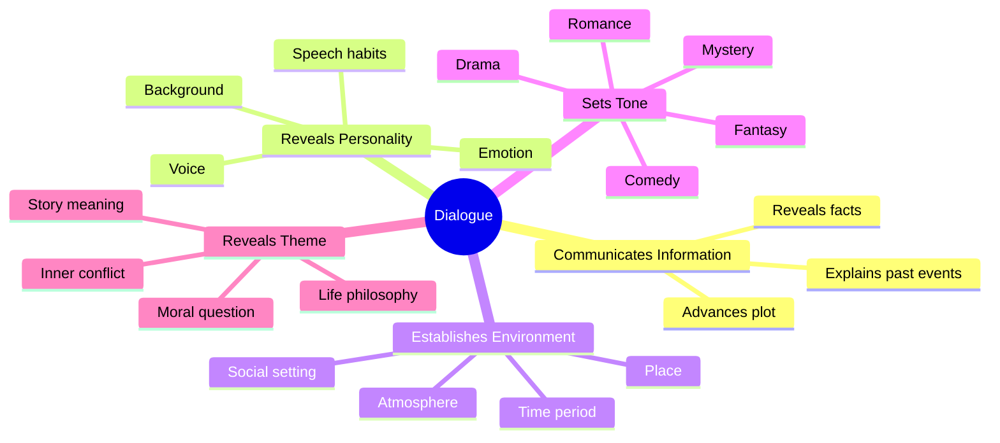
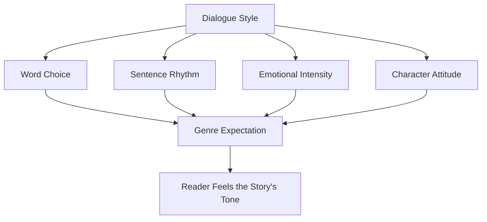
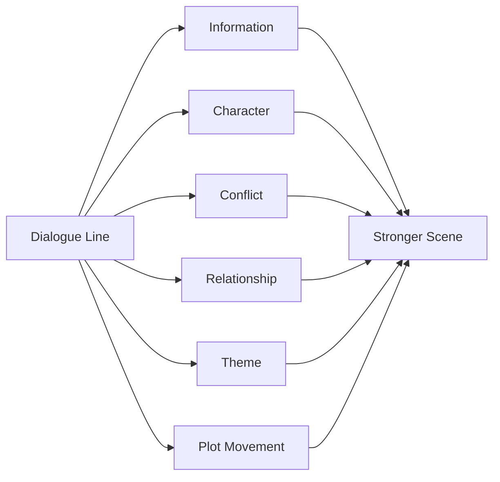

# 002 - The 5 Functions of Dialogue

## Section

**04 - Dialogue**

## Original Lecture Title

**5 chức năng của hội thoại**
**English:** The 5 Functions of Dialogue

## Duration

**10:24**

---

# 1. Core Idea

In fiction, dialogue is not just characters talking.

Good dialogue should perform a clear narrative function. It should help the story move, reveal something important, or deepen the reader’s understanding of the characters and the world.

Dialogue usually has **five major functions**:

1. Communicate facts and information
2. Reveal character personality
3. Establish the environment
4. Set the tone
5. Reveal the theme

Strong dialogue often performs more than one of these functions at the same time.

---

# 2. Dialogue Function Overview



---

# 3. Function 1: Communicate Facts and Information

On the surface, dialogue is the expression of a character’s thoughts.

On a deeper level, it gives the reader important information about:

* What is happening
* What happened before
* What might happen next
* What characters know or hide
* What conflict already exists between them

This kind of dialogue can replace direct explanation.

---

## Example: Martha and James

### Direct Explanation Version

The narrator could explain that James once hurt Martha by refusing to return her calls after an important night.

This works, but it is very direct.

The reader receives the information, but the scene may feel slower because the narrator is explaining instead of dramatizing.

---

### Dialogue Version

Instead, Martha and James can meet at a reunion, and their past can emerge through conversation.

Martha’s words reveal that James avoided her. James’s awkward reaction reveals guilt. The reader understands the history between them without needing a block of exposition.

This version is stronger because the dialogue does several things at once:

* Reveals past information
* Creates tension
* Shows James’s discomfort
* Shows Martha’s resentment
* Moves the scene forward

---

## Key Principle

> Dialogue should not merely explain information. It should dramatize information.

---

# 4. Function 2: Reveal Character Personality

Dialogue can introduce a character before the narrator explains anything about them.

A character’s voice can reveal:

* Age
* Social background
* Education
* Profession
* Confidence or insecurity
* Humor
* Emotional state
* Cultural background
* Relationship to other characters

The way a character speaks can be as important as what they say.

---

## Example: *Annie Hall*

In *Annie Hall*, the first conversation between the two main characters reveals personality immediately.

The female character speaks in a nervous, spontaneous, self-conscious way. Her speech is messy, funny, and unpredictable.

From the dialogue alone, the viewer understands that she is:

* Insecure
* Awkward
* Honest
* Spontaneous
* Unusual
* Emotionally transparent

The dialogue does not simply move the scene forward. It creates character.

---

## Character Voice Checklist

When writing dialogue, ask:

| Question                                          | Purpose                                      |
| ------------------------------------------------- | -------------------------------------------- |
| Could this line belong to any character?          | If yes, the voice may be too generic.        |
| Does the wording reveal personality?              | Dialogue should show who the character is.   |
| Does the rhythm match the character?              | Speech pattern can reveal temperament.       |
| Does the character speak differently from others? | Each major character needs a distinct voice. |

---

# 5. Function 3: Establish the Environment

Dialogue can also reveal the setting.

Characters can speak in ways that help the reader understand:

* Where the scene takes place
* Whether the space is open or closed
* Whether the setting is formal or informal
* Whether the story is set in the past, present, or future
* What kind of society or culture surrounds the characters

This allows the setting to appear naturally through interaction instead of description.

---

## Example: *Murder on the Orient Express*

In Agatha Christie’s *Murder on the Orient Express*, the train setting is central to the story.

Much of the dialogue refers to objects, compartments, passengers, luggage, conductors, and the physical structure of the train.

The characters’ conversations help establish the environment while also supporting the mystery.

The setting is not just background. It becomes part of the investigation.

---

## Key Principle

> Dialogue can make the setting feel alive without stopping the story for description.

---

# 6. Function 4: Set the Tone

The tone of a novel is often clear from how characters speak to each other.

Dialogue can make a story feel like:

* Comedy
* Romance
* Tragedy
* Mystery
* Fantasy
* Horror
* Historical fiction
* Family drama
* Adventure

A line of dialogue can immediately suggest the genre and emotional atmosphere of the story.

---

## Example

A line about Rome, iron, and conquest may suggest historical fiction or epic drama.

A line about darkness and spirits may suggest fantasy or horror.

A line about love and possession may suggest romance, melodrama, or emotional tragedy.

Tone comes not only from what characters say, but from the style, rhythm, and emotional weight of their words.

---

## Dialogue and Tone Diagram



---

# 7. Function 5: Reveal the Theme

Dialogue can also communicate the theme of a story.

Sometimes a character talks about their own problem, goal, fear, or belief. But beneath that individual situation, the reader senses a larger meaning.

The dialogue begins as personal speech, but it expands into a universal question.

---

## Example: *This Is Us*

In *This Is Us*, Kevin gives a monologue about life, family, memory, death, and connection.

He begins by talking about a painting, but the speech becomes a reflection on a larger theme:

> People may die, but they remain part of the lives they touched.

The dialogue reveals the emotional and philosophical heart of the story.

---

## Theme Through Dialogue

Dialogue can reveal theme when characters discuss:

* What life means
* What love requires
* What family means
* What death changes
* What freedom costs
* What people owe each other
* What a character believes is true

However, thematic dialogue must still feel natural.

If it sounds like the author is preaching through the character, the scene may feel artificial.

---

# 8. The 5 Functions of Dialogue

| Function                     | What It Does                                | Example Use                                                   |
| ---------------------------- | ------------------------------------------- | ------------------------------------------------------------- |
| **Communicates information** | Gives the reader facts needed for the story | A character reveals what happened fifteen years ago           |
| **Reveals personality**      | Shows who a character is through speech     | A nervous character rambles and self-corrects                 |
| **Establishes environment**  | Makes the setting feel present              | Characters discuss train compartments, luggage, or conductors |
| **Sets tone**                | Creates genre, mood, or atmosphere          | Formal speech suggests historical drama                       |
| **Reveals theme**            | Expresses the deeper meaning of the story   | A character reflects on life, death, or belonging             |

---

# 9. Strong Dialogue Usually Has Layers

Weak dialogue often performs only one function.

For example, if a line only gives exposition, it may feel flat.

Strong dialogue can perform several functions at once.

## Example

A character says:

> “Funny. Fifteen years, and you still look for the nearest exit when you see me.”

This line can perform multiple functions:

| Function     | How the Line Works                                                    |
| ------------ | --------------------------------------------------------------------- |
| Information  | Reveals that the characters have not seen each other in fifteen years |
| Character    | Shows the speaker is direct and wounded                               |
| Conflict     | Shows tension between the two characters                              |
| Relationship | Reveals unresolved history                                            |
| Plot         | Forces the other character to respond                                 |

---

# 10. Dialogue Layering Diagram



---

# 11. How to Audit Dialogue in Your Novel

When revising dialogue, do not only ask whether it sounds realistic.

Ask whether it is doing narrative work.

For each line, identify which function it serves.

---

## Dialogue Audit Table

| Line   | Information | Character | Environment | Tone     | Theme    | Keep / Revise / Cut |
| ------ | ----------- | --------- | ----------- | -------- | -------- | ------------------- |
| Line 1 | Yes / No    | Yes / No  | Yes / No    | Yes / No | Yes / No |                     |
| Line 2 | Yes / No    | Yes / No  | Yes / No    | Yes / No | Yes / No |                     |
| Line 3 | Yes / No    | Yes / No  | Yes / No    | Yes / No | Yes / No |                     |

If a line serves none of the five functions, it may be ornamental.

You should either:

* Delete it
* Shorten it
* Rewrite it
* Give it a stronger function

---

# 12. Practical Exercise

Choose one dialogue exchange from your novel.

Then label each line according to the function it performs.

Use these labels:

* **I** = Information
* **P** = Personality
* **E** = Environment
* **T** = Tone
* **Th** = Theme

Example:

```text
Martha: “Funny. Fifteen years, and now you remember my name.” [I, P, T]
James: “Martha, this isn’t the place.” [P, Conflict, T]
Martha: “It never was, was it?” [P, Theme, Conflict]
```

After labeling the exchange, ask:

> Which lines are doing real work, and which lines are only filling space?

---

# 13. Reflection Question

> Is any line in your scene serving only exposition, with no character, conflict, tone, or theme layered in?

If yes, revise that line so it performs more than one function.

---

# 14. Key Takeaways

* Dialogue has five major functions: information, personality, environment, tone, and theme.
* Good dialogue often performs multiple functions at once.
* Dialogue can replace direct explanation by dramatizing information.
* A character’s voice should reveal who they are.
* Dialogue can establish setting without stopping the scene.
* Tone is often created by how characters speak.
* Thematic dialogue should feel personal first and philosophical second.
* If a line of dialogue serves no function, remove it or improve it.

---

# 15. Summary

This lesson explains the five main functions of dialogue in fiction.

Dialogue should not exist only because characters need to talk. It should reveal information, character, setting, tone, or theme.

The best dialogue feels natural on the surface but is carefully designed underneath.

A strong line of dialogue does not merely sound realistic.

It works.
