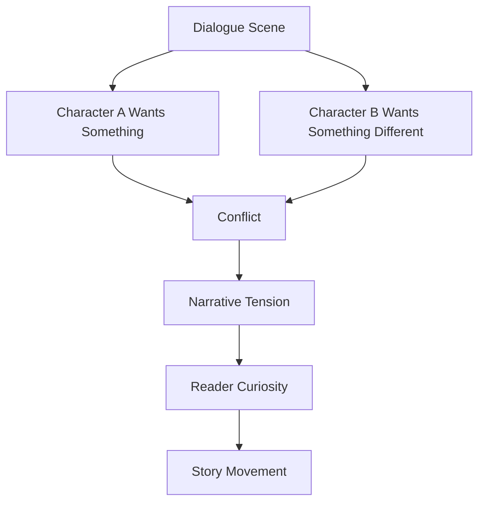
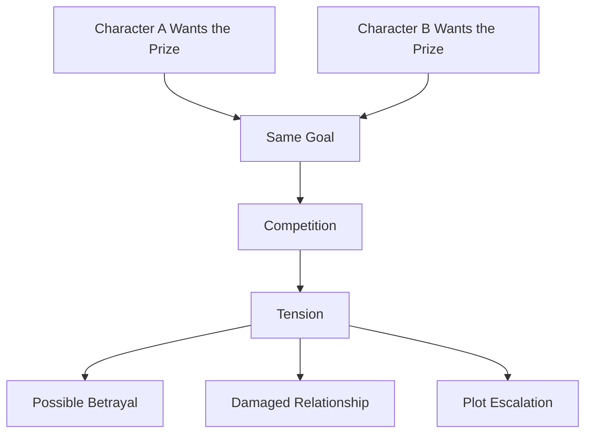
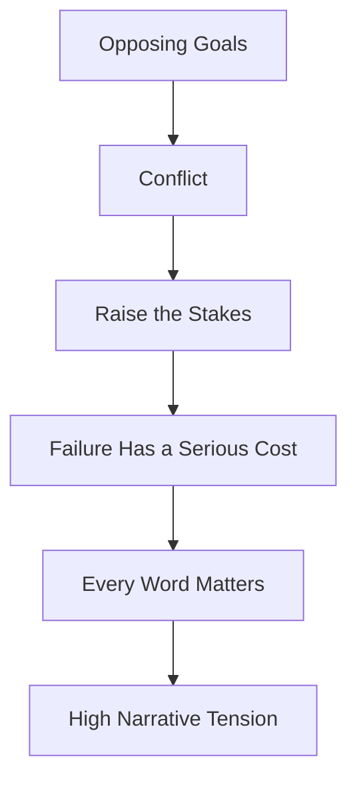
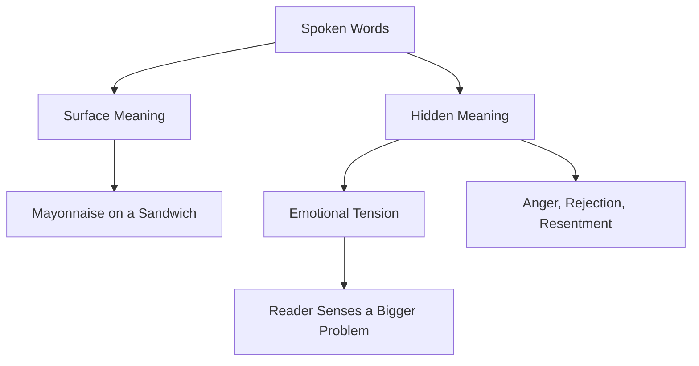
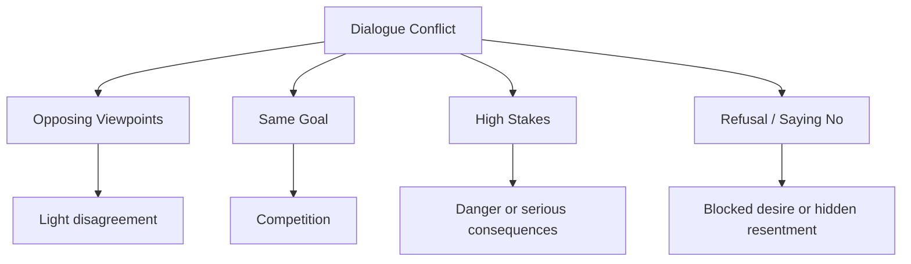
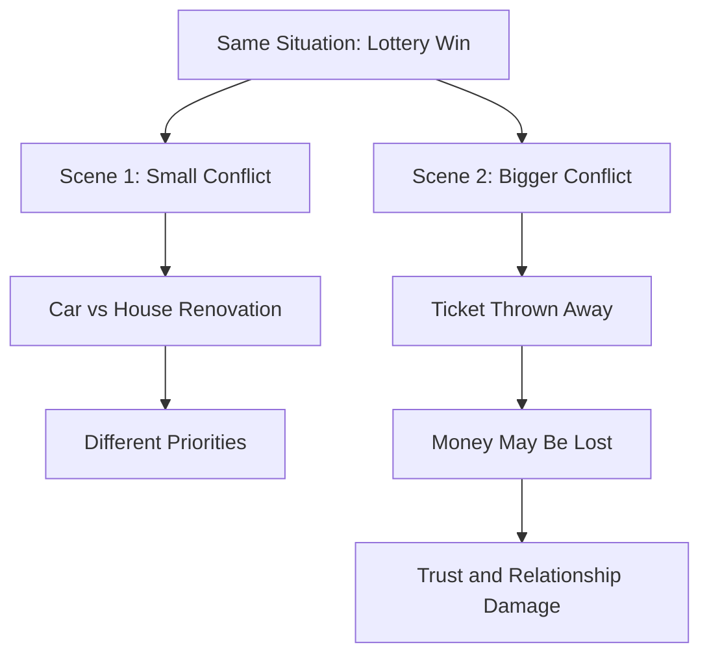

# 003 - Narrative Conflict and Tension

## Section

**04 - Dialogue**

## Original Lecture Title

**Narrative Conflict and Tension**

## Duration

**10:57**

---

## Lesson Overview

Good dialogue is one of the fastest ways to improve a novel.

However, good dialogue rarely comes from characters simply agreeing with each other. In real life, a conversation where everyone agrees may be pleasant. In fiction, it often becomes flat.

Dialogue becomes more engaging when there is conflict.

This does not always mean shouting, arguing, or hostility. Conflict can be subtle. It can come from different opinions, hidden desires, withheld information, competing goals, or emotional pressure beneath ordinary words.

---

## Core Principle

> The quickest way to improve dialogue is to stage a conflict.

Conflict in dialogue does two important things:

1. It moves the story forward.
2. It creates rhythm and narrative tension.

---

## Why Conflict Matters in Dialogue

Without conflict, dialogue can become only an exchange of information.

```text
"I agree."
"Yes, me too."
"That sounds good."
"Exactly."
```

This may be realistic, but it is not dramatic.

In fiction, dialogue should usually contain some kind of pressure. One character may want something the other character does not want to give. One character may avoid the truth. One character may say one thing while meaning another.

---

## Dialogue Tension Diagram



---

## Levels of Conflict

Conflict can have different intensities.

Think of a tennis match:

* Two friends may play casually for fun.
* Two rivals may play to prove superiority.
* Professional players may compete for a world title.

Dialogue works the same way. Some conflicts are light. Others are emotionally dangerous. The level of conflict depends on the rhythm and tension you want in the scene.

---

## Four Ways to Create Conflict in Dialogue

---

# 1. Give Characters Opposing Viewpoints

The simplest form of dialogue conflict is disagreement.

Two characters may have different beliefs, opinions, values, or interpretations of the same situation.

This creates light conflict.

The characters may not hate each other. Their relationship may not be in danger. They may have nothing major to lose. But the disagreement gives the conversation movement.

---

## Example Situation

One character praises another character's writing but disagrees with their political ideas.

```text
"You did a good job with that paper," he said.

She looked surprised.

"I like your style," he continued, "although I don't share your ideas."

"How could you support a man like Jimmy Carter?"

She stared at him.

"Tell me you're a Republican."

"Of course I am. And I'm rooting for Reagan."

"You're crazy," she said.
```

---

## Why This Works

This type of conflict:

* Establishes personality
* Reveals values
* Creates movement
* Adds energy to the scene
* Prevents the dialogue from becoming flat

The conflict is not explosive, but it gives the scene life.

---

# 2. Give Characters the Same Goal

A stronger form of conflict appears when two characters want the same thing.

Imagine a chess game. Both players have the same goal: to win.

In dialogue, two characters may both want:

* The same person
* The same job
* The same secret
* The same inheritance
* The same apology
* The same position of power
* The same chance to escape

When both characters want the same thing, the conversation becomes more tense because only one of them may be able to get it.

---

## Example Situation

Two men are in love with the same woman.

```text
"Are you in love with her?"

"Yes," I said.

I admitted it for the first time, both to him and to myself.

"So at the end of the week, you're hoping to leave with her."

"At least part of me hopes for that."

"Then you love her."

"I would like her to stay with me, if you're wondering."

"But the decision is not up to you or me," Charlie said. "Unless one of us abandons the game."
```

---

## Why This Works

This creates narrative tension because the reader wonders:

* What will happen now?
* Will their friendship survive?
* What will each man do to win?
* Will one of them betray the other?
* Will the woman choose either of them?

The dialogue creates future story pressure.

---

## Same Goal Conflict Diagram



---

# 3. Raise the Stakes

To make dialogue more intense, raise the stakes.

Give the characters opposing goals, then make the cost of failure serious.

The stakes may involve:

* Life and death
* Career destruction
* Moral failure
* Public shame
* Loss of love
* Loss of freedom
* Betrayal
* A secret being exposed
* Someone innocent being harmed

When the stakes are high, every word becomes important.

---

## Example Situation

A police negotiator speaks with a kidnapper.

The kidnapper agrees to release the hostages, but only if he is allowed to kill one specific person among them.

Now the conflict is verbal, but the danger is physical and moral.

The negotiator's words matter because the situation threatens:

* His conscience
* His duty
* His career
* The lives of innocent people
* His sense of identity

---

## High-Stakes Dialogue Example

```text
"This is Jeff Talley. I'm with the local police."

"Yeah. I'm in charge."

"All right. Then tell me who shot my officer."

"Don't put that on us."

"I want to talk to Mr. Smith. I need to know everyone inside is okay."

"No. You talk to me."

"All right, Dennis. You're running this. That means this is your responsibility."

"Get me a helicopter before I start shooting people."

"Be cool, Dennis. Nobody wants to hear guns go off in there."
```

---

## Why This Works

This dialogue is tense because:

* One character wants control.
* The other character wants to prevent violence.
* The situation can collapse at any moment.
* Every sentence can save or cost a life.
* The conflict happens through words, but the consequences are immediate.

---

## Stakes Escalation Diagram



---

# 4. Make Them Say No

One of the simplest ways to create tension is to make one character say “no” to another character.

This “no” can be literal or metaphorical.

A character may refuse to:

* Answer a question
* Give affection
* Admit the truth
* Apologize
* Obey
* Forgive
* Help
* Leave
* Stay
* Discuss the real problem

This creates tension because the conversation becomes blocked.

---

## Example Situation

Lisa and Charles are angry with each other, but they are not directly discussing the real problem.

Charles is upset because Lisa did not go out with him the previous Saturday. Lisa has a temper, and they have a long history of fighting.

### Basic Version

```text
"Hello," Lisa said.

"You forgot to put mayonnaise in the sandwich," Charles replied.

Lisa pushed the sandwich toward him.

"Well, anyway, I'm fine. Thank you. And you?"
```

The characters are not talking directly about their real issue, but the atmosphere is tense.

---

## Improved Version with Gesture and Subtext

```text
"Hello," she said with a tight smile, without looking up.

"I think you forgot to put mayonnaise on the sandwich," Charles said.

Lisa looked up for the first time and stared straight into his eyes.

Perhaps Charles could have avoided that comment, but he did not have time to finish the thought.

Lisa pushed the plate toward him with such force that, if Charles had not caught it at the last moment, it would have fallen to the floor.

"Anyway," she said, "I'm fine. Thank you. And you?"
```

---

## Why the Improved Version Works

The second version is stronger because it uses:

* Gesture
* Eye contact
* Physical action
* Subtext
* Character thought
* Emotional restraint
* Implied backstory

The characters are still talking about a sandwich, but the reader understands that the sandwich is not the real issue.

---

## Subtext Diagram



---

## Dialogue Conflict Types



---

## Conflict Does Not Always Mean Argument

A common mistake is thinking that conflict means characters must shout at each other.

Conflict can be quiet.

It can appear through:

* Silence
* Avoidance
* Polite refusal
* A forced smile
* A delayed answer
* A changed subject
* A character saying “I’m fine” when they are not
* One character asking for something the other refuses to give

The most interesting dialogue often happens when characters are not saying what they truly mean.

---

## Tools for Increasing Dialogue Tension

To tighten a dialogue scene, use more than spoken words.

You can add:

* Gestures
* Actions
* Facial expressions
* Pauses
* Thoughts
* Physical distance
* Objects in the scene
* Interruptions
* Unfinished sentences
* Repeated refusals

These details help reveal character and create emotional pressure.

---

## Example from Classic Fiction

In *Great Expectations* by Charles Dickens, the dialogue becomes threatening not only because of what is said, but also because of the character's gestures and physical presence.

The character does not merely say he is dangerous. He shakes his hand, snarls, strikes the table, rises, and declares his intention.

The words, gestures, and actions work together to create menace.

---

## Dialogue Tension Checklist

Before writing or revising a dialogue scene, ask:

### Character Desire

1. What does Character A want from this conversation?
2. What does Character B want?
3. Do they want different things?
4. Do they want the same thing but cannot both have it?

### Conflict

1. Where is the disagreement?
2. Is the conflict light, medium, or high-stakes?
3. Does one character refuse the other?
4. Is anyone avoiding the real subject?

### Stakes

1. What happens if Character A fails?
2. What happens if Character B fails?
3. Is the relationship at risk?
4. Is there a secret, threat, or emotional wound beneath the conversation?

### Subtext

1. What is being said openly?
2. What is being hidden?
3. What does each character really mean?
4. What does the reader understand that the characters do not say directly?

### Scene Movement

1. Does the dialogue change the situation?
2. Does it reveal character?
3. Does it create a new problem?
4. Does it push the plot forward?

---

## Practical Exercise

Write two dialogue scenes using the same characters and the same basic situation, but with different levels of conflict.

---

## Exercise Setup

You have just realized that you won **$30,000** in the lottery.

You want to use the money to buy the car you have always wanted.

Your wife is obsessed with cleanliness and wants to use the money to renovate the house.

---

## Scene 1: Small Conflict

Write a scene where the argument is about money and priorities.

The stakes are personal but not catastrophic.

### Conflict Source

```text
You want a car.
Your wife wants to renovate the house.
```

### Focus On

* Different opinions
* Mild frustration
* Personality contrast
* Competing desires

---

## Scene 2: Bigger Conflict

Write the same basic scene, but increase the stakes.

This time, your wife has thrown away the lottery ticket.

### Conflict Source

```text
You won $30,000.
You wanted to buy a car.
Your wife wanted to renovate the house.
But she threw away the ticket.
```

### Focus On

* Shock
* Blame
* Panic
* Anger
* Consequences
* What this reveals about the marriage

---

## Exercise Diagram



---

## Reflection Questions

1. Where do your characters agree too easily?
2. What does each character want in the dialogue?
3. What is left unsaid?
4. What is the real conflict beneath the surface topic?
5. Does the dialogue move the story forward?
6. Could the same information be delivered with more tension?
7. Is there a moment where one character says “no”?
8. What would happen if the stakes were raised?

---

## Key Takeaways

* Dialogue becomes stronger when it contains conflict.
* Conflict does not always mean open argument.
* Characters should often want different things from a conversation.
* Two characters wanting the same thing can create strong tension.
* Raising the stakes makes every word more important.
* Refusal is one of the simplest ways to create dramatic pressure.
* Gestures, actions, thoughts, and silence can intensify dialogue.
* Subtext often creates more tension than direct explanation.
* A good dialogue scene should reveal character and move the story forward.

---

## Summary

This lesson belongs to the **Dialogue** module.

A strong dialogue scene is not just a conversation. It is a dramatic exchange shaped by desire, resistance, conflict, and subtext.

The best dialogue happens when characters want something, avoid something, hide something, or refuse something. Whether the conflict is small or life-threatening, it should create tension, reveal character, and push the story forward.
