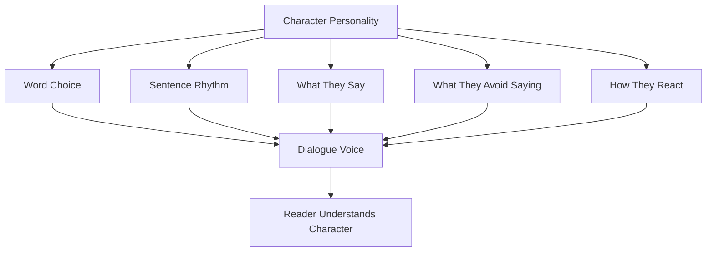

# 004 - Revealing Character Through Dialogue

## Section

**04 - Dialogue**

## Original Lecture Title

**Revealing Character Through Dialogue**

## Duration

**10:05**

---

## Lesson Overview

A character may look perfect on a character sheet, but the real test begins when they start speaking.

Dialogue reveals personality directly. It shows how a character thinks, reacts, hides, attacks, apologizes, avoids, jokes, lies, or protects themselves. A strong line of dialogue should make the reader feel:

> Only this character could have said that.

Good dialogue does not merely deliver information. It reveals character.

---

## Core Principle

> Dialogue should reveal personality through voice, rhythm, word choice, silence, and contradiction.

A character’s speech should reflect who they are, what they want, what they fear, and what they refuse to admit.

---

## Key Points

### 1. Give Each Character a Distinct Voice

Each important character should have a recognizable way of speaking.

Their voice may be shaped by:

* Personality
* Education
* Social background
* Confidence level
* Emotional state
* Age
* Profession
* Power position
* Past experiences
* Relationship to the listener

A shy character, an arrogant character, and an aggressive character should not apologize in the same way.

---

## Example: Different Personalities, Same Situation

Situation:

> Four characters arrive late to a family dinner because of traffic.

| Personality Type | Possible Dialogue Style                                                                        |
| ---------------- | ---------------------------------------------------------------------------------------------- |
| Egocentric       | “Sorry I’m late. I had to waste an hour in traffic, as if I had nothing more important to do.” |
| Insecure         | “I’m so sorry. I should have planned better. This is completely my fault.”                     |
| Exuberant        | “Sorry, sorry, sorry! The traffic was insane. But I’m here now — and I’m starving!”            |
| Aggressive       | “Why are you looking at me like that? You think I wanted to be late?”                          |

The situation is the same, but the dialogue reveals four different personalities.

---

## 2. Build a Verbal Fingerprint

A character’s voice should be identifiable even without dialogue tags.

A verbal fingerprint may include:

| Element           | Questions to Ask                                                         |
| ----------------- | ------------------------------------------------------------------------ |
| Vocabulary        | Do they use simple, poetic, technical, rude, formal, or childish words?  |
| Sentence Length   | Do they speak in short bursts or long explanations?                      |
| Rhythm            | Are they calm, rushed, dramatic, hesitant, or blunt?                     |
| Verbal Tics       | Do they repeat phrases, interrupt, swear, joke, or avoid direct answers? |
| Politeness Level  | Are they respectful, sarcastic, cold, warm, or confrontational?          |
| Emotional Control | Do they reveal feelings openly or hide them behind humor or silence?     |

A strong character voice lets the reader recognize the speaker before seeing the name.

---

## 3. Show Personality Through Content and Style

Dialogue reveals character in two ways:

### What the character says

This shows their values, goals, fears, and priorities.

### How the character says it

This shows their temperament, confidence, social habits, and emotional control.

For example:

* A greedy character may always bring conversations back to money.
* A resentful character may use subtle insults.
* A romantic character may exaggerate emotional meaning.
* A practical character may avoid emotional language.
* A fearful character may ask too many questions.
* A dominant character may interrupt others.

Both content and style matter.

---

## 4. Create Contrast Between Speech and Thought

People do not always say what they truly think.

Characters may speak falsely because they want to:

* Make a good impression
* Avoid conflict
* Manipulate someone
* Hide fear
* Maintain power
* Protect themselves
* Delay a problem
* Avoid shame
* Pretend everything is fine

This creates tension between outer dialogue and inner truth.

Example pattern:

```text
Spoken line: “Of course. I’m happy for you.”
Inner thought: She could barely breathe.
```

The contradiction tells the reader more than a direct explanation.

---

## 5. Reveal Character Through What They Avoid Saying

What a character refuses to discuss can be as revealing as what they say.

A character may avoid talking about:

* Guilt
* Love
* Betrayal
* Money
* Family
* Trauma
* Failure
* Desire
* Jealousy
* Ambition
* Fear

Avoidance creates subtext.

For example, if a character keeps changing the subject whenever marriage is mentioned, the reader learns something before the character admits it.

---

## 6. Use Other Characters’ Dialogue to Reveal Someone

A character can be revealed even when they are absent.

Other characters may talk about them with:

* Fear
* Admiration
* Envy
* Resentment
* Desire
* Suspicion
* Loyalty
* Hatred

This technique builds reputation before the character enters the scene.

For example:

```text
Character A: “Don’t joke about him.”
Character B: “Why?”
Character A: “Because the last man who did is still eating through a straw.”
```

The absent character becomes dangerous before appearing on the page.

---

## 7. Dialogue Can Reveal Relationships

Dialogue does not only reveal individuals. It also reveals the relationship between characters.

Through dialogue, readers can see:

* Who has power
* Who is hiding something
* Who feels inferior
* Who wants approval
* Who is trying to impress
* Who is afraid
* Who understands the other person best
* Who is lying
* Who is emotionally exposed

Two characters may speak differently depending on who they are talking to.

A character may be confident with friends but silent around a parent. Another may be cruel in public but gentle in private.

This contrast creates depth.

---

## Dialogue Character-Reveal Diagram



---

## Dialogue Subtext Diagram


---

## Character Voice Design

Before writing dialogue, define each major character’s voice.

| Character Trait | Dialogue Effect                                |
| --------------- | ---------------------------------------------- |
| Honest          | Direct, simple, sometimes blunt                |
| Sensitive       | Careful words, emotional awareness, hesitation |
| Ambitious       | Goal-focused, persuasive, strategic            |
| Greedy          | Talks about gain, ownership, advantage         |
| Pessimistic     | Expects failure, uses negative framing         |
| Resentful       | Indirect attacks, sarcasm, bitterness          |
| Insecure        | Apologies, over-explaining, self-correction    |
| Aggressive      | Interruptions, accusations, commands           |
| Exuberant       | Fast rhythm, exaggeration, enthusiasm          |
| Secretive       | Short answers, deflection, vague statements    |

---

## Practical Exercise

Take one scene from your draft and cover the dialogue tags.

Then ask:

1. Can you still tell who is speaking?
2. Does each character have a distinct voice?
3. Does the dialogue reveal personality?
4. Does each line reflect the speaker’s traits?
5. Are the characters saying only information, or are they revealing themselves?

---

## Character Voice Exercise

Choose one adjective for each major character.

For the protagonist, choose at least five traits.

For secondary characters, choose at least three traits.

Example:

```text
Protagonist:
- Honest
- Sensitive
- Ambitious
- Impulsive
- Secretive
```

Then, whenever the character speaks, make sure the dialogue reflects at least one of those traits.

The trait can appear in:

* What they say
* What they refuse to say
* How directly they speak
* How long their sentences are
* Whether they interrupt
* Whether they apologize
* Whether they joke
* Whether they lie
* Whether they avoid emotional topics

---

## Show, Don’t Tell Through Dialogue

| Telling            | Showing Through Dialogue                            |
| ------------------ | --------------------------------------------------- |
| He was arrogant.   | “I assumed you’d need me to fix it.”                |
| She was insecure.  | “It’s probably stupid, but I thought maybe…”        |
| He was aggressive. | “Say that again. Slowly.”                           |
| She was evasive.   | “That was a long time ago. Anyway, how’s work?”     |
| He was romantic.   | “I remembered because you smiled when you said it.” |
| She was practical. | “Feelings won’t pay the rent.”                      |

---

## Common Mistakes

### Mistake 1: All Characters Sound the Same

If every character speaks with the same rhythm, vocabulary, and attitude, the dialogue will feel flat.

### Mistake 2: Dialogue Only Delivers Plot Information

Dialogue should not only explain what happened. It should reveal who the characters are.

### Mistake 3: Overusing Dialogue Tags to Identify Speakers

If the reader needs constant tags to know who is speaking, the voices may not be distinct enough.

### Mistake 4: Ignoring Subtext

Characters should not always say exactly what they feel or mean. Realistic dialogue often contains avoidance, contradiction, and hidden intention.

### Mistake 5: Forgetting Relationship Dynamics

A character should not speak to everyone in the same way. Their voice changes depending on power, intimacy, fear, respect, or resentment.

---

## Writing Checklist

Before finishing a dialogue scene, check:

* [ ] Does each major character have a distinct voice?
* [ ] Can the reader identify speakers without constant tags?
* [ ] Does word choice reflect personality?
* [ ] Does rhythm reflect emotional state?
* [ ] Does the character avoid certain topics?
* [ ] Is there subtext beneath the spoken words?
* [ ] Do characters sometimes say one thing while thinking another?
* [ ] Does dialogue reveal relationship dynamics?
* [ ] Does every line either reveal character, advance conflict, or change the scene?
* [ ] Do the characters sound like themselves rather than like the author?

---

## Reflection Questions

1. Do your major characters sound distinct from each other?
2. Do any of your characters sound too much like you?
3. What words or phrases would only this character use?
4. What topics does this character avoid?
5. How does this character speak when afraid?
6. How does this character speak when angry?
7. How does this character speak to someone they love?
8. How does this character speak to someone they want to impress?
9. What does this character lie about?
10. What truth accidentally slips out when they speak?

---

## Summary

Dialogue is one of the strongest tools for revealing character.

A good line of dialogue should expose personality through word choice, rhythm, silence, contradiction, and subtext. The reader should feel that the line could only come from that specific character.

To create stronger dialogue:

* Give each character a distinct verbal fingerprint.
* Let personality shape both content and style.
* Use contrast between speech and thought.
* Reveal characters through what others say about them.
* Use silence and avoidance as meaningful tools.
* Make dialogue reveal relationships, not only information.

Strong dialogue does not simply tell the reader what characters say. It shows who they are.
