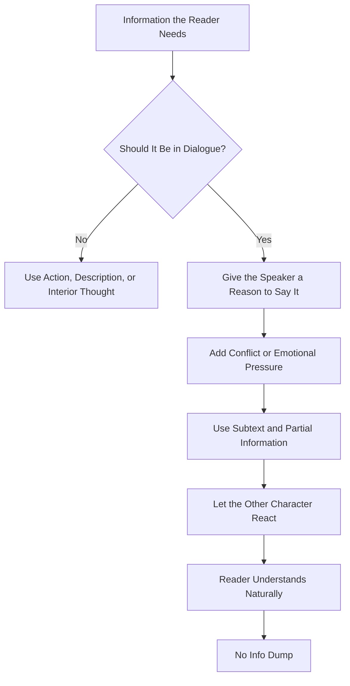

# 005 - How to Feed Information Through Dialogue

## Section

**04 - Dialogue**

## Original Lecture Title

**How to Feed Information Through Dialogue**

## Duration

**11:58**

---

## 1. Lesson Overview

Dialogue is one of the most effective tools for giving the reader important information about a character, relationship, backstory, or plot.

However, one of the most common mistakes new writers make is using dialogue as an **information dump**.

An information dump happens when the writer forces characters to explain facts only because the reader needs to know them.

Good dialogue should not feel like a lecture. It should feel like real people speaking because they want, fear, hide, attack, defend, or negotiate something.

---

## 2. What Is an Info Dump?

An **info dump** is a large amount of information delivered clumsily and unnaturally.

In dialogue, this usually happens when characters say things they would never actually say in real life.

### Common signs of dialogue info dumping:

* Characters explain things they both already know.
* Characters speak like textbooks.
* The scene stops so the author can explain the world.
* Dialogue has no conflict, tension, or emotional purpose.
* The reader can feel the author behind the characters.

---

## 3. Bad Dialogue: Information Both Characters Already Know

One common mistake is making one character tell another character something they both already know.

### Weak Example

> “You can’t talk to me like that, Anna. I’ve been your husband for eight years and work from morning to night as a manager at Safeway for 2,800 dollars per month.”
>
> “I have every right to talk to you like that, John, because we spend very little time together since I also work at Walmart, and you’re neglecting our son, Anthony.”
>
> “But he’s going to school. His grades are at the top of his class.”

This sounds unnatural because the characters are not really speaking to each other.

They are speaking to the reader.

The author wants to communicate:

* They have been married for eight years.
* They work at different supermarket chains.
* They do not spend much time together.
* They have a son named Anthony.
* Anthony is a good student.

But real people would not say all of that in one conversation.

---

## 4. Why This Feels Fake

Real dialogue is often:

* Interrupted
* Incomplete
* Emotional
* Full of silence
* Full of misunderstanding
* Shaped by what characters avoid saying

People rarely explain their full life situation to someone who already knows it.

Good dialogue gives the reader information indirectly.

---

## 5. Good Dialogue Feels Like Real Interaction

Good dialogue often creates the feeling that the reader is overhearing something private.

It may include:

* Embarrassment
* Awkward pauses
* Half-answers
* Avoidance
* Subtext
* Emotional tension

The information is still delivered, but it comes through naturally.

---

## 6. Example: Awkward Dialogue with Subtext

A strong example comes from *Ocean Sea* by Alessandro Baricco.

A woman is asked why she is there. The conversation is dry, awkward, and full of silence.

She reveals that she is there to be cured of adultery.

The dialogue works because it does not feel like an explanation prepared for the reader. It feels like a strange, uncomfortable exchange between people.

### Why it works:

* The characters hesitate.
* The rhythm is awkward.
* The revelation comes through pressure.
* The information feels emotionally charged.
* The scene allows silence to carry meaning.

---

## 7. Bad Dialogue: Explaining How Something Works

Another form of info dumping happens when characters explain a process in an artificial question-and-answer format.

### Weak Example

> “Master, tell me how gears are made with this apparatus,” the boy requested.
>
> “First you turn this lever, then you turn this wheel…”
>
> “Where do the wheels go when they are finished?”
>
> “Here, at the Blue Steam River, is the dirigible factory where most of the national fleet’s vessels are assembled…”

This sounds fake because the scene exists only to explain the world.

The characters are not in conflict. They are not hiding anything. They are not making a choice.

The dialogue becomes a manual.

---

## 8. The Core Principle

Information in dialogue should be motivated by the character’s need, not the author’s need.

### Weak motivation:

> The author needs the reader to know something.

### Strong motivation:

> The character wants something, hides something, fears something, or tries to change another character’s mind.

---

## 9. Three Ways to Avoid Dialogue Info Dumps

### 9.1 Make Dialogue Bounce Between Characters

Dialogue should move back and forth with energy.

Characters should react to each other instead of calmly delivering information.

Good dialogue can include:

* Questions
* Deflections
* Interruptions
* Misunderstandings
* Accusations
* Jokes
* Emotional shifts

The reader usually needs less information than the writer thinks.

Give only what is necessary for the scene to move forward.

---

## 10. Example: *This Is Us*

In the first episode of *This Is Us*, two characters argue in a way that feels casual and intimate.

At first, the audience does not fully know their relationship.

Through the conversation, the scene reveals several important facts:

* They are siblings.
* They were born in the same year.
* They are entering their late thirties.
* The female character is struggling with disappointment in her life.
* The male character is immature and often says the wrong thing.

The dialogue feels natural because the information emerges through emotion, conflict, and intimacy.

The scene is not simply explaining facts. It is showing a relationship.

---

## 11. Hint at Backstory Instead of Explaining It

If a character has suffered trauma in the past, you do not need to explain the entire event immediately.

Instead, you can hint at it through dialogue.

A traumatic past should affect:

* What the character avoids
* How they speak
* What makes them anxious
* Which topics they resist
* How they react under pressure

The reader gradually understands the backstory through behavior and conversation.

---

## 12. Example: *Ordinary People*

In *Ordinary People*, Conrad appears to be part of a normal family.

But as the story develops, the audience notices that:

* He struggles to socialize.
* He does not want to swim anymore.
* His relationship with his mother is strained.
* He is anxious and unstable.

Only later do we learn that he survived a boating accident in which his older brother died.

Conrad feels guilty, attempted suicide, and was hospitalized.

The film does not reveal all of this immediately. It allows the trauma to surface gradually through dialogue and behavior.

### Why this works:

* The backstory is delayed.
* The character’s pain appears before the explanation.
* The audience becomes curious.
* Dialogue reveals emotional damage indirectly.
* The trauma affects the present scene.

---

## 13. Use Conflict to Reveal Information

Conflict is one of the best ways to deliver exposition.

Instead of having characters explain facts, make them fight over something.

Information becomes more interesting when it appears inside:

* An argument
* A rejection
* A negotiation
* A confrontation
* A misunderstanding
* A power struggle
* A confession

Conflict gives information emotional weight.

---

## 14. Example: *Mystic River*

In *Mystic River*, the audience needs to know that Dave’s wife left him six months ago.

Instead of stating this directly, the information comes out through a conversation involving another woman who shows interest in him.

The dialogue reveals:

* His wife left him six months ago.
* He still has not emotionally moved on.
* She calls him, but he does not answer.
* He may be waiting for her to explain why she left.
* He is emotionally blocked.

The information works because it is embedded in conflict and emotional tension.

---

## 15. Weak vs Strong Dialogue Exposition

| Weak Dialogue                                    | Strong Dialogue                                   |
| ------------------------------------------------ | ------------------------------------------------- |
| Characters explain facts they both know.         | Characters reveal information through tension.    |
| The scene sounds like a lecture.                 | The scene sounds like a real conversation.        |
| The reader feels the author forcing information. | The reader discovers information naturally.       |
| Dialogue is calm and overly clear.               | Dialogue contains conflict, silence, and subtext. |
| Characters speak to the reader.                  | Characters speak to each other.                   |

---

## 16. Dialogue Information Flow Diagram

---

## 17. Exposition Through Dialogue Structure

---

## 18. How to Rewrite Exposition-Heavy Dialogue

### Step 1: Identify the Information

Ask:

> What information am I trying to give the reader?

Example:

* They are married.
* They have a child.
* Their marriage is failing.
* They work too much.
* They disagree about parenting.

---

### Step 2: Give the Characters a Reason to Speak

Ask:

> Why would this character say this now?

Possible reasons:

* They are angry.
* They want an apology.
* They are defending themselves.
* They are hiding guilt.
* They want control.
* They want to hurt the other person.
* They are trying to avoid blame.

---

### Step 3: Add Conflict

Turn the information into a disagreement.

Instead of:

> “We have been married for eight years.”

Try:

> “Eight years, John. Eight years, and you still don’t know when I’m lying.”

This reveals the length of the marriage while also creating tension.

---

### Step 4: Remove Obvious Explanations

Cut lines that sound like:

* “As you know…”
* “Remember when…”
* “You are my brother…”
* “Since we have been married for eight years…”
* “Because our son Anthony is in school…”

Replace them with lines that imply the facts.

---

## 19. Practical Exercise

Find one dialogue passage in your manuscript that feels too heavy with exposition.

Then ask:

1. Are the characters saying something they both already know?
2. Are they explaining facts only for the reader’s benefit?
3. Could the information emerge through an argument?
4. Could a secret, fear, or misunderstanding reveal the information?
5. Could you remove half the explanation and still let the reader understand?
6. Could silence or hesitation communicate part of the meaning?

---

## 20. Exercise Template

Use this table to revise exposition-heavy dialogue.

| Question                                  | Your Answer |
| ----------------------------------------- | ----------- |
| What information does the reader need?    |             |
| Who knows this information already?       |             |
| Who does not know it?                     |             |
| Why would the speaker say it now?         |             |
| What does the speaker want?               |             |
| What is the conflict in the scene?        |             |
| What can be implied instead of explained? |             |
| What line can be cut?                     |             |

---

## 21. Quick Revision Checklist

Before keeping an exposition-heavy dialogue scene, check:

* Does each character have a reason to speak?
* Is there tension in the exchange?
* Does the dialogue reveal character as well as information?
* Are the characters avoiding something?
* Is there subtext beneath the words?
* Can the reader infer some of the information?
* Are you explaining something too early?
* Would real people actually say these lines?

---

## 22. Key Takeaways

* Dialogue is a powerful tool for revealing information.
* Avoid making characters explain things they both already know.
* Do not turn dialogue into a manual or lecture.
* Let information surface through conflict, pressure, and subtext.
* Readers need less explanation than writers often think.
* Good dialogue should reveal character, relationship, and plot at the same time.
* The best exposition feels like discovery, not explanation.

---

## 23. Summary

This lesson focuses on how to deliver information through dialogue without creating an info dump.

Dialogue should not exist only to explain the story to the reader. It should come from the characters’ needs, emotions, conflicts, and relationships.

To make exposition feel natural, let information appear through argument, awkwardness, hesitation, misunderstanding, or subtext. When characters speak because they want something from each other, the reader receives information without feeling lectured.
