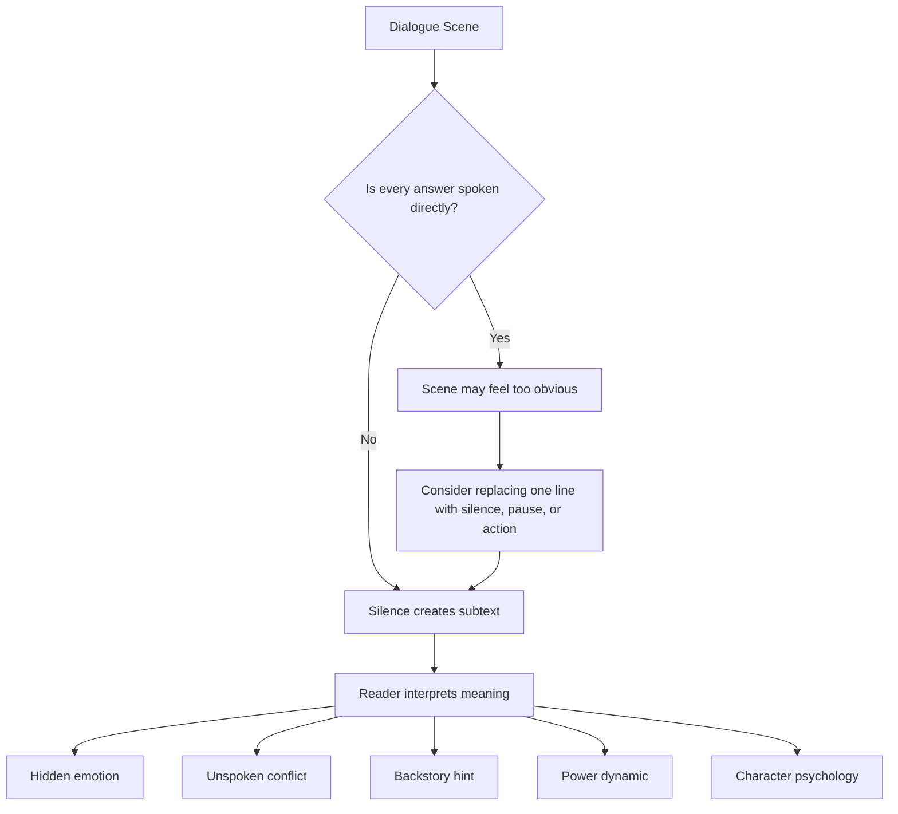
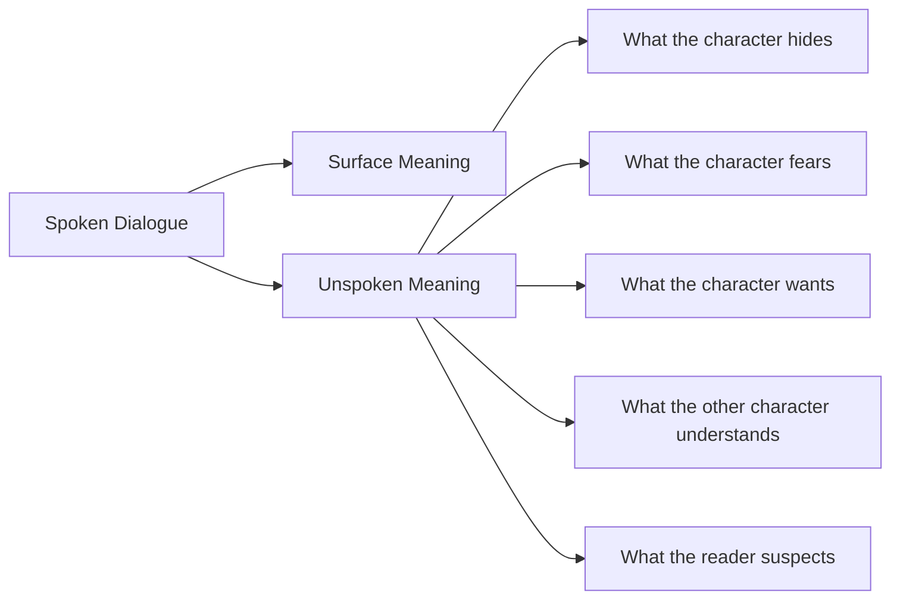

# 006 - Silence in Dialogue

## Section

04 - Dialogue

## Original Lecture Title

Silence in Dialogue

## Duration

9:25

---

## Core Idea

Dialogue is not only what characters say.

Sometimes, the most powerful part of a conversation is what remains unsaid.

A pause, a refused answer, a gesture, or a missing line can reveal guilt, fear, calculation, emotional overload, deception, or a shift in power between characters. Silence becomes meaningful when it adds information to the scene.

---

## Key Points

* Silence is not empty space. It is a dramatic tool.
* A character’s refusal to answer can reveal more than a direct explanation.
* Silence creates room for reader interpretation.
* A pause can increase tension, emphasize a previous line, or expose emotional pressure.
* Body language and action can replace dialogue.
* Use silence sparingly so it keeps its dramatic weight.

---

## What Is Silence in Dialogue?

Silence in dialogue is not simply the absence of speech.

It is a pause or omission that communicates meaning.

Silence can suggest:

* guilt
* fear
* deception
* hesitation
* emotional overwhelm
* hidden knowledge
* shame
* calculation
* power imbalance
* unresolved conflict
* a secret from the past

In fiction, silence works because readers naturally try to fill the gap.

When a character does not answer, the reader starts asking:

> Why didn’t they answer?
> What are they hiding?
> What did that pause mean?
> What does the other character understand from it?

---

## Why Silence Works

Silence is powerful because it forces interpretation.

Instead of telling the reader exactly what happened, the writer allows the reader to deduce meaning from behavior, timing, and context.

A direct line explains.

A meaningful silence implies.

And implication often feels stronger than explanation.

---

## Example: Direct Dialogue vs. Dialogue with Silence

### Version 1: Direct Dialogue

```text
“Have you sent the bank transfer yet?”

“Transfer? What transfer?”

“The transfer for this month’s rent.”

“This month’s rent?”

“Yes. We have to pay before the 5th of the month or the landlady will kick us out. Don’t tell me you forgot.”

“I forgot.”

“I knew it. I knew I should never have trusted you.”
```

This version gives clear information, but it is emotionally flat. The character directly admits the mistake, so the reader has little to infer.

---

### Version 2: Dialogue with Silence

```text
“Have you sent the transfer yet?”

Mario raised his eyebrow for a moment, then kept reading as if nothing had happened.

“The transfer for this month’s rent.”

He finally looked up.

He moved his lips as if he were trying to remember the last time he had gone to the bank.

“We had to pay before the 5th of the month, or the landlady will kick us out. Don’t tell me you forgot.”

“Well, look, I…”

He seemed to search for an answer on the table, in his pocket, anywhere, as if he could simply find it and say, “There it is.”

But of course it was not there.

The answer Laura wanted to hear was not there. Maybe it had been a long time since there had been such an answer between them.

“I knew it. I knew I should never have trusted you.”

She left the kitchen and slammed the door behind her.
```

In this version, Mario never says, “I forgot.”

But the reader understands it anyway.

The silence also suggests more than the forgotten transfer. It hints that this may not be the first time Mario has failed Laura. It shows guilt, avoidance, and a damaged relationship.

---

## The Function of Silence



---

## Four Ways to Use Silence in Dialogue

### 1. Do Not Answer Directly

Sometimes a character receives a direct question but does not give a direct answer.

This can happen because the character:

* does not know what to say
* does not want to reveal the truth
* cannot emotionally face the answer
* wants to change the subject
* wants to control the conversation
* is hiding something

A non-answer can create tension immediately.

Example:

```text
“How did you lose your hands?”

“That’s another story,” he said. “Do you want this picture or not?”
```

The question is direct, but the answer avoids it.

This makes the reader curious. The silence around the missing answer becomes more interesting than a direct explanation.

---

### 2. Use Silence to Introduce Backstory

Silence can hint at a hidden past.

A character may refuse to talk about:

* a death
* a betrayal
* a failed relationship
* a traumatic event
* a secret desire
* a family wound
* a past mistake

This kind of silence creates mystery.

When a character repeatedly avoids one question, the reader understands that the answer matters.

Example:

```text
“How did your father die?”

She looked away.

For a moment, the room seemed too small.

“Not tonight,” she said.
```

The silence tells us the topic is painful before the character explains anything.

---

### 3. Replace Dialogue with Body Language

Action can function as dialogue.

A gesture can support, deepen, or contradict spoken words.

Example:

```text
“I’m fine,” she said.

Her hand tightened around the glass.
```

The words say one thing.

The action says another.

Body language can replace a line completely:

```text
“Are you angry?”

He crossed his arms and looked out the window.
```

He does not need to say yes.

The gesture answers for him.

However, the action must fit the character. Not every character expresses anger, fear, or surprise in the same way.

One character may slam a door.

Another may smile politely.

Another may become very still.

---

### 4. Use a Character Who Rarely Speaks

A mostly silent character creates anticipation.

If a character has been silent for a long time, their first spoken line becomes significant simply because they finally speak.

The power comes from waiting.

When a quiet character speaks, the reader pays attention.

This technique works best when:

* the silence is established early
* other characters notice it
* the silence has emotional or psychological weight
* the first spoken line arrives at the right moment

The actual words may be simple.

The significance comes from the break in silence.

---

## Silence and Subtext

Silence often creates subtext.

Subtext is the meaning underneath the spoken words.



A character may say:

```text
“It’s late.”
```

But the subtext could be:

```text
I want you to leave.
```

Or:

```text
I wish you would stay.
```

Or:

```text
I cannot handle this conversation anymore.
```

Silence gives the reader room to discover that hidden layer.

---

## When to Use Silence

Use silence when a spoken line would be too obvious.

A good place for silence is often:

* after a painful question
* before a confession
* when a character is caught lying
* when someone has power over another person
* when a character realizes something
* when a relationship changes
* when the truth is too difficult to say
* when the reader should feel tension

---

## When Not to Use Silence

Silence loses power if it appears too often.

Avoid using silence when:

* the scene becomes vague
* the reader cannot understand what is happening
* every character constantly pauses
* silence is used only to sound dramatic
* the omitted information is necessary for clarity
* the scene needs momentum more than hesitation

Silence should clarify emotion, not confuse the basic situation.

---

## Practical Technique

When revising a dialogue scene, look for one line that explains too much.

Then ask:

> Would this line be stronger if the character did not say it?

Possible replacements:

```text
He said nothing.
```

```text
She looked away.
```

```text
He opened his mouth, then closed it again.
```

```text
The answer did not come.
```

```text
She folded the letter and placed it back on the table.
```

```text
He smiled, but only for a second.
```

The best replacement is not always a generic pause. It should be a specific action that belongs to that character.

---

## Revision Checklist

Use this checklist when editing dialogue:

* Is there a line that states something the reader could infer?
* Is there a direct answer that would be stronger as an avoided answer?
* Is there a question the character would not want to answer?
* Is there a moment where silence could reveal guilt, fear, or shame?
* Is there a character who always has a comeback ready?
* What would finally make that character stop talking?
* Is there a quiet character whose first spoken line could become powerful?
* Can an action replace a line of dialogue?
* Does the silence create meaning, or is it only empty space?
* Is the silence used sparingly enough to remain effective?

---

## Practical Exercise

Take an existing dialogue scene from your manuscript.

Find one line where a character explains too much.

Replace that line with:

* a pause
* a gesture
* an avoided answer
* an unfinished sentence
* a physical action
* a change of subject

Then write one sentence explaining what the silence implies.

---

## Reflection Questions

1. Is there a moment where your character’s silence would say more than any spoken line?
2. Which character in your story avoids answering difficult questions?
3. What question would make your most talkative character fall silent?
4. What secret, fear, or wound could be suggested through silence before it is revealed?
5. Does every pause in your dialogue add meaning, or are some pauses only decorative?

---

## Summary

Silence is one of the most powerful tools in dialogue.

It can reveal guilt, fear, deception, love, grief, hesitation, or control without stating any of those things directly.

A missing answer can create tension.

A pause can expose a relationship.

A gesture can replace a confession.

The key is to make silence meaningful. Do not use it as empty decoration. Use it when the absence of a line says more than the line itself.

In strong dialogue, what characters do not say can be just as important as what they do say.
