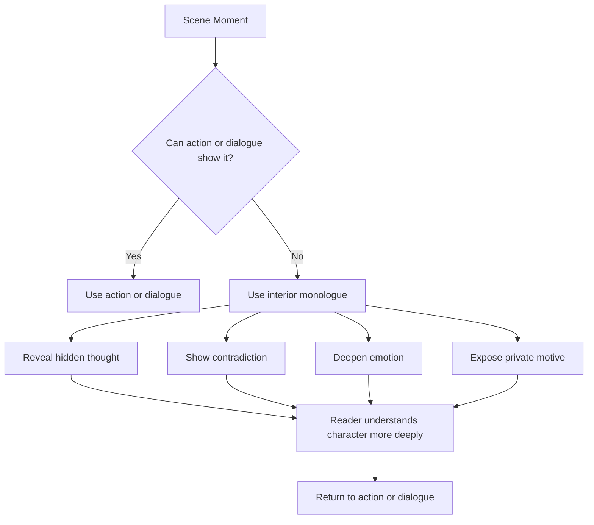

# 007 - Interior Monologue: Do's and Don'ts

## Section

**04 - Dialogue**

## Original Lecture Title

**Interior Monologue: Do's and Don'ts**

## Duration

**9:45**

---

## Overview

Characters do not only speak to other people.

They also speak to themselves.

Interior monologue is one of the tools that helps create a complete character. It allows the reader to enter the private space of the character’s mind: their doubts, fears, calculations, contradictions, memories, and hidden desires.

However, interior monologue can easily become ineffective if it interrupts the action, repeats what the scene already shows, or turns into a long block of unnecessary reflection.

Used well, interior monologue can make a scene deeper, sharper, and more emotionally powerful.

Used poorly, it can slow the story down and make the reader impatient.

---

## Core Idea

Interior monologue should not replace action.

It should add a layer that action and dialogue cannot fully show.

A strong interior monologue reveals:

* What the character thinks but does not say
* What the character hides from others
* What the character misunderstands about themselves
* What the character fears
* What the character wants
* What contradicts their spoken words
* What emotional pressure exists beneath the surface

---

## Why Interior Monologue Matters

Some writers overuse interior monologue. They stop the action for huge passages of thought that do not move the scene forward.

Other writers avoid it completely because they think fast-paced stories should only contain action and dialogue.

Both approaches are limited.

A character’s inner conflict can be just as dramatic as a fight, chase, or duel.

The key is balance.

---

## Six Rules for Writing Interior Monologue

---

## 1. Make a Sandwich

Interior monologue works best when it is placed between action and dialogue.

Think of a sandwich:

```text
Action / Dialogue
↓
Interior Monologue
↓
Action / Dialogue
```

Do not begin with a long block of thought before the reader is grounded in the scene.

First, hook the reader with something concrete:

* A line of dialogue
* A physical action
* A conflict
* A setting detail
* A problem

Then, after the scene has movement, allow the character’s inner voice to enter.

### Weak Structure

```text
Long reflection
Long reflection
Long reflection
Then something happens
```

### Stronger Structure

```text
Something happens
The character reacts internally
The scene continues
```

Interior monologue should feel woven into the scene, not pasted on top of it.

---

## 2. Use Interior Monologue Sparingly

Most readers remember:

* Plot
* Action
* Characters
* Conflict
* Emotional turning points

They rarely say, “That novel had such a beautiful interior monologue.”

However, when used at the right moment, interior monologue can make a scene unforgettable.

It is especially useful:

* At the beginning of a first-person novel
* During moments of major emotional pressure
* When a character is lying
* When a character is making a difficult choice
* When the outer action does not reveal the full truth
* When the story needs to establish theme, values, or worldview

Interior monologue should appear when it adds real depth, not whenever the writer wants to explain.

---

## 3. Do Not Say Too Much

Interior monologue should usually be short.

Avoid using it to explain everything about the character’s:

* Past
* Trauma
* Philosophy
* Future plans
* Feelings
* Family history
* Worldview
* Every possible motivation

Give the reader room to breathe.

A short inner thought can often do more than a full paragraph.

### Weak

> I wondered what the best thing for me to do in that situation was, because I felt confused and uncertain about all the possible consequences.

### Stronger

> Now what?

The second version is shorter, sharper, and closer to how thought often works under pressure.

---

## 4. Do Not Overuse Thinking Verbs

Words like these can create distance between the reader and the character:

* thought
* wondered
* realized
* considered
* asked himself
* reflected
* remembered

These verbs are not always wrong, but they are often unnecessary.

In first-person and close third-person narration, the reader already understands whose thoughts they are reading.

### Weak

> He slammed the door in my face.
> Now what, I wondered.

### Stronger

> He slammed the door in my face.
> Now what?

The second version is more immediate. It removes the barrier between the reader and the character’s mind.

---

## 5. Show the Character’s Authentic Inner Voice

People often think differently from how they speak.

A character may sound polite out loud but be cruel inside.
A character may act confident but think anxiously.
A character may joke with others while privately panicking.
A character may say “I’m fine” while thinking the opposite.

Interior monologue reveals the authentic side of the character.

The inner voice may be:

* Cynical
* Afraid
* Hopeful
* Bitter
* Naive
* Violent
* Tender
* Self-critical
* Arrogant
* Confused
* Detached
* Obsessive

The writer should decide what kind of inner voice belongs to this character.

A character’s inner monologue is not just information. It is personality.

---

## 6. Create Contrast Between Speech and Thought

One of the strongest uses of interior monologue is contradiction.

A character says one thing aloud but thinks something different.

This contrast creates tension and reveals character.

### Example

> “Where do you think you’ll be for Tet?” she asked.
> Probably in jail.
> “I’m not sure about my itinerary,” I said.

This works because the spoken line and the inner thought are not the same.

The dialogue hides the truth.
The interior monologue reveals it.

That contrast immediately creates curiosity.

The reader wonders:

* Why does he think he may be in jail?
* What is he planning?
* Why is he hiding it?
* What danger is coming next?

A small line of interior monologue can create suspense.

---

## Interior Monologue Diagram



---

## Good Uses vs Bad Uses

| Good Interior Monologue                     | Bad Interior Monologue                |
| ------------------------------------------- | ------------------------------------- |
| Reveals what the character cannot say aloud | Repeats what is already obvious       |
| Adds contradiction                          | Explains too much                     |
| Stays connected to the present scene        | Wanders into unrelated reflection     |
| Creates tension                             | Stops the pacing                      |
| Shows private motive                        | Summarizes the plot                   |
| Uses few sharp lines                        | Becomes a long essay inside the scene |

---

## Example: Repetition vs New Information

### Weak Interior Monologue

> “I hate you,” Anna said.
> She was angry at him.

The interior thought adds nothing. The dialogue already shows anger.

### Stronger Interior Monologue

> “I hate you,” Anna said.
> Please ask me to stay.

Now the inner thought adds contradiction. The character’s spoken words and private desire are different.

This creates emotional complexity.

---

## Example: Too Much vs Just Enough

### Too Much

> He looked at the letter and began thinking about his childhood, his relationship with his father, the mistakes he had made in school, the many ways he had disappointed his family, and the philosophical meaning of regret.

### Just Enough

> He looked at the letter.
> His father had kept it.
> Damn him.

The shorter version leaves space for the reader to feel the emotion without being over-explained.

---

## Practical Exercise

Choose one scene from your manuscript.

Find a moment where a character says something aloud.

Then add one line of interior monologue that contradicts what they just said.

### Example Setup

Spoken dialogue:

> “I’m happy for you,” she said.

Possible interior monologue:

> I hope it falls apart by morning.

This immediately creates tension between public behavior and private truth.

---

## Exercise: Stream of Consciousness

A good way to write better interior monologue is to become more aware of your own inner voice.

Set a timer for **15 minutes**.

Write down everything going through your mind without filtering it.

Do not worry about grammar, structure, or beauty.

If you get stuck, remember the last thing that made you feel:

* Angry
* Excited
* Embarrassed
* Afraid
* Jealous
* Proud
* Regretful

Then write what your mind actually did in that moment.

This exercise helps you understand how thought moves: quickly, strangely, emotionally, and often illogically.

---

## Revision Checklist

| Question                                            | Purpose                            |
| --------------------------------------------------- | ---------------------------------- |
| Does the interior monologue add something new?      | Avoids repetition                  |
| Is it connected to the present scene?               | Protects pacing                    |
| Is it short enough?                                 | Prevents over-explanation          |
| Can action or dialogue show this instead?           | Keeps the scene active             |
| Does it reveal hidden emotion or motive?            | Deepens character                  |
| Does it contradict what the character says or does? | Creates tension                    |
| Are thinking verbs overused?                        | Makes the narration more immediate |
| Does the inner voice fit this specific character?   | Strengthens character identity     |

---

## Key Takeaways

* Interior monologue is a powerful tool, but it must be controlled.
* It should reveal what action and dialogue cannot.
* Avoid long, unnecessary blocks of thought.
* Use interior monologue sparingly.
* Keep it tied to the present moment.
* Remove unnecessary thinking verbs.
* Let the inner voice reveal the character’s authentic self.
* Contradiction between speech and thought creates strong tension.
* A short inner line can be more powerful than a long explanation.

---

## Summary

Interior monologue gives the reader access to the private life of a character.

It shows the thoughts that remain hidden beneath dialogue and action.

The best interior monologue does not stop the story. It sharpens the story.

It reveals contradiction, deepens emotion, exposes motive, and brings the reader closer to the character’s true self.

Use it carefully, briefly, and only when it adds something the scene could not otherwise show.

---

# Bài luyện tập

## Mục tiêu


## Đề bài


## Yêu cầu hoàn thành

- [ ] 
- [ ] 
- [ ] 

## Kết quả / lời giải


## Ghi chú
