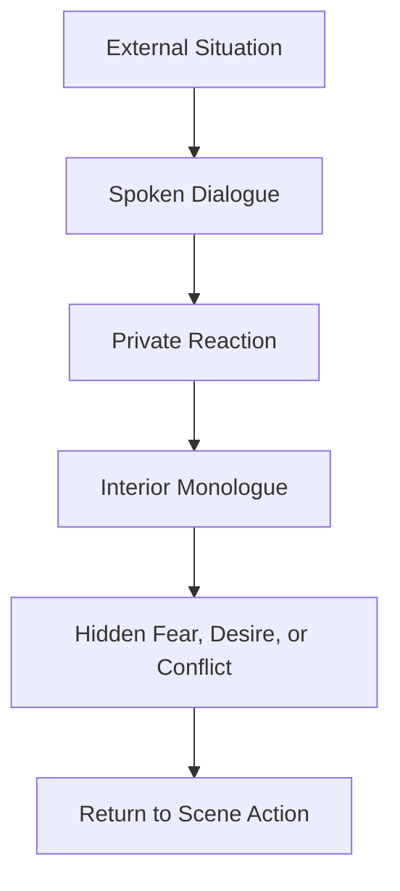

# 008 - Exercise: Writing an Interior Monologue

## Section

**04 - Dialogue**

## Original Lecture Title

**Bài tập viết độc thoại**
**English:** Exercise: Writing an Interior Monologue

## Duration

**Not listed**
Writing exercise / discussion segment

---

# 1. Core Idea

Interior monologue is the private voice inside a character’s mind.

It reveals what the character thinks, fears, wants, hides, or cannot say aloud.

In dialogue scenes, interior monologue is especially useful because it creates contrast between:

* What the character says
* What the character thinks
* What the character wants to hide
* What the reader understands

A strong interior monologue does not stop the scene. It deepens the tension inside the scene.

---

# 2. What Is Interior Monologue?

An **interior monologue** is a passage that shows a character’s thoughts from the inside.

It may appear as:

* Direct thought
* Fragmented thought
* Emotional reaction
* Silent self-argument
* Private confession
* Fear, memory, or desire

Interior monologue allows the reader to hear what the character cannot or will not say out loud.

---

# 3. Interior Monologue vs. Spoken Dialogue

| Element                   | Spoken Dialogue            | Interior Monologue                  |
| ------------------------- | -------------------------- | ----------------------------------- |
| Heard by other characters | Yes                        | No                                  |
| Heard by the reader       | Yes                        | Yes                                 |
| Usually controlled        | Often                      | Less controlled                     |
| Can be dishonest          | Yes                        | Yes, but often reveals deeper truth |
| Function                  | External conflict          | Internal conflict                   |
| Main effect               | Moves conversation forward | Reveals hidden emotional pressure   |

---

# 4. Main Functions of Interior Monologue

Interior monologue can serve several important narrative functions.

## 1. Reveal hidden truth

A character may say one thing while thinking another.

Example:

```text
“I’m happy for you,” she said.

Of course I am. Delighted. Completely thrilled. I hope the ring turns your finger green.
```

The spoken line is polite.
The interior monologue reveals jealousy.

---

## 2. Create dramatic irony

Interior monologue can build dramatic irony when the reader knows something other characters do not.

The character may be hiding:

* A secret
* A lie
* A memory
* A fear
* A plan
* A desire
* A betrayal

The reader becomes aware of the hidden pressure beneath the scene.

---

## 3. Show emotional conflict

Interior monologue is useful when a character is torn between two impulses.

For example:

* Tell the truth or stay silent
* Run away or stay
* Laugh or cry
* Forgive or punish
* Confess love or protect pride

The character’s thoughts become a battlefield.

---

## 4. Reveal character voice

A character’s private thoughts should not sound exactly like the narrator.

Interior monologue should reflect:

* Vocabulary
* Rhythm
* Education
* Personality
* Fear
* Humor
* Emotional habits
* Cultural background

A nervous character’s thoughts may be fast and fragmented.
A cold character’s thoughts may be precise and controlled.
A comic character’s thoughts may turn fear into jokes.

---

# 5. Interior Monologue Structure



---

# 6. Why Interior Monologue Matters in Dialogue Scenes

Dialogue shows what characters choose to say.

Interior monologue shows what they choose not to say.

This contrast can make a scene more powerful.

## Example

```text
“You did great,” Mark said.

Great. Right. That was why everyone stopped clapping halfway through. That was why the woman in the front row checked her phone like she was reading my obituary.
```

The spoken line is reassurance.
The interior monologue reveals insecurity and humiliation.

---

# 7. The Assignment

## Prompt

A stand-up comedian is waiting backstage at a club.

It is his first-ever performance.
He will be announced in only a few minutes.
He is about to walk onto the main stage.

## Task

Write his interior monologue.

The monologue should reveal what he is thinking before he steps onstage.

---

# 8. Assignment Situation Diagram


---

# 9. What the Monologue Should Reveal

The comedian’s interior monologue could reveal:

* Fear of failure
* Desire to be loved
* Need for approval
* Shame
* Excitement
* Self-doubt
* Hope
* Memory of rehearsal
* Fear of silence
* Fear of laughter not coming
* A private reason for wanting to perform

The goal is not only to show that he is nervous.

The goal is to make his nervousness specific, personal, and alive.

---

# 10. Strong Interior Monologue Techniques

## 1. Use a distinct inner voice

The monologue should sound like this specific comedian, not like a neutral narrator.

A comedian’s thoughts might be:

* Fast
* Self-mocking
* Observational
* Exaggerated
* Darkly funny
* Full of sudden comparisons
* Full of panic disguised as jokes

---

## 2. Mix fear with humor

Because the character is a comedian, his fear can become material.

He may think:

* “What if they hate me?”
* “What if they laugh for the wrong reason?”
* “What if I forget the first joke?”
* “What if my panic is funnier than my act?”

This creates a voice that fits the situation.

---

## 3. Keep the monologue moving

Interior monologue should not become a long essay.

It should feel like thought under pressure.

Use:

* Short sentences
* Interruptions
* Repetition
* Sudden shifts
* Sensory details
* Physical reactions

---

## 4. Connect thought to the present moment

The monologue should stay connected to what is happening backstage.

Possible present-moment details:

* The microphone stand
* The curtain
* The host’s voice
* The smell of beer
* The sound of laughter
* The comedian’s sweaty hands
* The stage lights
* The previous performer leaving the stage

These details prevent the monologue from floating away from the scene.

---

# 11. Example Interior Monologue

```text
They are laughing now. Good. Terrible. Good because they can laugh. Terrible because now they have standards.

My hands are wet. Why are my hands wet? I am not a frog. I am a grown man in a clean shirt, unless the sweat has already reached the shirt, in which case I am a cautionary tale with shoes.

Ten minutes. I only have to survive ten minutes. People survive worse things every day. Dentists. Family dinners. Group chats. I can survive ten minutes.

Unless I forget the first line.

Do not forget the first line.

The first line is the door. Open the door, walk through it, then the second joke comes. Then the third. Then maybe they laugh. Maybe one person laughs. One generous drunk person in the back. I love him already. Whoever you are, sir, please be loud.

The host is talking again. That means I have maybe thirty seconds.

Thirty seconds before they find out whether I am a comedian or just a man with unresolved childhood issues and a microphone.

Same thing, maybe.

Breathe. Smile. Walk like you meant to be here.
```

---

# 12. Why This Example Works

| Technique              | Effect                           |
| ---------------------- | -------------------------------- |
| Fast rhythm            | Shows panic                      |
| Self-mocking humor     | Fits a comedian’s personality    |
| Physical detail        | Keeps the scene grounded         |
| Repetition             | Shows anxiety                    |
| Present-stage pressure | Keeps the scene moving           |
| Private fear           | Reveals what he cannot say aloud |

---

# 13. Interior Monologue Revision Checklist

Use this checklist after writing your monologue.

| Question                                                 | Yes / No |
| -------------------------------------------------------- | -------- |
| Does the monologue sound like this specific character?   |          |
| Does it reveal something the character cannot say aloud? |          |
| Is there emotional pressure?                             |          |
| Does the thought connect to the current scene?           |          |
| Is the passage short enough to keep the scene moving?    |          |
| Does it reveal fear, desire, or contradiction?           |          |
| Could another character’s monologue sound different?     |          |

---

# 14. Common Mistakes to Avoid

## Mistake 1: Making the monologue too general

Weak:

```text
He was nervous and hoped the audience would like him.
```

Stronger:

```text
If they do not laugh in the first ten seconds, I will legally change my name and become a man who repairs printers.
```

The stronger version gives the nervousness a specific comic voice.

---

## Mistake 2: Explaining instead of thinking

Interior monologue should feel like thought, not a summary.

Weak:

```text
He remembered that this performance was important because he had always wanted to become a comedian.
```

Stronger:

```text
Dad said, “Get a real job.” If this goes badly, I can still hear him saying it forever.
```

---

## Mistake 3: Stopping the scene

If the monologue is too long, the reader may forget what is happening externally.

Keep returning to the present moment.

Example:

```text
The host touched the microphone. My stomach dropped before he even said my name.
```

---

## Mistake 4: Making every thought too polished

Real thoughts are often messy.

They may include:

* Sentence fragments
* Contradictions
* Repetition
* Sudden fear
* Sudden jokes
* Illogical associations

Interior monologue should feel alive, not perfectly organized.

---

# 15. Practical Exercise

Write one full paragraph of interior monologue during a tense conversation or performance.

The character should think something they cannot say aloud.

## Steps

1. Choose a tense external situation.
2. Decide what the character says or does on the outside.
3. Decide what they secretly think.
4. Give the thoughts a distinct character voice.
5. Keep the passage short.
6. Return quickly to the present action.

---

# 16. Reflection Question

> What private thought would most complicate this scene if the other character could suddenly hear it?

This is a powerful question because interior monologue becomes most useful when it contains danger.

The thought should matter.

It should be something the character would rather hide.

---

# 17. Key Takeaways

* Interior monologue reveals what a character cannot say aloud.
* It should have its own voice, distinct from the narrator’s voice.
* It can create dramatic irony when the reader knows something other characters do not.
* It works best when connected to a tense present-moment situation.
* Interior monologue should be short enough that it does not stop the scene.
* A strong monologue reveals fear, desire, contradiction, or hidden truth.
* The best interior monologue feels like thought under pressure.

---

# 18. Summary

This lesson focuses on writing interior monologue as part of the dialogue module.

Interior monologue is not just “thinking.” It is a tool for revealing hidden conflict.

In a dialogue or performance scene, what a character does not say may be more powerful than what they say.

For this assignment, the stand-up comedian’s private thoughts should reveal the emotional tension behind the public performance.

The audience will hear his jokes.

The reader should hear his fear.
