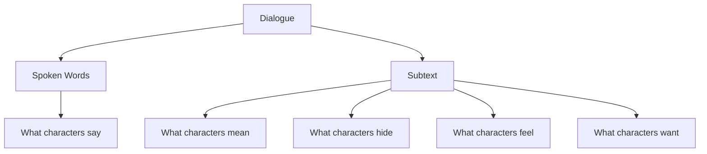
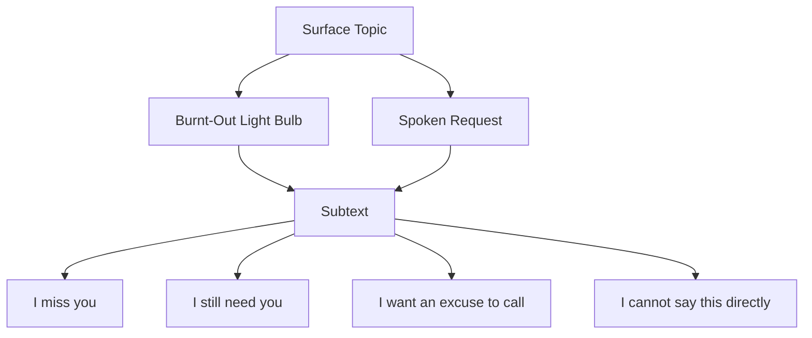
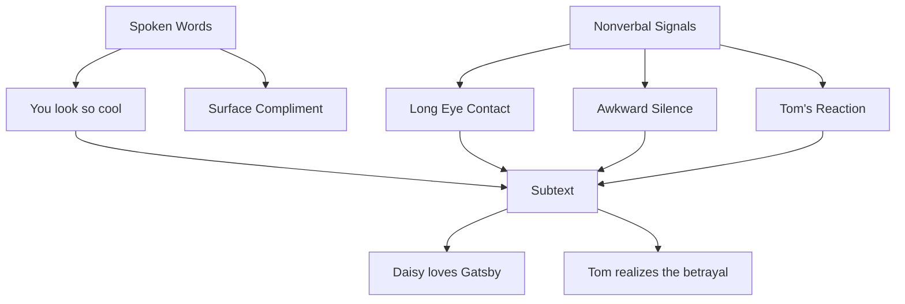
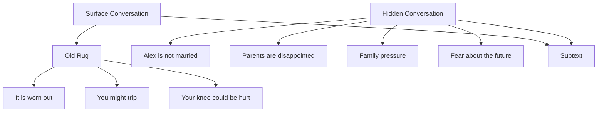
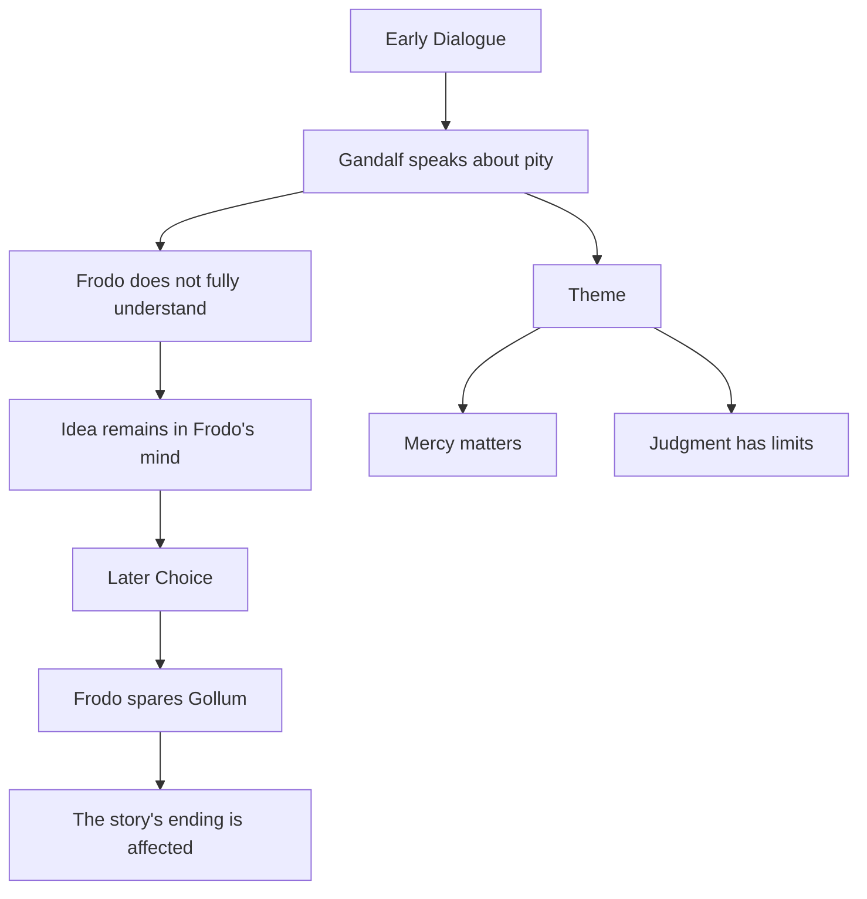
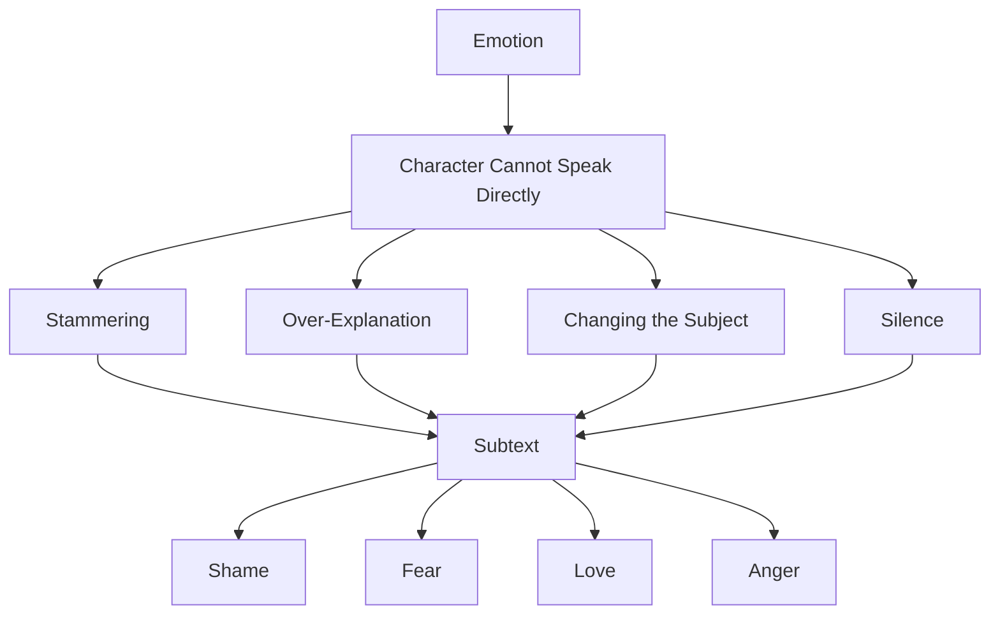
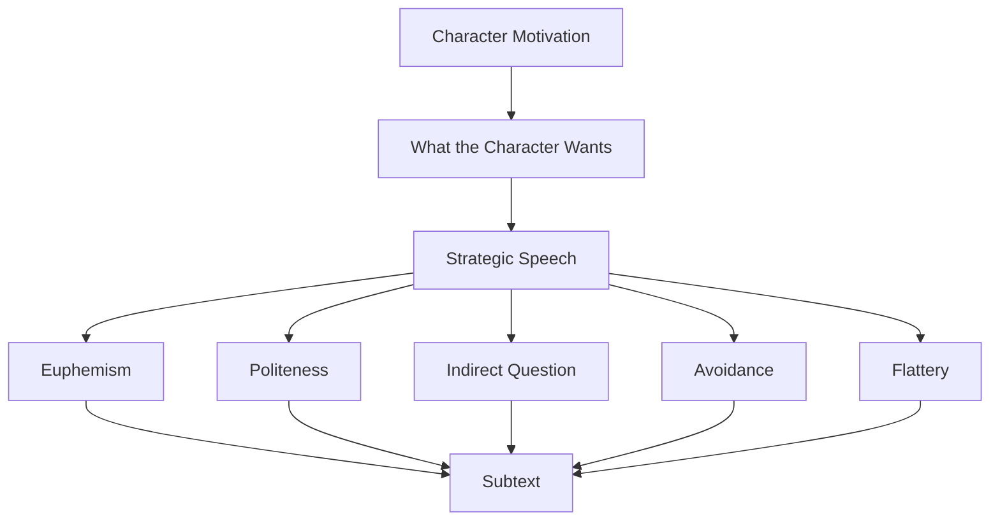
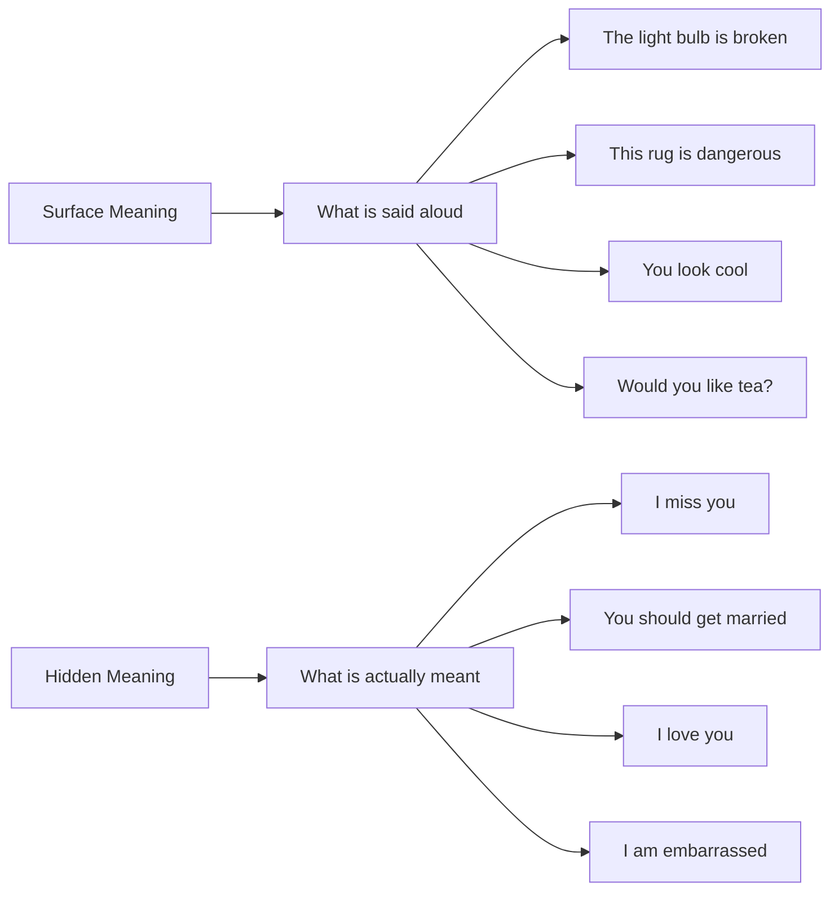
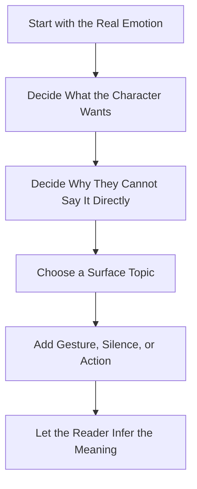
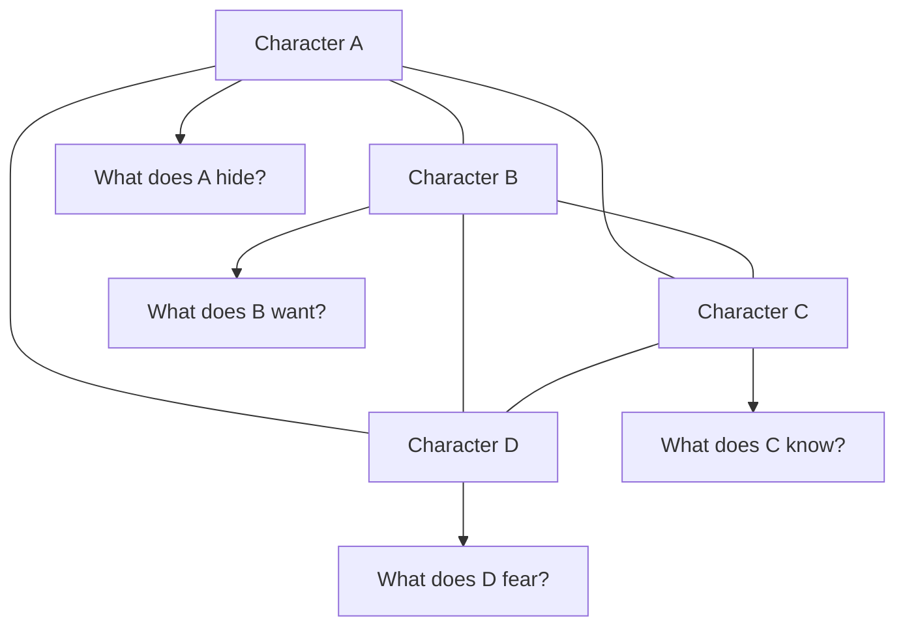

# 009 - Subtext in Dialogue

## Section

**04 - Dialogue**

## Original Lecture Title

**Subtext in Dialogue**

## Duration

**12:58**

---

## Lesson Overview

Think of an iceberg.

In dialogue, the words characters actually say are only the visible tip of the iceberg. Beneath the surface lies something larger, hidden, and often more important.

That hidden layer is **subtext**.

Subtext is the meaning, emotion, fear, desire, or truth that exists underneath the literal words being spoken.

Characters may appear to talk about one thing, while the real subject is something else entirely.

---

## Core Principle

> Subtext is the hidden message beneath the spoken words.

In real life, people often avoid saying exactly what they mean.

They may avoid the truth because they are:

* Embarrassed
* Afraid
* Angry
* Ashamed
* In love
* Trying to protect themselves
* Trying to manipulate someone
* Unable to admit what they want

This is why subtext is essential in fiction. It makes dialogue feel human.

---

## The Iceberg Model of Dialogue



---

## What Is Subtext?

Subtext is not random mystery. It is meaning that the reader can infer from context, tone, behavior, and situation.

A character might say:

```text
"I'm fine."
```

But the subtext might be:

```text
I am hurt.
I am angry.
I do not want to talk about this.
I want you to notice that something is wrong.
```

The spoken line is simple. The hidden meaning is complex.

---

## Why Subtext Matters

Subtext makes dialogue stronger because it creates emotional depth.

It allows the reader to participate by interpreting what is really happening beneath the surface.

Subtext can:

* Create tension
* Reveal hidden emotions
* Suggest backstory
* Build conflict
* Show attraction or resentment
* Hide secrets
* Make dialogue feel more natural
* Let the reader infer meaning without direct explanation

---

## Subtext vs Direct Dialogue

### Direct Dialogue

```text
"I am still in love with you, and I miss our marriage."
```

### Dialogue with Subtext

```text
"The hallway light is out again," she said. "You were always better at fixing that."
```

The second version is more indirect. The character is talking about a light bulb, but the real subject may be loneliness, memory, dependence, regret, or love.

---

## Example: Romantic Subtext

In romantic comedies, subtext is everywhere.

People often find it easier to talk around their feelings than to state them directly.

For example, in *Crazy, Stupid, Love*, Cal and Emily are getting divorced. Cal has moved out of the house, but one evening he secretly returns to watch his family from outside.

At the same time, Emily calls him. Her excuse is that she needs help with a burnt-out light bulb.

On the surface, she is talking about a household problem.

Underneath, the subtext suggests:

* She misses him
* She still needs him
* She is not ready to fully let him go
* She wants connection without admitting it directly

---

## Subtext Diagram



---

# Five Ways to Create Subtext in Dialogue

---

# 1. Use Nonverbal Signals

Subtext can be created through what characters do not say.

Characters may reveal hidden meaning through:

* Eye contact
* Silence
* A forced smile
* A trembling hand
* Avoiding someone’s gaze
* Touching an object
* Moving closer or farther away
* Speaking too quickly
* Changing posture

Nonverbal behavior can expose the truth even when the spoken words try to hide it.

---

## Example: Hidden Betrayal

In *The Great Gatsby*, Daisy and Gatsby reveal their emotional connection not through a direct confession, but through looks, tone, and compliments.

Daisy says that Gatsby looks “cool,” but the real message is deeper. Her gaze and repetition reveal affection. Tom notices the exchange and understands that something has happened between them.

The surface conversation is ordinary.

The subtext is betrayal.

---

## Nonverbal Subtext Diagram



---

## Why Nonverbal Subtext Works

Nonverbal signals are powerful because characters may lie with words, but their bodies often reveal the truth.

A character can say:

```text
"It does not matter."
```

But if they cannot look the other person in the eye, the reader understands that it does matter.

---

# 2. Use Context

The context of a scene can create subtext.

Characters may talk about one object, event, or practical problem, while the real meaning comes from the larger situation.

The reader understands the hidden meaning because they know the context.

---

## Example: Talking About a Rug

In *Portnoy's Complaint* by Philip Roth, the parents appear to discuss an old carpet.

On the surface, they are talking about:

* The rug
* Its poor condition
* The risk of tripping
* Physical safety

But beneath the surface, they are really talking about their son Alex and their disappointment that he has not married.

The rug becomes a substitute subject.

---

## Context-Based Subtext Diagram



---

## Tarantino-Style Subtext

Quentin Tarantino’s films often use conversations that seem unrelated to the actual violence or danger of the scene.

Characters may talk about:

* Hamburgers
* Coffee
* Television
* Foot massages
* The Bible
* Ordinary daily details

But the real situation may involve murder, threat, criminal loyalty, or betrayal.

The contrast between ordinary conversation and extreme circumstances creates tension.

---

## Why Context Works

Context allows dialogue to become indirect.

The characters do not need to explain the real issue because the situation already gives the words meaning.

This makes the scene feel more natural and less heavy-handed.

---

# 3. Connect Subtext to the Theme

Subtext becomes even stronger when it connects to the central theme of the novel.

The theme is the deeper message, question, or moral pressure of the story.

When dialogue carries thematic subtext, ordinary lines can foreshadow major decisions later in the plot.

---

## Example: Mercy in *The Lord of the Rings*

In *The Lord of the Rings*, Frodo initially does not fully understand Gandalf’s lesson about pity and mercy.

Gandalf suggests that even the wise cannot always see all ends, and that mercy may matter more than judgment.

At the time, this may seem like a philosophical conversation.

But later, Frodo’s decision to spare Gollum becomes crucial to the fate of the story.

The subtext supports the novel’s larger theme:

> Mercy can shape destiny in ways that judgment cannot predict.

---

## Thematic Subtext Diagram



---

## Why Thematic Subtext Works

Thematic subtext helps a story feel unified.

A line of dialogue can do more than serve the immediate scene. It can quietly prepare the reader for the moral meaning of the whole novel.

---

# 4. Show Emotion Indirectly

Emotion is one of the richest sources of subtext.

When characters feel strongly, they often struggle to speak directly.

They may:

* Stop mid-sentence
* Avoid answering
* Change the subject
* Over-explain
* Speak too formally
* Say the opposite of what they feel
* Hide behind practical details
* Fall silent

This creates subtext because the reader senses the emotion behind the broken or indirect speech.

---

## Example: Embarrassment and Poverty

A character might try to hide shame by over-explaining:

```text
"You have found me in a strange position, Lisa," I began.

"No, no, do not imagine anything. I am not ashamed of my poverty. On the contrary, I am proud of it. One can be poor and honorable."

I stopped.

"Would you like tea?"
```

The character says they are not ashamed, but the subtext tells us the opposite.

The nervous explanation reveals:

* Embarrassment
* Insecurity
* A desire to appear dignified
* Fear of being judged

---

## Emotional Subtext Diagram



---

## Why Emotional Subtext Works

When a character says exactly what they feel, the scene can become too obvious.

When a character tries not to reveal what they feel, the emotion often becomes stronger.

The reader sees the struggle.

---

# 5. Play with Character Motivation

A character’s motivation shapes the way they speak.

Characters rarely enter a conversation without wanting something.

They may want to:

* Be loved
* Avoid blame
* Get information
* Hide guilt
* Gain power
* Save face
* Test someone
* Manipulate someone
* Receive forgiveness
* Avoid rejection

Because they want something, their dialogue becomes strategic.

They may use:

* Politeness
* Euphemism
* Questions
* Jokes
* Indirect suggestions
* False humility
* Silence
* Careful wording

---

## Motivation-Based Subtext Diagram



---

## Example: Social Status and Rejection

A character may ask polite questions, but the real subject may be class, rejection, and belonging.

On the surface, the dialogue may sound formal or intellectual.

Underneath, the character may be asking:

* Do I still belong here?
* Am I acceptable to your family?
* Am I being rejected because of my work?
* Can I cross this social boundary?
* Do you see me as inferior?

The subtext gives emotional weight to the conversation.

---

## Common Sources of Subtext

Subtext often comes from hidden or difficult material, such as:

* Secrets
* Past relationships
* Family trauma
* Shame
* Forbidden love
* Fear
* Desire
* Jealousy
* Social pressure
* Class difference
* Guilt
* Betrayal
* Unspoken resentment
* Unresolved history

---

## Surface Meaning vs Hidden Meaning



---

## How to Write Subtext Naturally

To create subtext, do not simply make dialogue vague.

Instead, build a clear difference between:

1. What the character says
2. What the character means
3. What the character wants
4. What the character is afraid to reveal

---

## Subtext Writing Process



---

## Example: Direct vs Subtext

### Direct Version

```text
"I am angry because you forgot our anniversary."
```

### Subtext Version

```text
She set the two untouched plates in the sink.

"You bought flowers today," she said.

He looked at the roses on the table.

"They were on sale."

"Of course," she said. "Lucky timing."
```

The characters never mention the anniversary directly, but the reader can sense the hurt.

---

## Practical Exercise

Create subtext between characters by mapping their relationships.

---

## Exercise Instructions

Take a blank sheet of paper and write the names of all the main characters in your novel.

Arrange them in a circle.

Then draw lines between the characters and answer questions about each relationship.

---

## Character Relationship Map



---

## Relationship Questions

For each pair of characters, ask:

1. Are they completely unrelated?
2. Do they have a past connection?
3. Is the connection known to both characters?
4. Is it known only to one of them?
5. Is it unknown to both of them?
6. Does one character owe the other something?
7. Does one character envy the other?
8. Does one character fear the other?
9. Does one character love the other?
10. Does one character know a secret about the other?
11. What can they not say directly?
12. What subject do they talk about instead?

---

## Practice Goal

Write a dialogue scene between two characters where the real topic is hidden.

The characters should speak about something ordinary while the reader senses something deeper.

### Example Setup

```text
Surface topic:
Cleaning the kitchen.

Hidden topic:
One character is thinking about leaving the marriage.
```

### Example Dialogue

```text
"You missed a spot," she said.

He looked at the counter. "Where?"

"Near the sink."

He wiped it with his sleeve.

"Not like that," she said.

He stopped. "Then how?"

She folded the towel carefully. "I do not know anymore."
```

---

## Revision Checklist for Subtext

When revising dialogue, ask:

### Surface Layer

1. What are the characters literally talking about?
2. Is the surface topic clear?
3. Does the conversation sound natural?

### Hidden Layer

1. What is the real subject?
2. What does each character want?
3. What is each character afraid to say?
4. What emotion is being hidden?

### Reader Inference

1. Can the reader sense the hidden meaning?
2. Are you explaining the subtext too directly?
3. Can gesture, silence, or action carry more meaning?
4. Does the scene trust the reader?

### Story Function

1. Does the subtext reveal character?
2. Does it create tension?
3. Does it suggest backstory?
4. Does it connect to the theme?
5. Does it move the relationship or plot forward?

---

## Reflection Questions

1. Where in your draft does a character say exactly what they mean when subtext would be stronger?
2. Which characters avoid saying the truth?
3. What hidden desire shapes each major relationship?
4. What secret could influence a conversation without being named?
5. What ordinary subject could characters use to avoid a painful truth?
6. Does the reader have enough context to understand the subtext?
7. Are you trusting the reader, or explaining too much?

---

## Key Takeaways

* Subtext is the hidden meaning beneath spoken dialogue.
* Characters often talk around the real subject.
* Subtext makes dialogue feel more natural and emotionally rich.
* Nonverbal signals can reveal what words hide.
* Context can turn ordinary dialogue into meaningful tension.
* Subtext can connect to the theme of the whole novel.
* Strong emotion often appears through avoidance, silence, or broken speech.
* Character motivation shapes strategic dialogue.
* The reader should infer subtext instead of being told directly.

---

## Summary

This lesson belongs to the **Dialogue** module.

Subtext is what gives dialogue depth. It allows characters to speak indirectly while still revealing emotion, conflict, secrets, desire, and fear.

A strong dialogue scene often has two layers: the visible conversation and the hidden meaning underneath. The writer’s job is not to explain the hidden meaning too loudly, but to create enough context, gesture, silence, and pressure for the reader to feel it.
