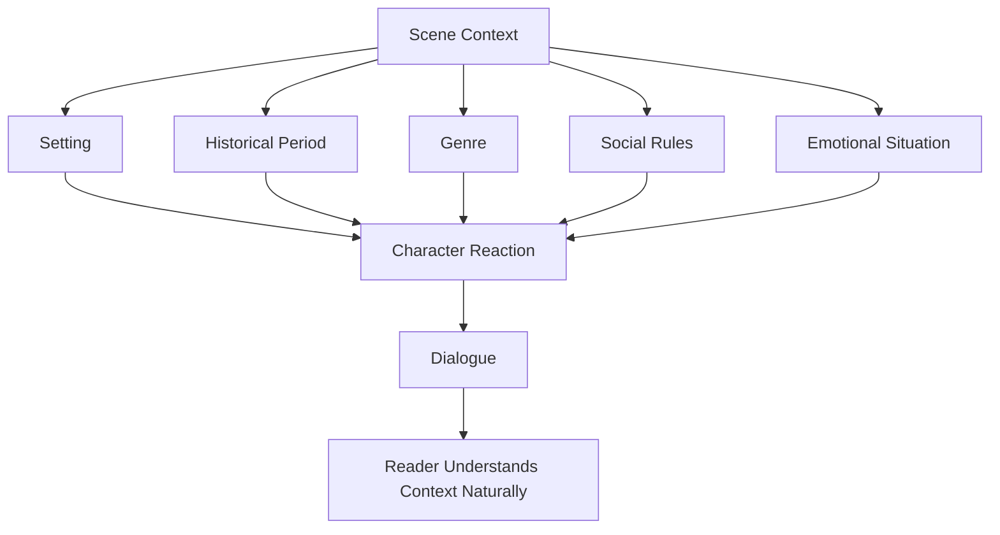
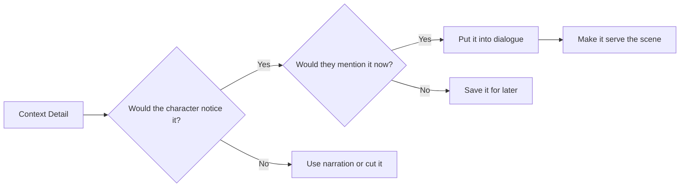

# 010 - Using Dialogue to Convey Context

## Section

**04 - Dialogue**

## Original Lecture Title

**Using Dialogue to Convey Context**

## Duration

**6:48**

---

## Lesson Overview

Characters never exist in empty space. They are always speaking inside a specific setting, historical period, culture, social structure, or emotional situation.

Context can be shown through narration, description, action, or dialogue. In this lesson, the focus is on using dialogue to indirectly reveal the world around the characters.

Good contextual dialogue helps the reader understand:

* Where the scene takes place
* What kind of world the characters live in
* What historical or social rules shape the scene
* What mood or atmosphere surrounds the characters
* What emotional situation they are facing

The key is to make the context feel natural, not forced.

---

## Core Principle

> Dialogue should reveal context because the characters have a reason to mention it, not because the writer needs to explain it.

The reader should not feel that characters are describing the world only for the reader’s benefit.

---

## Key Points

### 1. Use Dialogue to Create Atmosphere

Dialogue can establish atmosphere by letting characters react to the environment around them.

For example, a character may refer to:

* Darkness
* Weather
* Danger
* Silence
* A strange sound
* A historical title
* A place name
* A threat nearby
* A social rule
* A cultural custom

A few words can immediately suggest genre, mood, and setting.

For example:

```text
“We should turn back,” Garrett said as the woods darkened around them.

“Do the dead frighten you, Ser Waymar?” Royce asked with a faint smile.

Garrett did not answer the provocation.

“Dead is dead,” he said softly. “We have no business with them.”
```

This dialogue suggests:

* A dark forest
* Danger
* Death
* Fantasy atmosphere
* Medieval-style titles
* Unease between characters

The setting is not explained in a long paragraph. It is felt through the dialogue.

---

## 2. Match Dialogue to Genre

The kind of context you reveal depends on the genre of the story.

| Genre              | Possible Dialogue Function                                    |
| ------------------ | ------------------------------------------------------------- |
| Detective fiction  | Interrogation, clues, suspicion, hidden motives               |
| Fantasy            | World rules, titles, legends, magic, kingdoms                 |
| Science fiction    | Technology, missions, planets, systems, procedures            |
| Historical fiction | Period language, social rank, customs, political tension      |
| Romance            | Emotional stakes, intimacy, misunderstanding, social pressure |
| Horror             | Fear, uncertainty, warnings, denial, atmosphere               |
| War fiction        | Orders, survival, hierarchy, trauma, urgency                  |

Dialogue should support the genre’s atmosphere.

For example:

```text
“Your Majesty, the northern gate has fallen.”
```

This single line suggests monarchy, hierarchy, danger, and possibly fantasy or historical fiction.

```text
“Captain, the oxygen reserve will not last until Mars orbit.”
```

This line immediately suggests science fiction, danger, technology, and mission pressure.

---

## 3. Choose Language That Reveals Time and Place

Characters reveal context through the words they use.

Their dialogue may include:

* Titles
* Slang
* Formality level
* Cultural references
* Religious references
* Military ranks
* Political language
* Objects from the period
* Technology from the world
* Social expectations

Examples:

| Dialogue Detail                        | Context It Suggests                      |
| -------------------------------------- | ---------------------------------------- |
| “Your Majesty”                         | Monarchy, court, hierarchy               |
| “Milord”                               | Medieval or fantasy setting              |
| “Captain”                              | Military, ship, police, or space mission |
| “The telegram arrived this morning.”   | Historical period                        |
| “The portal closes at midnight.”       | Fantasy or science fiction               |
| “The server went down again.”          | Modern technology setting                |
| “Do not speak her name in this house.” | Family conflict, taboo, social pressure  |

The right vocabulary can place the reader inside the world without direct explanation.

---

## 4. Let the Story Situation Shape the Dialogue

The same information can create completely different contexts depending on how characters react.

For example, the same sentence:

```text
“I’m pregnant.”
```

can create very different scenes depending on the response.

### Positive Context

```text
“I’m pregnant.”

For a moment, Marco said nothing.

Then his voice broke into laughter. “That cannot be. Today is your birthday. I was supposed to give you a gift.”

“Does that mean you’re happy?”

“Happy? I’m running to you right now.”
```

This creates a warm, joyful, hopeful context.

### Dark Context

```text
“I’m pregnant.”

He froze.

“What?” he said.

She looked down at her untouched coffee.

“How long have you known?”

“Three weeks.”

He kept stirring the coffee, though the sugar had already dissolved.
```

This creates a tense, oppressive, emotionally dangerous context.

The event is the same. The dialogue and reactions create the context.

---

## 5. Avoid Empty Exposition

Weak contextual dialogue often sounds like characters are explaining things they already know.

Avoid lines like:

```text
“As you know, brother, we have lived in this kingdom for twenty years under the cruel rule of King Alden.”
```

This sounds unnatural because the character is not speaking to the other character. They are speaking to the reader.

A more natural version:

```text
“Keep your voice down. Alden’s men still own this street.”
```

This line reveals:

* The king’s name
* His oppressive control
* The characters’ fear
* The political context
* The danger of the location

The context emerges from the character’s need in the scene.

---

## 6. Make Characters React to Context

Characters should not describe the setting neutrally. They should react to it.

Instead of:

```text
“The city is dangerous at night.”
```

Use:

```text
“Hide your purse before we reach the bridge.”
```

Instead of:

```text
“This spaceship is old.”
```

Use:

```text
“If the left engine coughs again, do not touch the red switch.”
```

Instead of:

```text
“The palace has strict rules.”
```

Use:

```text
“Bow lower. They count disrespect by the inch here.”
```

Reaction feels more alive than explanation.

---

## Context Through Dialogue Diagram



---

## Natural Context Checklist



---

## Practical Exercise

Write a dialogue scene where two brothers are making final preparations for an imminent journey.

The journey could be:

* A holiday in France
* A trip to Mars
* A dangerous escape
* A military mission
* A pilgrimage
* A family visit
* A fantasy quest

Then rewrite the same scene, but add the fact that they are packing while talking.

Important rule:

> Do not directly explain that they are packing.

Instead, let the reader infer it through small contextual details.

For example:

```text
“Fold that one again.”

“It is a shirt, not a treaty.”

“It wrinkles if you breathe on it wrong.”
```

This suggests packing without saying:

```text
They were packing their clothes.
```

The dialogue creates the context naturally.

---

## Example Exercise Version 1: Trip to France

```text
“Did you print the tickets?”

“You asked me three times.”

“And you answered twice.”

He sighed. “Yes. Tickets, passports, hotel address.”

“What about the adapter?”

“You mean the thing you said we would never need because Paris is civilized?”

“Do not start.”
```

This dialogue suggests:

* Travel preparation
* Sibling dynamic
* Mild tension
* A modern setting
* A trip to France or Europe

---

## Example Exercise Version 2: Trip to Mars

```text
“Did you seal the pressure kit?”

“You asked me three times.”

“And you avoided answering twice.”

He glanced at the silver case. “Yes. Pressure kit, oxygen tabs, emergency beacon.”

“What about the radiation badge?”

“You mean the thing you said made me look like a paranoid old man?”

“On Mars, paranoid old men survive.”
```

This version uses the same basic structure, but the context changes completely.

Now the scene suggests:

* Science fiction
* Space travel
* Danger
* Technical preparation
* A more serious journey

---

## Show, Don’t Tell Through Contextual Dialogue

| Telling                            | Showing Through Dialogue                                  |
| ---------------------------------- | --------------------------------------------------------- |
| They were in a fantasy world.      | “Milord, the eastern tower has fallen.”                   |
| The city was unsafe.               | “Do not stop walking until we pass the bridge.”           |
| The family was poor.               | “Cut the apple in three. Your father has not eaten.”      |
| The ship was damaged.              | “If the engine goes quiet, pray before you look outside.” |
| The palace was strict.             | “Smile only when spoken to.”                              |
| They were preparing for a journey. | “You packed the wrong boots.”                             |
| The situation was tense.           | “Say it again, but quieter.”                              |

---

## Common Mistakes

### Mistake 1: Characters Explain What They Already Know

Avoid dialogue that exists only to inform the reader.

Weak:

```text
“As you know, we are brothers traveling to France tomorrow.”
```

Better:

```text
“If you forget your passport again, I am leaving you at the airport.”
```

---

### Mistake 2: Context Has No Scene Function

Do not include setting details unless they affect the scene.

A detail should create:

* Mood
* Conflict
* Tension
* Character reaction
* Worldbuilding
* Relationship dynamics
* Plot movement

---

### Mistake 3: Dialogue Sounds Like Description

Characters should not speak like tour guides unless there is an in-scene reason.

Weak:

```text
“This forest is dark, ancient, and filled with dangerous spirits.”
```

Better:

```text
“Do not answer if you hear your name from the trees.”
```

---

### Mistake 4: Language Does Not Match the World

Modern slang may break a historical or fantasy scene unless used intentionally.

Formal titles may sound strange in a modern realistic scene unless the situation justifies them.

Always check whether the character’s language fits:

* Time period
* Social class
* Education
* Genre
* Culture
* Relationship
* Emotional state

---

## Writing Checklist

Before finishing a dialogue scene that conveys context, check:

* [ ] Does the dialogue reveal where the characters are?
* [ ] Does it suggest the genre or world?
* [ ] Does the language match the time period?
* [ ] Do characters mention details they would realistically notice?
* [ ] Does the context affect the scene?
* [ ] Is the information motivated by the situation?
* [ ] Does the dialogue avoid “as you know” exposition?
* [ ] Can the reader infer context without being directly told?
* [ ] Does the setting create mood or tension?
* [ ] Does the dialogue still sound like real character speech?

---

## Reflection Questions

1. Would this character realistically notice this detail?
2. Would they comment on it in this moment?
3. Is the detail important to the scene, or only to the reader?
4. Can the context be shown through reaction instead of explanation?
5. Does the dialogue reveal genre, setting, or historical period?
6. Does the language match the world?
7. Does the context create atmosphere?
8. Does the dialogue also reveal character or relationship?
9. Is there any “as you know” exposition that should be removed?
10. Could a reader understand the scene’s context without a descriptive paragraph?

---

## Summary

Dialogue can convey context naturally when characters react to their surroundings, social rules, historical period, or emotional situation.

Strong contextual dialogue does not explain the world directly. Instead, it lets the reader infer the world through:

* Word choice
* Titles
* Objects
* Reactions
* Atmosphere
* Genre signals
* Character behavior
* Emotional tone

The best contextual dialogue serves both the story world and the scene itself.

It tells the reader where they are without sounding like an explanation.
