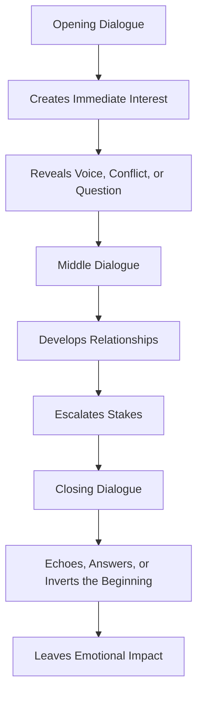
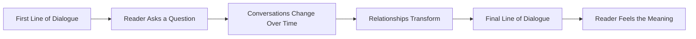

# 011 - Using Dialogue to Open, Develop, and Close a Story

## Section

**04 - Dialogue**

## Original Lecture Title

**Using Dialogue to Open, Develop, and Close a Story**

## Duration

**5:09**

---

## 1. Lesson Overview

The beginning of a story is extremely important.

Dialogue can be one of the strongest tools for opening a story because it immediately places the reader inside a living moment.

Instead of explaining the situation from the outside, dialogue allows the reader to hear conflict, personality, tension, and mystery right away.

Dialogue can also help develop the middle of the story and create a powerful ending. A line of dialogue can open a question, deepen a relationship, or leave the reader suspended in uncertainty.

---

## 2. Why Dialogue Works Well at the Beginning

Opening a story with dialogue can quickly attract the reader’s attention.

A good first exchange can suggest:

* Who the characters are
* What kind of relationship they have
* What conflict is already present
* What tone the story will have
* What question the reader should keep reading to answer

Dialogue is especially useful in the first paragraphs because it creates movement immediately.

The reader is not simply receiving information. The reader is listening to people interact.

---

## 3. Example: Opening with Conflict

Consider this opening exchange:

> “All right,” said the man.
> “What about it?”
> “No,” said the girl.
> “I can’t.”
> “You mean you won’t.”
> “I can’t,” said the girl.
> “That’s all that I mean.”
> “You mean that you won’t.”
> “All right,” said the girl.
> “Have it your own way.”

This dialogue immediately creates tension.

The reader does not know the full situation yet, but the conflict is already clear.

---

## 4. What This Opening Reveals

This short exchange reveals two important things.

### 4.1 It Suggests Context

The words **man** and **girl** suggest an age difference between the two characters.

This gives the reader a basic sense of the relationship without directly explaining it.

### 4.2 It Reveals Personality and Power

The girl says:

> “I can’t.”

The man answers:

> “You mean you won’t.”

This tells us something about both characters.

The man is pressuring her. He sounds aggressive and insistent.

However, the girl may actually have the stronger position because she is the one who can choose.

Even if the man pushes, he does not fully control the situation.

This is the power of dialogue: it can reveal character, conflict, and power dynamics at the same time.

---

## 5. Three Tips for Opening a Story with Dialogue

If you want to begin a novel or story with dialogue, follow these three tips.

### 5.1 Limit the Number of Speakers

Use only one or two characters at the beginning.

Too many voices can confuse the reader before they understand the scene.

### 5.2 Give Clues About the Environment

Do not let the dialogue float in empty space.

Add small details that help the reader understand where the characters are, what they are doing, or what kind of atmosphere surrounds them.

### 5.3 Let the Secondary Character Speak First

If possible, let the secondary character speak first.

Then let the protagonist answer.

This often feels natural because the protagonist’s response can immediately reveal personality, attitude, and conflict.

---

## 6. Dialogue as Character in Action

Dialogue does not only communicate words.

It shows characters acting through language.

A character’s speech can reveal:

* Confidence
* Fear
* Class
* Education
* Cynicism
* Vulnerability
* Aggression
* Humor
* Desperation
* Moral values

When characters speak, they expose themselves.

---

## 7. Example: Dialogue That Reveals Theme

Consider this exchange:

> “Where are you going, brother?” asked the well-dressed old gentleman.
>
> The other man looked at him for a moment, then said, “I didn’t know I had a brother, and I don’t know where this road will take me.”
>
> “I’ll try to show you the way,” said the gentleman. “But I hope you don’t mind if I ask you for a rather unusual favor.”
>
> “I’m ready to do any work,” the homeless man replied.
>
> “I see you have some flaws, but it was God who put you in my path. You’ll definitely need some money. Don’t take it the wrong way. I’ve got too much of it. Can you just tell me honestly how much you need, at least for the moment?”
>
> The other man thought about it for a few seconds and then said, “Twenty francs.”
>
> “But that’s far too little,” said the gentleman. “You’ll certainly need two hundred.”

In only a few lines, the author creates curiosity and begins moving the whole story forward.

---

## 8. Why This Dialogue Works

The opening question is unusual:

> “Where are you going, brother?”

The main character answers cynically:

> “I didn’t know I had a brother, and I don’t know where this road will take me.”

This response reveals the essence of the character.

He is a homeless wanderer with no clear direction.

He could have reacted with surprise, fear, or anger. Instead, he responds with irony and emptiness.

The dialogue does several things at once:

* Introduces the characters
* Creates curiosity
* Reveals social contrast
* Establishes tone
* Moves the plot forward
* Suggests the story’s existential theme

The road becomes more than a road. It becomes a metaphor for life, direction, uncertainty, and fate.

---

## 9. Dialogue in the Middle of a Story

Dialogue is not only useful for openings.

In the middle of a story, dialogue helps develop:

* Relationships
* Conflicts
* Secrets
* Character arcs
* Emotional tension
* Power shifts
* Thematic ideas

As the story develops, conversations should not stay the same.

The way characters speak to each other should change as their relationship changes.

---

## 10. How Dialogue Develops a Story

In the middle section, dialogue can show progression.

For example:

| Early Dialogue                       | Later Dialogue                            |
| ------------------------------------ | ----------------------------------------- |
| Characters hide the truth.           | Characters confront the truth.            |
| Characters speak politely.           | Characters become more direct.            |
| Characters misunderstand each other. | Characters finally understand each other. |
| Characters trust each other.         | Trust is broken.                          |
| Characters avoid conflict.           | Conflict becomes unavoidable.             |

Dialogue should track emotional movement.

If the plot changes but the conversations feel the same, the story may feel static.

---

## 11. Dialogue as an Ending Tool

Dialogue can also be a powerful way to end a story.

A final line of dialogue can create:

* Closure
* Irony
* Emotional release
* Ambiguity
* Suspense
* A sense of continuation
* An open ending

Dialogue is especially useful for open endings because spoken language can stop at the exact moment before full explanation.

The reader is left suspended.

---

## 12. Example: Ending with Suspense

The following ending comes from Raymond Carver’s story **“The Bath.”**

> The telephone rang.
>
> “Yes,” she said.
>
> “Hello,” she said.
>
> “Mrs. Weiss?” the man’s voice said.
>
> “Yes,” she said. “This is Mrs. Weiss.”
>
> “Is this about Scottie?”
>
> “Scottie?” the voice said.
>
> “It is about Scottie,” the voice said. “It has to do with Scottie.”
>
> “Yes.”

The story ends there.

---

## 13. Why This Ending Works

“The Bath” tells the story of a child named Scottie who is hit by a car on his birthday and falls into a coma.

Before the accident, his mother had ordered a birthday cake from a bakery.

Throughout the story, the parents wait anxiously for Scottie to wake up.

At the end, the phone rings.

The reader does not know whether the caller is:

* The hospital
* The bakery
* Someone with news about Scottie
* Someone who does not understand the situation

The story does not reveal whether Scottie survives.

This creates emotional suspension.

The parents are trapped in uncertainty, and the reader is forced to feel a small part of that same fear.

---

## 14. Opening vs Closing Dialogue

A strong story can use dialogue at both the beginning and the end.

The opening dialogue may raise a question.

The closing dialogue may answer it, echo it, or leave it unresolved.

### Example Structure

| Story Position | Function of Dialogue                          |
| -------------- | --------------------------------------------- |
| Opening        | Creates curiosity, conflict, or mystery       |
| Middle         | Develops relationships and raises stakes      |
| Ending         | Creates closure, reversal, echo, or ambiguity |

---

## 15. Dialogue Arc Diagram

---

## 16. Dialogue as Story Structure

---

## 17. How to Use Dialogue at the Beginning

When opening with dialogue, ask:

1. Does the first line create curiosity?
2. Does it suggest conflict or tension?
3. Does it reveal something about the speaker?
4. Can the reader understand enough context to keep reading?
5. Are there too many speakers too soon?
6. Is the dialogue grounded in a visible scene?

A strong opening line should make the reader wonder:

> What is happening here?

But it should not make the reader feel completely lost.

---

## 18. How to Use Dialogue in the Middle

In the middle of the story, ask:

1. Has the relationship between these characters changed?
2. Does their dialogue reflect that change?
3. Is the conversation repeating information the reader already knows?
4. Does the dialogue increase pressure?
5. Does the dialogue reveal new emotional truth?
6. Does the scene move the story forward?

Middle dialogue should not simply fill space.

It should create movement.

---

## 19. How to Use Dialogue at the End

When ending with dialogue, ask:

1. Does the final line carry emotional weight?
2. Does it echo something from earlier in the story?
3. Does it answer a question raised near the beginning?
4. Does it create satisfying ambiguity?
5. Does it show how the character has changed?
6. Would the ending be weaker if this line were removed?

A final spoken line can be quiet, but it should not be meaningless.

---

## 20. Echo and Inversion

One powerful technique is to make the final line echo or invert an earlier line.

### Echo

An echo repeats the emotional meaning of an earlier line.

Example:

> Opening: “I can’t stay.”
> Ending: “I’m staying.”

### Inversion

An inversion reverses the meaning of an earlier line.

Example:

> Opening: “I don’t need anyone.”
> Ending: “Don’t leave me alone.”

This creates a sense of structure and transformation.

The dialogue itself shows the character arc.

---

## 21. Practical Exercise

Find the first and last important lines of dialogue in your story.

Then compare them.

Ask:

1. What question does the first dialogue line raise?
2. What emotional state does it create?
3. What does the final dialogue line answer?
4. Has the character changed between these two moments?
5. Could the final line echo or invert the first line?
6. Does the ending feel earned by the conversations in the middle?

---

## 22. Dialogue Opening and Ending Template

| Story Moment      | Dialogue Line | Function                     | Emotional Effect |
| ----------------- | ------------- | ---------------------------- | ---------------- |
| Opening dialogue  |               | Creates curiosity / conflict |                  |
| Midpoint dialogue |               | Shows change / raises stakes |                  |
| Final dialogue    |               | Echoes or answers opening    |                  |

---

## 23. Revision Checklist

Use this checklist when revising dialogue across the whole story.

* Does the opening dialogue pull the reader in?
* Are there too many characters speaking too early?
* Is the scene grounded in a clear environment?
* Does the protagonist’s first response reveal personality?
* Does dialogue in the middle show changing relationships?
* Do conversations escalate with the plot?
* Does the final line of dialogue carry emotional meaning?
* Does the ending dialogue echo, answer, or reverse something from earlier?
* Could the story’s dialogue form a visible emotional arc?

---

## 24. Key Takeaways

* Dialogue can be a powerful way to open a story.
* A first exchange can reveal conflict, character, tone, and theme.
* Opening dialogue should usually involve only a small number of speakers.
* Dialogue in the middle should track how relationships and stakes evolve.
* A final line of dialogue can create closure, suspense, irony, or ambiguity.
* Strong final dialogue often echoes or reverses something from the beginning.
* Dialogue can help shape the entire emotional structure of a story.

---

## 25. Summary

Dialogue can open, develop, and close a story with great force.

At the beginning, it can immediately attract the reader’s attention by creating conflict, mystery, or a strong character voice.

In the middle, it can show how relationships change and how tension escalates.

At the end, it can leave the reader with closure, uncertainty, or emotional resonance.

Used well, dialogue is not just decoration. It becomes part of the story’s structure.

---

# Bài luyện tập

## Mục tiêu

## Đề bài

## Yêu cầu hoàn thành

- [ ] 
- [ ] 
- [ ] 

## Kết quả / lời giải

## Ghi chú
