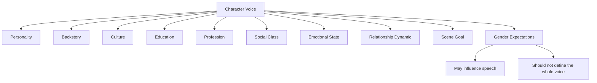
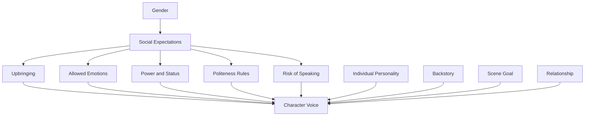

# 012 - Male and Female Voice in Dialogue

## Section

04 - Dialogue

## Original Lecture Title

Male and Female Voice in Dialogue

## Duration

4:59

---

## Core Idea

A believable character voice does not come from gender alone.

It comes from the full person behind the dialogue: personality, background, education, social class, profession, culture, trauma, desires, fears, and the situation they are in.

Gender can influence how a character speaks, especially in societies with strong gender expectations, but it should never be the only tool used to differentiate voices.

The goal is not to write “how men talk” or “how women talk.”

The goal is to write how this specific man, this specific woman, or this specific character speaks.

---

## Key Points

* Character voice should come from individual details, not broad gender stereotypes.
* Gender may affect dialogue through social expectations, upbringing, power, culture, and environment.
* A character’s speech pattern should reflect their psychology, history, and current goal in the scene.
* Avoid assuming that all men are blunt, unemotional, or status-focused.
* Avoid assuming that all women are emotional, indirect, or talkative.
* Read dialogue aloud to check whether each voice sounds distinct because of character, not because of stereotype.
* The social world of the story matters: different cultures, time periods, classes, and communities shape how people speak.

---

## The Problem with Writing “Male Voice” and “Female Voice”

In real life, people often recognize gender through sound, pitch, rhythm, body language, and social context.

In fiction, however, readers only receive written language.

That creates a challenge:

> How can a writer make characters sound distinct without relying on stereotypes?

The answer is to build voice from specific identity, not generic gender.

A weak approach asks:

```text
How do men talk?
How do women talk?
```

A stronger approach asks:

```text
Who is this character?
What do they want?
What are they afraid to reveal?
How were they raised?
What social rules shaped them?
How much power do they have in this scene?
What are they trying to get from the other person?
```

---

## Character Voice Is Built from Many Layers



Gender may be one influence, but it should not overpower the others.

A shy male character may speak indirectly.

A confident female character may speak bluntly.

A powerful older woman may dominate a conversation.

A young man raised to avoid conflict may soften every request.

A soldier, a poet, a doctor, a street vendor, and a teenager will all speak differently, regardless of gender.

---

## Five Better Questions Than “Is This Male or Female Dialogue?”

### 1. How Direct Is This Character?

Some characters ask for what they want immediately.

```text
Can I borrow your mower?
```

Others build context first.

```text
I hate to ask, but my mother-in-law is coming tomorrow, and the garden is a disaster. Would it be possible to borrow your mower for the afternoon?
```

This difference may be influenced by gender expectations, but it can also come from:

* politeness
* insecurity
* social class
* cultural background
* fear of rejection
* habit
* manipulation
* professional training
* relationship history

A character who is direct may be confident, impatient, rude, honest, desperate, or simply practical.

A character who is indirect may be polite, anxious, strategic, emotionally careful, or socially trained to avoid appearing demanding.

---

### 2. How Easily Does This Character Express Emotion?

Some characters speak openly about their feelings.

```text
I was hurt when you left without saying goodbye.
```

Others avoid emotional language.

```text
You left early.
```

Others turn emotion into action.

```text
He picked up the glass, set it down, and looked toward the door.
```

A character’s emotional openness may depend on:

* upbringing
* gender norms
* trauma
* trust
* age
* culture
* pride
* fear of vulnerability
* the relationship with the listener

The key is not to assume that women always express emotion and men always hide it.

Instead, ask:

> What has this character learned about showing emotion?

---

### 3. How Does This Character Establish Status?

Some characters define themselves through achievements, titles, money, expertise, or authority.

```text
I’m the senior surgeon on this case.
```

```text
I’ve been doing this job for twenty years.
```

```text
Do you know who my father is?
```

Others avoid status displays, or even hide their status.

```text
I just help out around here.
```

Status can appear in dialogue through:

* job titles
* interruptions
* name-dropping
* technical language
* calm authority
* mockery
* politeness
* refusal to explain
* asking, “What do you do?”

In some social environments, men may be encouraged to establish rank openly. In others, women may do the same. In some settings, everyone does it. In others, open status display is considered rude.

The writer’s job is to understand the social rules of the world the characters live in.

---

### 4. How Does This Character Give Compliments?

Compliments are never neutral.

They can express:

* affection
* admiration
* politeness
* flirtation
* envy
* social bonding
* manipulation
* dominance
* discomfort

Example:

```text
Nice shirt.
```

Depending on context, this could be friendly, awkward, flirtatious, sarcastic, or threatening.

Instead of asking whether men or women compliment differently, ask:

> What does this character risk by giving this compliment?

In some friendships, compliments are normal.

In others, they create embarrassment.

In a romantic scene, a compliment may be a test.

In a rivalry, it may be a disguised insult.

In a formal environment, it may be inappropriate.

---

### 5. What Social Rules Shape This Character’s Speech?

The setting can overturn every general rule.

A character’s gendered speech patterns may be shaped by:

* country
* religion
* family structure
* historical period
* workplace culture
* political system
* class expectations
* rural or urban environment
* age group
* subculture
* education level
* rules about politeness
* rules about profanity
* rules about who may interrupt whom

For example:

* In one society, women may be discouraged from swearing.
* In another, everyone may swear casually.
* In one family, men may avoid emotional confession.
* In another, men may express affection openly.
* In one workplace, women may need to speak more forcefully to be taken seriously.
* In another, directness may be punished regardless of gender.

Voice is never separate from environment.

---

## A Better Model for Gender and Dialogue



Gender matters most when it affects what a character has been allowed, punished, rewarded, or trained to say.

---

## Example: Same Request, Different Character Voices

### Direct and Practical

```text
Can I borrow your mower this afternoon?
```

This character values efficiency. They may be confident, familiar with the listener, or simply in a hurry.

---

### Polite and Indirect

```text
I hate to bother you, but would it be possible to borrow your mower for a few hours today?
```

This character is careful not to impose.

---

### Anxious and Over-Explaining

```text
I know this is last minute, and you can absolutely say no, but my mother-in-law is coming tomorrow and the garden looks terrible, and I just realized our mower is broken, so I wondered if maybe I could borrow yours?
```

This character fears rejection or judgment.

---

### Entitled

```text
I need your mower today. I’ll bring it back later.
```

This character assumes access to other people’s things.

---

### Manipulative

```text
You still have that mower, right? I was just telling my wife how generous you always are.
```

This character pressures the other person indirectly.

---

### Embarrassed

```text
This is awkward, but… could I borrow your mower?
```

This character feels the social cost of asking.

---

## Notice the Difference

The difference between these voices does not come from gender alone.

It comes from:

* confidence
* politeness
* entitlement
* anxiety
* manipulation
* shame
* relationship dynamics
* social context

This is the level where dialogue becomes believable.

---

## Practical Technique: Swap the Names

Take a dialogue exchange between a male character and a female character.

Then swap their names.

Ask:

> Do the voices still feel distinct?

If the only difference between them is that one “sounds male” and the other “sounds female,” the dialogue may be too generic.

A strong character voice should remain recognizable even when the name tag is removed.

---

## Voice Fingerprint Checklist

Give each major character a verbal fingerprint.

Consider:

* sentence length
* vocabulary level
* emotional openness
* directness
* use of humor
* use of silence
* use of profanity
* politeness level
* rhythm
* favorite phrases
* level of formality
* tendency to interrupt
* tendency to avoid conflict
* tendency to ask questions
* tendency to explain too much
* tendency to hide behind sarcasm
* tendency to speak in images, facts, commands, or jokes

---

## Character Voice Design Table

| Voice Element                     | Character A | Character B |
| --------------------------------- | ----------- | ----------- |
| Direct or indirect?               |             |             |
| Emotional or restrained?          |             |             |
| Formal or casual?                 |             |             |
| Short or long sentences?          |             |             |
| Polite or blunt?                  |             |             |
| Uses humor?                       |             |             |
| Uses silence?                     |             |             |
| Interrupts others?                |             |             |
| Avoids certain topics?            |             |             |
| Shows status openly?              |             |             |
| Uses slang or technical language? |             |             |
| What social rules shaped them?    |             |             |

---

## Common Mistakes

### Mistake 1: Making All Men Sound the Same

Not every male character should be blunt, emotionally closed, aggressive, or status-focused.

That creates flat writing.

---

### Mistake 2: Making All Women Sound the Same

Not every female character should be talkative, emotional, polite, indirect, or nurturing.

That also creates flat writing.

---

### Mistake 3: Confusing Stereotype with Voice

A stereotype is broad and predictable.

A character voice is specific and personal.

Weak dialogue says:

```text
She talks like this because she is a woman.
```

Stronger dialogue says:

```text
She talks like this because she grew up in a house where anger was punished, became a lawyer, learned to choose every word carefully, and is now hiding how afraid she is.
```

---

### Mistake 4: Ignoring the Setting

A modern teenager, a medieval queen, a corporate executive, a farmer, a monk, and a soldier will not speak the same way.

Even if they share the same gender, their environments create different voices.

---

## Practical Exercise

Choose a dialogue scene between two characters of different genders.

Then do the following:

1. Remove the dialogue tags.
2. Check whether you can still tell who is speaking.
3. Swap the characters’ names.
4. Ask whether the voices still fit their personalities.
5. Identify any line that relies only on gender stereotype.
6. Rewrite that line based on the character’s specific background, goal, or emotional state.

---

## Reflection Questions

1. Are your characters’ voices differentiated by who they are, or only by broad gender assumptions?
2. What social rules shape how men, women, or other genders speak in your story world?
3. Which character speaks most directly, and why?
4. Which character avoids emotional language, and why?
5. Which character uses words to establish status?
6. Which character uses silence to hold power?
7. Which character speaks differently in public than in private?
8. Could readers recognize your main characters’ dialogue without name tags?
9. Are any of your lines based on stereotype rather than psychology?
10. How does the setting influence what each character is allowed to say?

---

## Summary

Male and female voices in dialogue should not be built from stereotypes.

Gender can matter, especially when society has taught characters different rules about emotion, politeness, power, status, and self-expression. But believable dialogue comes from the specific character, not from gender alone.

To write stronger voices, focus on the individual.

Ask who the character is, what they want, what they fear, how they were raised, what their society expects, and what power they have in the conversation.

The more specific the character, the more believable the voice.
