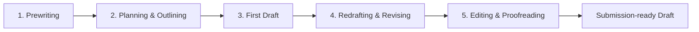

# Academic Writing Process — Từ ý tưởng đến bản thảo hoàn chỉnh

Khóa học Markdown này được biên soạn từ transcript bài giảng về **5 bước của quy trình viết học thuật** và mở rộng thành một workflow thực hành cho essay, report, research paper và thesis.

## Mục tiêu khóa học

Sau khi hoàn thành, người học có thể:

- biến một chủ đề rộng thành câu hỏi hoặc luận điểm có thể xử lý;
- thu thập nguồn và dữ liệu phù hợp trước khi viết;
- tạo outline có logic thay vì viết theo cảm hứng;
- hoàn thành first draft bằng cấu trúc đoạn văn rõ ràng;
- phân biệt **revision**, **editing** và **proofreading**;
- kiểm tra tính mạch lạc, bằng chứng, ngữ pháp, chính tả và consistency;
- hoàn thiện trích dẫn trước khi nộp bài.

## Workflow cốt lõi

> Quy trình thực tế không hoàn toàn tuyến tính. Người viết có thể quay lại outline, research hoặc draft khi phát hiện lập luận còn thiếu.

## Cấu trúc thư mục

- `module_01_prewriting/` — chọn, thu hẹp chủ đề và chuẩn bị research.
- `module_02_planning_and_drafting/` — outline, paragraph logic và first draft.
- `module_03_revision/` — sửa lập luận, tổ chức và cohesion.
- `module_04_editing_and_proofreading/` — chỉnh câu, lỗi ngôn ngữ, consistency và citation.
- `templates/` — worksheet và checklist dùng trực tiếp.
- `transcript/` — transcript tiếng Việt đã chuẩn hóa.
- `references/` — nguồn tham khảo mở rộng.

## Cách học

1. Đọc bài theo thứ tự trong `00_COURSE_MAP.md`.
2. Làm worksheet ngay sau bài liên quan.
3. Dùng chính một đề tài của bạn xuyên suốt khóa học.
4. Sau Module 4, chạy `templates/final_submission_checklist.md` trước khi nộp bài.
